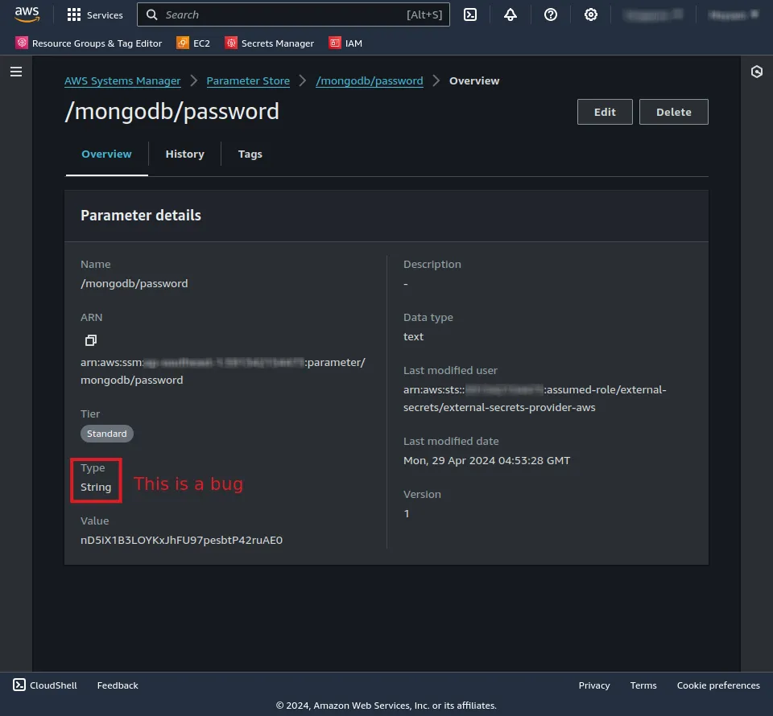

# External Secrets Operator: Fetching AWS SSM Parameters into Azure AKS

<iframe
  width="560"
  height="315"
  src="https://www.youtube.com/embed/JFJJWB7neIg?si=K6jVqpb3iGDER1J5"
  title="YouTube video player"
  frameborder="0"
  allow="accelerometer; autoplay; clipboard-write; encrypted-media; gyroscope; picture-in-picture; web-share"
  referrerpolicy="strict-origin-when-cross-origin"
  allowfullscreen
></iframe>

How to pass your secrets to the Kubernetes cluster without hard-coding them
into your source code or manually creating the Kubernetes Secret resource.

<!-- more -->

## Introduction

Deploying an application rarely is just the application itself. It is usually
all the tooling and infrastructure around it that makes it work and produce
the value it was meant to.

One of the most common things that applications need is secrets. Secrets are
sensitive information that the application needs to function properly. This
can be database passwords, API keys, or any other sensitive information the
app uses to function and communicate with all the relevant external services.

In Kubernetes, the most common way to pass secrets to the application is by
creating a Kubernetes Secret resource[^1]. This resource is a Kubernetes object
that stores sensitive information in the cluster. The application can then
access this information by mounting the secret as a volume or by passing it as
environment variables.

However, creating a Kubernetes Secret resource manually is a tedious task,
especially when working at scale. Not to mention the maintenance required to
rotate the secrets periodically and keep them in sync with the upstream.

On the other hand, passing secrets as hard-coded and plaintext value is a no-no
when it comes to security. As much of a common sense as it is, going around the
industry and seeing how people hard-code their secrets into the source code
pains my soul.

In this article, we will explore how to use the
External Secrets Operator[^2] to
pass secrets to the Kubernetes cluster without hard-coding them into the
source code or manually creating the Kubernetes Secret resource.

<!-- subscribe -->

## Roadmap

Before we start, let's set a clear objective of what we want to achieve in
this article. The links will take you to the respective sections of this
article.

First off, we'll
[create an Azure AKS Kubernetes cluster](#step-0-setting-up-azure-managed-kubernetes-cluster)
using the official
[OpenTofu](../../category/opentofu.md) module. The AKS cluster will have its OpenID
Connect endpoint exposed to the internet.

We will use that OpenID Connect endpoint to
[establish a trust relationship between the Kubernetes cluster and the AWS IAM](#step-1-establishing-azure-aks-trust-relationship-with-aws-iam)
, leveraging
[OpenID Connect](../../category/openid-connect.md). This trust relationship will
allow the Kubernetes cluster's Service Accounts to assume an IAM Role with
web identity to access AWS resources.

Afterwards, we will
[deploy the External Secrets operator](#step-2-deploying-external-secrets-operator)
to the Kubernetes
cluster passing the right Service Account to its running pod so that it can
assume the proper AWS IAM Role[^3].

With that set up, the External Secrets operator will be able to
[read the secrets from the AWS SSM Parameter Store](#step-5-deploying-the-application-that-uses-the-secret)
and create Kubernetes Secrets from them.

At this point, any pod in the same namespace as the target Secret will be able
to mount and read its values business as usual.

Ultimately, we'll also cover how to allow the External Secrets operator to
[write back to the AWS SSM Parameter Store](#pushsecret-to-aws-ssm-parameter-store)
the values of the Kubernetes Secrets
we want it to. An example include deploying a database with a generated
password and storing that password back to the AWS SSM Parameter Store for
references by other services or applications.

With that said, let's get started!

!!! success "OpenID Connect"

      OpenID Connect, in simple terms, is a protocol that allows one service
      to authenticate and authorize another service, optionally on behalf of
      a user. It is an authentication layer on top of OAuth2.0 protocol.

      If you're new to the topic, we have a practical example to solidify your
      understanding in our guide on
      [OIDC Authentication](./0007-oidc-authentication.md).

!!! question "Why AWS SSM instead of Azure Key Vault?"

      The External Secrets operator supports multiple backends for storing
      secrets. One of the most common backends is the AWS SSM Parameter Store.
      It is easy to set up, free to use, and has the least amount of drama
      around it.

      However, I'm not here to dictate what you should and shouldn't use in
      your stack. If Azure Key Vault works for you, by all means, go for it.
      Choosing a tech stack goes beyond just how sexy it looks on the resume,
      or how fun of a Developer Experience it provides!

## Prerequisites

Before we start, you need to have the following prerequisites:

<div class="annotate" markdown>
- [x] A Kubernetes cluster v1.29-ish. Feel free to follow earlier guides to
      set up the Kubernetes cluster [the Hard Way](./0003-kubernetes-the-hard-way.md)
      or [using k3s](./0005-install-k3s-on-ubuntu22.md). Although we'll spin
      up a new Kubernetes cluster using Azure AKS TF module[^4].
- [x] Internet accessible endpoint to your Kubernetes API server (1). We have
      covered [how to expose your Kubernetes API server](./0008-k8s-federated-oidc.md)
      in last week's guide. Azure AKS, however, comes with a public
      [OpenID Connect](../../category/openid-connect.md) endpoint by default[^7].
- [x] An AWS account with the permissions to read and write SSM parameters and
      to create OIDC provider and IAM roles.
- [x] OpenTofu v1.6[^8]
- [ ] AZ CLI v2 Installed[^9]. Only required if you're operating within Azure.
- [ ] Optionally, FluxCD v2.2[^10] installed in your cluster. Not required if you
      aim to use bare Helm commands for installations. There is a beginner
      friendly [guide to FluxCD](./0006-gettings-started-with-gitops-and-fluxcd.md)
      in our archive if you're new to the topic.
</div>

1. You're free to run a local Kubernetes cluster and expose it to the internet
   using tools like ngrok[^5] or telepresence[^6].

## Step 0: Setting up Azure Managed Kubernetes Cluster

First things first, let's set up the Azure AKS Kubernetes cluster using the
official TF module[^4].

```hcl title="aks/variables.tf"
-8<- "docs/blog/codes/2024/0009/aks/variables.tf"
```

```hcl title="aks/versions.tf"
-8<- "docs/blog/codes/2024/0009/aks/versions.tf"
```

```hcl title="aks/main.tf"
-8<- "docs/blog/codes/2024/0009/aks/main.tf"
```

```hcl title="aks/outputs.tf"
-8<- "docs/blog/codes/2024/0009/aks/outputs.tf"
```

Having this TF code, we now need to apply it to our Azure account.

### Authenticating to Azure

The first requirement is to be authenticated to Azure API. There are more than
one ways to authenticate to Azure[^11]. The most common way, and the one we'll
use today, is by authenticating to Azure CLI[^12].

???+ example "Authenticate to Azure Using AZ CLI"

      For your reference, here's a quick way to authenticate to Azure:

      ```shell title="" linenums="0"
      az login --use-device-code
      ```

      This command will print out a URL and a code. Open the URL in your
      browser and enter the code when prompted. This will authenticate you to
      Azure CLI.

Once authenticated, and if the default subscription and tenant-id is not set,
you can set them as environment variables just like the following:

```shell title="" linenums="0"
export ARM_SUBSCRIPTION_ID=159f2485-xxxx-xxxx-xxxx-xxxxxxxxxxxx
export ARM_TENANT_ID=72f988bf-xxxx-xxxx-xxxx-xxxxxxxxxxxx
```

### Applying the TF Code

Lastly, once all is set, you can apply the TF code to create the AKS cluster.

```shell title="" linenums="0"
tofu init
tofu plan -out tfplan
tofu apply tfplan
```

Creating the resources in this stack shall take about ~20 minutes to complete.
Once done, you should have a fully functional Azure AKS cluster with the
OpenID Connect endpoint exposed to the internet.

The output of this TF code will, as specified in our code, be an OIDC issuer
URL. We are going to use this URL to establish a trust relationship between
the Kubernetes cluster and the AWS IAM in the next step.

The null resource in our TF code will add or update your current kubeconfig
file with the new AKS cluster credentials[^13]. We will use this in a later step.

## Step 1: Establishing Azure AKS Trust Relationship with AWS IAM

This step aims to facilitate and enable the API calls from the pods inside the
Kubernetes cluster to the AWS services.
[As we have seen earlier](./0008-k8s-federated-oidc.md), this is what
OpenID Connect is all about.

Let's write the TF code to create the OIDC provider in the AWS.

```hcl title="aws-oidc/variables.tf"
-8<- "docs/blog/codes/2024/0009/aws-oidc/variables.tf"
```

```hcl title="aws-oidc/versions.tf"
-8<- "docs/blog/codes/2024/0009/aws-oidc/versions.tf"
```

```hcl title="aws-oidc/main.tf"
-8<- "docs/blog/codes/2024/0009/aws-oidc/main.tf"
```

```hcl title="aws-oidc/outputs.tf"
-8<- "docs/blog/codes/2024/0009/aws-oidc/outputs.tf"
```

The code should be self-explanatory, especially at this point after covering
three blog posts on the topic of [OpenID Connect](../../category/openid-connect.md).

But, let's emphasize the highlighting points:

1. When it comes to AWS IAM assume role, there are
   five types of trust relationships[^14]. In this scenario, we are using the
   Web Identity trust relationship type[^15].
2. Having the principal as `Federated` is just as the name suggests; it is
   a federated identity provider. In this case, it is the Azure AKS OIDC
   issuer URL. In simple English, it allows the Kubernetes cluster to sign
   the access tokens, and the AWS IAM will trust those tokens if the `iss`
   claim of their tokens match the trusted URL.
3. Having two conditionals on the audience (`aud`) and the subject (`sub`) allows
   for a tighter security control and to enforce the principle of least privilege[^16].
   The target Kubernetes Service Account is the only one who is able to assume
   this IAM Role and is only capable of doing the permissions assigned, but no
   more. This enhances the overall security posture of the system.

```shell title="" linenums="0"
export AWS_PROFILE="PLACEHOLDER"

tofu plan -out tfplan
tofu apply tfplan
```

### IAM Policy Document

You may have seen the IAM policy document as JSON string in other TF codes.
Truth be told, there is no one-size-fits-all. Do whatever works best for you.

I prefer writing my IAM policy documents as TF code because every other code
in this module is written in HCL format. It is easier to maintain and read
when everything is in the same format and there will be less mental gymnastics
when a future engineer, or even myself, comes back to this code.

But, of course, I understand that when the IAM policy gets bigger, there is a
very good reason to write it in the JSON format.

For your reference, this is the equivalent TF code when writing it in the JSON
format:

```hcl title=""
-8<- "docs/blog/codes/2024/0009/junk/iam-role/main.tf"
```

Pick what's best and more appealing to you and your team and stick with it.
Don't let any clown :clown: tell you otherwise, including myself! :sunglasses:

## Step 2: Deploying External Secrets Operator

At its simplest form, you can easily install yours with `helm install`.
However, my preferred way of Kubernetes deployments is through GitOps, and
[FluxCD is my go-to tool](./0006-gettings-started-with-gitops-and-fluxcd.md)
for that.

```yaml title="external-secrets/namespace.yml"
-8<- "docs/blog/codes/2024/0009/external-secrets/namespace.yml"
```

```yaml title="external-secrets/repository.yml"
-8<- "docs/blog/codes/2024/0009/external-secrets/repository.yml"
```

```yaml title="external-secrets/release.yml" hl_lines="31"
-8<- "docs/blog/codes/2024/0009/external-secrets/release.yml"
```

```yaml title="external-secrets/kustomizeconfig.yml"
-8<- "docs/blog/codes/2024/0009/external-secrets/kustomizeconfig.yml"
```

```yaml title="external-secrets/kustomization.yml" hl_lines="2"
-8<- "docs/blog/codes/2024/0009/external-secrets/kustomization.yml"
```

???+ example "Helm Values File"

      You don't have to necessarily commit the Helm values file into your
      source code. But it comes with a huge benefit when trying to upgrade to
      a newer version and you want to know what changes to expect during a
      code review.

      ```shell title="" linenums="0"
      helm show values \
         external-secrets/external-secrets \
         --version 0.9.x \
         > external-secrets/values.yml
      ```

      And the content:

      ```yaml title="external-secrets/values.yml"
      -8<- "docs/blog/codes/2024/0009/external-secrets/values.yml"
      ```

If you have set up your directory structure to be traversed in a recursive
fashion by FluxCD, you'd only push this to the upstream and the live state
will reconcile as specified.

Otherwise, apply the following manifests to create the FluxCD Kustomization:

```yaml title="gitops/gitrepo.yml" hl_lines="4"
-8<- "docs/blog/codes/2024/0009/gitops/gitrepo.yml"
```

```yaml title="gitops/external-secrets.yml" hl_lines="18"
-8<- "docs/blog/codes/2024/0009/gitops/external-secrets.yml"
```

## Step 3: Create the Secret Store

At this point, we should have a Kubernetes cluster with the External Secrets
operator running on it. It should also be able to assume the AWS IAM Role
we created earlier by leveraging the OIDC trust relationship.

In External Secrets operator, the `SecretStore` and `ClusterSecretStore` are
the proxies to the external secrets management systems. They are responsible
for fetching or creating the secrets from the external systems and creating
the Kubernetes Secrets from them[^17].

Let us create a `ClusterSecretStore` that will be responsible for fetching
or creating AWS SSM Parameters.

```hcl title="cluster-secret-store/variables.tf"
-8<- "docs/blog/codes/2024/0009/cluster-secret-store/variables.tf"
```

```hcl title="cluster-secret-store/versions.tf"
-8<- "docs/blog/codes/2024/0009/cluster-secret-store/versions.tf"
```

```hcl title="cluster-secret-store/main.tf" hl_lines="17-18"
-8<- "docs/blog/codes/2024/0009/cluster-secret-store/main.tf"
```

### Service Account Annotations Hack

You will notice that there are two annotations to the
`external-secrets` Service Account that are, suspiciously, sounding like an
AWS EKS Kubernetes cluster thing. That is, these are specifically the annotations
that only AWS EKS understands and acts upon.

This is an unfortunate mishap. If you're curious to read the full details,
I have provided a very long and detailed explanation in
their GitHub repository's issue[^18].

The gist of that discussion, if you're not feeling like reading my whole
rambling, is that the External Secrets operator is not able to assume IAM Role
with Web Identity outside the AWS EKS Kubernetes cluster; that is, you'll only
get the benefit of [OpenID Connect](../../category/openid-connect.md) if
only you're within AWS[^19] as far as External Secrets operator is concerned.

That is something I consider to be a bug! It shouldn't be the case and they
should be able to handle Kubernetes clusters where we wouldn't want to manually
pass the AWS credentials to the pods.

## Step 4: Test the Setup: Creating ExternalSecret and PushSecret

That's it guys!

We have done all the hard works and it's time for pay off. Let's create an
`ExternalSecret` and a `PushSecret` to test the setup.

In this step, as the tradition of this post has been so far, we won't go into
sample hello-world examples. We will try to deploy a MongoDB database and
an application that talks to it instead.

The objective for this section is as follows:

1. Deploy a MongoDB application using Helm, pushing the auto-generated
   passwords to the AWS SSM Parameter Store using `PushSecret` CRD.
2. Deploy another application that uses the `ExternalSecret` CRD to fetch the
   newly created secret in AWS SSM Parameter Store and use it to connect to
   the MongoDB database.

If that gets you excited, let's get started! Although, I have to warn you, the
rest of this tutorial is a piece of cake compared to what we have done so far.

### Deploying MongoDB

!!! bug "MongoDB ARM64 Support"

      As of the writing of this blog post, the bitnami MongoDB Helm chart
      does not support ARM64 architecture. This is a known issue and there is
      an open issue for it[^20].

      If you're running on ARM64 architecture, you may want to either:

      1. Use a different Helm chart that supports ARM64.
      2. Deploy MongoDB manually using StatefulSet; the same approach I'll
         employ in this tutorial.

```yaml title="mongodb/namespace.yml"
-8<- "docs/blog/codes/2024/0009/mongodb/namespace.yml"
```

```ini title="mongodb/configs.env"
-8<- "docs/blog/codes/2024/0009/mongodb/configs.env"
```

```yaml title="mongodb/password.yml"
-8<- "docs/blog/codes/2024/0009/mongodb/password.yml"
```

```yaml title="mongodb/externalsecret.yml"
-8<- "docs/blog/codes/2024/0009/mongodb/externalsecret.yml"
```

```yaml title="mongodb/service.yml"
-8<- "docs/blog/codes/2024/0009/mongodb/service.yml"
```

```yaml title="mongodb/statefulset.yml"
-8<- "docs/blog/codes/2024/0009/mongodb/statefulset.yml"
```

```yaml title="mongodb/kustomization.yml"
-8<- "docs/blog/codes/2024/0009/junk/mongo/kustomization.yml"
```

This Kustomization is valid and can be applied as is. I generally prefer
reconciling my Kubernetes resource using FluxCD and GitOps. Here's the
`Kustomization` resource for FluxCD:

```yaml title="gitops/mongodb.yml"
-8<- "docs/blog/codes/2024/0009/gitops/mongodb.yml"
```

This stack will be deployed in whole and as is. Here's what the
`Secret/mongodb-secrets` will look like.

```yaml title=""
-8<- "docs/blog/codes/2024/0009/junk/mongo/mongodb-secrets.yml"
```

It's a bit out of scope for this guide, but notice that I am creating the
`Kustsomization` resource in the `flux-system` namespace, whereas the final
MongDB Kustomization will be deployed in the `mongodb` namespace. It's only
because **I want FluxCD to take care of GitOps, while MongoDB is deployed in
its dedicated namespace**.

### PushSecret to AWS SSM Parameter Store

We have generated the MongoDB password using the External Secrets operator
generator API. It is now time to store it in our secrets management system to
later be used by other parts or applications.

```yaml title="mongodb/kustomization.yml" hl_lines="12"
-8<- "docs/blog/codes/2024/0009/mongodb/kustomization.yml"
```

<div class="annotate" markdown>
```yaml title="mongodb/pushsecret.yml"
-8<- "docs/blog/codes/2024/0009/mongodb/pushsecret.yml"
```
</div>

   1. As of writing this article, the External Secrets operator and FluxCD do not
      work well together when it comes to generator API. Specifically, the FluxCD
      will try to recreate the Password[^21] resource resource on every tick of
      the `Kustomization.spec.interval`.

      This means that the initial password is gone by the time the second tick
      comes around.

      This is possibly a known issue, one which I can see being
      discussed in their GitHub repository[^22].

      Although I haven't found a fix by now, specifying
      `updatePolicy: IfNotExists` for the `PushSecret` makes sure that we won't
      lose the actual password initially used by the script to bootstrap the
      MongoDB database.

      **There may be a better way!**

This will result in the following parameter to be created in our AWS account.

<figure markdown="span">
   { loading=lazy }
   <figcaption>AWS SSM Parameter Store</figcaption>
</figure>

As you can see in the screenshot, the parameter type is set to `String`. This is
a bug and you can follow the discussion on the
GitHub issue[^23].

Ideally, this parameter should be customizable in `PushSecret.spec` and allow
us to specify `SecureString` instead.

## Step 5: Deploying the Application that Uses the Secret

Now that we have our database set up and the password stored in the AWS SSM
Parameter Store, we can deploy an application that uses this password to
connect to the database.

```yaml title="app/namespace.yml"
-8<- "docs/blog/codes/2024/0009/app/namespace.yml"
```

```yaml title="app/externalsecret.yml"
-8<- "docs/blog/codes/2024/0009/app/externalsecret.yml"
```

```yaml title="app/job.yml"
-8<- "docs/blog/codes/2024/0009/app/job.yml"
```

```yaml title="app/kustomization.yml"
-8<- "docs/blog/codes/2024/0009/app/kustomization.yml"
```

Again, you can apply this stack as is, or create is FluxCD Kustomization.

```yaml title="gitops/app.yml" hl_lines="7"
-8<- "docs/blog/codes/2024/0009/gitops/app.yml"
```

We have intentionally enabled the `force` flag for this stack because
Kubernetes jobs will complain if you modify any of the immutable fields.
Forcing the stack to reconcile means that the job will be recreated with the
new changes.

**NOTE**: You should evaluate the impact of the `force` flag in your
production environment. It may cause downtime if not used carefully. You should
specifically consider the idempotency behavior of a recreated job for your
appliction(s).

## Conclusion

External Secrets operator is a really appealing tool for fetching secrets from
external secrets management systems.

It empowers you to use your desired secrets management system without having
to compromise on the security aspect of passing credentials around! I have
always opted in for the External Secrets operator when it comes to day-to-day
operations of a Kubernetes cluster.

With the mechanisms and APIs provided by the ESO, one can easily enhance the
operations of the secrets in the daily operations of the Kubernetes cluster.

You have also seen the power of OIDC and how it can enhance the security
posture of the system, as well as reducing the need and overhead of passing
credentials around or having to worry about their rotations.

With the knowledge you have gained in this article, you should be able to
deploy the External Secrets operator in your Kubernetes cluster and manage
your secrets in a secure & efficient way and with a peace of mind.

I hope you have enjoyed reading this article as much as I have enjoyed writing
it. Feel free to reach out through the links provided at the bottom of this
article if you have any questions or feedback.

## FAQ

### Why not use the SOPS?

I'm not here to dictate what you should and shouldn't use in your stack. But,
if you're here and reading this, I will give you my honest opinion.

I think Sops is great for what it's worth.

Yet, I find it truly concerning to commit even the encrypted versions of my
secrets to the repository and hoping that no computer will ever be powerful
enough to break or decompose them into their plaintext versions.

I find it disturbing to let myself at the mercy of the wild internet and
push my luck with the most critical part of my workloads, that is, the
secrets.

You are more than welcome to disagree, but I just wanted to say why I would
never use Sops in my stack.

### Why not use the Sealed Secrets, or Vault?

I have never used these tools. In fact, you're free to pick your stack as you
please, if you find a good enough reason to do so.

I may, at some point, use Azure or Hashicorp Vault as a backend to the External
Secrets operator, but that's a story for another day.

### Why not use the AWS Secrets Manager?

The AWS SSM Parameter Store[^24], in its standard tier, is free to use and offers
encryption out of the box. I wouldn't want to be charged extra money if I
really don't have to.

<!-- References -->
[^1]: https://kubernetes.io/docs/concepts/configuration/secret/
[^2]: https://external-secrets.io/v0.9.16/
[^3]: https://docs.aws.amazon.com/IAM/latest/UserGuide/id_roles.html
[^4]: https://registry.terraform.io/modules/Azure/aks/azurerm/8.0.0
[^5]: https://ngrok.com/
[^6]: https://www.telepresence.io/
[^7]: https://learn.microsoft.com/en-us/azure/aks/use-oidc-issuer
[^8]: https://github.com/opentofu/opentofu/releases/tag/v1.6.2
[^9]: https://learn.microsoft.com/en-us/cli/azure/install-azure-cli
[^10]: https://github.com/fluxcd/flux2/releases/tag/v2.2.3
[^11]: https://registry.terraform.io/providers/hashicorp/azurerm/3.101.0/docs#authenticating-to-azure
[^12]: https://registry.terraform.io/providers/hashicorp/azurerm/3.101.0/docs/blog/guides/azure_cli
[^13]: https://learn.microsoft.com/en-us/azure/aks/control-kubeconfig-access
[^14]: https://spacelift.io/blog/aws-iam-roles
[^15]: https://docs.aws.amazon.com/cli/latest/reference/sts/assume-role-with-web-identity.html
[^16]: https://en.wikipedia.org/wiki/Principle_of_least_privilege
[^17]: https://external-secrets.io/v0.9.16/api/clustersecretstore/
[^18]: https://github.com/external-secrets/external-secrets/issues/660#issuecomment-2080421742
[^19]: https://external-secrets.io/v0.9.16/provider/aws-parameter-store/#eks-service-account-credentials
[^20]: https://github.com/bitnami/charts/issues/3635
[^21]: https://external-secrets.io/v0.9.16/api/generator/password/
[^22]: https://github.com/external-secrets/external-secrets/discussions/2402
[^23]: https://github.com/external-secrets/external-secrets/issues/3422
[^24]: https://docs.aws.amazon.com/systems-manager/latest/userguide/systems-manager-parameter-store.html
