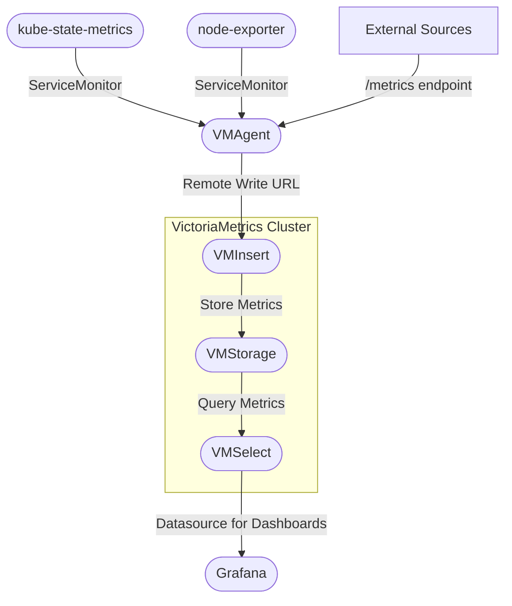
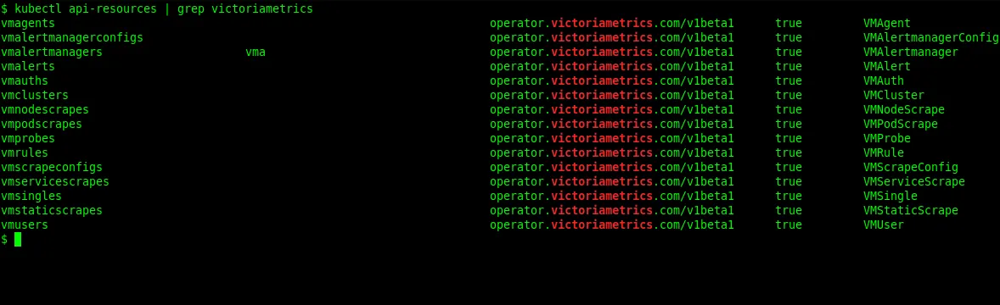
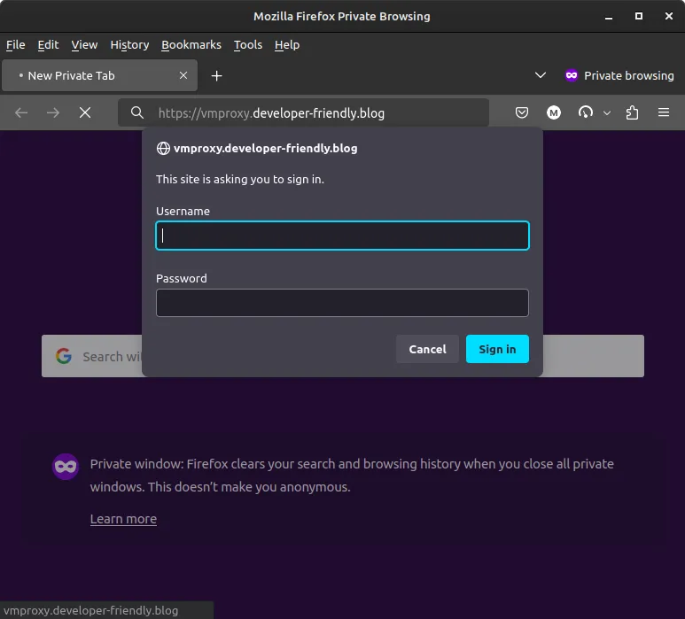
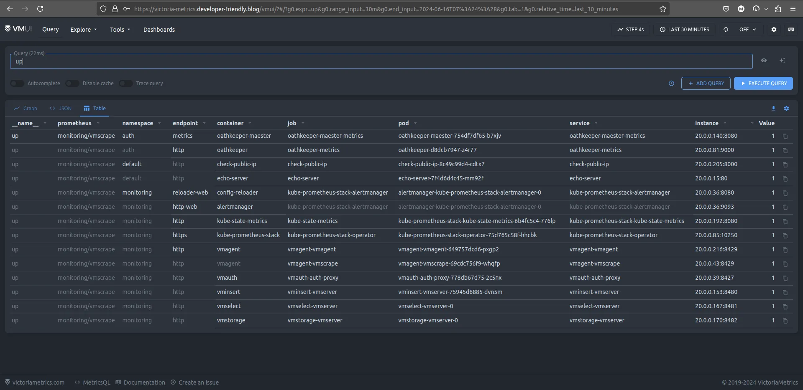

# Unlocking the Power of VictoriaMetrics: A Prometheus Alternative

One of the main tasks of an operations team in any organization is to provide a
solid and robust monitoring solution for the platform, the application, and the
entire infrastructure.

Monitoring enables business owners to understand how their applications behave
in a production setup, how to optimize it, and how to proactively fine-tune &
forecast the future growth of the platform.

In this blog post, we will explore what Victoria Metrics has to offer, how to
set it up and configure it to work as a drop-in replacement for Prometheus and
a datastore for Grafana.

<!-- more -->

## Why Monitoring is Crucial?

Monitoring is crucial because it gives you real-time & historic insights into
the health and performance of your systems, helping you catch issues before
they escalate into bigger problems.

Consider monitoring as a constant health check-up for the systems and
infrastructure, ensuring everything runs smoothly and efficiently.

With successful monitoring, one can optimize resource usage, prevent downtime,
quickly troubleshoot unexpected behaviors, and do capacity planning, ultimately
saving time and reducing costs.

Additionally, it provides valuable data for improving future performance and
planning capacity, making it an indispensable part of managing any tech
environment.

## Introduction to Victoria Metrics

Victoria Metrics[^vm-landing-page] is a high-performance[^last9-prometheus-comparison],
cost-effective time series database designed for monitoring and observability.
It's known for its speed, efficiency, and scalability, making it an excellent
choice for handling large volumes of data effortlessly.

Furthermore, it’s fully compatible with Prometheus[^seifeddinerajhi-medium],
offering an effortless transition for those looking to migrate their current
monitoring setup.

<!-- subscribe -->

## Why Victoria Metrics?

Victoria Metrics stands out because of multiple factors.

For one, it is scalable, which is a perfect choice for handling vast amounts of
time series data[^vm-prominent-features].

Also, it’s designed to be a drop-in replacement for Prometheus, offering
**faster queries**, better compression[^vm-blog-comparing-agents], and
multi-tenant support.

For me personally, I came across Victoria Metrics looking for a long-term
storage solution for Prometheus. Looking through the available tools, the most
compelling ones were Victoria Metrics and Thanos.

I chose Victoria Metrics because it was far more resource efficient and a lot
easier to set up and configure. With Thanos, there's a huge learning curve and
the overhead and maintainability cost outweighed the benefits.

## Key Features of Victoria Metrics

- Delivers high performance with fast query capabilities[^vm-vs-prom-perf].
- Offers efficient data compression to save storage space, e.g., it provides a
  decent performance on HDD storage.
- Ensures smooth handling of multiple data sources with multi-tenant support.
- Provides effortless compatibility with Prometheus for easy integration.
- Scales easily to manage large datasets.

## Victoria Metrics vs. Prometheus

- **Resource Utilization**: Victoria Metrics is more memory and CPU efficient
  than Prometheus, making it a cost-effective solution. I have personally seen
  as much as a 50% reduction in memory footprint when switching to Victoria
  Metrics.
- **Long-term Storage**: Victoria Metrics has native support for long-term
  storage, whereas with Prometheus, you need to set up a separate solution like
  Thanos[^prometheus-long-term-storage].
- **Scalability**: Victoria Metrics is designed to be scalable both vertically
  and horizontally. Prometheus, on the other hand, falls short in that regard
  and requires additional tools like Thanos to scale[^last9-vm-vs-thanos].

## Deploy Victoria Metrics

For this guide, we wil use [Kubernetes](../../category/kubernetes.md) to deploy
Victoria Metrics. Feel free to pick an easy way to create your cluster, like
Minikube, Kind, or K3s.

We have other guides in our archive to set up a Kubernetes cluster if you are
interested:

- [Kubernetes The Hard Way](./0003-kubernetes-the-hard-way.md)
- [How to Install Lightweight Kubernetes on Ubuntu 22.04](0005-install-k3s-on-ubuntu22.md)
- [Create an Azure AKS Cluster with OpenTofu](./0009-external-secrets-aks-to-aws-ssm.md#step-0-setting-up-azure-managed-kubernetes-cluster)

Diagram below shows the installation architecture for this blog post.



### Victoria Metrics Operator

The official provided operator[^vm-operator] for Victoria Metrics has a lot of
benefits compared to alternative one-shot installation methods.

With the Victoria Metrics operator you get to decide the architecture of your
Victoria Metrics using one or multiple CRD resources. It is more flexible in
the long run.

We are using [FluxCD](../../category/fluxcd.md) as our [GitOps](../../category/gitops.md)
tool of choice, but feel free to use any other tool you are comfortable with.

```yaml title="victoria-metrics-operator/namespace.yml"
-8<- "docs/blog/codes/2024/0016/victoria-metrics-operator/namespace.yml"
```

```yaml title="victoria-metrics-operator/repository.yml"
-8<- "docs/blog/codes/2024/0016/victoria-metrics-operator/repository.yml"
```

```yaml title="victoria-metrics-operator/release.yml"
-8<- "docs/blog/codes/2024/0016/victoria-metrics-operator/release.yml"
```

```yaml title="victoria-metrics-operator/kustomization.yml"
-8<- "docs/blog/codes/2024/0016/victoria-metrics-operator/kustomization.yml"
```

```yaml title="victoria-metrics-operator/kustomize.yml"
-8<- "docs/blog/codes/2024/0016/victoria-metrics-operator/kustomize.yml"
```

Finally, to deploy this stack:

```bash title="" linenums="0"
kubectl apply -f victoria-metrics-operator/kustomize.yml
```

### Victoria Metrics CRDs

Having the Victoria Metrics Operator installed, we can query and see that we
have the corresponding CRDs available in our Kubernetes cluster.

```bash title="" linenums="0"
kubectl api-resources | grep victoriametrics
```

And the output:

<figure markdown="span">
  { align=left loading=lazy }
  <figcaption>Victoria Metrics Operator CRDs</figcaption>
</figure>

Just by looking at the CRDs here, you can quickly realize how powerful this
mode of installation is and how much flexibility it provides. Because, at any
point in time, you can scale your VictoriaMetrics instance components, resize
or completely replace them with a different architecture.
:building_construction:

For example, one of the quickest ways to provide authentication on top of any
of the Victoria Metrics component instances is to create a `VMAuth` as a proxy
and one or more `VMUser` CRD[^vmauth].

See an example below. :point_down:

```yaml title="" hl_lines="5 36"
-8<- "docs/blog/codes/2024/0016/junk/vmauth.yml"
```

A few seconds after applying these resources, a new Kubernetes Service and a
Secret in the target namespace will be created.

We can get the corresponding password for the user by running:

```bash title="" linenums="0"
kubectl get \
  -n monitoring \
  secret/vmuser-john-doe \
  -o jsonpath='{.data.password}' | \
  base64 -d -
```

Having the password we grabbed from the Secret, and the address from the
`HTTPRoute` resource, we will be prompted for basic HTTP authentication upon
the first visit to the address.

<figure markdown="span">
  { align=left loading=lazy }
  <figcaption>VMAuth Authentication Proxy</figcaption>
</figure>

The best thing about this architecture is that any piece of it is replaceable
by your preferred tooling. If you choose to use a different authentication
proxy server such as [Ory Oathkeeper](../../category/oathkeeper.md) to take advantage
of your current Identity Provider, you definitely can[^oathkeeper-access-rules].

## Migration From Kube Prometheus Stack

At this point, we will assume that you have the Kube Prometheus
Stack[^k8s-prom-stack] installed in your cluster. Due to the massive adoption
of the Kube Prometheus Stack, this assumption is not far-fetched.

That stack comes with a number of CRDs that make it easier for discovering
new targets for your Prometheus server.

Upon the [installation of Victoria Metrics Operator](#victoria-metrics-operator),
you are, by default and unless explicitly disabled, opting in for automatic
conversion of every one of the Prometheus Stack's CRDs into that of Victoria
Metrics Operator[^vm-object-conversion].

That, in essence, means that the following conversion table applies to you:

| Kube Prometheus Stack CRD | Victoria Metrics Operator CRD |
|---------------------------|-------------------------------|
| `ServiceMonitor`          | `VMServiceScrape`             |
| `PodMonitor`              | `VMPodScrape`                 |
| `Probe`                   | `VMProbe`                     |
| `PrometheusRule`          | `VMRule`                      |
| `AlertmanagerConfig`      | `VMAlertmanagerConfig`        |
| `ScrapeConfig`            | `VMScrapeConfig`              |

With this table in mind, moving away from Prometheus to Victoria Metrics has
the least overhead[^vm-migration-guide]. All your current scrape targets (e.g.,
`ServiceMonitor` & `PodMonitor`) will continue to work when replacing a
Prometheus server with a `VMAgent` instance; the Victoria Metrics Operator
takes care of the CRD conversion and the `VMAgent` will scrape those targets.

Your Grafana dashboard will also continue to work as expected just by a change
of datasource address from Prometheus URL to that of Victoria Metrics.

## Scrape Targets with Victoria Metrics

At this point, we should visit our last objective for this blog post. We aim to
scrape targets with Victoria Metrics components and ship them to a storage to
later be queried.

As such, we aim to provide the following variations:

1. Shipping metrics from `kube-state-metrics` and `node-exporter` to
   Victoria Metrics, as you saw earlier in [the diagram above](#deploy-victoria-metrics).
2. Shipping metrics from the same sources to Grafana Cloud.
3. Shipping metrics from another Prometheus instance elsewhere or a `VMAgent`
   to the Victoria Metrics standalone deployment.

### Deploy Victoria Metrics to Kubernetes Cluster

For the deployment of the Victoria Metrics storage, you have the option to
deploy them one by one or all in a single instance. The former gives you more
scalability, whereas the latter gives you more simplicity[^vm-cluster-arch].

We will deploy the `VMCluster` in this section and leave `VMSingle` for
[the last section](#monitor-standalone-hosts-with-victoria-metrics).

We first deploy the `storage` component , the query component (`select`) and the
ingestion component (`insert`)[^vm-cluster]. These components are the core of
Victoria Metrics.

```yaml title="victoria-metrics-cluster/vmcluster.yml"
-8<- "docs/blog/codes/2024/0016/victoria-metrics-cluster/vmcluster.yml"
```

We then deploy a `VMAgent`, scraping metrics from any of the discovered targets
and ship them to the cluster created with `VMCluster`.

```yaml title="victoria-metrics-cluster/vmagent.yml"
-8<- "docs/blog/codes/2024/0016/victoria-metrics-cluster/vmagent.yml"
```

Notice that in the `VMAgent`, the URL we are passing to the remote-write is
coming from our `VMCluster` instance, one that can be verified with the
`kubectl get service` command, as well as looking through the documentation for
Victoria Metrics endpoints[^vm-url-formats]. :point_down:

```yaml title="victoria-metrics-cluster/vmagent.yml" linenums="9"
-8<- "docs/blog/codes/2024/0016/victoria-metrics-cluster/vmagent.yml:9:10"
```

Lastly, we need to be able to access the UI from our browser. That's where the
rest of the components come as you see below[^vm-operator-vmauth].

```yaml title="victoria-metrics-cluster/vmauth.yml"
-8<- "docs/blog/codes/2024/0016/victoria-metrics-cluster/vmauth.yml"
```

```yaml title="victoria-metrics-cluster/vmuser.yml"
-8<- "docs/blog/codes/2024/0016/victoria-metrics-cluster/vmuser.yml"
```

```yaml title="victoria-metrics-cluster/httproute.yml"
-8<- "docs/blog/codes/2024/0016/victoria-metrics-cluster/httproute.yml"
```

```yaml title="victoria-metrics-cluster/kustomization.yml"
-8<- "docs/blog/codes/2024/0016/victoria-metrics-cluster/kustomization.yml"
```

```yaml title="victoria-metrics-cluster/kustomize.yml"
-8<- "docs/blog/codes/2024/0016/victoria-metrics-cluster/kustomize.yml"
```

Finally, to deploy this stack:

```bash title="" linenums="0"
kubectl apply -f victoria-metrics-cluster/kustomize.yml
```

Opening the target address at `/vmui` endpoint, we will see the Victoria
Metrics query dashboard as you see below.

<figure markdown="span">
  { align=left loading=lazy }
  <figcaption>Victoria Metrics UI</figcaption>
</figure>

This concludes [our first objective](#scrape-targets-with-victoria-metrics), to
scrape and ship metrics from the same cluster.

### Remote Write Victoria Metrics to Grafana Cloud

Grafana Cloud makes it very easy for you to ship your metrics with the least
overhead. You will be responsible for only scraping your targets. The rest is
the taken care of by their infrastructure, including storage, query, scaling,
availabilty, etc.

Let's create a single `VMAgent` to scrape all the metrics and ship them to the
Grafana Cloud.

!!! tip "Grafana Cloud Account"

    If don't already have one, they provide a generous free tier for you to
    try out their services[^grafana-cloud-product-page].

For the Prometheus server, you will have a remote write URL similar to what you
see below.

```yaml title=""
-8<- "docs/blog/codes/2024/0016/junk/grafana-cloud-remote-write-prom.yml"
```

Let's use this configuration to create such a `VMAgent` instance.

```yaml title="grafana-cloud/vmagent.yml"
-8<- "docs/blog/codes/2024/0016/grafana-cloud/vmagent.yml"
```

This agent will also, just like the last one, scrape all the  `VMServiceScrape`
& `VMPodScrape` resources.

The difference is, however, that this agent will ship the metrics to the remote
write URL of the Grafana Cloud and we won't have to manage any storage or
[Grafana](../../category/grafana.md) instance of our own anymore.

### Monitor Standalone Hosts with Victoria Metrics

For addressing [the last objective](#scrape-targets-with-victoria-metrics), we
aim to make things a bit more different in that we will scrape the target host
from a single standalone machine (outside [Kubernetes](../../category/kubernetes.md))
and ship those to the in-cluster Victoria Metrics we will create with the
`VMSingle` CRD resource.

Since this is assumed to be a standalone machine, we will use our beloved tool
[Ansible](../../category/ansible.md) :hugging:. This helps reproducibility as well as
documenting the steps for future reference.

```yaml title="standalone-host/victoria-metrics/vars/vars-aarch64.yml"
-8<- "docs/blog/codes/2024/0016/standalone-host/victoria-metrics/vars/vars-aarch64.yml"
```

```yaml title="standalone-host/victoria-metrics/vars/vars-x86_64.yml"
-8<- "docs/blog/codes/2024/0016/standalone-host/victoria-metrics/vars/vars-x86_64.yml"
```

```ini title="standalone-host/victoria-metrics/templates/vmagent.service.j2"
-8<- "docs/blog/codes/2024/0016/standalone-host/victoria-metrics/templates/vmagent.service.j2"
```

```yaml title="standalone-host/victoria-metrics/templates/vmagent.yml.j2"
-8<- "docs/blog/codes/2024/0016/standalone-host/victoria-metrics/templates/vmagent.yml.j2"
```

```yaml title="standalone-host/victoria-metrics/tasks/main.yml"
-8<- "docs/blog/codes/2024/0016/standalone-host/victoria-metrics/tasks/main.yml"
```

```yaml title="standalone-host/victoria-metrics/handlers/main.yml"
-8<- "docs/blog/codes/2024/0016/standalone-host/victoria-metrics/handlers/main.yml"
```

Having this Ansible role, we can now use it to monitor our target host.

But, before doing that, let's deploy a `VMSingle` instance to our Kubernetes
cluster as promised earlier.

```yaml title="victoria-metrics-standalone/vmsingle.yml"
-8<- "docs/blog/codes/2024/0016/victoria-metrics-standalone/vmsingle.yml"
```

```yaml title="victoria-metrics-standalone/httproute.yml" hl_lines="17"
-8<- "docs/blog/codes/2024/0016/victoria-metrics-standalone/httproute.yml"
```

```yaml title="victoria-metrics-standalone/kustomization.yml"
-8<- "docs/blog/codes/2024/0016/victoria-metrics-standalone/kustomization.yml"
```

```yaml title="victoria-metrics-standalone/kustomize.yml"
-8<- "docs/blog/codes/2024/0016/victoria-metrics-standalone/kustomize.yml"
```

Finally, to deploy this stack:

```bash title="" linenums="0"
kubectl apply -f victoria-metrics-standalone/kustomize.yml
```

And now we are ready to run the following Ansible playbook.

```yaml title="standalone-host/main.yml"
-8<- "docs/blog/codes/2024/0016/standalone-host/main.yml"
```

```bash title="" linenums="0"
ansible-playbook standalone-host/main.yml
```

All of these approaches are just a few of the many ways you can monitor your
infrastructure with [Victoria Metrics](../../category/victoriametrics.md). We covered
some of the most typical ways you would normally monitor a production setup.
This should give you a good idea on how to get started with Victoria Metrics.

## Conclusion

Victoria Metrics is a powerful, high-performance and resource efficient
monitoring solution that can easily replace Prometheus in your monitoring
stack. It offers a wide range of features and capabilities that make it an
ideal choice for handling large-scale data and optimizing monitoring
performance. Although we didn't cover it in this blog post, VictoriaMetrics
come with a product for logging as well which is just as powerful as their
metrics product[^victorialogs-docs].

By following the steps outlined in this guide, you can migrate or integrate
your current monitoring setup with Victoria Metrics effortlessly and take
advantage of its advanced features and benefits.

We have covered some of the most common patterns for monitoring the target
hosts and scraping the metrics using Victoria Metrics. You can use these
examples to build up your own monitoring solution in a way that fits your
environment.

If you are looking for a high-performance, scalable, and cost-effective
monitoring solution, Victoria Metrics is definitely worth considering.

Give it a try today and see how it can transform your monitoring experience!

[^vm-landing-page]: https://victoriametrics.com/
[^last9-prometheus-comparison]: https://last9.io/blog/prometheus-vs-victoriametrics/
[^seifeddinerajhi-medium]: https://medium.com/@seifeddinerajhi/victoriametrics-a-comprehensive-guide-comparing-it-to-prometheus-and-implementing-kubernetes-03eb8feb0cc2
[^vm-prominent-features]: https://docs.victoriametrics.com/single-server-victoriametrics/#prominent-features
[^vm-blog-comparing-agents]: https://victoriametrics.com/blog/comparing-agents-for-scraping/
[^vm-vs-prom-perf]: https://zetablogs.medium.com/prometheus-vs-victoria-metrics-load-testing-3fa0cc782912
[^prometheus-long-term-storage]: https://prometheus.io/docs/prometheus/latest/storage/#operational-aspects
[^last9-vm-vs-thanos]: https://last9.io/blog/thanos-vs-victoriametrics/
[^vm-operator]: https://artifacthub.io/packages/helm/victoriametrics/victoria-metrics-operator/0.32.2
[^vmauth]: https://docs.victoriametrics.com/operator/auth/
[^oathkeeper-access-rules]: https://www.ory.sh/docs/oathkeeper/api-access-rules
[^k8s-prom-stack]: https://artifacthub.io/packages/helm/prometheus-community/kube-prometheus-stack/60.1.0
[^vm-object-conversion]: https://docs.victoriametrics.com/operator/migration/#objects-conversion
[^vm-migration-guide]: https://docs.victoriametrics.com/operator/migration/
[^vm-cluster-arch]: https://docs.victoriametrics.com/cluster-victoriametrics/#architecture-overview
[^vm-cluster]: https://docs.victoriametrics.com/operator/quick-start/#vmcluster-vmselect-vminsert-vmstorage
[^vm-url-formats]: https://docs.victoriametrics.com/cluster-victoriametrics/#url-format
[^vm-operator-vmauth]: https://docs.victoriametrics.com/operator/quick-start/#vmauth
[^grafana-cloud-product-page]: https://grafana.com/products/cloud/
[^victorialogs-docs]: https://docs.victoriametrics.com/victorialogs/
