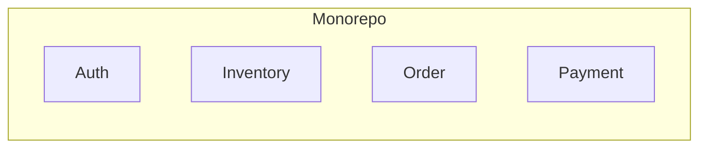
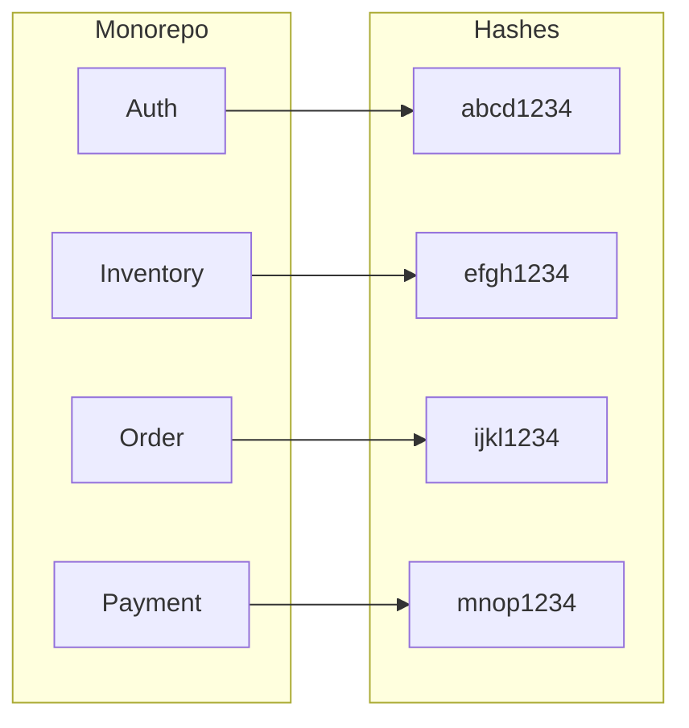
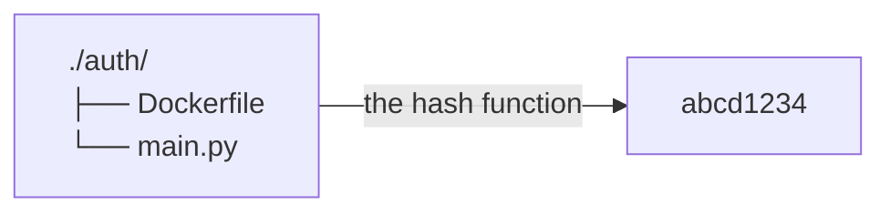

# Supercharge Monorepo CI/CD: Unlock Selective Builds

<iframe
  width="560"
  height="315"
  src="https://www.youtube.com/embed/aELgrPiZU5o?si=mfzobXVybhb1zaHu"
  title="YouTube video player"
  frameborder="0"
  allow="accelerometer; autoplay; clipboard-write; encrypted-media; gyroscope; picture-in-picture; web-share"
  referrerpolicy="strict-origin-when-cross-origin"
  allowfullscreen
></iframe>

Monorepo is the practice of storing all your code in a single repository, which
can be beneficial for code sharing, dependency management, and version control.

However, there is no free lunch! As your codebase grows, managing builds become
unavoidably complex and time-consuming. This build time is billed on your
organization and it can get quite costly.

In this blog post, we'll explore the challenges of building only changed
applications in a monorepo and discuss strategies to optimize your workflow
with selective builds.

If this gets you excited, let's dive in!

<!-- more -->

## Introduction

In the modern day of software development, where it is claimed that *software
is eating the world*[^software-eating-world], it's important to stay sharp and
ahead of the game, not falling victom of our own success.

Monorepo is one of the strategies to help manage the codebase of multiple
applications[^monorepo-wikipedia], while keeping them in a single repository, squeezing
every ounce of collaboration and teamwork out of your team.

It comes with its own benefit and challenges of course. Let's explore them in
more detail.

### What is a Monorepo and Why Use It?

A monorepo is a single repository that contains the source code for multiple
projects or applications. This approach is commonly used by organizations to
manage large codebases, share code between projects, and simplify dependency
management[^monorepo-tools].



It allows standardizing some of the organization-wide practices for packaging,
building, dependency management, and deployment. It enables more accessible
codebase where audits are done faster, dependencies can be upgraded
simultaneously and the overall development experience is more streamlined.

### The Challenge of Building Only Changed Applications

As the codebase in a monorepo grows, it becomes evidently clear that builds
will cost more compute time and resources. This is because the build process
often involves compiling, testing, and packaging all applications in the
repository, even if only a few of them have changed.

<figure markdown="span">
  { align=left loading=lazy }
  <figcaption><a href="https://unsplash.com/photos/man-wearing-white-top-using-macbook-1K9T5YiZ2WU" target="_blank">Full focus at a coffee shop</a></figcaption>
</figure>

This inefficiency can lead to longer build times, increased resource consumption,
and slower feedback loops for developers. To address this challenge, developers
need to implement strategies for building only the applications that have
changed since the last build.

### Key Advantages of Using a Monorepo Structure

Monorepo comes with a couple of very sexy and appealing
advantages[^circleci-monorepo]:

- [x] **Code Sharing**: Developers can easily share code between projects and
      applications, reducing duplication and improving consistency.
- [x] **Dependency Management**: Dependencies can be managed at the repository
      level, ensuring that all applications use the same versions of libraries
      and packages[^awesome-monorepo].
- [x] **Version Control**: Changes to multiple applications can be tracked and
      managed in a single repository, simplifying version control and code reviews.
- [x] **Collaboration**: Teams can work together more effectively by sharing
      code, reviewing changes, and coordinating releases in a single repository.
- [x] **Consistency**: Standardized build processes, testing frameworks, and
      deployment pipelines can be applied across all applications in the repository.

### Downsides of Monorepo Structure

However, there are some disadvantages to using a monorepo structure:

- [x] **Complexity**: Managing a large codebase with multiple applications can
      be complex and challenging, especially as the number of projects grows.
      This will require a lot of discipline and organization.
- [x] **Build Performance**: Building all applications in the repository can be
      time-consuming and resource-intensive, leading to longer build times and
      slower feedback loops for developers.
- [x] **Dependency Conflicts**: Dependencies between applications can lead to
      conflicts and compatibility issues, requiring careful management and
      coordination between teams.
- [x] **Security Risks**: A single repository can be a single point of failure
      for security breaches, so it's important to implement strong access controls
      and security measures to protect the codebase.
- [x] **Bigger Size at Scale**: When the teamsize grows, so does the size of
      the applications within it. As a result, even a single `git status`
      might take minutes[^monorepo-please-dont].

## The Problem with Full Rebuilds

When you make changes to a single application in a monorepo, the traditional
build process often involves rebuilding all applications in the repository. This
can be inefficient and time-consuming, especially if only a few applications have
changed.

Structured poorly, this can lead to a lot of wasted time and resources, which
could be better spent on more productive tasks. Imagine paying for an AWS
lambda function that runs for 10 minutes, but only 1 minute is used for the
actual work!

That's the main reason why optimizing the build process is crucial to benefit
from the advantages of a monorepo structure, while minimizing the drawbacks.

### Why Full Rebuilds are Inefficient

Full rebuilds are inefficient for several reasons:

- [x] **Resource Consumption**: Building all applications in the repository
      requires more compute resources, leading to higher costs and longer build
      times.
- [x] **Build Time**: Rebuilding unchanged applications is a waste of time and
      can slow down the feedback loop for developers.
- [x] **Developer Productivity**: Waiting for full rebuilds to complete can
      reduce developer productivity and hinder collaboration between teams.
- [x] **CI/CD Pipelines**: Full rebuilds can overload CI/CD pipelines and
      increase the risk of build failures and bottlenecks.

## Strategies for Building Only Changed Applications

To address the challenges of full rebuilds in a monorepo, developers can implement
strategies for building only the applications that have changed since the last
build. This can help optimize build performance, reduce resource consumption, and
improve developer productivity.

There are various strategies to employ, each can be fitting for different
organizations and teams. Let's explore some of them.

### Using Dependency Graphs to Identify Changes

One approach to selective builds is to use dependency graphs to identify the
applications that have changed and need to be rebuilt. By analyzing the
dependencies between applications, developers can determine which applications
are affected by a change and only rebuild those applications.

### Implementing Selective Builds with Build Tools

Another strategy is to use build tools that support selective builds, such as
Bazel or Lerna. These tools allow developers to define build targets for
specific applications and only rebuild those targets when changes are detected.

### Leveraging CI/CD Pipelines for Optimized Builds

The third approach to selective builds is to employ CI/CD pipelines to optimize
builds in a monorepo by triggering builds **only for the applications that have
changed**.

By setting up automated pipelines that monitor changes in the repository,
developers can ensure that only the necessary applications are rebuilt.

This is the approach we will explore in this article, implementing an efficient
CI/CD pipeline that will trigger the build for only the applications that have
changed since the last build.

## Selective Builds in Practice

We have done a lot of talking so far. Let's get hands-on a bit. :nerd:

Imagine having a monorepo with the following code structure:

```plaintext title="" linenums="0"
monorepo/
├── auth/
├── inventory/
├── order/
└── payment/
```

We need a way to findout about the changes in the repository in each
application. As explained earlier, there are different ways to do this.

To keep things simple, we will follow a naive approach by identifying the
changes of an application by looking at the changes to the contents of the
files within its directory.

If we, somehow, figure out a way to map the current contents of the files down
to a single unique string (i.e. a hash), we can compare future changes of any
of the files within that directory to the earlier computed hash and determine
if the application needs a rebuild.

Chances are, collisions are close to none and we won't have false negatives,
i.e. to not build an application if it needs to be built. :fingers_crossed:



With the hashes we collected in our first run, in any of the future pushes to
the repository, running the same hash function should either:

1. Generate the same hash output, meaning no changes were made to the files
   within the application directory, :lock: or
2. Generate a different hash output, meaning changes were made to the files
   and we need a rebuild of that application to reflect the new state of the
   app. :twisted_rightwards_arrows:

### Determine Current State for Selective Builds

*What if there was a way we could map our directory's content to a hash?*

That's the question we will cover in this section. It aims to calculate a
single finite string that represents the current state of the files within a
directory.

This function has to have knowledge of the contents within each of the files in
that directory because any future changes to those files should change the
output of this hash function.

Consequently, and completely irrelevant, the hash function is a one-way
function, meaning we can't reverse-engineer the contents of the files from the
hash output. This may or may not be a compliance requirement for your
orgniazation, yet it is good to know that it's already the case if the need
arises.

```shell title=""
find . -maxdepth 1 -type d -print0 | \
   while IFS= read -r -d '' dir; do
     find "$dir" -type f -exec sha256sum {} \; | \
     sha256sum - | \
     awk '{print $1}' | \
     xargs -I {} echo "$dir: {}"
   done | \
   sha256sum - | \
   awk '{print $1}'
```

There are 3 steps happening in this hash function. Let's break it down:

:one: We first find all the directories at the root of the current working
directory and pass that to the next step.

:two: For each of the found directories, we calculate the SHA256 hash of the
contents of the files within that directory and pass it to the next pipe.

In the next pipe, we'll grab all the hashes of the files within each directory
and calculate another SHA256 hash of these textual outputs.

Here's a visual diagram of everything that's happened so far.



And here's a sample output of the script:

```plaintext title="" linenums="0"
./:          0bb5ea223d6c1d8a01694e98d1e8c5da12eb7e45d7530276d85a77a2466779d1
./order:     58013061b734d86cb1794a7d0542db559b4dd4c55201a7cb6cd1c8a331ce1180
./auth:      ad39a5acefb8599684aa7761c3713c5bf4a67e217f0b00514abe19af58d74668
./payment:   50addb41c31a91220677a981eb1ac9b818c024d066997ad59f3a61ca0fa65aed
./inventory: 6e061f94f199396d210ce2be5ffc9ec88a87bd78d5b1895e9055791fdf34944e
```

:two: We grab all these textual outputs and run them through our SHA256 hash
function to get a single hash output. This will be the hash function of the
entire directory we'll use later to compare the current state against any of
the future changes. This will be the sample output:

```plaintext title="" linenums="0"
2c3d76bc29e8f1123c2e07b85d4f7796c3516604f1558cfd0c549aa255f92990  -
```

:three: As you see in the last step's output, there is a redundant `-` at the
end. The `awk` at the last step removes that, leaving us with only the hash
function output.

:material-check-all: The output of the last step is our final value for getting
a unique hash string for an entire directory of files. We'll use this in our
following steps.

Now that we get the idea of what to do, let's put it into a script. To make the
process programmatic, we'll use [JavaScript] to have more flexibility, as well
as because it is natively supported in [GitHub Actions].

The following snippet is probably not the best in class; yet, as there are
usually multiple ways to get the job done in programming languages, let's just
see it to completion for now.

```js title="index.js"
-8<- "docs/blog/codes/2024/0019/index.js::12"
```

We will now store the hash for all the directories of a given root path.

```js title="index.js" linenums="14"
-8<- "docs/blog/codes/2024/0019/index.js:14:53"
```

### Comparison for Selective Builds on Changes

In our naive approach, we will consider an application to be changed **if any
of the files within it has changed their contents**, e.g. addition, deletion,
etc.

To be able to determine the change, we need to store the "state" somewhere,
that is, the hash function output of previous runs. That's how we'll later be
able to compare the hashes and decide if a rebuild is needed.

Furthermore, for our datastore, among many available options, we'll pick
[Redis] for its simpicity and ease of use.

```js title="index.js" linenums="55"
-8<- "docs/blog/codes/2024/0019/index.js:55:71"
```

### Mark Changed Services for Rebuild

At this stage we're ready to putting it all together. We'll use the previous
codes to determine the changes in the repository and mark the applications
that need a rebuild if the contents of a file in that directory has changed.

Since this script will be used in the [GitHub Actions] workflow, we should
write the output to a special temporary file accessible by `$GITHUB_OUTPUT`.

```js title="index.js" linenums="73"
-8<- "docs/blog/codes/2024/0019/index.js:73:96"
```

### JavaScript GitHub Actions

To run this script, we will provide the required file `action.yml` for this
script to be used in the GitHub Actions workflow.

```yaml title="action.yml"
-8<- "docs/blog/codes/2024/0019/action.yml"
```

For the Redis server, we'll use the free tier of Upstash[^upstash], a managed Redis service.

!!! info "DISCLOSURE"

    This post is **NOT** sponsored by Upstash. I'm just a happy user of their
    services.

### GitHub Actions Workflow for Selective Builds

We are now ready to take this script and use it for our CI/CD pipeline. We
have already covered [how to use dynamic matrix in GitHub Actions] in a
previous post, so we'll use that knowledge to build our pipeline.

In our monorepo, we can define a [GitHub Actions] workflow that has three jobs:

1. The first job will run through the first depth of directories, read the
   contents of each directory/app, and calculate the hash of the contents.
   The output of this first job will be a list of directories that has changed
   contents since the last run and are in need of a rebuild.
2. The second job will use the technique of [GitHub Actions dynamic matrix] to
   run the build for only the applications that have changed.
3. The third job will wait for the completion of the build step, and once done
   successfully, it will update the Redis server with the new hash values for
   the directories.

Here's what each of the three jobs will look like in a sample monorepo:

```yaml title=".github/workflows/ci.yml" hl_lines="16-17 23 34 36 39 72 89 95"
-8<- "docs/blog/codes/2024/0019/ci.yml"
```

Notice a couple of important points in the workflow:

- [x] There are two triggers for this CI/CD workflow; one for the pushes to
      `main`, the default branch of the repository and understandably since
      we want to tie our live state to the `HEAD` of the repository. The next
      trigger is scheduled to run daily; this is present to avoid Upstash
      removing your possibly unused Redis instance as part of their resource
      management.
- [x] This workflow will run the three jobs in sequential order, waiting for
      the completion of one before starting the other. However, the build of
      the applications will be in parallel, thanks to the dynamic matrix
      feature of [GitHub Actions].
- [x] The second job, named `build`, is expecting two outputs from the first
      job and it is important to highlight that the value of each output is an
      string, yet the format expected in the `strategy.matrix` is a JSON
      serialized string.
      It will turn out to be something like this in the end:
      ```yaml title="" linenums="0"
      strategy:
        matrix:
          directory:
            - ./auth
            - ./inventory
            - ./order
            - ./payment
      ```
- [x] There are other ways we could've avoided writing three separate jobs
      for the same requirement, however, if we want to leverage the power of
      GitHub Actions' parallel builds, we have to split the jobs into separate
      steps, one for identifying changes, one for the actual build, and the
      last one to update the Redis server with the new hashes.

**NOTE**: As smart as it may sound to merge the last two jobs, that would
actually result in duplicate work and overwriting the writes to the Redis
server. This may or may not be an issue for your use case, yet it is clearly
evident that it is redundant and not a good idea!

### Save the Hashes of the Changes to the Upstash Redis Server

In order to be able to later compare the current state of the repo against old
states, we have to write the new hashes at the end of every workflow after the
build.

To do that in our [JavaScript] code, we'll simply use the [Redis] API.

```js title="index.js" linenums="96"
-8<- "docs/blog/codes/2024/0019/index.js:98:100"
```

### Entrypoint to the JavaScript GitHub Actions

The main starting point of this script, fetching all the inputs and producing
the expected output is as follows. Notice the heavy usage of the
[GitHub Actions] SDK API in this code to access the input.

```js title="index.js" linenums="100"
-8<- "docs/blog/codes/2024/0019/index.js:102:"
```

The first run of this script will trigger a build on all the directories as
expected, since the Redis server doesn't have any previous state to compare
against.

<figure markdown="span">
  { align=left loading=lazy }
  <figcaption>Build All Applications on First Run</figcaption>
</figure>

As soon as the first run is completed, the Redis server will have the hashes
of the directories stored. This will allow the script to compare the current
state against the previous state in the next run.

<figure markdown="span">
  { align=left loading=lazy }
  <figcaption>Redis Stored Hashes</figcaption>
</figure>

As a result, any future change to a single application, will only trigger a
build for that app only, instead of an expensive and unnecessary full rebuild
of all the applications.

<figure markdown="span">
  { align=left loading=lazy }
  <figcaption>Selective Build on Changes</figcaption>
</figure>

## Considerations

While the proposed method works great for some teams and processes, it's good
to be aware of the following considerations:

- [x] **Build Process May Vary**: Some of the applications may have different
      build processes, dependencies, or requirements. In such cases, a selective
      build approach may not be suitable for all applications in the monorepo.
      The proposed method is using the same build pipeline for all
      applications, which may not be ideal for all use cases.
- [x] **Human Collaboration**: As much as the proposed method is a streamlined
      approach into building projects and producing artifacts, it is important
      to highlight that no amount of technology can replace the chemistry
      and collaboration between team members. If one of the the teams decide
      to change their build for a specific application, the end result may
      end up breaking every other app's build process!

It's great to tackle this with the consultation of your team members. If the
majority of the team is happy with a process in place, that'll benefit the
overall productivity!

## Conclusion

Here's a crisp recap of what we covered in this blog post:

- [x] Selective builds in monorepos improve CI/CD efficiency
- [x] Hash functions identify changed applications for targeted rebuilds
- [x] JavaScript and GitHub Actions automate the process
- [x] Redis stores hashes to track repository state
- [x] Benefits include faster build times, reduced rebuilds, and improved
      productivity

To close this up, it is recommended to implement selective builds using
JavaScript, GitHub Actions, and Redis to optimize your monorepo's development
workflow, especially for large codebases with multiple applications.

## Further Reading

If you want to find out more about monorepo and how other players in the
industry are using it, here are some resources to check out:

1. **Microsoft DevOps Blog** - Insights into using Azure DevOps for monorepo
   management and selective builds[^microsoft-devops-blog].

1. **GitHub Blog** - Articles on monorepo strategies and build
   optimization[^github-blog].

1. **LinkedIn Engineering Blog** - LinkedIn's practices for managing large
   codebases with monorepos[^linkedin-engineering-blog].

1. **Facebook Engineering Blog** - Facebook's experiences with monorepos and
   incremental builds[^facebook-engineering-blog].

1. **Atlassian Developer Blog** - Insights into monorepo architecture and
   efficient build practices[^atlassian-developer-blog].

1. **ThoughtWorks Insights** - Articles on continuous integration, deployment,
   and monorepo strategies[^thoughtWorks-insights].

1. **Medium Articles** - Community-driven insights on monorepos and selective
   builds[^medium].

1. **Stack Overflow** - Discussions and Q&A on monorepo best
   practices[^stack-overflow].

1. **Guide to Monorepos for Front-end Code** by Toptal[^toptal-monorepo]

1. **Monorepos in Git** by Atlassian[^atlassian-monorepo-git]

## Bonus: Python Equivalent Script

If you have made it thus far, you deserve a goodie! :candy:

Here is the equivalent Python script for the JavaScript script we have
discussed so far. It does the same thing, albeit in Python.

```python title="main.py"
-8<- "docs/blog/codes/2024/0019/main.py"
```

Happy hacking and until next time :saluting_face:, *ciao*. :penguin: :crab:

[JavaScript]: /category/javascript/
[Redis]: /category/redis/
[GitHub Actions]: /category/github-actions/
[how to use dynamic matrix in GitHub Actions]: ./0004-github-actions-dynamic-matrix.md
[GitHub Actions dynamic matrix]: ./0004-github-actions-dynamic-matrix.md

[^software-eating-world]: https://a16z.com/why-software-is-eating-the-world/
[^monorepo-wikipedia]: https://en.wikipedia.org/wiki/Monorepo
[^monorepo-tools]: https://monorepo.tools/
[^circleci-monorepo]: https://circleci.com/blog/monorepo-dev-practices/
[^awesome-monorepo]: https://github.com/korfuri/awesome-monorepo
[^monorepo-please-dont]: https://medium.com/@mattklein123/monorepos-please-dont-e9a279be011b
[^upstash]: https://console.upstash.com/redis
[^microsoft-devops-blog]: https://devblogs.microsoft.com/devops/
[^github-blog]: https://github.blog/
[^linkedin-engineering-blog]: https://engineering.linkedin.com/blog
[^facebook-engineering-blog]: https://engineering.fb.com/
[^atlassian-developer-blog]: https://developer.atlassian.com/blog/
[^thoughtWorks-insights]: https://www.thoughtworks.com/insights
[^medium]: https://medium.com/
[^stack-overflow]: https://stackoverflow.com/
[^toptal-monorepo]: https://www.toptal.com/front-end/guide-to-monorepos
[^atlassian-monorepo-git]: https://www.atlassian.com/git/tutorials/monorepos
