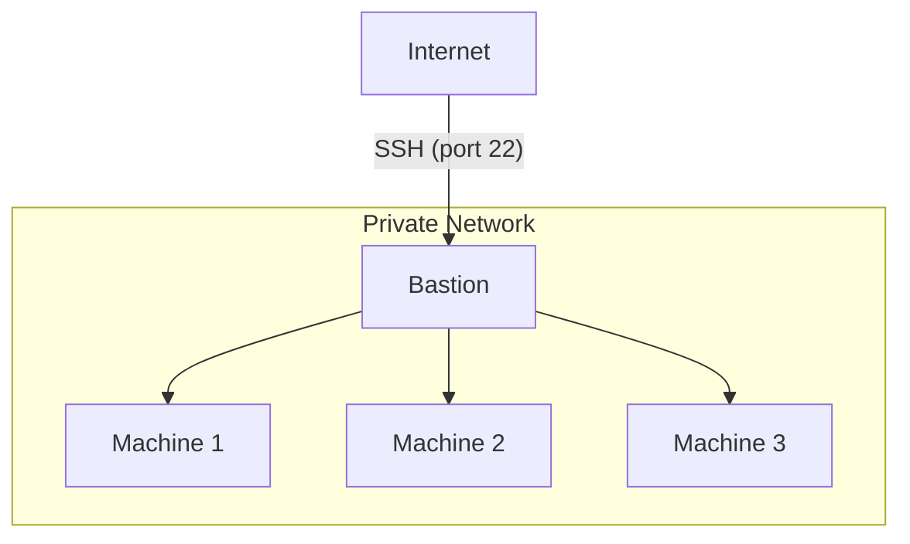

# Azure Bastion Host: Secure Cloud Access Made Simple

Discover how Azure Bastion can revolutionize your cloud security strategy.
This comprehensive guide explains what a Bastion host is, why it's crucial for
secure access to your Azure resources, and provides a step-by-step walkthrough
for implementation.

You'll learn how to enhance your network security, simplify remote access, and
automate Bastion deployment using tools like OpenTofu and Azure CLI. Dive in
to unlock the full potential of secure, scalable cloud access for your
organization.

<!-- more -->

## Introduction

Deploying production workloads in cloud providers has made a lot of operational
efforts easier. They allow for a lot of flexibility in your infrastructure &
with their on-demand offerings, your life as an administrator will be much
easier.

<!-- subscribe -->

### Challenges in Cloud Network Security

However, this ease doesn't come at a cheap price; and I'm not talking about
just the financial implications of deploying to cloud providers, but also their
maintenance and long-term management.

When you deploy your services to cloud providers, you can't simply lean back
and relax! They do make a lot of things easier, but they don't do magic. At the
end of the day, you're still in charge of anything happening to your production
workloads and as a result, your customers.

One of the most critical aspect of managing a production workload is to ensure
it is compliant with your security policies, not allowing adversaries to take
control and damage your business, financially and reputation-wise.

### Bastion Host: Secure Cloud Access Made Simple

Bastion hosts are computers like any other, sitting in your private network and
opening a backdoor to the internal services, using which you can gain access to
the resources which would've otherwise been closed due to deep defensive
measures.

Here's a how it look like:



The bastion host in this setup may also be called the "jump host", as in, you
make an extra hop from your current node to the target node using one extra
jump. :kangaroo:

## What is a Bastion Host? Understanding the Gateway to Secure Cloud Access

### Defining the Core Concept of Bastion Hosts

A Bastion host, often referred to as a jump server or jump box, is a specially
designed computer on a network that serves as a critical access point for a
protected network, particularly when accessing internally isolated
environments[^bastion-wikipedia].

In the context of [cloud computing], a Bastion host acts as a secure,
intermediate server that allows authorized users to connect to other servers or
services within a private network, typically a Virtual Private Cloud (VPC) or
Virtual Network (VNet)[^azure-vnet].

The primary purpose of a Bastion host is to provide a controlled and monitored
entry point into a protected network environment, reducing the attack surface
and enhancing overall security posture.

By channeling all external access through this fortified server, organizations
can implement robust security measures, such as multi-factor authentication,
detailed logging, and fine-grained access controls.

The provided capabilities for audit allows organization to adhere to the strict
compliance requirements and security standards, ensuring that only authorized
users can access sensitive resources[^az-compliance].

### The Evolution of Bastion Hosts: From On-Premises to Cloud

Historically, Bastion hosts emerged in the early days of network security as a
means to protect sensitive on-premises infrastructure. As organizations began
to adopt more complex network architectures, the need for a secure gateway
became increasingly apparent. Traditional Bastion hosts were often hardened
Linux or Unix servers, meticulously configured to withstand potential attacks.

With the advent of cloud computing, the concept of Bastion hosts has evolved to
meet the unique challenges of distributed and scalable environments. Cloud
providers like [Azure] have introduced managed Bastion services, such as Azure
Bastion, which offer enhanced security features, seamless integration with
cloud resources, and simplified management compared to traditional jump
servers[^azure-bastion].

The modern cloud-based Bastion host builds upon its on-premises predecessors by
incorporating advanced technologies like SSL/TLS encryption, automated
patching, and integration with cloud-native identity and access management
systems.

This evolution has made Bastion hosts an indispensable component of secure
cloud architecture, enabling organizations to maintain strict access controls
while leveraging the flexibility and scalability of cloud environments.

## Leveraging Azure Bastion: Enhancing Cloud Security and Compliance

### Security Benefits of Azure Bastion: Fortifying Your Cloud Perimeter

[Azure Bastion] provides a robust set of security features that significantly
enhance your cloud infrastructure's protection. By acting as a secure gateway,
it eliminates the need to expose RDP and SSH ports directly to the internet,
dramatically reducing the attack surface[^azure-faq].

Azure Bastion implements strong encryption for all remote connections, ensuring
that data in transit remains confidential. Additionally, it supports Azure
Active Directory integration, enabling multi-factor authentication and
just-in-time access, further strengthening your security posture[^az-bastion-intro].

### Compliance Advantages: Meeting Regulatory Requirements with Azure Bastion

For organizations operating in regulated industries, Azure Bastion offers
compliance advantages that are essential for maintaining data security and
privacy.

It helps meet various compliance standards by providing detailed audit logs of
all remote access sessions, aiding in forensic analysis and regulatory
reporting.

The service's built-in security features align with best practices required by
frameworks such as HIPAA, PCI DSS, and ISO 27001, simplifying the compliance
process for cloud environments.

### Simplified Access Management: Streamlining Secure Remote Connections

Azure Bastion eliminates the need for managing multiple VPN connections or
distributing and maintaining SSH keys. With its browser-based console, users
can securely access resources from any device without requiring additional
client software, reducing administrative overhead and improving user
experience.

## Azure Bastion vs. Traditional Jump Servers: A Comparative Analysis

### Key Differences: Cloud-Native Security vs. Legacy Approaches

While traditional jump servers and Azure Bastion serve similar purposes, there
are key differences in their implementation and capabilities.

Traditional jump servers often require manual setup, patching, and maintenance,
whereas [Azure] Bastion is a fully managed PaaS offering.

Azure Bastion also provides native integration with Azure services, offering a
more seamless experience compared to standalone jump servers.

### Advantages of Azure Bastion: Elevating Cloud Access Security

[Azure Bastion] offers several advantages over traditional jump servers:

1. [x] Automated patching and updates, ensuring the latest security measures
       are always in place
1. [x] Scalability to handle varying loads without manual intervention
1. [x] Native integration with Azure AD for enhanced identity management
1. [x] Built-in logging and monitoring capabilities for improved visibility
1. [x] No need for public IP addresses on your Azure VMs, enhancing security

## Understanding Azure Bastion Architecture and Integration

### Azure Bastion Architecture: A Deep Dive into Secure Design

Azure Bastion's architecture is designed for optimal security and performance.
It deploys a hardened and managed instance within your Azure Virtual Network,
which acts as the sole entry point for RDP and SSH traffic.

This architecture ensures that all remote desktop and SSH traffic is contained
within your Azure environment, never exposed directly to the internet.

### Effortless Integration with Azure Virtual Network

Azure Bastion integrates seamlessly with [Azure] Virtual Network, providing
secure access to all VMs within the VNet without requiring public IP addresses.

It utilizes Azure's backbone network for connectivity, ensuring
high-performance and low-latency connections[^az-networking].

This integration allows for granular network security group rules, enabling you
to precisely control which resources can be accessed through the Bastion host.

By leveraging Azure Bastion, organizations can achieve a higher level of
security, compliance, and operational efficiency in their cloud environments.

Its cloud-native design and deep integration with Azure services make it a
superior choice for secure remote access in modern cloud architectures.

## Step-by-Step Guide: Creating an Azure Bastion Host

In the following sections, we'll use the power of [Infrastructure as Code] to
efficiently produce and deploy an Azure Bastion in a Virtual Network.
Specifically, we'll employ [OpenTofu] & [Terragrunt] to create a repeatable and
consistent environment where the desired behavior will match that of the
written codes in the TF files.

### Prerequisites

For the purpose of this demo, we'll use the following stack. Feel free to alter
as you see fit, or stick with the ones provided here:

- [x] [Terragrunt v0.66]: Used mainly for dependency management between stacks
- [x] [OpenTofu v1.8]: Used for declarative definition of the infrastructure
- [x] [Azure CLI v2.63]: Used in the last step for native SSH connection from
      the command line of the local machine.

Additionally, we'll use the Azure CLI authentication[^az-cli-auth] for our API
requests to the Azure cloud. Make sure you have the required permissions to
create the resources.

```shell title="" linenums="0"
# If not already logged in
az login --use-device-code

# Specify your target Azure account
export ARM_SUBSCRIPTION_ID="00000000-0000-0000-0000-000000000000"
export ARM_TENANT_ID="00000000-0000-0000-0000-000000000000"
```

### Architecture Overview

Having the required tools installed, here's a list of the stacks we'll create
below:

- [x] `vnet`: [Azure] Virtual Network. Skip this step if you already have a
      VNet.
- [x] `bastion`: Azure Bastion Host. This is the main stack we'll focus on.
- [x] `vm`: Azure Virtual Machine. We'll use this to test the Bastion host.

### Configuring the Azure Virtual Network

You can safely skip this step if you already have a VNet in your [Azure] cloud
environment. For the sake of thoroughness, we'll create one from scratch.

```tf title="vnet/versions.tf"
-8<- "docs/blog/codes/2024/0020/vnet/versions.tf"
```

```tf title="vnet/naming.tf"
-8<- "docs/blog/codes/2024/0020/vnet/naming.tf"
```

```tf title="vnet/main.tf"
-8<- "docs/blog/codes/2024/0020/vnet/main.tf"
```

The following outputs will be used in other stacks when we define dependencies
to help [Terragrunt] understand the order of execution:

```tf title="vnet/outputs.tf"
-8<- "docs/blog/codes/2024/0020/vnet/outputs.tf"
```

The following [Terragrunt] HCL file is identical to being empty, yet we are
specifying an empty `input` block for readability.

```hcl title="vnet/terragrunt.hcl"
-8<- "docs/blog/codes/2024/0020/vnet/terragrunt.hcl"
```

Applying this stack as well as the other following two stack is similar. Simply
running the following three commands in the respective directories:

```shell title="" linenums="0"
terragrunt init
terragrunt plan -out tfplan
terragrunt apply tfplan
```

### Deploying Azure Bastion

Now that we have our VNet ready, we can proceed to create the [Azure Bastion]
host. The following files will be used to create the Bastion host:

```tf title="bastion/versions.tf"
-8<- "docs/blog/codes/2024/0020/bastion/versions.tf"
```

```tf title="bastion/naming.tf"
-8<- "docs/blog/codes/2024/0020/bastion/naming.tf"
```

```tf title="bastion/data.tf"
-8<- "docs/blog/codes/2024/0020/bastion/data.tf"
```

```tf title="bastion/locals.tf"
-8<- "docs/blog/codes/2024/0020/bastion/locals.tf"
```

```tf title="bastion/variables.tf"
-8<- "docs/blog/codes/2024/0020/bastion/variables.tf"
```

```tf title="bastion/main.tf"
-8<- "docs/blog/codes/2024/0020/bastion/main.tf"
```

```tf title="bastion/outputs.tf"
-8<- "docs/blog/codes/2024/0020/bastion/outputs.tf"
```

Notice how we are using the outputs from the `vnet` stack in our current
`bastion` stack. The alternative is to use the `terraform_remote_state` data
source[^tf-remote-state].

```hcl title="bastion/terragrunt.hcl"
-8<- "docs/blog/codes/2024/0020/bastion/terragrunt.hcl"
```

### Connecting to VMs using Azure Bastion

In a real-world scenario, you'd have a VM or a set of VMs that you'd like to
connect to using the Azure Bastion host. It may also be a private
endpoint[^az-pe] to other [Azure] services such as Azure SQL Database[^az-sql],
Azure Key Vault[^az-vault], etc.

Let us create a demo VM to test the Bastion host.

```tf title="vm/versions.tf"
-8<- "docs/blog/codes/2024/0020/vm/versions.tf"
```

```tf title="vm/naming.tf"
-8<- "docs/blog/codes/2024/0020/vm/naming.tf"
```

```tf title="vm/data.tf"
-8<- "docs/blog/codes/2024/0020/vm/data.tf"
```

```tf title="vm/locals.tf"
-8<- "docs/blog/codes/2024/0020/vm/locals.tf"
```

```tf title="vm/variables.tf"
-8<- "docs/blog/codes/2024/0020/vm/variables.tf"
```

```tf title="vm/main.tf"
-8<- "docs/blog/codes/2024/0020/vm/main.tf"
```

```tf title="vm/outputs.tf"
-8<- "docs/blog/codes/2024/0020/vm/outputs.tf"
```

Just as we had in the `bastion` stack, we're using the outputs from the `vnet`
stack in our current `vm` stack using the `dependency` block provided by
[Terragrunt].

```hcl title="vm/terragrunt.hcl"
-8<- "docs/blog/codes/2024/0020/vm/terragrunt.hcl"
```

### Native SSH Connection to Azure VM

Applying all the three stacks, we are now able to connect to the VM using
either the Azure Portal or the Azure CLI. Unfortunately though, since the
Azure Bastion Host is a PaaS offering, we can't use the `ssh` command directly
from the command line[^az-bastion-native-client].

```shell title="" linenums="0" hl_lines="20"
cd ./bastion
bastion_name=$(terragrunt output -raw bastion_name)

cd ../vm

rg=$(terragrunt output -raw resource_group_name)
vm_id=$(terragrunt output -raw vm_id)
admin_username=$(terragrunt output -raw admin_username)

terragrunt output -raw ssh_private_key > ~/.ssh/bastion
chmod 600 ~/.ssh/bastion

# if not already installed
az extension add -n bastion
az extension add -n ssh

az network bastion ssh \
  --name ${bastion_name} \
  --resource-group ${rg} \
  --target-resource-id ${vm_id} \
  --auth-type ssh-key \
  --username ${admin_username} \
  --ssh-key ~/.ssh/bastion
```

The final SSH command can also accept private IP addresses as you see below.

```shell title="" linenums="0" hl_lines="7"
# `vm` directory
private_ip=$(terragrunt output -raw private_ip_address)

az network bastion ssh \
  --name ${bastion_name} \
  --resource-group ${rg} \
  --target-ip-address ${private_ip} \
  --auth-type ssh-key \
  --username ${admin_username} \
  --ssh-key ~/.ssh/bastion
```

<!-- ssh tunnel -->
### SSH Tunneling with Azure Bastion

Another useful feature of Azure Bastion is the ability to create an SSH tunnel
to your Azure VMs through the Bastion host. This can be particularly useful for
accessing services running on the VM that are not exposed to the public
internet[^az-bastion-native-client].

To create an SSH tunnel, you can use the following commands:

```shell title="" linenums="0" hl_lines="4 12"
az network bastion tunnel \
  --name ${bastion_name} \
  --resource-group ${rg} \
  --target-resource-id ${vm_id} \
  --resource-port 22 \
  --port 50022


az network bastion tunnel \
  --name ${bastion_name} \
  --resource-group ${rg} \
  --target-ip-address ${private_ip} \
  --resource-port 22 \
  --port 50022
```

The distinction between resource port and local port is crucial to highlight:

- [x] `resource-port`: The port on the target resource (VM) that you want to
      connect to. In this case, it's the default SSH port 22, but it can also
      be a 5432 for a PostgreSQL database, 3306 for a MySQL database, etc.
- [x] `port`: The local port on your machine that will be used to establish the
      tunnel. You can choose any available port on your local machine. This
      will ultimately be the port you connect to with the address
      `localhost:50022`.

It may not look like it at first, but tunneling through the Bastion host can be
a powerful tool for securely accessing your Azure VMs and services.

An example of a very common use case is to access a database that is only
accessible through your internal VNet and not accessible from the outside
world.

!!! tip "Azure AD Authentication"

    **IMPORTANT NOTE**: In these examples, we are using the native SSH
    capability and providing SSH private key for authentication to the
    final/target VM. Azure Bastion Host comes with suppot for Azure AD
    authentication as well, which is recommended for production environments.

## Best Practices for Azure Bastion Implementation

### Security Considerations: Protecting Your Azure Environment

When implementing Azure Bastion, security should be your top priority. Start by
ensuring that your Azure Bastion subnet is named `AzureBastionSubnet` and has a
minimum subnet mask of `/27`[^security-bast-practices].

Furthermore, implement Network Security Groups (NSGs) to control traffic flow,
allowing only necessary inbound and outbound connections[^bastion-nsg].

On top of that, enable Azure Bastion's native logging features and integrate
with Azure Monitor for comprehensive visibility into access patterns and
potential security incidents.

### Performance Optimization: Enhancing User Experience

To maximize [Azure] Bastion's performance, consider these optimization
techniques:

1. Place the Bastion host in the same region as your target VMs to reduce
   latency.
1. Ensure your virtual network has sufficient bandwidth to handle expected
   traffic.
1. Use Azure Bastion's `Standard` SKU for features like host scaling and
   IP-based connection.
1. Implement Azure ExpressRoute for high-speed, private connections from
   on-premises networks.

### Cost Management Tips: Minimizing Azure Bastion Expenses

While [Azure] Bastion provides significant security benefits, it's essential to
manage costs effectively[^bastion-pricing]:

1. Choose the right SKU based on your usage patterns – `Basic` for smaller
   deployments, Standard for larger or more dynamic environments.
1. Implement Azure Policy to ensure consistent, cost-effective Bastion
   deployments across your organization.
1. Use Azure Cost Management tools to monitor and forecast Bastion-related
   expenses.
1. Consider implementing auto-shutdown for non-production environments to
   reduce unnecessary runtime costs.

## Considerations

As cloud environments continue to evolve, solutions like Azure Bastion will
play an increasingly crucial role in maintaining robust, scalable, and secure
infrastructures.

Remember, while Azure Bastion offers substantial benefits, it's important to
align its implementation with your specific organizational needs and security
policies.

Regularly review and update your Bastion configurations to ensure they continue
to meet your evolving security requirements in the dynamic cloud landscape.

## Conclusion

[Azure] Bastion stands as a powerful tool for enhancing cloud security and
simplifying remote access management.

Let's recap the essential takeaways:

1. Azure Bastion provides a secure, fully managed PaaS solution for accessing
   Azure VMs without exposing them directly to the internet.
1. It offers significant advantages over traditional jump servers, including
   automated patching, scalability, and native Azure AD integration.
1. Implementing Azure Bastion enhances compliance with various regulatory
   standards through detailed logging and built-in security features.
1. The service seamlessly integrates with Azure Virtual Networks, offering
   high-performance, low-latency connections to your resources.
1. Best practices for Azure Bastion implementation include proper subnet
   configuration, enabling logging, and optimizing for performance and cost.

By leveraging Azure Bastion, organizations can significantly improve their
cloud security posture while streamlining access management.

[cloud computing]: ../../category/cloud-computing.md
[Azure]: ../../category/azure.md
[Infrastructure as Code]: ../../category/infrastructure-as-code.md
[OpenTofu]: ../../category/opentofu.md
[Terragrunt]: ../../category/terragrunt.md
[Azure Bastion]: ../../category/azure-bastion.md

[Terragrunt v0.66]: https://github.com/gruntwork-io/terragrunt/releases/tag/v0.66.8
[OpenTofu v1.8]: https://github.com/opentofu/opentofu/releases/tag/v1.8.1
[Azure CLI v2.63]: https://learn.microsoft.com/en-us/cli/azure/install-azure-cli-linux?pivots=apt

[^bastion-wikipedia]: https://en.wikipedia.org/wiki/Bastion_host
[^azure-vnet]: https://learn.microsoft.com/en-us/azure/networking/
[^az-compliance]: https://docs.microsoft.com/en-us/azure/compliance/offerings/
[^azure-bastion]: https://learn.microsoft.com/en-us/azure/bastion/bastion-overview
[^azure-faq]: https://learn.microsoft.com/en-us/azure/bastion/bastion-faq
[^az-bastion-intro]: https://docs.microsoft.com/en-us/azure/bastion/bastion-overview
[^az-networking]: https://learn.microsoft.com/en-us/azure/networking/fundamentals/networking-overview
[^az-cli-auth]: https://learn.microsoft.com/en-us/cli/azure/authenticate-azure-cli
[^tf-remote-state]: https://developer.hashicorp.com/terraform/language/state/remote-state-data
[^az-pe]: https://learn.microsoft.com/en-us/azure/private-link/private-endpoint-overview
[^az-sql]: https://learn.microsoft.com/en-us/azure/azure-sql/database/sql-database-paas-overview?view=azuresql
[^az-vault]: https://learn.microsoft.com/en-us/azure/key-vault/general/basic-concepts
[^az-bastion-native-client]: https://learn.microsoft.com/en-us/azure/bastion/native-client
[^bastion-nsg]: https://docs.microsoft.com/en-us/azure/bastion/bastion-nsg
[^security-bast-practices]: https://docs.microsoft.com/en-us/azure/security/fundamentals/best-practices-and-patterns
[^bastion-pricing]: https://azure.microsoft.com/en-us/pricing/details/azure-bastion/
