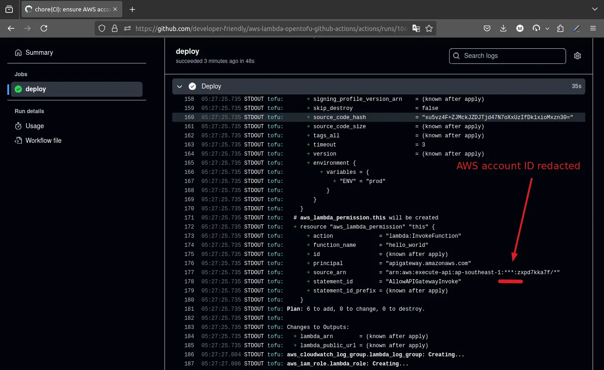
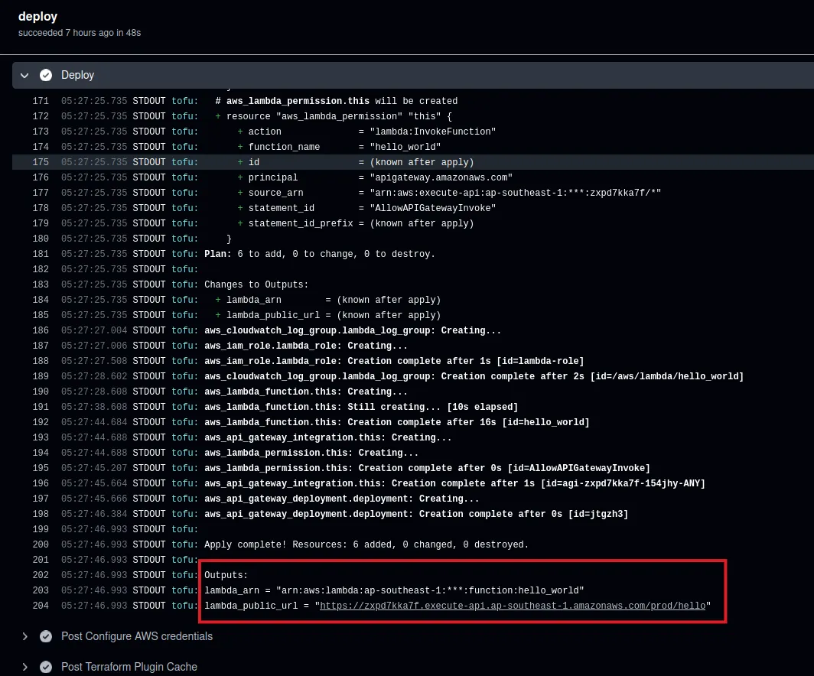
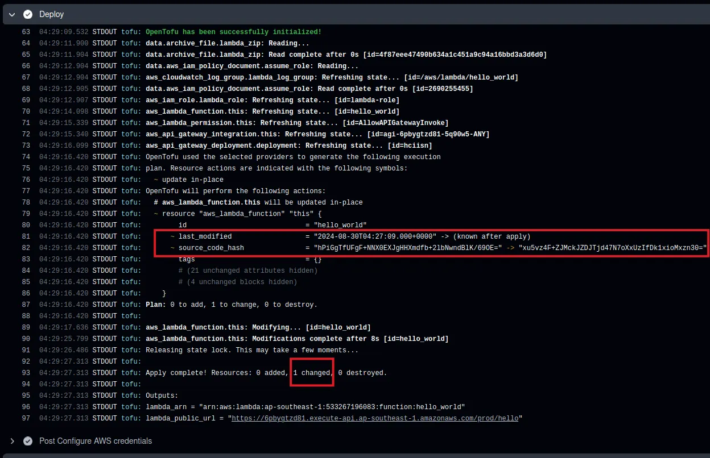

# How to Deploy NodeJS to AWS Lambda with OpenTofu & GitHub Actions

If you're a software engineer in any tier, there's a good chance that you're
already familiar with the language and syntax of JavaScript. It has a very low
barrier for entry and that is one of its strongest suits and what makes it so
widely adopted and popular.

In this article, you'll learn how to deploy a JavaScript application to AWS
Lambda using the principles of GitOps and with the help of OpenTofu as the
Infrastructure as Code and GitHub Actions for the CI/CD pipeline.

Stick till the end to find out how.

<!-- more -->

## Introduction

### The Popularity of JavaScript in Software Engineering

Given the wide adoption of [JavaScript], it's no surprise that many developers
would opt-in to write their applications in this language. It's easy to learn,
and a lot of people financially benefit by employing their stack and deploying
their application written in JavaScript.

In hindsight, JavaScript is a great choice for its dynamism and flexibility.
You will likely find more JavaScript developers in the market when looking for
a new hire than you'd, for example, find Erlang developers! :nerd:

### Overview of the Deployment Process

Regardless of the choice for the programming language, you will need a hosting
environment to deploy your application and [AWS] comes really strong with its
full suite of services.

As an SRE, I can assure you that I am yet to see a reliable and scalable
platform as good as [AWS]. Financial wise, however, I believe that AWS is way
too expensive and not a good choice for small startups and solopreneurs.

However, when considering its serverless option, the [AWS Lambda], I think
there are only a few providers out there that can compete with its offering.

!!! tip "Which Serverless Provider to Choose?"

    Among many available options, the best advice I can give as much as
    [serverless] is concerned, is to write your application agnostic to the
    interface and the platform it will be deployed on. You can always
    create a thin wrapper for, e.g., [AWS Lambda], Google Cloud Functions,
    [Azure] Functions, etc.

    In essence, try to write your application as a function of inputs and
    outputs. The added benefit is that your application is much easier
    to write automated tests for! :material-check-bold:

All in all, in today's article, I aim to develop and deploy a [JavaScript]
application and deploy it using the [NodeJS] runtime in [AWS Lambda].

The agenda is straightforward:

- [x] Create a [JavaScript] application that can handle HTTP requests coming from
      the [AWS] API Gateway.
- [x] Use [OpenTofu] to provision the infrastructure as code for the Lambda
      function.
- [x] Implement [GitOps] principles to manage the continuous integration and
      continuous deployment pipeline within [GitHub Actions].

If any of these stages look a bit scary, fret not! I'll guide you through each
step and provide you with the necessary code snippets to provide a complete
understanding of what is happening under the hood.

<!-- subscribe -->

## Prerequisites

### Required Tools and Technologies

Before we dive into the development and deployment process, let's make sure
that you have the necessary tools and technologies installed on your machine.

Here's a list of what you'll need:

- [x] Bun[^bun-install] or NPM[^npm-install] installed on your machine. Either
  works, at least one is required and I'll be using Bun in this article.
- [x] An [AWS] account with the necessary permissions to create and manage
  Lambda functions and API Gateway resources.
- [x] A [GitHub] account to create a new repository and set up the CI/CD pipeline
  using [GitHub Actions].
- [x] [OpenTofu] v1.8 installed[^opentofu-install].
- [x] [Terragrunt] v0.67 installed[^terragrunt-install].

### Setting Up Your Development Environment

The directory structure for this project is as follows:

NOTE: This structure is truncated for brevity.

```plaintext title="" linenums="0"
.
├── .github
│   ├── workflows
│   │   └── ci.yml
├── application/
│   ├── index.js
│   ├── package.json
├── infra
│   ├── aws-github-oidc
│   │   ├── main.tf
│   │   └── terragrunt.hcl
│   ├── gateway
│   │   ├── main.tf
│   │   └── terragrunt.hcl
│   ├── lambda
│   │   ├── main.tf
│   │   └── terragrunt.hcl
│   └── repository
│       ├── main.tf
│       └── terragrunt.hcl
└── terragrunt.hcl
```

The root `terragrunt.hcl` holds our remote state definition, that is, the
backend that persists the creation of all our [OpenTofu] stacks.

```terraform title="terragrunt.hcl"
-8<- "https://raw.githubusercontent.com/developer-friendly/aws-lambda-opentofu-github-actions/8dd524c7d6513970a8b3d8173097c519dbb2a787/terragrunt.hcl"
```

The `workspace_name` will result in values you see here:

- `infra-aws-gateway-oidc`
- `infra-gateway`
- `infra-lambda`
- `infra-repository`

## Building a NodeJS Application for AWS Lambda

At this point, we're ready to start creating our main application. The target
for this section is the `application/` directory, creating a [NodeJS]
application in the [JavaScript] programming language.

### Creating a Basic NodeJS Function

Since we're using Bun for our development, we'll need it in our `package.json`
as you see below.

To create the project and its initial config, `bun init` or `npm init` will
guide you through the process.

Be mindful of the `"type": "module"` in the following config file which allows
us to import other JS files in the project directory.

```json title="application/package.json" hl_lines="10"
-8<- "https://raw.githubusercontent.com/developer-friendly/aws-lambda-opentofu-github-actions/765285871571181ff3dc73b2707dacce9769af26/application/package.json"
```

### Best Practices for Lambda-Compatible NodeJS Code

When developing a [NodeJS] applications for [AWS Lambda], there are a few best
practices that you should follow to ensure that your code runs smoothly and
efficiently.

Here are some tips to keep in mind:

- [x] **Keep it small**: Lambda functions have a maximum size limit of 250MB,
  so make sure your code is as small as possible[^aws-lambda-quotas].
- [x] **Use async/await**: Use async/await instead of callbacks to handle
  asynchronous operations.
- [x] **Minimize dependencies**: Only include the dependencies that you need
  in your `package.json` file[^lambda-best-practices-medium].
- [x] **Use environment variables**: Store sensitive informations like API keys
  and database credentials in environment variables[^lambda-env-vars].
- [x] **Handle errors**: Make sure to handle errors properly in your code to
  prevent your Lambda function from crashing[^lambda-best-practices-devto].

### Code Snippet: Example Lambda Function

We will be using ECMAScript to develop our application, but you're welcome to
try other alternatives.

The logs you see in this code will be emitted to the [AWS] Cloudwatch logs.

```javascript title="application/index.js"
-8<- "https://raw.githubusercontent.com/developer-friendly/aws-lambda-opentofu-github-actions/765285871571181ff3dc73b2707dacce9769af26/application/index.js"
```

The name of the file, `index` and the name of the entrypoint function `handler`
are important to keep in mind because they will be used explicitly as the
handler of our [AWS Lambda] Function in the form of `index.handler`.

The main idea in this code is to have something ready that will respond with
`HTTP OK 200` on any request, regardless of the method or path. We'll extend
this later when setting up the CI/CD pipeline.

## Infrastructure as Code with OpenTofu

At this stage, we have what we need from an application perspective. Now, we
need to setup the infrastructure to host our application.

As you may have noticed in
[the directory structure earlier](#setting-up-your-development-environment)
, we have four stacks we'll be creating for this demo. Each of them serve a
specific purpose and you will be guided on each one of them.

### Introduction to OpenTofu

[OpenTofu] is a tool that allows you to define your infrastructure as code
using a simple and easy-to-understand configuration file. It's a fork of
[Terraform] (right after their change of license to BUSL[^hashicorp-busl]) and
provides a more user-friendly interface for managing your infrastructure.

The configurations in [OpenTofu] are written in the HCL language and stored in
`.tf` files. These files define the resources that you want to create in your
infrastructure, such as EC2 instances, S3 buckets, and Lambda functions.

### Establishing Trust Relationship Between AWS & GitHub

To make sure we do not need to store any hardcoded credentials in our [GitHub]
environment, we will establish a trust relationship between our [AWS] account
and the [GitHub] repository that will deploy our code to that account.

This is powered by [OpenID Connect] (OIDC) protocol and will allow us to
authenticate GitHub runners with AWS without the need to pass any access-key
and secret-key[^oidc-docs].

You can read more about it in the official [GitHub]
documentations[^github-aws-oidc] and [AWS] security blog[^aws-sec-blog-oidc].

```terraform title="infra/aws-github-oidc/versions.tf"
-8<- "https://raw.githubusercontent.com/developer-friendly/aws-lambda-opentofu-github-actions/0b7f77849331dcde8d0411e851b490eef34711cb/infra/aws-github-oidc/versions.tf"
```

```terraform title="infra/aws-github-oidc/variables.tf"
-8<- "https://raw.githubusercontent.com/developer-friendly/aws-lambda-opentofu-github-actions/0b7f77849331dcde8d0411e851b490eef34711cb/infra/aws-github-oidc/variables.tf"
```

The following conditions you see on the [AWS] IAM Role are ensuring that the
JWT token provided to the AWS API has two of its claims defined exactly and
explicitly as you see in this code.

**NOTE**: The IAM Role permission you see here has a quite permissive policy.
In a production setup, you should narrow down the permissions to the least
privilege principle[^least-privilege-principle].

```terraform title="infra/aws-github-oidc/main.tf" hl_lines="20 26"
-8<- "https://raw.githubusercontent.com/developer-friendly/aws-lambda-opentofu-github-actions/0b7f77849331dcde8d0411e851b490eef34711cb/infra/aws-github-oidc/main.tf"
```

In the end, the decoded JWT token of the GitHub runner job will have its claims
as you see below.

```json title=""
{
// --- truncated ---
  "sub": "repo:developer-friendly/aws-lambda-opentofu-github-actions:environment:prod",
  "aud": "https://sts.amazonaws.com/",
// --- truncated ---
}
```

Verifying the claims in the token is possible through grabbing the
`Authorization` header from the [AWS] Cloudtrail logs; a topic which is out of
scope for this article! :confounded:

```terraform title="infra/aws-github-oidc/outputs.tf"
-8<- "https://raw.githubusercontent.com/developer-friendly/aws-lambda-opentofu-github-actions/0b7f77849331dcde8d0411e851b490eef34711cb/infra/aws-github-oidc/outputs.tf"
```

```terraform title="infra/aws-github-oidc/terragrunt.hcl"
-8<- "https://raw.githubusercontent.com/developer-friendly/aws-lambda-opentofu-github-actions/0b7f77849331dcde8d0411e851b490eef34711cb/infra/aws-github-oidc/terragrunt.hcl"
```

For this, and all the rest of the [Terragrunt] stacks to follow, we'll use the
same method for provisioning of the resources as you see below.

```shell title="" linenums="0"
cd infra/aws-github-oidc
terragrunt init
terragrunt plan -out tfplan
terragrunt apply tfplan
```

### Preparing the GitHub Environment for CI/CD Pipeline

We are now equipped with the established trust between the providers. It's now
time to ensure the [GitHub] setup is ready to execute the pipelines in the
proper environment.

If you don't know much about [GitHub] Environments, you can read more about it
in the official documentations[^github-envs].

The gist of it is that GitHub Environment allows you to define specific
policies to restrict which runners and which branches are allowed to access and
execute their pipelines on it and what kind of restrictions are in place, e.g.,
a certain checks being passed, a reviewer approving the deployment, etc.

```terraform title="infra/repository/versions.tf"
-8<- "https://raw.githubusercontent.com/developer-friendly/aws-lambda-opentofu-github-actions/0b7f77849331dcde8d0411e851b490eef34711cb/infra/repository/versions.tf"
```

To be able to send requests to the GitHub API, we need to be authenticated in
our terminal. Read the docs if you need more info[^gh-cli-authentication].

The following `terraform_cloud_token` will allow the GitHub runner to store the
remote state in the [Terraform] cloud[^tfc-token-docs].

```terraform title="infra/repository/variables.tf" hl_lines="11-16"
-8<- "https://raw.githubusercontent.com/developer-friendly/aws-lambda-opentofu-github-actions/0b7f77849331dcde8d0411e851b490eef34711cb/infra/repository/variables.tf"
```

To grab your TFC token, head over to the Tokens section of your [Terraform]
cloud[^tfc-token-users].

!!! example "Terraform Cloud Token Variable"

    To pass the token to your TF `plan`, you can pass it as a CLI
    variable[^tf-variable-docs], or provide the value in a git-ignored
    `*.tfvars` file as below.

    ```terraform title="infra/repository/terraform.tfvars"
    terraform_cloud_token = "your-tfc-token"
    ```

Creating the `AWS_ACCOUNT_ID` secret below will ensure that the [AWS] account
ID is redacted in the [GitHub] runner logs. You can see a proof of that in the
logs of the deployment (screenshot below)[^lambda-deployment-logs].

```terraform title="infra/repository/main.tf" hl_lines="32 40 52-58"
-8<- "https://raw.githubusercontent.com/developer-friendly/aws-lambda-opentofu-github-actions/0b7f77849331dcde8d0411e851b490eef34711cb/infra/repository/main.tf"
```

Notice the [AWS] IAM Role and the TF cloud token provided to the GitHub
Environment that will later be used by the GitHub runner job to talk to the
AWS and [Terraform] cloud respectively.

<figure markdown="span">
 { align=left loading=lazy }
  <figcaption>GitHub runner Lambda Deployment Logs</figcaption>
</figure>

```terraform title="infra/repository/terragrunt.hcl"
-8<- "https://raw.githubusercontent.com/developer-friendly/aws-lambda-opentofu-github-actions/8dd524c7d6513970a8b3d8173097c519dbb2a787/infra/repository/terragrunt.hcl"
```

We apply this stack just as we did before.

```shell title="" linenums="0"
cd infra/repository
terragrunt init
terragrunt plan -out tfplan
terragrunt apply tfplan
```

### Creating the AWS API Gateway

Having prepared all the resources in the repository and the trust relationship
between GitHub Action and the AWS IAM for our runner job to deploy [AWS Lambda]
Function, we now need to prepare the internet facing HTTP endpoint for our
Lambda, that is, the API Gateway.

```terraform title="infra/gateway/versions.tf"
-8<- "https://raw.githubusercontent.com/developer-friendly/aws-lambda-opentofu-github-actions/0b7f77849331dcde8d0411e851b490eef34711cb/infra/gateway/versions.tf"
```

In the following code :point_down:, notice the important `path_part` in our
`aws_api_gateway_resource` creation. This will appear explicitly and exactly as
you configure here in the final internet-facing HTTP endpoint. Whatever you
place in this value, will be used in your HTTP requests.

```terraform title="infra/gateway/main.tf" hl_lines="9"
-8<- "https://raw.githubusercontent.com/developer-friendly/aws-lambda-opentofu-github-actions/0b7f77849331dcde8d0411e851b490eef34711cb/infra/gateway/main.tf"
```

The following outputs are needed for our `lambda` stack when we want to bind
the trigger of [AWS] API Gateway to send the events to our [AWS Lambda] Function.

```terraform title="infra/gateway/outputs.tf"
-8<- "https://raw.githubusercontent.com/developer-friendly/aws-lambda-opentofu-github-actions/0b7f77849331dcde8d0411e851b490eef34711cb/infra/gateway/outputs.tf"
```

```terraform title="infra/gateway/terragrunt.hcl"
-8<- "https://raw.githubusercontent.com/developer-friendly/aws-lambda-opentofu-github-actions/8dd524c7d6513970a8b3d8173097c519dbb2a787/infra/gateway/terragrunt.hcl"
```

That's all that we need as far as infrastructure goes.

The next step will be the final stage where we deploy the [JavaScript]
application code to the [AWS Lambda] function using [NodeJS] runtime.

!!! question "Why separating API Gateway and Lambda stacks?"

    While it may not be obvious and/or necessary, especially in a small setup,
    separating your TF stacks into manageable chunks of code will allow for
    better management and maintainability of your infrastructure as it grows.

    Especially so, knowing that the next stack, the `lambda/` directory, will
    be deployed inside the CI/CD pipeline by the [GitHub Actions] runner job;
    the less you put in that stack, the less time your CI/CD will be billed and
    the less dollar you have to pay to the GitHub! :moneybag:

    As a concrete example, the current runner for this demo only takes ~40s to
    deploy the new JavaScript code into the previously deployed [AWS Lambda].

    Those numbers will add up when you do 100s of deployments per month.

### Defining AWS Lambda Resources

In the `infra/lambda/` directory, you'll find the configuration file for the
Lambda function. These files define the resources that are required to deploy
the JavaScript code to the [AWS Lambda].

```hcl title="infra/lambda/versions.tf"
-8<- "https://raw.githubusercontent.com/developer-friendly/aws-lambda-opentofu-github-actions/0b7f77849331dcde8d0411e851b490eef34711cb/infra/lambda/versions.tf"
```

Notice the names of these variables below. They will be valued with the help
of [Terragrunt] dependency block[^tg-dependency].

```hcl title="infra/lambda/variables.tf"
-8<- "https://raw.githubusercontent.com/developer-friendly/aws-lambda-opentofu-github-actions/0b7f77849331dcde8d0411e851b490eef34711cb/infra/lambda/variables.tf"
```

Do you see the magic code below :point_down: that is archiving the application
within the [OpenTofu] without the need for us to do it manually from the CLI!?
That's what makes this setup extremely sexy; the GitHub CI/CD pipeline will
only have to apply this TF stack to upgrade the newer version of our
application and there will not be a need for an extra step to do a `zip` in the
runner job.

```hcl title="infra/lambda/main.tf" hl_lines="5-9 37 71 78-81"
-8<- "https://raw.githubusercontent.com/developer-friendly/aws-lambda-opentofu-github-actions/0b7f77849331dcde8d0411e851b490eef34711cb/infra/lambda/main.tf"
```

Line 71 is of extreme importance because it will be part of our internet-facing
endpoint as part of the URI, as you will see shortly for yourself.

!!! tip "Cloudwatch Log Group"

    Notice that we did not have to create the Cloudwatch Log Group ourselves in
    this TF stack.

    Because the `AWSLambdaBasicExecutionRole` has the required permission to
    create and ingest logs into the corresponding log group.

    However, creating it here will allow us to have control over its
    configuration, as well as its lifetime whenever we decide to terminate the
    Lambda Function and we want to remove all the relevant resources alongside,
    not leaving any orphan resource to bill our organization!

```hcl title="infra/lambda/outputs.tf"
-8<- "https://raw.githubusercontent.com/developer-friendly/aws-lambda-opentofu-github-actions/0b7f77849331dcde8d0411e851b490eef34711cb/infra/lambda/outputs.tf"
```

```hcl title="infra/lambda/terragrunt.hcl"
-8<- "https://raw.githubusercontent.com/developer-friendly/aws-lambda-opentofu-github-actions/8dd524c7d6513970a8b3d8173097c519dbb2a787/infra/lambda/terragrunt.hcl"
```

The output of this last stack will give us a URL similar to what you see here:

```plaintext title="" linenums="0"
https://6pbygtzd81.execute-api.ap-southeast-1.amazonaws.com/prod/hello
```

Which is essentially, in the following format:

```plaintext title="" linenums="0"
https://<api-id>.execute-api.<region>.amazonaws.com/<stage>/<path_part>
```

## Implementing GitOps Principles

With our initial application deployment complete, it's time to take this to the
next step. Let's set up a CI/CD pipeline that enables [continuous integration]
and effortless updates. This pipeline will automatically trigger when changes
are pushed to the `main` branch, deploying the latest version of our
application by updating the [AWS Lambda] function's code.

The CI/CD definition will take advantage of
[the established trust relationship](#establishing-trust-relationship-between-aws-github)
we did earlier using [OpenID Connect] (OIDC) protocol.

Using that trust relationship, the end result is that the GitHub runner will
be able to assume an [AWS] IAM Role using the web identity token provided by
[GitHub Actions].

To learn more about the web identity token and how it simplifies the
authentication from other service providers to the [AWS] API, refer to the
official documentation[^aws-web-identity-token].

### Version Control for Infrastructure and Application Code

Having all this setup, we are now empowered to commit our changes to the VCS
and push it to the target [GitHub] repository.

The idea is that once we push to the `main` branch, the deployment of our new
code will automatically grab the latest changes and pushes them to the
[AWS Lambda] function.

### Pull Request Workflow for Changes

When you want to make changes to the application or the infrastructure, you
should create a new branch from the `main` branch and make your changes there.

We can take this one step further where any new pull request will result in a
preview environment that has an internet-accessible endpoint for the reviewers
and all the stakeholders involved to get a look'n feel of what the new change
will be like.

We have an in-depth guide for [setting up the preview environment] in a
different setup, one that you can get inspiration from and build yours for the
current or any other future setup.

## Setting Up GitHub Actions for CI/CD

The CI definition will look as you see below.

```yaml title=".github/workflows/ci.yml" hl_lines="14 21 36 42"
-8<- "https://raw.githubusercontent.com/developer-friendly/aws-lambda-opentofu-github-actions/8dd524c7d6513970a8b3d8173097c519dbb2a787/.github/workflows/ci.yml"
```

The highlight of this CI definition is in the step named
`Configure AWS credentials` when we're configuring the AWS credentials by
instructing the runner to grab the JWT token issued and provided by the GitHub
Actions and use it to assume the [AWS] IAM Role for performing the required
actions in the target AWS account[^tg-foundation-iam-role].

For this to happen, the `id-token: write` permission is required. The rest of
the authentication is what we've allowed in the `infra/aws-github-oidc/` stack
when configuring the `sub` and `aud` claims of the trust
relationship[^github-aws-oidc].

Ultimately, the only entity in the whole world that is allowed to assume this
role is coming from a [GitHub] runner job that is in the target repository and is
running under the specific GitHub Environment[^github-envs].

## Deploying to AWS Lambda

Now that we have everything set up, it's time to deploy our application to
[AWS Lambda].

As soon as we commit and push the changes, a new [GitHub Actions] workflow will
be triggered and the CI/CD pipeline will start.

Here's a sample deployment of our application as you see in the screenshot
below[^ci-example-successful-run].

<figure markdown="span">
 { align=left loading=lazy }
  <figcaption>Example Successful CI Run</figcaption>
</figure>

### Automated Deployment Process

Now that we have everything ready, all we have to do is to change the code a
bit, commit and push it to the repository and observe the new deployment.

```js title="application/index.js" hl_lines="1 7"
-8<- "https://raw.githubusercontent.com/developer-friendly/aws-lambda-opentofu-github-actions/8dd524c7d6513970a8b3d8173097c519dbb2a787/application/index.js"
```

```js title="application/routes.js"
-8<- "https://raw.githubusercontent.com/developer-friendly/aws-lambda-opentofu-github-actions/8dd524c7d6513970a8b3d8173097c519dbb2a787/application/routes.js"
```

Upon submitting our change to the `main` branch, we'll get the new deployment
in as soon as less than one minute, especially having that cache mechanism for
the TF providers[^tg-cache-providers].

<figure markdown="span">
 { align=left loading=lazy }
  <figcaption>Rollout Release in Lambda Function</figcaption>
</figure>

### Verifying the Deployment

To test the current setup, from anywhere around the world, a simple `curl`
command can verify our setup.

```shell title="" linenums="0"
curl -sSD - \
  https://6pbygtzd81.execute-api.ap-southeast-1.amazonaws.com/prod/hello

# output: Hello World!

# or

curl -sSD - \
  -X POST \
  -H content-type:application/json \
  -d '{"name":"John Doe"}' \
  https://6pbygtzd81.execute-api.ap-southeast-1.amazonaws.com/prod/hello

# output: Hello John Doe!
```

The result will return `200 OK`, with some header information giving away that
the response was returned by [AWS] Cloudfront[^lambda-edge-cloudfront].

### Troubleshooting Common Deployment Issues

While the deployment process is designed to be smooth, you may encounter
issues.

Common problems include incorrect [IAM] permissions, misconfigured OIDC trust
relationships, or errors in your Lambda function code.

If you face deployment failures, start by checking the [GitHub Actions] logs
for specific error messages.

Verify that your [AWS] credentials and permissions are correctly set up, and
ensure that your Lambda function code is compatible with the runtime
environment.

Don't forget to review the CloudWatch logs for any runtime errors that might
occur after deployment.

Specifically, you might mistakenly create the API Gateway integration with
HTTP method other than `POST`. That will result in `500 Internal Server Error`
when sending HTTP requests to the target address.

```hcl title="infra/lambda/main.tf" linenums="52" hl_lines="6"
-8<- "https://raw.githubusercontent.com/developer-friendly/aws-lambda-opentofu-github-actions/0b7f77849331dcde8d0411e851b490eef34711cb/infra/lambda/main.tf:52:59"
```

## Performance Optimization and Monitoring

### Lambda Function Optimization Techniques

Now that we've got our Lambda function up and running, let's talk about making
it sing!

Optimizing your Lambda function isn't just about saving a few milliseconds –
it's about respecting your users' time and your wallet.

We must employ techniques like:

- Minimizing cold starts
- Optimizing memory allocation
- Leveraging Lambda layers
- etc.

These tweaks might seem small, but they add up to create a snappier, more
cost-effective application.

Remember, a well-optimized Lambda function is a happy Lambda function!

### Monitoring Tools and Best Practices

Keeping an eye on your Lambda function is like being a good parent – it's all
about love, attention, and the right tools.

You should keep a close eye on [AWS] CloudWatch and X-Ray, being mindful on the
metrics and alerts.

Remember, though, monitoring isn't just about watching numbers; it's about
understanding your application's behavior in the wild.

## Security Considerations

### IAM Roles and Permissions

Always adhere to the principle of least privilege when setting up [IAM] roles
for your Lambda function; Grant only the permissions necessary for the function
to perform its tasks.

Additionally, regularly review and audit these permissions to ensure they
remain appropriate as your application evolves. Automated off-the-shelf and
opensource tools exist to ensure that the requested permissions are aligned
with the actual usage. Make sure to employ them appropriately.

For your reference, here are some of the available tools:

- [x] [AWS] IAM Access Analyzer[^iam-access-analyzer]: Identifies resources in
  your organization and accounts that are shared with an external entity
- [x] CloudSplaining[^cloudsplaining]: An AWS IAM Security Assessment tool that
  identifies violations of least privilege
- [x] RepoKid[^repokid]: Automatically removes permissions from AWS [IAM] roles
  that are not being used
- [x] Prowler[^prowler]: A command-line tool for AWS security best practices
  assessment, auditing, hardening and forensics readiness

### Securing Your Lambda Function

1. [x] **Environment Variables**: Use AWS Secrets Manager or Parameter Store
   for sensitive data instead of hardcoding them in your
   function[^lambda-env-vars].
1. [x] **VPC Configuration**: If your Lambda needs to access private resources,
   configure it to run within a VPC, but be mindful of the potential impact on
   cold start times[^lambda-vpc].
1. [x] **Input Validation**: Implement thorough input validation to protect
   against injection attacks and unexpected inputs.
1. [x] **Dependency Management**: Regularly update your function's dependencies
   to patch known vulnerabilities. Consider using tools like `npm audit` or
   Snyk[^snyk] to automate this process[^lambda-dependencies].
1. [x] **Encryption**: Enable encryption for your function's environment
   variables and any data at rest[^lambda-encryption].
1. [x] **Logging and Monitoring**: Implement comprehensive logging, but be
   cautious about what you log to avoid accidentally exposing sensitive
   information[^lambda-monitoring].

Remember, security is an ongoing process. Regularly review [AWS] security best
practices and stay informed about new features and recommendations for securing
[serverless] applications.

## Conclusion

And there you have it, folks! We've journeyed together from the humble
beginnings of a [JavaScript] function to a fully-fledged, securely deployed AWS
Lambda application.

We've harnessed the power of [OpenTofu] for infrastructure as code, embraced
the principles of GitOps, and set up a slick CI/CD pipeline with
[GitHub Actions].

Let's recap the key takeaways:

1. [JavaScript] and AWS Lambda make a powerful duo for serverless applications.
1. [OpenTofu] simplifies infrastructure management and promotes version
   control.
1. [GitOps] principles enhance collaboration and maintain deployment
   consistency.
1. [GitHub Actions] automate the deployment process, saving time and reducing
   errors, while removing the manual labour of repeatable work.
1. [Security] and performance optimization are ongoing processes crucial for
   robust applications.

Remember, this journey doesn't end here. The world of [serverless] is
ever-evolving, and there's always more to learn and optimize.

Wherever you are in your craftsmanship journey, I hope this guide has given you
the tools, understanding and confidence to tackle your next serverless project.

For those of you who skimmed (no judgment here!), the gist is this:

> With the right tools and practices, deploying and managing serverless
applications can be a smooth, secure, and even enjoyable process.

Give it a try – your future self will thank you!

Thank you for investing your valuable time in reading this guide. Your growth
and success in the world of serverless development mean the world to me.

If you have any questions, hit me up in the comments.

Now go forth and deploy those Lambda functions like a pro! 🚀

Until next time, *ciao* :cowboy: & happy coding! :penguin: :crab:

[JavaScript]: ../../category/javascript.md
[AWS]: ../../category/aws.md
[GitHub]: ../../category/github.md
[GitHub Actions]: ../../category/github-actions.md
[OpenTofu]: ../../category/opentofu.md
[NodeJS]: ../../category/nodejs.md
[AWS Lambda]: ../../category/aws-lambda.md
[Terraform]: ../../category/terraform.md
[OpenID Connect]: ../../category/openid-connect.md
[Terragrunt]: ../../category/terragrunt.md
[IAM]: ../../category/iam.md
[serverless]: ../../category/serverless.md
[Azure]: ../../category/azure.md
[GitOps]: ../../category/gitops.md
[Continuous Integration]: ../../category/continuous-integration.md
[Security]: ../../category/security.md

[setting up the preview environment]: ./0017-per-pr-deployment.md

[^bun-install]: https://bun.sh/docs/installation
[^npm-install]: https://docs.npmjs.com/cli/v10/commands/npm-install
[^opentofu-install]: https://opentofu.org/docs/intro/install/
[^terragrunt-install]: https://terragrunt.gruntwork.io/docs/getting-started/install/
[^aws-lambda-quotas]:https://docs.aws.amazon.com/lambda/latest/dg/gettingstarted-limits.html
[^lambda-best-practices-medium]: https://medium.com/platform-engineer/aws-lambda-performance-best-practices-50968e5bb075
[^lambda-env-vars]: https://docs.aws.amazon.com/lambda/latest/dg/configuration-envvars.html
[^lambda-best-practices-devto]: https://dev.to/aws-builders/aws-lambda-best-practices-4chn
[^hashicorp-busl]: https://www.hashicorp.com/blog/hashicorp-adopts-business-source-license
[^oidc-docs]: https://openid.net/specs/openid-connect-core-1_0.html
[^github-aws-oidc]: https://docs.github.com/en/actions/security-for-github-actions/security-hardening-your-deployments/configuring-openid-connect-in-amazon-web-services
[^aws-sec-blog-oidc]: https://aws.amazon.com/blogs/security/use-iam-roles-to-connect-github-actions-to-actions-in-aws/
[^least-privilege-principle]: https://en.wikipedia.org/wiki/Principle_of_least_privilege
[^github-envs]: https://docs.github.com/en/actions/managing-workflow-runs-and-deployments/managing-deployments/managing-environments-for-deployment
[^gh-cli-authentication]: https://registry.terraform.io/providers/integrations/github/6.2.3/docs
[^tfc-token-docs]: https://developer.hashicorp.com/terraform/cloud-docs/users-teams-organizations/api-tokens
[^tfc-token-users]: https://app.terraform.io/app/settings/tokens
[^tf-variable-docs]: https://developer.hashicorp.com/terraform/language/values/variables
[^lambda-deployment-logs]: https://github.com/developer-friendly/aws-lambda-opentofu-github-actions/actions/runs/10627337889/job/29460327863#step:7:178
[^tg-dependency]: https://terragrunt.gruntwork.io/docs/reference/config-blocks-and-attributes/#dependency
[^aws-web-identity-token]: https://docs.aws.amazon.com/STS/latest/APIReference/API_AssumeRoleWithWebIdentity.html
[^tg-foundation-iam-role]: https://docs.gruntwork.io/reference/modules/terraform-aws-security/github-actions-iam-role/
[^ci-example-successful-run]: https://github.com/developer-friendly/aws-lambda-opentofu-github-actions/actions/runs/10627337889/job/29460327863
[^tg-cache-providers]: https://terragrunt.gruntwork.io/docs/features/provider-cache/
[^lambda-edge-cloudfront]: https://docs.aws.amazon.com/AmazonCloudFront/latest/DeveloperGuide/lambda-generating-http-responses.html
[^iam-access-analyzer]: https://aws.amazon.com/iam/features/analyze-access/
[^cloudsplaining]: https://github.com/salesforce/cloudsplaining
[^repokid]: https://github.com/Netflix/repokid
[^prowler]: https://github.com/prowler-cloud/prowler
[^lambda-vpc]: https://docs.aws.amazon.com/lambda/latest/dg/configuration-vpc.html
[^snyk]: https://docs.snyk.io/
[^lambda-dependencies]: https://docs.aws.amazon.com/lambda/latest/dg/chapter-layers.html
[^lambda-encryption]: https://docs.aws.amazon.com/lambda/latest/dg/security-dataprotection.html
[^lambda-monitoring]: https://docs.aws.amazon.com/lambda/latest/dg/lambda-monitoring.html
