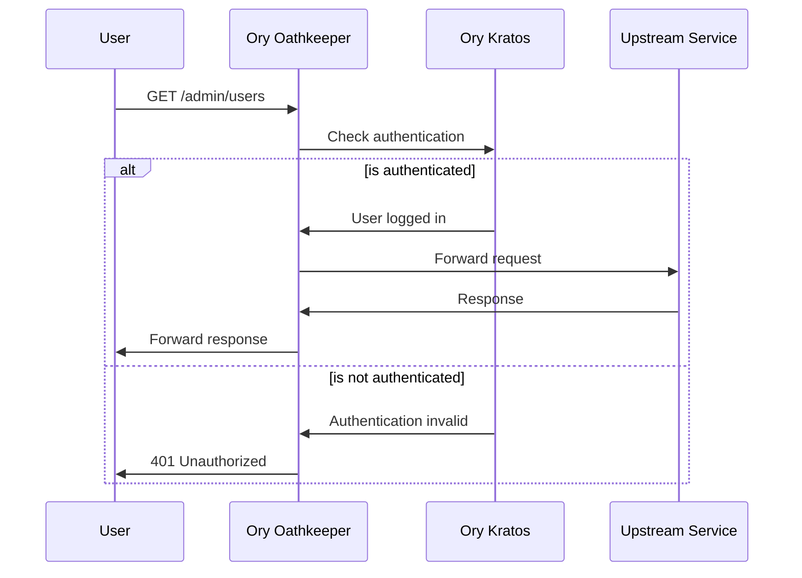

# How to Secure Admin Pages Behind with Ory Oathkeeper and Kratos

In today's digital landscape, protecting sensitive administrative interfaces
is crucial for organizations delivering services over the internet. This guide
offers a practical approach to implementing secure, authenticated access for
admin pages using Ory's proxy and authentication (micro)services.

We'll explore how to leverage Ory Oathkeeper and Kratos to create a robust
authentication system that aligns with current security best practices and
regulatory requirements.

If you're looking for an efficient way to enhance the security of your admin
services, you'll find value in the steps outlined here.

<!-- more -->

## Introduction: Securing Admin Access in the Digital Age

Behind the scenes of every successful digital service, is a team of expert
IT professionals trying to maintain the platform and the underlying services.
While those services are crucial to the success of the business, they also
represent a potential security risk if not properly protected.

Admin pages are a prime target for malicious actors looking to exploit
vulnerabilities in the system. By securing these pages with robust
authentication mechanisms, you can significantly reduce the risk of
unauthorized access and data breaches.

## Understanding the Need for Gated Authentication

Since we're living in the age of network and connectivity, it's essential to
implement a secure authentication system that can scale with your business
needs.

Furthermore, by providing a protected access to your upstream services, you
will enable the non-IT professionals to focus on their tasks without worrying
about common matters such as credential rotations, access control, and
compliance.

This is where Ory Oathkeeper and Kratos come into play.

The combination of the two allows for any internet business to implement
secure, scalable, and compliant authentication and authorization mechanisms
that can be easily integrated into existing systems.

By using these services, you won't have to reinvent the wheel to protect the
upstream applications, and instead, you will configure the said services in a
way that can forward the internet traffic if only certain authn & authz
condition(s) are met.

## Introducing Ory Oathkeeper and Kratos: Powerful Authentication Tools



Ory Oathkeeper is a powerful proxy that acts as a gatekeeper for your
services, enforcing access control policies and handling authentication
requests. In doing so, Oathkeeper receives all the incoming traffic from the
outside world, and by consulting the configured authentication and
authorization services, decides whether to allow or deny access to the
requested resource.

Kratos, on the other hand, is a flexible and extensible identity management
system that provides user registration, login, and account recovery. In its
latest release (v1.3 as of the time of writing[^kratos-v1.3]), it comes with
many great features and improvements that make it a perfect fit for modern
infrastructures.

## The Benefits of Secure Admin Pages for IT Professionals

Why should you care about having a secure access to your applications?

Why would you want to add yet another service to your (already complex) setup?

The reason is quite simple really.

There are many malicious actors and adversaries out there who are looking to
exploit any vulnerability they can find in your system.

It's not necessarily that they are bad people (although some of them are
:man_facepalming_tone2:), but, in reality, most are just trying to make a
living (no judgment here).

As such, taking a proactive approach is crucial to ensure you're staying ahead
of the curve and protecting your business from potential threats. You wouldn't
want your company to be vulnerable out in the wild, now would you?

To keep things professional, here's a list of things that are advantageous to
you and your team when you enforce authenticated and protected access to your
upstream services (admin page or otherwise):

- [x] **Compliance**: By implementing secure access controls, you can ensure
  that your organization meets the necessary compliance standards and
  regulations.
- [x] **Security**: Protecting your admin pages with robust authentication
  mechanisms helps prevent unauthorized access and data breaches.
- [x] **Scalability**: Ory Oathkeeper and Kratos are designed to scale with
  your business needs, ensuring that you can handle increased traffic and
  user demand. Both are completely stateless and can scale horizontally as well
  as vertically.
- [x] **Maintenance**: By using these services, you can reduce the burden on
  your IT team and simplify the process of managing access controls and
  security policies.
- [x] **Flexibility**: Ory Oathkeeper and Kratos are highly flexible and
  extensible, allowing you to customize the authentication and authorization
  mechanisms to suit your specific requirements.
- [x] **Feature Rich**: Ory services come with many built-in features natively
  supported out of the box. To name just a few of Ory Kratos' latest features,
  passkey, webauthn, and passwordless authentication are just a few.

## Step-by-Step Guide: Implementing Ory Proxy for Admin Access

To start using the Oathkeeper & Kratos, we first need to deploy their services
into our infrastructure. There are various ways you can achieve this step which
highly depends on your current setup.

For the purpose of demonstration, we'll use the official Helm chart to deploy
their services into a Kubernetes cluster.

For a complete guide on Ory Oathkeeper and Ory Kratos, head over to their
corresponding guide in our archive below:

- [x] [Ory Kratos: Headless Authentication, Identity and User Management]
- [x] [Ory Oathkeeper: Identity and Access Proxy Server]

### Prerequisites

If you want to follow along with this guide, here are the list of tools you
need:

- [x] A Kubernetes cluster (v1.31 as of writing)
- [x] Helm CLI (v3.16)

### Deploying Ory Oathkeeper

It's simpler to deploy Oathkeeper initially and that's where we start.

```yaml title="oathkeeper-values.yml"
-8<- "../../codes/2024/0022/oathkeeper-values.yml"
```

```bash title="" linenums="0"
helm repo add ory https://k8s.ory.sh/helm/charts
helm install oathkeeper ory/oathkeeper \
  --version 0.49.x \
  --values oathkeeper-values.yml
```

### Deploying Ory Kratos

Kratos' deployment is more involved and requires a bit of configuration.


## Leveraging Ory Authentication Microservices for Enhanced Security

## Compliance and Best Practices: Meeting Modern Security Standards

## Case Study: Real-World Implementation of Ory Oathkeeper and Kratos

## Troubleshooting Common Issues in Admin Page Security

## Future-Proofing Your Admin Access: Scalability and Maintenance

## Conclusion: Empowering IT Teams with Secure Admin Capabilities

[^kratos-v1.3]: https://github.com/ory/kratos/releases/tag/v1.3.0

[Ory Kratos: Headless Authentication, Identity and User Management]: ./0012-ory-kratos.md
[Ory Oathkeeper: Identity and Access Proxy Server]: ./0015-ory-oathkeeper.md
