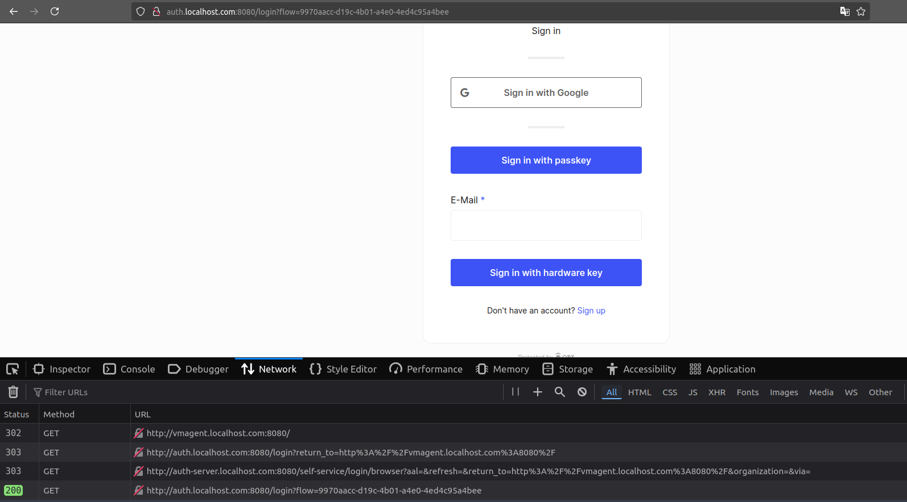
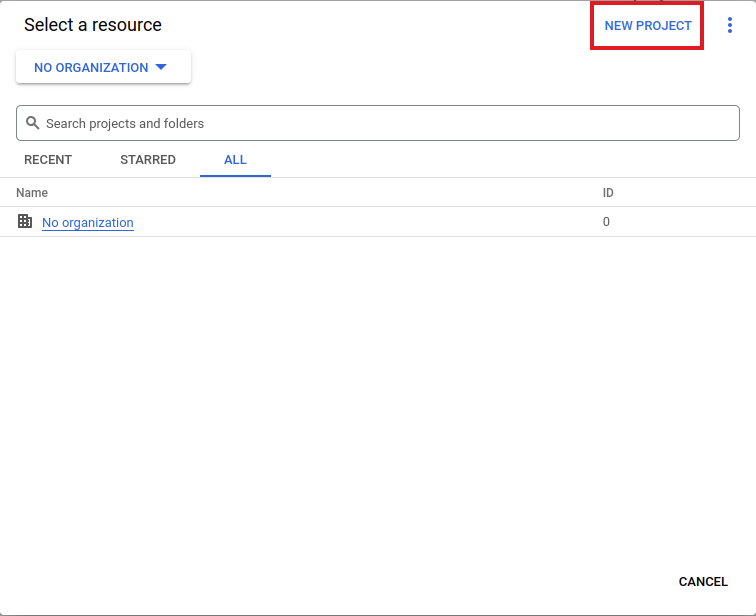
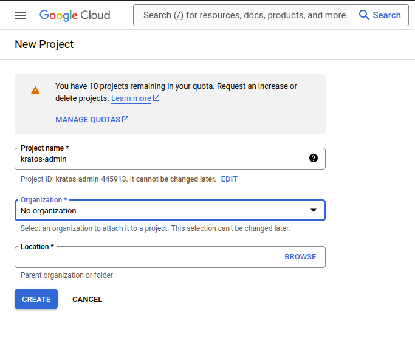
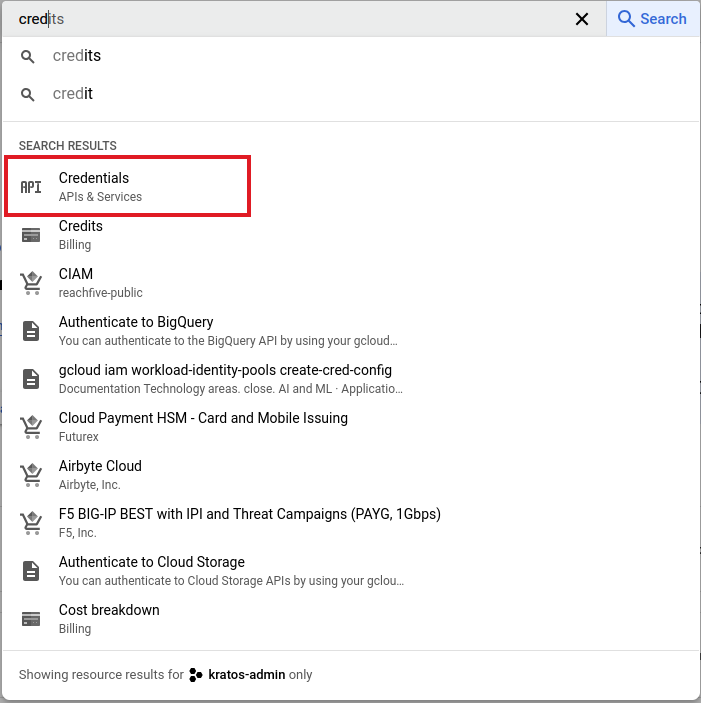
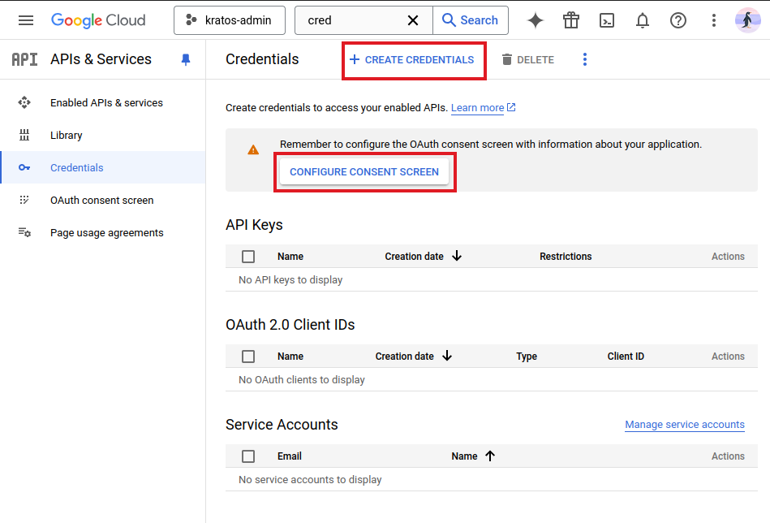

# How to Protect ANY Upstream Service with Operational Authentication

In this blog post, I will demonstrate how to use Ory Oathkeeper and Ory Kratos
to protect upstream services behind authentication, especially the ones that do
not have native authentication built-in, e.g., Prometheus, Hubble UI,
Alertmanager, etc.

<!-- more -->

## Introduction

Over the years of administering and maintaining production-grade systems at
different companies, I have found myself in the situations where I needed to
deploy internet-accessible services that may or may not provide built-in
authentication.

These services are usually valuable assets and solutions to the current
problems of the organization/platform. Having them exposed and accessible over
the internet would benefit the employees and administrators a lot.

However, the downside is that not having a built-in authentication is a
security risk. One that cannot and should not be overlooked.

As such, in the following article, I will share my method of protecting those
critical and administrative level services to the public internet in a way that
is only visible to the trusted eyes.

## Prerequisites

The purpose of this blog post is not [Kubernetes], however I find myself at
ease deploying and configuring stuff on Kubernetes.

Additionally, this blog post will mainly focus on [Ory] services, specifically
Ory [Oathkeeper] and Ory [Kratos].

Getting to know those services and their inner workings is crucial for a better
understanding of this blog post.

If you find yourself in need of a practical guide, you will find links at the
bottom of this blog post useful.

## Setting up the Environment

I will be deploying a K3d[^k3d] Kubernetes cluster on my machine, however, the
ideas described here are applicable AND used in production (by myself).

```shell title="" linenums="0"
k3d cluster create \
  --image rancher/k3s:v1.31.4-k3s1 \
  -p "8080:80@loadbalancer" \
  --agents 0 \
  --servers 1
```

This will be a locally accessible [Kubernetes] cluster. Notice the
port-forwarding flag which will allow us to send load balanced requests to the
cluster.

When this is ready, the following Ingress Class is available:

```shell title="" linenums="0"
$ kubectl get ingressclass
NAME      CONTROLLER                      PARAMETERS   AGE
traefik   traefik.io/ingress-controller   <none>       1s
```

## Deploy VictoriaMetrics K8s Stack

I admire the [VictoriaMetrics] family and all its branching products. I use
almost all of its services, including the newly released VictoriaLogs[^vmlogs].

I will deploy their Kubernetes compatible stack using the following three
commands:

```shell title="" linenums="0"
helm repo add vm https://victoriametrics.github.io/helm-charts
helm repo update vm
helm install victoria-metrics-k8s-stack vm/victoria-metrics-k8s-stack --version=0.x
```

Now, checking on the deployed apps, I will see the followings [Kubernetes]
Service resources.

```shell title="" linenums="0"
$ kubectl get svc
NAME                                                   TYPE        CLUSTER-IP      EXTERNAL-IP   PORT(S)                      AGE
kubernetes                                             ClusterIP   10.43.0.1       <none>        443/TCP                      9m1s
victoria-metrics-k8s-stack-grafana                     ClusterIP   10.43.160.127   <none>        80/TCP                       4m46s
victoria-metrics-k8s-stack-kube-state-metrics          ClusterIP   10.43.166.238   <none>        8080/TCP                     4m46s
victoria-metrics-k8s-stack-prometheus-node-exporter    ClusterIP   10.43.189.100   <none>        9100/TCP                     4m46s
victoria-metrics-k8s-stack-victoria-metrics-operator   ClusterIP   10.43.242.71    <none>        8080/TCP,9443/TCP            4m46s
vmagent-victoria-metrics-k8s-stack                     ClusterIP   10.43.52.139    <none>        8429/TCP                     3m50s
vmalert-victoria-metrics-k8s-stack                     ClusterIP   10.43.216.20    <none>        8080/TCP                     3m46s
vmalertmanager-victoria-metrics-k8s-stack              ClusterIP   None            <none>        9093/TCP,9094/TCP,9094/UDP   3m10s
vmsingle-victoria-metrics-k8s-stack                    ClusterIP   10.43.77.57     <none>        8429/TCP                     3m51s
```

## Deploy Ory Kratos

This is where the fun begins. :sunglasses:

I aim to deploy [Kratos] with as minimal overhead as possible. I maintain my
own [Kustomization] files for deploying some of the services, including
Kratos[^kustomizations].

You will see shortly how easy it is to deploy Kratos, with only a custom
Kratos configuration file!

### Kratos Server Configuration

First things first, we need to create a `config.yml` file for the Kratos server.

This is regardless of how you plan to deploy the Kratos server, e.g., Docker
Compose, bare CLI, Kubernetes, etc.

??? note "kratos-server-config.yml"

    ```yaml title=""
    -8<- "docs/blog/posts/2024/0023-operational-authentication/kratos/kratos-server-config.yml"
    ```

Notice that we intentionally disabled the registration because we are only
going to allow Google Workspace email addresses to access our Kratos server
using the SSO integration with Kratos server.

Consequently, one can enable Azure AD integration and only allow organization
email addresses to access the Kratos server.

This is the crucial part of this blog post, where we restrict access to
critical admin services to only the trusted users of our company.

!!! tip "Browser Cookie Domain"

    You might look at this configuration file, and the ones about to come, and
    wonder, "*what's with the `localhost.com` domain?*".

    There is a discussion in a relevant Stackoverflow thread[^localhost-cookie]
    that covers the why and the how.

    The short answer is that the modern browsers, for your own security
    perhaps, will not allow subdomain cookies from `abc.localhost` to
    `xyz.localhost`.

    Since Ory Kratos heavily relies on Cookie authentication for any
    browser based application, that will break our setup and we will not make
    it through very long, sadly! :disappointed:

As a result of the browser security measures, we will use `localhost.com` as
the base domain for all our services.

That requires us to add the followings to our `/etc/hosts` file:

```plaintext title="" linenums="0"
127.0.0.1 auth-server.localhost.com
127.0.0.1 auth.localhost.com
127.0.0.1 vmagent.localhost.com
```

### Kratos Kustomization

You are more than welcome to pick [Helm] from the officially supported Helm
chart[^ory-charts], however, I have found their Helm charts inflexible and very
hard to maintain and customize! Examples include mounting secrets from
[External Secrets] Operator, mounting a specific volume, etc.

That's the main reason I maintain my own security hardened [Kustomization]
stack[^kustomizations] that is almost always one patch[^kustomize-patch] away
from being exactly what you need it to be.

Let's create our Kratos Kustomization files.

```yaml title="kratos/ingress.yml"
-8<- "docs/blog/posts/2024/0023-operational-authentication/kratos/ingress.yml"
```

```yaml title="kratos/kustomization.yml"
-8<- "docs/blog/posts/2024/0023-operational-authentication/kratos/kustomization.yml"
```

### Kratos SQL Database

There are a number of ways you can provide a SQL-backed database to the [Ory]
[Kratos] Kratos server. In this blog post, I choose to deploy an in-cluster
PostgreSQL using the Bitnami Helm Chart[^bitnami-postgres].

```shell title="" linenums="0"
helm repo add bitnami https://charts.bitnami.com/bitnami
helm repo update bitnami
helm install postgresql bitnami/postgresql --version=16.x --set auth.username=kratos,auth.password=kratos,auth.database=kratos
```

### Build and Apply Kratos Kustomization

At this point, we are ready to deploy the Kratos server with the provided
configuration.

??? example "kustomize build ./kratos"

    ```yaml title=""
    -8<- "docs/blog/posts/2024/0023-operational-authentication/assets/kratos-manifests.yml"
    ```

??? example "kubectl apply -k ./kratos"

    ```plaintext title="" linenums="0"
    serviceaccount/kratos unchanged
    configmap/kratos-config-57k2b7bctm unchanged
    configmap/kratos-envs-f5b9tfdm77 unchanged
    service/kratos-admin unchanged
    service/kratos-courier unchanged
    service/kratos-public unchanged
    deployment.apps/kratos unchanged
    ```

We will wait for a bit, and after everything has landed successfully, here are
the success of our efforts:

??? example "kubectl logs deploy/kratos -c kratos"

    ```plaintext title=""
    time=2024-12-26T11:10:04Z level=info msg=[DEBUG] GET https://gist.githubusercontent.com/meysam81/8bb993daa8ebfeb244ccc7008a1a8586/raw/dbf96f1b7d2780c417329af9e53b3fadcb449bb1/admin.schema.json audience=application service_name=Ory Kratos service_version=v1.3.1
    time=2024-12-26T11:10:05Z level=info msg=No tracer configured - skipping tracing setup audience=application service_name=Ory Kratos service_version=v1.3.1
    time=2024-12-26T11:10:05Z level=warning msg=The config has no version specified. Add the version to improve your development experience. audience=application service_name=Ory Kratos service_version=v1.3.1
    time=2024-12-26T11:10:05Z level=info msg=Software quality assurance features are enabled. Learn more at: https://www.ory.sh/docs/ecosystem/sqa audience=application service_name=Ory Kratos service_version=v1.3.1
    time=2024-12-26T11:10:05Z level=info msg=TLS has not been configured for public, skipping audience=application service_name=Ory Kratos service_version=v1.3.1
    time=2024-12-26T11:10:05Z level=info msg=TLS has not been configured for admin, skipping audience=application service_name=Ory Kratos service_version=v1.3.1
    time=2024-12-26T11:10:05Z level=info msg=Starting the admin httpd on: 0.0.0.0:4434 audience=application service_name=Ory Kratos service_version=v1.3.1
    time=2024-12-26T11:10:05Z level=info msg=Starting the public httpd on: 0.0.0.0:4433 audience=application service_name=Ory Kratos service_version=v1.3.1
    ```

Now, let's try if it's working:

```shell title="" linenums="0"
$ curl -i http://auth-server.localhost.com:8080/health/ready
HTTP/1.1 200 OK
Content-Length: 16
Content-Type: application/json; charset=utf-8
Date: Thu, 26 Dec 2024 11:15:51 GMT
Vary: Origin

{"status":"ok"}
```

## Deploy Ory Oathkeeper

We are half way there guys, hang in there. :hugging:

Deploying Oathkeeper is a two-step process when it comes to [Kubernetes].

We first need to deploy Oathkeeper Maester[^maester], the Operator that
converts Kubernetes CRDs to Access Rules[^access-rules] for the Oathkeeper server.

### Deploy Oathkeeper Maester

```yaml title="oathkeeper-maester/kustomization.yml"
-8<- "docs/blog/posts/2024/0023-operational-authentication/oathkeeper-maester/kustomization.yml"
```

```shell title="" linenums="0"
kubectl apply -k ./oathkeeper-maester
```

??? example "kustomize build ./oathkeeper-maester"

    ```yaml title=""
    -8<- "docs/blog/posts/2024/0023-operational-authentication/assets/oathkeeper-maester-manifests.yml"
    ```

Now, I know, I know, it's too much!
Why the hell not just use the official Helm chart!?

By all means, if that works for you, go for it.

I just enjoy hacking way too much that I would like to admit. :nerd:

### Oathkeeper Configuration

The second part of the [Oathkeeper] story is of course the Oathkeeper server
itself.

I will provide the configuration file, as it is the most crucial part of the
deployment.

??? note "oathkeeper/oathkeeper-server-config.yml"

    ```yaml title=""
    -8<- "docs/blog/posts/2024/0023-operational-authentication/oathkeeper/oathkeeper-server-config.yml"
    ```

Notice the `cookie_session` configuration. There is where we instruct our
[Oathkeeper] instance to query the [Kratos] server for availble authentication
and session information.

That will result in either a 200 OK, as in the user is already logged in, or
a 401 Unauthorized, as in the user needs to login and no available session is
found.

Additionally, the `allowed_origin` is a crucial part of this configuration.
Without it, your browser requests will be blocked due to the CORS policy.

In short, the server should respond with a list of allowed "origins", as in,
the host domains that are allowed to access the server. Consequently, the
browser will only send the requets to those server that have explicitly
allowed the origin[^allowed-origins].

### Oathkeeper Kustomization

We have the most important part ready, it's time to deploy this bad boy!

```yaml title="oathkeeper/kustomization.yml"
-8<- "docs/blog/posts/2024/0023-operational-authentication/oathkeeper/kustomization.yml"
```

```shell title="" linenums="0"
kubectl apply -k ./oathkeeper
```

??? example "kustomize build ./oathkeeper"

    ```yaml title=""
    -8<- "docs/blog/posts/2024/0023-operational-authentication/assets/oathkeeper-manifests.yml"
    ```

Believe it or not, all is ready now. :partying_face:

We can safely go ahead and expose our internal services behind the [Ory]
authentication layer, and all thanks to operational configuration and system
administration skills and no requirement for changing the codebase of the
upstream services.

Imagine having to add your custom-built authantication to the [VictoriaMetrics]
codebase. Good luck with that! :sweat_smile:

## Kratos Self-Service UI Node

Oh, I forgot to mention. :face_with_hand_over_mouth:

You seen that redirect URL in the Oathkeeper server configuration?

```yaml title="oathkeeper/oathkeeper-server-config.yml" linenums="20" hl_lines="8"
-8<- "docs/blog/posts/2024/0023-operational-authentication/oathkeeper/oathkeeper-server-config.yml:20:28"
```

How about a similar configuration in the Kratos server configuration?

```yaml title="kratos/kratos-server-config.yml" linenums="23" hl_lines="7"
-8<- "docs/blog/posts/2024/0023-operational-authentication/kratos/kratos-server-config.yml:23:29"
```

That also needs to be deployed; a frontend that can authenticate the user from
the browser. Whatever the frontend may be, it needs to be able to talk to the
Kratos public API and authenticate the user[^kratos-custom-ui].

What other better fit for the task than the UI created by the [Ory] team
itself, officially maintained and provided as an opensource
project[^selfservice-ui].

And yes, I also support the [Kustomization] for that sucker too. :wink:

```yaml title="kratos-selfservice-ui-node/ingress.yml"
-8<- "docs/blog/posts/2024/0023-operational-authentication/kratos-selfservice-ui-node/ingress.yml"
```

```yaml title="kratos-selfservice-ui-node/kustomization.yml"
-8<- "docs/blog/posts/2024/0023-operational-authentication/kratos-selfservice-ui-node/kustomization.yml"
```

```shell title="" linenums="0"
kubectl apply -k ./kratos-selfservice-ui-node
```

??? example "kustomize build ./kratos-selfservice-ui-node"

    ```yaml title=""
    -8<- "docs/blog/posts/2024/0023-operational-authentication/assets/kratos-selfservice-ui-node-manifests.yml"
    ```

## Protecting Unauthenticated Services

Let's go ahead and create a Rule and Ingress resource to make sure our setup is
solid. :muscle:

```yaml title="protected-endpoints/vmagent.yml" hl_lines="27-28"
-8<- "docs/blog/posts/2024/0023-operational-authentication/protected-endpoints/vmagent.yml"
```

Notice that by specifying the `authenticator` to be the `cookie_session`, and
by not customizing and overriding the configuration values in our `Rule`
resource, we are using the default configuration as specified in the
[Oathkeeper server configuration](#oathkeeper-configuration) section above.

Applying this resource, and we'll be able to verify our setup.

```shell title="" linenums="0"
kubectl apply -f ./protected-endpoints/
```

It takes a while for [Ory] Oathkeeper to get notified about the changes to the
Access Rule, but eventually, the following logs should be visible in
`deploy/oathkeeper`:

??? example "kubectl logs deploy/oathkeeper -c oathkeeper"

    ```plaintext title="" linenums="0"
    time=2024-12-26T12:31:19Z level=info msg=Detected access rule repository change, processing updates. audience=application repos=[file:///etc/rules/access-rules.json] service_name=ORY Oathkeeper service_version=v0.40.8
    time=2024-12-26T12:31:19Z level=info msg=Detected file change for access rules. Triggering a reload. audience=application event=fsnotify file=/etc/rules/access-rules.json service_name=ORY Oathkeeper service_version=v0.40.8
    ```

Let's open our browser and navigate to the newly created address to see if we
hit the expected authentication layer.

<http://vmagent.localhost.com:8080>

And, the result is unsurprisingly a 302 redirect to the Kratos Self-Service UI,
after which we need to login and be able to access the upstream service.

<figure markdown="span">
  { loading=lazy }
  <figcaption>Login Page</figcaption>
</figure>

If we try to register a new account, the result is, as expected, not allowed:

```json title=""
{
  "id": "c9d90e17-c1cd-4164-b75b-b1f9a4e070d2",
  "error": {
    "id": "self_service_flow_disabled",
    "code": 400,
    "reason": "Registration is not allowed because it was disabled.",
    "status": "Bad Request",
    "message": "registration flow disabled"
  },
  "created_at": "2024-12-26T13:14:02.646882Z",
  "updated_at": "2024-12-26T13:14:02.646882Z"
}
```

That concludes the main objective of this post. :tada: :dancer:

## Google Social Sign-In

Before we close this off, there is one last **bonus** topic I find suiting to
discuss here.

You have seen the [Kratos] server configuration holding a
`oidc.config.providers` with an entry for `google`.

```yaml title="kratos/kratos-server-config.yml" linenums="58" hl_lines="4-5"
-8<- "docs/blog/posts/2024/0023-operational-authentication/kratos/kratos-server-config.yml:58:76"
```


That requires you to create a Google OAuth2.0 Client ID and
Secret[^google-oauth2], and provide them to the [Kratos] server, either as
environment variables (e.g. using [External Secrets] Operator), or by passing
them to the configuration file (not recommended)[^kratos-env-vars].

Below, you will find the screenshots on how to create a OAuth2.0 Client.

First, head over to the Google Cloud Console at
<https://console.cloud.google.com>.

<figure markdown="span">
  { loading=lazy }
  <figcaption>Google Cloud Console New Project</figcaption>
</figure>

Create a new project and name it as you see fit.

<figure markdown="span">
  { loading=lazy }
  <figcaption>Project Name</figcaption>
</figure>

Confusingly enough, just creating the project doesn't select it for you, unless
it's your first project. So, make sure to pick the project from the top-left.

Once you do, head over to the `APIs & Services` section and then `Credentials`.
I always search for "*cred*" at the top search bar and get to it in an instant.

<figure markdown="span">
  { loading=lazy }
  <figcaption>Console Search Bar</figcaption>
</figure>

<figure markdown="span">
  { loading=lazy }
  <figcaption>Credentials Page</figcaption>
</figure>

You will first have to "Configure Consent Screen" to provide the necessary
information about your application.

After that, you can create a new OAuth 2.0 Client ID.

!!! note "Google Workspace Account"

    Bear in mind that the setup provided in this guide works only for Google
    Workspace accounts and restricting the users to the domain is only
    applicable to those accounts.

    For personal accounts, you will have to either manually add "*test users*"
    to your trusted list or open it to the public; this beats the whole purpose
    of gating your services behind authentication! :confounded:

Once you created the Oauth 2.0 credentials, provide them to the cluster with
any secret management setup of your choice.

```shell title="" linenums="0"
kubectl create secret generic kratos-google-oauth2-credentials \
  --from-literal=SELFSERVICE_METHODS_OIDC_CONFIG_PROVIDERS_0_CLIENT_ID=YOUR_CLIENT_ID \
  --from-literal=SELFSERVICE_METHODS_OIDC_CONFIG_PROVIDERS_0_CLIENT_SECRET=YOUR_CLIENT_SECRET

kubectl patch deploy/kratos --type=json \
  -p='[{
    "op": "add",
    "path": "/spec/template/spec/containers/0/envFrom/-",
    "value": {
      "secretRef": {
        "name": "kratos-google-oauth2-credentials"
      }
    }
  }]'
```

Believe me, it's done, we're done, you're done. :clap:

Thank you for sticking around till the end. :rose:

## Further Reading

If you liked this piece, you may find the following blog posts to your liking:

- [Ory Oathkeeper: Identity and Access Proxy Server]
- [Ory Kratos: Headless Authentication, Identity and User Management]
- [What is OpenID Connect Authentication? A Practical Guide]

Happy hacking and until next time :saluting_face:, *ciao*. :penguin: :crab:

[Kubernetes]: /blog/category/kubernetes
[Ory]: /blog/category/ory
[Helm]: /blog/category/helm
[Kratos]: /blog/category/kratos
[Oathkeeper]: /blog/category/oathkeeper
[VictoriaMetrics]: /blog/category/victoriametrics
[Kustomization]: /blog/category/kustomization
[External Secrets]: /blog/category/external-secrets

[Ory Oathkeeper: Identity and Access Proxy Server]: ../0015-ory-oathkeeper.md
[Ory Kratos: Headless Authentication, Identity and User Management]: ../0012-ory-kratos.md
[What is OpenID Connect Authentication? A Practical Guide]: ../0007-oidc-authentication.md

[^k3d]: https://k3d.io
[^vmlogs]: https://docs.victoriametrics.com/victorialogs/
[^kustomizations]: https://github.com/meysam81/kustomizations
[^localhost-cookie]: https://stackoverflow.com/a/74554894/8282345
[^ory-charts]: https://github.com/ory/k8s
[^kustomize-patch]: https://kubectl.docs.kubernetes.io/references/kustomize/kustomization/patches/
[^bitnami-postgres]: https://artifacthub.io/packages/helm/bitnami/postgresql
[^maester]: https://github.com/ory/oathkeeper-maester/
[^access-rules]: https://www.ory.sh/docs/oathkeeper/api-access-rules
[^allowed-origins]: https://developer.mozilla.org/en-US/docs/Web/HTTP/Headers/Access-Control-Allow-Origin
[^kratos-custom-ui]: https://www.ory.sh/docs/kratos/self-service
[^selfservice-ui]: https://github.com/ory/kratos-selfservice-ui-node
[^google-oauth2]: https://developers.google.com/identity/protocols/oauth2/javascript-implicit-flow
[^kratos-env-vars]: https://www.ory.sh/docs/kratos/configuring
