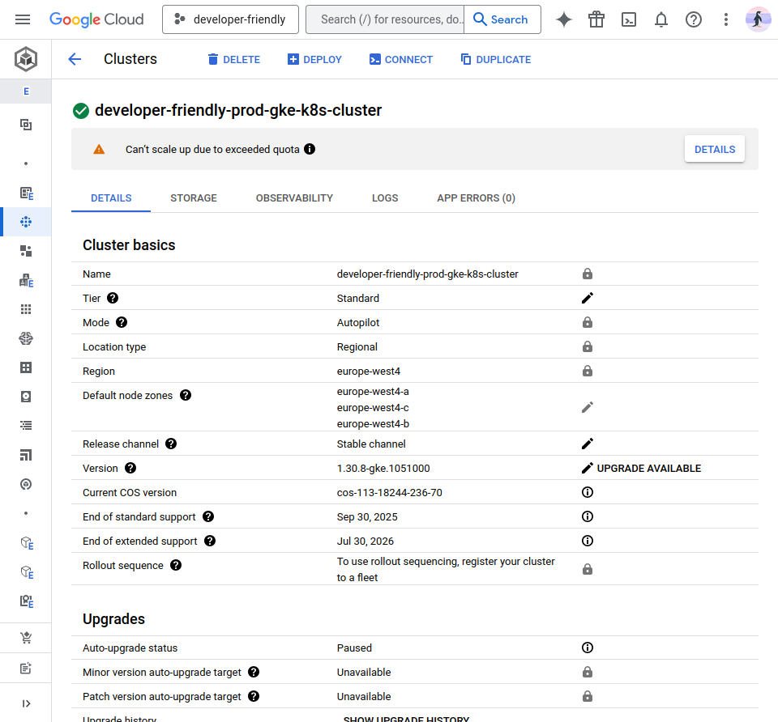

# How to Provision a Production-Ready Autopilot GKE Cluster

In this blog post I share my opinioated version of provisioning a Kubernetes
cluster in the Google Cloud Platform (GCP) using nothing but Opentofu.

The principles discussed here are the ones I have learned while dealing with
production setups at the same scale.

If you enjoy Kubernetes or want to learn more about GCP, this is for you.

<!-- more -->

## Introduction

I have had the pleasure of working with Kubernetes in the last few years of my
professional career.

While provisioning a [Kubernetes] from scratch may not be the most interesting
part of the the day to day operation of dealing with a Kubernetes cluster, it
is one of the most important ones.

The reason, especially in the context of Google Cloud, is that some of the
initial settings and configurations you specify (or not) in your day 0
operations are the ones that you will not be able to change after the cluster
is created[^gke-immutable-settings].

Therefore, I took some time to document my steps into provisioning a
production-ready [Kubernetes] cluster from scratch.

Stick till the end to get to know the required component it takes.

## Prerequisites

- [OpenTofu](https://github.com/opentofu/opentofu/releases/v1.9.0)
- [Terragrunt](https://github.com/gruntwork-io/terragrunt/releases/tag/v0.72.6)
- [gcloud CLI](https://cloud.google.com/sdk/docs/install)
- [direnv](https://direnv.net/) (optional)
- [kubectl](https://kubernetes.io/docs/tasks/tools/install-kubectl/)
- [Helm](https://helm.sh/docs/intro/install/)

**NOTE**: With `direnv`, you can make sure to include your local development
environment variables to yourself without exposing them to the VCS. Ensure
you have `.envrc` in the root of the repository with the values you need.

Example values:

```shell title="" linenums="0"
# <repo-root>/.envrc
export KUBECONFIG="<repo-root>/.kubeconfig"
```

### Authenticate to Google Cloud

To get started, your first need to be authenticated to Google Cloud.

```shell title="" linenums="0"
gcloud auth login
```

Additionally, to be able to perform TF API calls to the Google Cloud, you would
need the Application Default Credentials (ADCs)[^adc].

```shell title="" linenums="0"
gcloud auth application-default login
```

## Project Structure

The code is structured in directory per-environment manner (truncated for
brevity).

```plaintext
tofu/
├── backend.hcl # <- Terraform cloud remote state backend
├── gcp/
│   ├── gcp.hcl # Google Cloud authentication source
│   └── prod/
│       ├── 10-networking/
│       │   ├── main.tf
│       │   └── terragrunt.hcl
│       ├── 20-gke-encryption-key/
│       │   ├── main.tf
│       │   └── terragrunt.hcl
│       └── 30-kubernetes-cluster/
│           ├── main.tf
│           ├── terragrunt.hcl
│           └── terragrunt.hcl
└── modules/
    └── naming/
        └── main.tf
```

## Shared Modules

### Naming

We first need to create a unified naming module to be used everywhere:

```terraform title="tofu/modules/naming/versions.tf"
-8<- "docs/blog/posts/2025/003-gcp-gke-cluster-tf/tofu/modules/naming/versions.tf"
```

```terraform title="tofu/modules/naming/variables.tf"
-8<- "docs/blog/posts/2025/003-gcp-gke-cluster-tf/tofu/modules/naming/variables.tf"
```

```terraform title="tofu/modules/naming/data.tf"
-8<- "docs/blog/posts/2025/003-gcp-gke-cluster-tf/tofu/modules/naming/data.tf"
```

```terraform title="tofu/modules/naming/main.tf"
-8<- "docs/blog/posts/2025/003-gcp-gke-cluster-tf/tofu/modules/naming/main.tf"
```

```terraform title="tofu/modules/naming/outputs.tf"
-8<- "docs/blog/posts/2025/003-gcp-gke-cluster-tf/tofu/modules/naming/outputs.tf"
```

### Terragrunt Root Modules

There are a few modules being included in each of the following
stacks[^tg-include][^root-modules]:

```hcl title="tofu/backend.hcl"
-8<- "docs/blog/posts/2025/003-gcp-gke-cluster-tf/tofu/backend.hcl"
```

```hcl title="tofu/gcp/gcp.hcl"
-8<- "docs/blog/posts/2025/003-gcp-gke-cluster-tf/tofu/gcp/gcp.hcl"
```

## Networking

Next step is to create a dedicated VPC network and avoid using the default VPC
provided in everty GCP project.

They also recommend to use custom subnets[^custom-subnet] instead of auto-mode,
which is where a subnet will be created for your in each of the available GCP
regions.

Let's do just that.

```terraform title="tofu/gcp/prod/10-networking/versions.tf"
-8<- "docs/blog/posts/2025/003-gcp-gke-cluster-tf/tofu/gcp/prod/10-networking/versions.tf"
```

```terraform title="tofu/gcp/prod/10-networking/naming.tf"
-8<- "docs/blog/posts/2025/003-gcp-gke-cluster-tf/tofu/gcp/prod/10-networking/naming.tf"
```

```terraform title="tofu/gcp/prod/10-networking/main.tf"
-8<- "docs/blog/posts/2025/003-gcp-gke-cluster-tf/tofu/gcp/prod/10-networking/main.tf"
```

```terraform title="tofu/gcp/prod/10-networking/outputs.tf"
-8<- "docs/blog/posts/2025/003-gcp-gke-cluster-tf/tofu/gcp/prod/10-networking/outputs.tf"
```

```hcl title="tofu/gcp/prod/10-networking/terragrunt.hcl"
-8<- "docs/blog/posts/2025/003-gcp-gke-cluster-tf/tofu/gcp/prod/10-networking/terragrunt.hcl"
```

Running this stack:

```shell title="" linenums="0"
terragrunt init -upgrade
terragrunt plan -out tfplan
terragrunt apply tfplan
```

## GKE Encryption Key

We then need to create an encryption Customer-Managed Key (CMK) key for the
GKE secrets[^gke-secret-encryption].

```terraform title="tofu/gcp/prod/20-gke-encryption-key/versions.tf"
-8<- "docs/blog/posts/2025/003-gcp-gke-cluster-tf/tofu/gcp/prod/20-gke-encryption-key/versions.tf"
```

```terraform title="tofu/gcp/prod/20-gke-encryption-key/naming.tf"
-8<- "docs/blog/posts/2025/003-gcp-gke-cluster-tf/tofu/gcp/prod/20-gke-encryption-key/naming.tf"
```

```terraform title="tofu/gcp/prod/20-gke-encryption-key/main.tf"
-8<- "docs/blog/posts/2025/003-gcp-gke-cluster-tf/tofu/gcp/prod/20-gke-encryption-key/main.tf"
```

```terraform title="tofu/gcp/prod/20-gke-encryption-key/outputs.tf"
-8<- "docs/blog/posts/2025/003-gcp-gke-cluster-tf/tofu/gcp/prod/20-gke-encryption-key/outputs.tf"
```

```hcl title="tofu/gcp/prod/20-gke-encryption-key/terragrunt.hcl"
-8<- "docs/blog/posts/2025/003-gcp-gke-cluster-tf/tofu/gcp/prod/20-gke-encryption-key/terragrunt.hcl"
```

Creating this stack is just as before with the three commands mentioned above.

## Kubernetes Cluster

Finally, we will create the cluster on Autopilot mode, requiring the least
management and operational overhead over the lifetime of the cluster[^gke-autopilot].

```terraform title="tofu/gcp/prod/30-kubernetes-cluster/versions.tf"
-8<- "docs/blog/posts/2025/003-gcp-gke-cluster-tf/tofu/gcp/prod/30-kubernetes-cluster/versions.tf"
```

```terraform title="tofu/gcp/prod/30-kubernetes-cluster/variables.tf"
-8<- "docs/blog/posts/2025/003-gcp-gke-cluster-tf/tofu/gcp/prod/30-kubernetes-cluster/variables.tf"
```

```terraform title="tofu/gcp/prod/30-kubernetes-cluster/naming.tf"
-8<- "docs/blog/posts/2025/003-gcp-gke-cluster-tf/tofu/gcp/prod/30-kubernetes-cluster/naming.tf"
```

```terraform title="tofu/gcp/prod/30-kubernetes-cluster/main.tf"
-8<- "docs/blog/posts/2025/003-gcp-gke-cluster-tf/tofu/gcp/prod/30-kubernetes-cluster/main.tf"
```

```hcl title="tofu/gcp/prod/30-kubernetes-cluster/terragrunt.hcl"
-8<- "docs/blog/posts/2025/003-gcp-gke-cluster-tf/tofu/gcp/prod/30-kubernetes-cluster/terragrunt.hcl"
```

We provision this stack as well and we move on to the next step.

## Fetch Kubeconfig Credential

Once the cluster is ready, we can use the following CLI command in the terminal
to get the credential to talk to our cluster[^get-credentials].

```shell title="" linenums="0"
gcloud container clusters get-credentials \
  developer-friendly-prod-gke-k8s-cluster \
  --region europe-west4 \
  --project developer-friendly
```

## Deploy Sample Helm Application

For the case of this demo, we deploy Valkey from Bitnami Helm
chart[^valkey-bitnami].

```shell title="" linenums="0"
helm repo add bitnami https://charts.bitnami.com/bitnami
helm repo update bitnami
helm install valkey bitnami/valkey --version 2.x
```

And that't it.

## Future Plans

It's good to touch on some of the future improvements we can make to this setup:

- :white_check_mark: Provision a dedicated host deploy Atlantis to allow team
  collaboration on TF codes[^atlantis].
- :white_check_mark: Deploy VictoriaMetrics Kubernetes Stack[^vm-k8s-stack] for
  monitoring
- :white_check_mark: Deploy Promtail[^promtail] and use VictoriaLogs[^vlogs] as
  backend

This list is non-exhaustive. Once your infrastructure grows, more required
components come into play, e.g., security, audit, compliance, etc.

This list is only here to give you an idea of what's possible.

## Conclusion

<figure markdown="span">
  { align=left loading=lazy }
  <figcaption>GKE Autopilot Cluster</figcaption>
</figure>

We have seen how to create a Kubernetes cluster in GKE with the least
operational overhead.

The GKE Autpilot is an equivalent of [AWS]' Auto-mode[^eks-automode].

These clusters may not make you feel hacky while dealing with the daily
operation of a [Kubernetes] cluster.

However, since they require so little overhead for the maintenance of the
cluster itself, you'd have the opportunity to focus on your core business logic
and improve the user experience of your application, instead of chasing and
troubleshooting a cumbersome Kubernetes bug.

Until next time, *ciao* :cowboy: & happy coding! :penguin: :crab:

## FAQ

### Why Terragrunt as an additional wrapper for an added complexity?

Terragrunt provides a thin wrapper around TF code. You'd generally add more
tooling and complexity as your stack requires.

In the case of current stack, we're using `dependency`[^tg-dependency] graph
heavily to make sure dependent stacks are tied together correctly and inputs
are passed around dynamically without the need to hardcode any value.

That makes it a viable choice to reduce the long-term chore and operational
overhead, e.g., in case of disaster recovery, or just to spin up an identical
replica of this platform in another region/account.

[Kubernetes]: ../../../category/kubernetes.md
[AWS]: ../../../category/aws.md

[^gke-immutable-settings]: https://cloud.google.com/kubernetes-engine/docs/concepts/configuration-overview
[^adc]: https://registry.terraform.io/providers/hashicorp/google/latest/docs/guides/provider_reference
[^tg-include]: https://terragrunt.gruntwork.io/docs/getting-started/overview/#the-include-block
[^root-modules]: https://terragrunt.gruntwork.io/docs/reference/config-blocks-and-attributes/#backend
[^custom-subnet]: https://cloud.google.com/kubernetes-engine/docs/best-practices/networking#custom-subnet-mode
[^gke-secret-encryption]: https://cloud.google.com/kubernetes-engine/docs/how-to/encrypting-secrets
[^gke-autopilot]: https://cloud.google.com/kubernetes-engine/docs/concepts/autopilot-overview
[^get-credentials]: https://cloud.google.com/sdk/gcloud/reference/container/clusters/get-credentials
[^valkey-bitnami]: https://artifacthub.io/packages/helm/bitnami/valkey
[^atlantis]: https://www.runatlantis.io/docs/
[^vm-k8s-stack]: https://artifacthub.io/packages/helm/victoriametrics/victoria-metrics-k8s-stack
[^promtail]: https://artifacthub.io/packages/helm/grafana/promtail
[^vlogs]: https://docs.victoriametrics.com/victorialogs/
[^eks-automode]: https://docs.aws.amazon.com/eks/latest/userguide/automode.html
[^tg-dependency]: https://terragrunt.gruntwork.io/docs/reference/config-blocks-and-attributes/#dependency
