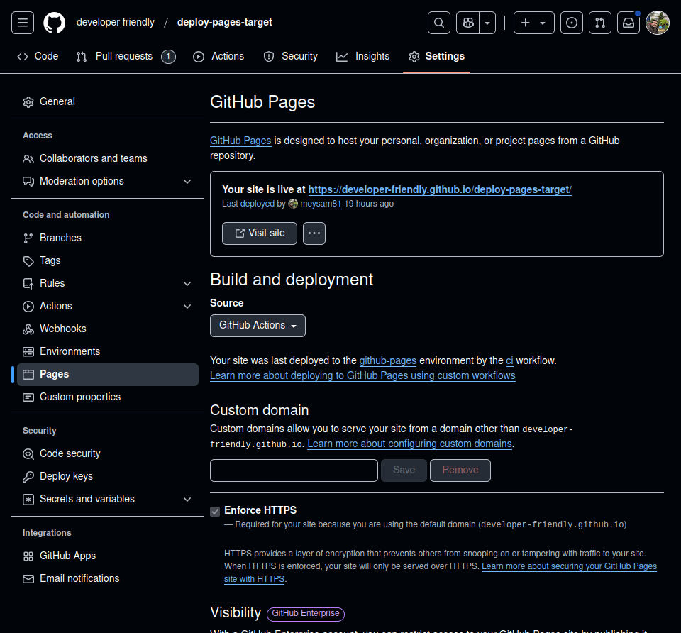
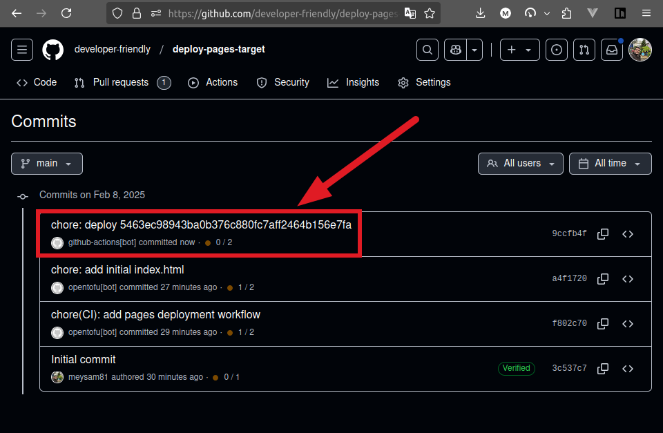

# How to Publish to GitHub Pages From Another Repository

In this blog post, you will learn how to leverage GitHub Actions to deploy
static files to the GitHub Pages of another repository.

This can be useful if you keep your source code in a private repository, but
also, you may find additional reasons to need this setup.

Stick around till the end to find out how to do this with OpenTofu.

<!-- more -->

## Introduction

The objective of this blog post is to deploy a static site from one [GitHub]
repository to another.

There may be different kinds of reasons why you'd want to do that, but for
starter, you might hold your source code (possibly written in a specific
framework) inside a private repository.

On top of that, [GitHub Pages] is not available on private repositories unless
you're paying some dollars :money_with_wings: to GitHub[^gh-pricing].
:money_mouth:

All in all, there are various reasons why the approach provided in this blog
post might be suitable for you.

As such, and just because I've recently gone through this exercise myself,
and because [GitHub] does not officially support this
feature[^pages-discussion] (yet! :thinking:), I will explain my implementation
and provide you with all the goody [OpenTofu] codes. :hugging:

## Prerequisites

Make sure you have the following setup:

- [OpenTofu] v1 installed[^opentofu]
- [GitHub] CLI v2 installed[^gh-cli] and authenticated[^gh-auth-login]

## Preparation

We'll first look at how our [Infrastructure as Code] directory structure
looks like.

```plaintext title="" linenums="0"
./
├── 10-pages-repository
│   ├── files
│   │   ├── ci.yml
│   │   └── index.html
│   ├── main.tf
│   ├── outputs.tf
│   ├── terragrunt.hcl
│   └── versions.tf
├── 20-source-code-repository
│   ├── files
│   │   └── ci.yml.tftpl
│   ├── main.tf
│   ├── outputs.tf
│   ├── terragrunt.hcl
│   ├── variables.tf
│   └── versions.tf
└── github.hcl
```

## Create The Pages Repository

We're ready to jump right in.

The first repository will be the target repo where we'll deploy our statics.

This is a must for our use-case to be a public repository. The benefit we get
from this is that [GitHub] provides free [GitHub Pages] hosting for public
repositories.

```terraform title="10-pages-repository/versions.tf"
-8<- "docs/blog/posts/2025/004-gh-pages-another-repo/tofu/10-pages-repository/versions.tf"
```

```hcl title="10-pages-repository/main.tf" hl_lines="57"
-8<- "docs/blog/posts/2025/004-gh-pages-another-repo/tofu/10-pages-repository/main.tf"
```

Notice that the `read_only` is set to false because we want to grant `git push`
access to the created Deploy Key[^deploy-keys].

```hcl title="10-pages-repository/terragrunt.hcl"
-8<- "docs/blog/posts/2025/004-gh-pages-another-repo/tofu/10-pages-repository/terragrunt.hcl"
```

The [Terragrunt] include block[^include-block] is a very useful feature that
allows us to reuse the same configuration across multiple repositories.
:point_down:

```hcl title="github.hcl"
-8<- "docs/blog/posts/2025/004-gh-pages-another-repo/tofu/github.hcl"
```

!!! tip "Important Note"

    The `owner` configuration in the `provider` block[^tofu-provider-block]
    will mean nothing unless you are authenticated to GitHub using your GitHub
    CLI[^gh-auth-login]!

    Additionally, you will require at least the following scopes:

    - `repo`
    - `workflow`
    - `admin:repo_hook`

```terraform title="10-pages-repository/outputs.tf"
-8<- "docs/blog/posts/2025/004-gh-pages-another-repo/tofu/10-pages-repository/outputs.tf"
```

The following CI file will get triggered as soon as our source repository
pushes the statically built files into the root of the repository; this
workflow, in turn, is responsible for deploying those static files behind the
[GitHub] CDN.

```yaml title="10-pages-repository/files/ci.yml"
-8<- "docs/blog/posts/2025/004-gh-pages-another-repo/tofu/10-pages-repository/files/ci.yml"
```

```html title="10-pages-repository/files/index.html"
-8<- "docs/blog/posts/2025/004-gh-pages-another-repo/tofu/10-pages-repository/files/index.html"
```

Applying this stack is the usual practice:

```shell title="" linenums="0"
terragrunt init -upgrade
terragrunt plan -out tfplan
terragrunt apply tfplan
```

<figure markdown="span">
  { align=left loading=lazy }
  <figcaption>GitHub Pages Settings</figcaption>
</figure>

Now we're ready to create the next repository.

## Source Code Repository

This is the repository where we'll store our source codes written in React,
Vue, or any other framework of your choosing.

You can choose to make this one private and it will still work with the ideas
presented here, however, for the sake of demonstration, we'll stick to public
for both repositories.

```terraform title="20-source-code-repository/versions.tf"
-8<- "docs/blog/posts/2025/004-gh-pages-another-repo/tofu/20-source-code-repository/versions.tf"
```

```terraform title="20-source-code-repository/variables.tf"
-8<- "docs/blog/posts/2025/004-gh-pages-another-repo/tofu/20-source-code-repository/variables.tf"
```

```terraform title="20-source-code-repository/main.tf"
-8<- "docs/blog/posts/2025/004-gh-pages-another-repo/tofu/20-source-code-repository/main.tf"
```

```hcl title="20-source-code-repository/terragrunt.hcl"
-8<- "docs/blog/posts/2025/004-gh-pages-another-repo/tofu/20-source-code-repository/terragrunt.hcl"
```

```yaml title="20-source-code-repository/files/ci.yml.tftpl"
-8<- "docs/blog/posts/2025/004-gh-pages-another-repo/tofu/20-source-code-repository/files/ci.yml.tftpl"
```

You are not bound to just `bun`[^bun] and can choose any other static site
builder. I am more comfortable and prefer `bun` for its simplicity.

In the second CI workflow definition, the steps should be self-explanatory.
However, to avoid being presumptuous, I will highlight the importance of the
following two steps:

```yaml title="20-source-code-repository/files/ci.yml.tftpl" linenums="34" hl_lines="6"
-8<- "docs/blog/posts/2025/004-gh-pages-another-repo/tofu/20-source-code-repository/files/ci.yml.tftpl:34:39"
```

And then later...

```yaml title="20-source-code-repository/files/ci.yml.tftpl" linenums="68" hl_lines="4"
-8<- "docs/blog/posts/2025/004-gh-pages-another-repo/tofu/20-source-code-repository/files/ci.yml.tftpl:68:"
```

The reason we store the files in an ephemeral filesystem path is that the
`actions/checkout` in between them will wipe everything in the current working
directory.

```yaml title="20-source-code-repository/files/ci.yml.tftpl" linenums="46"
-8<- "docs/blog/posts/2025/004-gh-pages-another-repo/tofu/20-source-code-repository/files/ci.yml.tftpl:46:50"
```

That is, the statically built files we created with `bun run build` will be
cleared once `checkout` finishes its executation.

## Develop and Deploy Frontend Code

At this stage, we go into the normal flow of a software engineer, create some
feature, commit it to the source code and push it to the repository.

```shell title="" linenums="0"
gh repo clone developer-friendly/deploy-pages-source
cd deploy-pages-source/

# only for the first time
bun init -y

bun install
bun i vite@latest -D

echo "Hello again, this time from the source repository" | tee index.html

git add .
git commit -m 'chore: initial commit'
git push origin $(git branch --show-current)
```

And the result is as expected.

<figure markdown="span">
  { align=left loading=lazy }
  <figcaption>Commits in Target Repository</figcaption>
</figure>

!!! tip "404 Not Found"

    For single page applications, since GitHub doesn't provide native suppot
    (yet!), you might wanna do a bit of hack!

    It can be as simple as creating a symbolic link to the `index.html` file:

    ```shell title="" linenums="0"
    ln index.html 404.html
    ```

    Or it might be a bit more involved, using some JavaScript
    workaround[^spa-github].

For a better experience in your daily development, you might also benefit from
the Slack GitHub Integration[^slack-gh]. That gives you the ability to
subscribe to different triggers in both the repositories.

## Conclusion

In this piece you've seen how to leverage the currently available tools in the
[GitHub] ecosystem to deploy static files from one repository to another.

This is a cool workaround to take advantage of free [GitHub Pages] hosting for
your frontend applications if you're on a budget.

Additionally, you might just use this method for your preview deployments or
as a auxiliary deployment strategy.

If you enjoyed this piece and read all the way down here, you might wanna
subscribe to [the newsletter] or the [rss feed]. :wink:

Until next time, *ciao* :cowboy: & happy coding! :penguin: :crab:

[GitHub]: ../../../category/github.md
[GitHub Pages]: ../../../category/github-pages.md
[OpenTofu]: ../../../category/opentofu.md
[Infrastructure as Code]: ../../../category/infrastructure-as-code.md
[Terragrunt]: ../../../category/terragrunt.md

[the newsletter]: https://newsletter.developer-friendly.blog/subscription/form
[rss feed]: /feed_rss_created.xml

[^gh-pricing]: https://github.com/pricing#compare-features
[^pages-discussion]: https://github.com/orgs/community/discussions/42772
[^opentofu]: https://github.com/opentofu/opentofu/releases/tag/v1.9.0
[^gh-cli]: https://github.com/cli/cli/releases/tag/v2.66.1
[^gh-auth-login]: https://cli.github.com/manual/gh_auth_login
[^deploy-keys]: https://docs.github.com/en/authentication/connecting-to-github-with-ssh/managing-deploy-keys#deploy-keys
[^include-block]: https://terragrunt.gruntwork.io/docs/reference/config-blocks-and-attributes/#include
[^tofu-provider-block]: https://developer.hashicorp.com/terraform/language/providers/configuration
[^bun]: https://bun.sh/
[^spa-github]: https://github.com/rafgraph/spa-github-pages
[^slack-gh]: https://slack.github.com/
