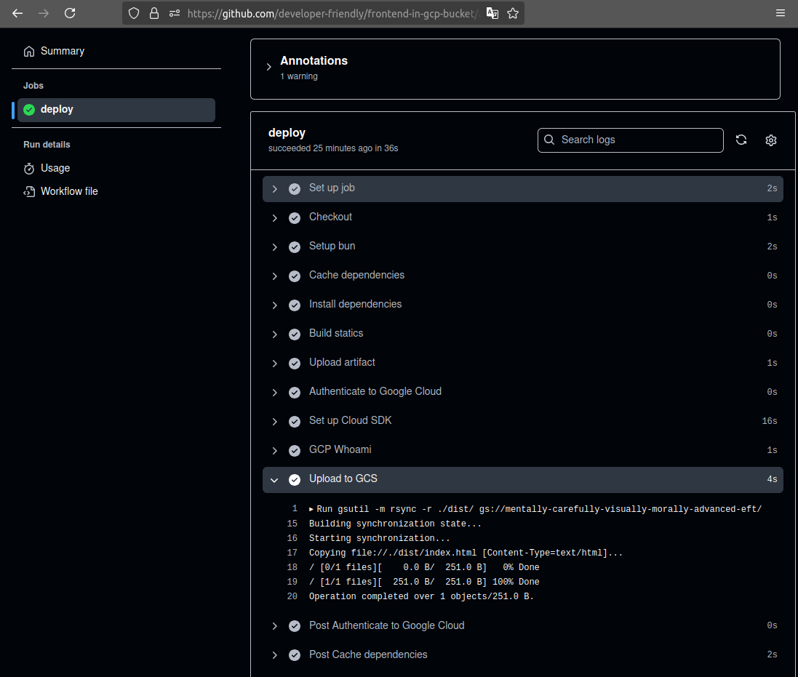
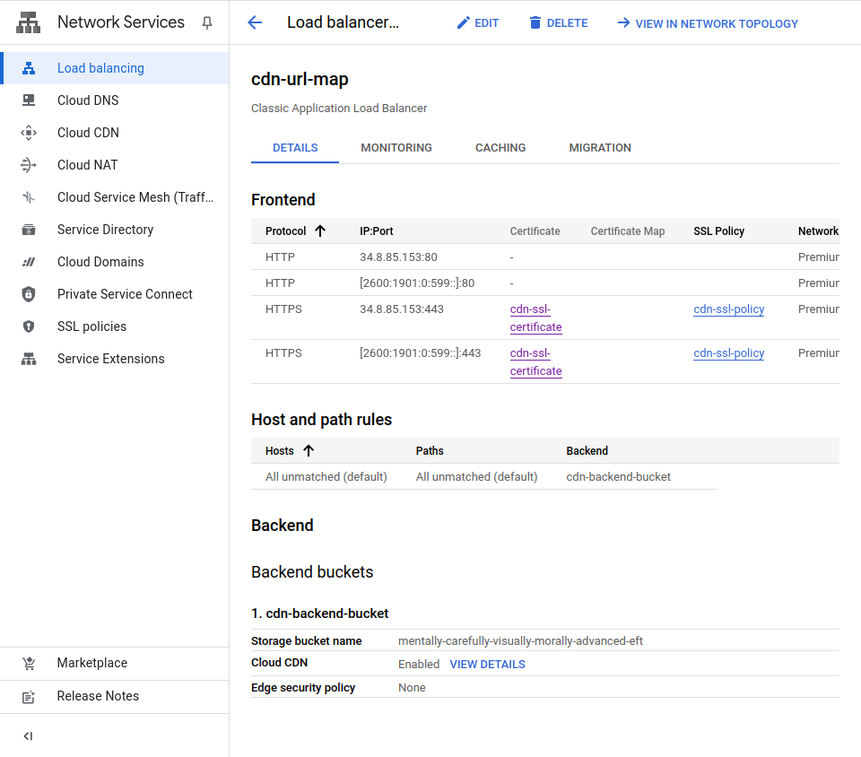
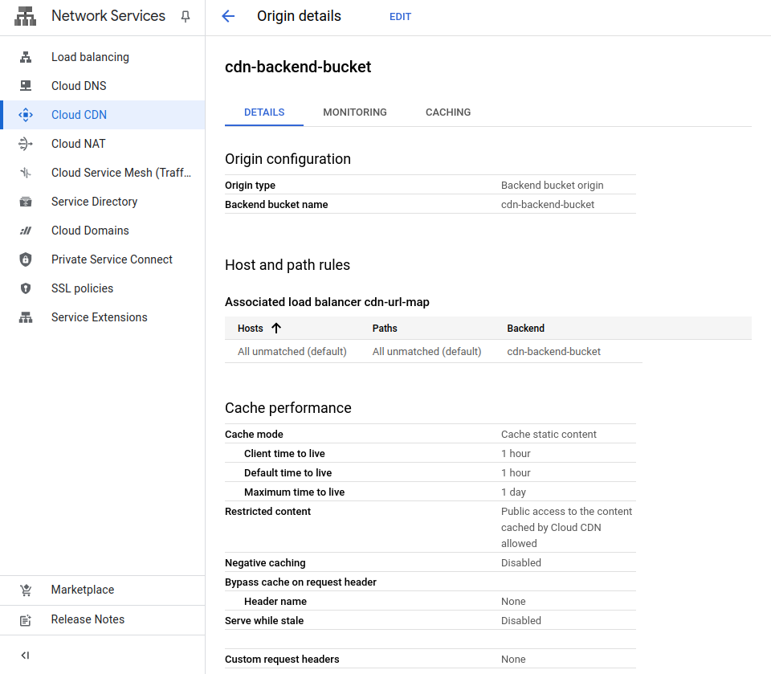

# How to Deploy Static Site to GCP CDN with GitHub Actions

Building and deploying static sites is rarely an issue these days. Most of the
PaaS providers already have full support for your live and your preview
environments and a clean integration with your favorite Git provider.

However, some organizations may choose to stick with big players like GCP for
various reasons.

In this blog post, you will learn how to build your frontend and deploy your
static files to GCP bucket using GitHub Actions and serve it behind GCP CDN.

In this approach we will employ OpenID Connect to authenticate GitHub Actions
runner to GCP API to avoid passing hard-coded credentials (Actually, GCP calls
this Federated Workload Identity but it is unsurprisingly based on OIDC).

If this sounds interesting to you, let's not keep you waiting any longer.

<!-- more -->

## Introduction

I find it fascinating to work with service providers who have native support
for [OpenID Connect] (aka OIDC).

In essence, OIDC is based on establishing a trust relationship between two
service providers, enabling identities from one to authenticate and access the
APIs of the other.

This is a powerful feature that allows you to stay compliant and increases
your security posture because you will no longer have to pass around any
hard-coded credentials; better yet, you no longer have to bear any overhead for
secret rotation! I can't think of any happier news than this.

If you're frustrated by [GitHub] PAT tokens, you know what I'm talking about.
:cold_sweat:

This intro should prepare you for what you can expect from the rest of this
blog post.

If you're unsure of what this all means, let me break it down for you and
clearly state my objective:

> *Let the runners of GitHub Actions of a specific repository authenticate to
a specific project of GCP API and upload the static site to the bucket that is
configured to serve as the backend of a GCP CDN.*

That sums up the entire blog post we're about to share here. All the codes that
is to come will be written in [OpenTofu] and applied via [Terragrunt].

## Pre-requisites

You should be prepared by now on what you will need installed, but let's nail
it down for the sake of explicitness:

- [OpenTofu] v1.x[^opentofu]
- [Terragrunt] v0.x[^terragrunt]
- [GitHub] account[^github]
- [GCP] account[^gcp]
- gcloud CLI[^gcloud]
- A domain name
- [GitHub] CLI (optional)[^gh-cli]

## Directory Structure

Here's what you will see in the rest of this post (truncated for brevity):

```plaintext title="" linenums="0"
.
├── 10-storage-bucket/
│   ├── main.tf
│   └── terragrunt.hcl
├── 20-github-workload-identity/
│   ├── main.tf
│   └── terragrunt.hcl
├── 30-github-actions-iam/
│   ├── main.tf
│   └── terragrunt.hcl
├── 40-dns-record/
│   ├── main.tf
│   └── terragrunt.hcl
├── 50-cdn-endpoint/
│   ├── main.tf
│   └── terragrunt.hcl
├── 60-github-frontend-repository/
│   ├── files/
│   ├── main.tf
│   └── terragrunt.hcl
├── gcp.hcl
└── github.hcl
```

The top two files that will be used occasionally are as follows:

```hcl title="gcp.hcl"
-8<- "docs/blog/posts/2025/005-gcp-cdn/tofu/gcp.hcl"
```

```hcl title="github.hcl"
-8<- "docs/blog/posts/2025/005-gcp-cdn/tofu/github.hcl"
```

## Google Storage Bucket

The first step is to create a bucket and enable CDN on it.

Additionally, and based on the official documentation, you will have to enable
public access to the bucket[^gcs-cdn-public].

I personally don't like this approach. I would've preferred to allow my CDN
readonly access to the files and keep the bucket private.

However, as of this writing, they do not have official support for this
approach.

As a result, make sure to use this public bucket to only serve your static
files and never push anything you don't want the public to see.

```terraform title="10-storage-bucket/versions.tf"
-8<- "docs/blog/posts/2025/005-gcp-cdn/tofu/10-storage-bucket/versions.tf"
```

```terraform title="10-storage-bucket/main.tf"
-8<- "docs/blog/posts/2025/005-gcp-cdn/tofu/10-storage-bucket/main.tf"
```

```hcl title="10-storage-bucket/terragrunt.hcl"
-8<- "docs/blog/posts/2025/005-gcp-cdn/tofu/10-storage-bucket/terragrunt.hcl"
```

```terraform title="10-storage-bucket/outputs.tf"
-8<- "docs/blog/posts/2025/005-gcp-cdn/tofu/10-storage-bucket/outputs.tf"
```

## GitHub Federated Workload Identity

This is my favorite part of this setup. It is based on the [OpenID Connect]
protocol and it really takes the security of our setup to the next level.

As mentioned at the beginning of this article, the objective is to let [GitHub]
runners authenticate and copy files to the Google Cloud Storage[^gcs-docs]
while avoiding any hard-coded credentials!

```terraform title="20-github-workload-identity/versions.tf"
-8<- "docs/blog/posts/2025/005-gcp-cdn/tofu/20-github-workload-identity/versions.tf"
```

```terraform title="20-github-workload-identity/main.tf"
-8<- "docs/blog/posts/2025/005-gcp-cdn/tofu/20-github-workload-identity/main.tf"
```

You have the possibility to restrict the access further by adding more
conditionals to the Workload Identity using the `attribute_condition`
attribute.

For more examples, refer to the official provider documentations[^gcp-provider-wi].

```hcl title="20-github-workload-identity/terragrunt.hcl"
-8<- "docs/blog/posts/2025/005-gcp-cdn/tofu/20-github-workload-identity/terragrunt.hcl"
```

```terraform title="20-github-workload-identity/outputs.tf"
-8<- "docs/blog/posts/2025/005-gcp-cdn/tofu/20-github-workload-identity/outputs.tf"
```

This is only half the battle. So far, we have only created a pool of
identities[^gcp-wi], using which we can create and assign a service account to[^gcp-sa].

## GitHub Runner IAM Binding

This is where we create the service account which will be used by the CI runners
within our [GitHub Actions].

Service accounts in [GCP] are identities bound to GCP identity server. However,
using the Federated Workload Identity[^gcp-wi], you can define external
services that are allowed to assume and use its ACL to talk to GCP API.

```terraform title="30-github-actions-iam/versions.tf"
-8<- "docs/blog/posts/2025/005-gcp-cdn/tofu/30-github-actions-iam/versions.tf"
```

```terraform title="30-github-actions-iam/variables.tf"
-8<- "docs/blog/posts/2025/005-gcp-cdn/tofu/30-github-actions-iam/variables.tf"
```

```terraform title="30-github-actions-iam/main.tf" hl_lines="19"
-8<- "docs/blog/posts/2025/005-gcp-cdn/tofu/30-github-actions-iam/main.tf"
```

Pay close attention to how we're defining the principal in the
`google_service_account_iam_member` resource. This will be all the runners in
our desired [GitHub] repository.

All thanks to [OpenID Connect] (or Federated Workload Identity in GCP world
:rolling_eyes:).

```hcl title="30-github-actions-iam/terragrunt.hcl" hl_lines="6-7"
-8<- "docs/blog/posts/2025/005-gcp-cdn/tofu/30-github-actions-iam/terragrunt.hcl"
```

Take note of how we're using outputs from one [Terragrunt] stack and pass it as
input to another. This is the best part of working with [Terragrunt] as it
makes it easy to avoid using the TF remote state[^tf-remote-state].

```terraform title="30-github-actions-iam/outputs.tf"
-8<- "docs/blog/posts/2025/005-gcp-cdn/tofu/30-github-actions-iam/outputs.tf"
```

Creating this stack will allow us to let the [GitHub] runners assume this role
and copy the static files of our frontend.

## DNS Record

This is where we create a public IP address in the GCP project and create the
corresponding DNS record for it.

Mind you, this step should be tailored to your setup, e.g., if you
use [Azure] Hosted Zone, [AWS] Route 53, or any other DNS provider.

The example below is using a [Cloudflare] provider.

```terraform title="40-dns-record/versions.tf"
-8<- "docs/blog/posts/2025/005-gcp-cdn/tofu/40-dns-record/versions.tf"
```

```terraform title="40-dns-record/main.tf"
-8<- "docs/blog/posts/2025/005-gcp-cdn/tofu/40-dns-record/main.tf"
```

```terraform title="40-dns-record/cloudflare.tf"
-8<- "docs/blog/posts/2025/005-gcp-cdn/tofu/40-dns-record/cloudflare.tf"
```

```hcl title="40-dns-record/terragrunt.hcl"
-8<- "docs/blog/posts/2025/005-gcp-cdn/tofu/40-dns-record/terragrunt.hcl"
```

```terraform title="40-dns-record/outputs.tf"
-8<- "docs/blog/posts/2025/005-gcp-cdn/tofu/40-dns-record/outputs.tf"
```


!!! tip "Why not creating the IP address within CDN endpoint stack?"

    There is a very important reason why we create the IP address and the DNS
    record before creating the Google Load Balancer (i.e. URL Map)[^url-maps].

    We want to take advantage of the DNS propagation delay so that by the time we
    are done creating the URL maps in the next step, the DNS from our domain
    provider is already pointing to the IP address of the load balancer.

## Verify the Setup: GitHub Frontend Repository

We are now ready to push our static files from a sample frontend repository.

This step doesn't necessarily have to be written in TF codes, nor are we
obsessed being a [Infrastructure as Code] (IaC) purist; it's just simpler to
showcase the demo we're providing here.

```hcl title="60-github-frontend-repository/versions.tf"
-8<- "docs/blog/posts/2025/005-gcp-cdn/tofu/60-github-frontend-repository/versions.tf"
```

```yaml title="60-github-frontend-repository/files/ci.yml.tftpl" hl_lines="16"
-8<- "docs/blog/posts/2025/005-gcp-cdn/tofu/60-github-frontend-repository/files/ci.yml.tftpl"
```

In the CI file, having the `id-token: write` is a required attribute for the
whole setup to work properly.

```hcl title="60-github-frontend-repository/files/index.tml"
-8<- "docs/blog/posts/2025/005-gcp-cdn/tofu/60-github-frontend-repository/files/index.html"
```

```hcl title="60-github-frontend-repository/files/index.js"
-8<- "docs/blog/posts/2025/005-gcp-cdn/tofu/60-github-frontend-repository/files/index.js"
```

```hcl title="60-github-frontend-repository/files/package.json"
-8<- "docs/blog/posts/2025/005-gcp-cdn/tofu/60-github-frontend-repository/files/package.json"
```

```hcl title="60-github-frontend-repository/variables.tf"
-8<- "docs/blog/posts/2025/005-gcp-cdn/tofu/60-github-frontend-repository/variables.tf"
```

```hcl title="60-github-frontend-repository/main.tf"
-8<- "docs/blog/posts/2025/005-gcp-cdn/tofu/60-github-frontend-repository/main.tf"
```

```hcl title="60-github-frontend-repository/terragrunt.hcl"
-8<- "docs/blog/posts/2025/005-gcp-cdn/tofu/60-github-frontend-repository/terragrunt.hcl"
```

And the result of a sample `curl` request:

```shell title="" linenums="0"
$ curl -sLD - frontend-in-gcp-bucket.developer-friendly.blog
HTTP/1.1 301 Moved Permanently
Cache-Control: private
Location: https://frontend-in-gcp-bucket.developer-friendly.blog:443/
Content-Length: 0
Date: Sun, 16 Feb 2025 11:54:12 GMT
Content-Type: text/html; charset=UTF-8

HTTP/2 200
x-guploader-uploadid: AHMx-iEHh4iLajDAS_vP_L-pxqOtDJVoC2JXuew_xr4Xd2ZyEwNaMqo0-o-H5cn_ifkpBuXTsR8FGWQ
x-goog-generation: 1739705267499482
x-goog-metageneration: 1
x-goog-stored-content-encoding: identity
x-goog-stored-content-length: 251
x-goog-meta-goog-reserved-file-mtime: 1739705243
x-goog-hash: crc32c=1MUXVw==
x-goog-hash: md5=MyYCc5m58a1vKmg5oqww3Q==
x-goog-storage-class: STANDARD
accept-ranges: bytes
content-length: 251
access-control-allow-origin: *
access-control-expose-headers: *
server: UploadServer
date: Sun, 16 Feb 2025 11:45:41 GMT
last-modified: Sun, 16 Feb 2025 11:27:47 GMT
etag: "3326027399b9f1ad6f2a6839a2ac30dd"
content-type: text/html
age: 511
cache-control: public,max-age=3600
alt-svc: h3=":443"; ma=2592000,h3-29=":443"; ma=2592000

<!DOCTYPE html>
<html lang="en">
  <head>
    <meta charset="UTF-8" />
    <meta name="viewport" content="width=device-width, initial-scale=1.0" />
    <title>Hello World</title>
  </head>
  <body>
    Hello from GCP Storage Bucket!
  </body>
</html>
```

<figure markdown="span">
  { align=left loading=lazy }
  <figcaption>Successful CI run</figcaption>
</figure>

<figure markdown="span">
  { align=left loading=lazy }
  <figcaption>GCP Load Balancer</figcaption>
</figure>

<figure markdown="span">
  { align=left loading=lazy }
  <figcaption>GCP CDN</figcaption>
</figure>


## Conclusion

The aim of this blog post was to allow GitHub runners deploy our frontend code
to Google Cloud Storage while avoiding the need to pass hard-coded credentials.

We have created the Federated Workload Identity, bound it to a specific
repository of our organization using attribute conditions, and created a
dedicated service account to be used by the runner jobs.

This setup will serve you right for a full-blown production setup. You can
customize it further but it is solid.

That's all I had to say. Thanks for sticking around. :hugging:

[OpenID Connect]: ../../../category/openid-connect.md
[GCP]: ../../../category/gcp.md
[OpenTofu]: ../../../category/opentofu.md
[Terragrunt]: ../../../category/terragrunt.md
[GitHub]: ../../../category/github.md
[GitHub Actions]: ../../../category/github-actions.md
[Azure]: ../../../category/azure.md
[AWS]: ../../../category/aws.md
[Infrastructure as Code]: ../../../category/infrastructure-as-code.md
[Cloudflare]: ../../../category/cloudflare.md

[^opentofu]: https://github.com/opentofu/opentofu/releases/tag/v1.9.0
[^terragrunt]:https://github.com/gruntwork-io/terragrunt/releases/tag/v0.73.5
[^github]: https://github.com/
[^gcp]: https://console.cloud.google.com/
[^gcloud]: https://cloud.google.com/sdk/docs/install
[^gh-cli]: https://github.com/cli/cli/releases/tag/v2.67.0
[^gcs-cdn-public]: https://cloud.google.com/cdn/docs/setting-up-cdn-with-bucket#make_your_bucket_public
[^gcs-docs]: https://cloud.google.com/storage/docs/
[^gcp-provider-wi]: https://registry.terraform.io/providers/hashicorp/google/6.20.0/docs/resources/iam_workload_identity_pool_provider#example-usage---iam-workload-identity-pool-provider-github-actions
[^gcp-wi]: https://cloud.google.com/iam/docs/workload-identity-federation
[^gcp-sa]: https://cloud.google.com/iam/docs/service-account-overview
[^tf-remote-state]: https://developer.hashicorp.com/terraform/language/state/remote-state-data
[^url-maps]: https://cloud.google.com/load-balancing/docs/url-map
