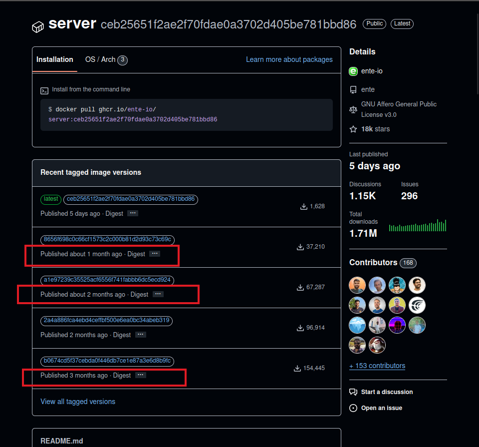

# Ente: Self Host the Google Photos Alternative and Own Your Privacy

In the recent few years, I keep seeing people being more aware of their privacy
and taking it into their own hands.

More and more solutions are emerging through the community that address the
critical part of our society and personal life; privacy!

In this blog post, I will introduce you to Ente, the Google Photos alternative.


You will see the codes required to deploy the server into a Kubernetes setup
and host the frontend using GitHub Pages.

Stick around till the end if that's your cup of tea.

<!-- more -->

## Introduction

It delights me to see more and more people raising concerns on the matter of
[privacy].

It's a crucial aspect, one that is regularly overlooked due to the enormous
amount of tracking (by big conglamorate) that is concerningly becoming a habit
and we're becoming numb to the idea!

This shouldn't be the norm. It's not right!

And hopefully, reading this post and similar ones like this throughout the
internet, you will take your privacy more seriously and start taking it under
your control.

To a tracking-less and cookie-less internet :champagne_glass: . Let's begin!

## Preface

Before we dive in, it's important to mention that this blog post, as well as
the rest of the articles in [this website] are all technical-heavy. More
importantly, we focus on [Kubernetes] here, cause that's what we do in our day
to day life, and that's what you'd hear us talking about non-stop if you were
to sit and chat with us. :nerd:

If you're not technical, or do not enjoy the ecosystem of [Kubernetes], then
probably this blog post is not for you. The official Ente documentation has
a proper guide[^ente-selfhosting] on docker compose deployment which tends to
be a lot easier for non-technical people.

With that out of the way, let us not waste any more time.

## Prerequisites

1. You will need a [Kubernetes] cluster. I have countless guides in this website
   explaining different forms of provisioning one, whether managed, or
   self-managed.
2. You will need a [GitHub] account[^github].
3. Understanding and the installation of [OpenTofu] (or [Terraform])[^opentofu].

## Ente Server Kubernetes Deployment

When you have your basic tools setup, it's time to provide you with the codes
necessary to deploy the Ente server in a [Kubernetes] deployment.

```yaml title="ente-server/deployment.yml" hl_lines="52-60 72-82"
-8<- "docs/blog/posts/2025/006-ente/k8s/ente-server/deployment.yml"
```

Noticed the volumes section of the container above?

```yaml title="ente-server/deployment.yml" linenums="52"
-8<- "docs/blog/posts/2025/006-ente/k8s/ente-server/deployment.yml:52:60"
```

```yaml title="ente-server/deployment.yml" linenums="72"
-8<- "docs/blog/posts/2025/006-ente/k8s/ente-server/deployment.yml:72:82"
```

There is one secret reference and another configMap.

Here's the config file (the `museum.yaml`[^museum-yaml]):

```yaml title="ente-server/files/museum.yaml"
-8<- "docs/blog/posts/2025/006-ente/k8s/ente-server/files/musuem.yaml"
```

And the secret:

```yaml title="ente-server/externalsecret.yml"
-8<- "docs/blog/posts/2025/006-ente/k8s/ente-server/externalsecret.yml"
```

The [External Secrets] is fetching the target secrets from [AWS] Parameter Store.

???+ tip "Postgres Database"

    The database used for this setup is coming from Cloudnative-PG[^cnpg].

    They have an awesome production-ready setup for Postgres which you can
    deploy to any [Kubernetes] cluster out-of-the-box.

    Here's the manifests used for this deployment.

    ```yaml title="postgres/cluster.yml"
    -8<- "docs/blog/posts/2025/006-ente/k8s/postgres/cluster.yml"
    ```

    Get your PGtune config from the available online website[^pgtune].

    ```yaml title="postgres/externalsecret-superuser.yml"
    -8<- "docs/blog/posts/2025/006-ente/k8s/postgres/externalsecret-superuser.yml"
    ```

    ```yaml title="postgres/externalsecret-user.yml"
    -8<- "docs/blog/posts/2025/006-ente/k8s/postgres/externalsecret-user.yml"
    ```

    ```yaml title="postgres/kustomization.yml"
    -8<- "docs/blog/posts/2025/006-ente/k8s/postgres/kustomization.yml"
    ```

I have [another guide] dedicated to how to authenticate ESO to the AWS API.

And chances are, you will most likely need to pull your secrets from different
vendors, so I won't go into details here.

But to put those secrets in [AWS] SSM, here's the sequence of commands you need
to run:

```shell title="ente-server/secrets.sh"
-8<- "docs/blog/posts/2025/006-ente/k8s/ente-server/secrets.sh"
```

Note that by passing multiple configuration files, we are overriding the values
from the default `local.yaml` file[^local-yaml].

In the (semi-official) Docker image we will manually build shortly from the
original source code, the order of precedence is as follows (from lowest to
highest)[^config-parsing]:

1. `/configurations/{{environment}}.yaml`; environment is `local` by default.
2. CLI flag of `--credentials-file` or `/credentials.yaml` by default.
3. Lastly, the `/museum.yaml` file.
4. Environment variables starting with `ENTE_` and all caps.

After these steps, if a config is not yet valued, an error will be raised and
ente server will not start.

It's time to create the remaining resources:

```yaml title="ente-server/service.yml"
-8<- "docs/blog/posts/2025/006-ente/k8s/ente-server/service.yml"
```

```yaml title="ente-server/serviceaccount.yml"
-8<- "docs/blog/posts/2025/006-ente/k8s/ente-server/serviceaccount.yml"
```

```yaml title="ente-server/httproute.yml"
-8<- "docs/blog/posts/2025/006-ente/k8s/ente-server/httproute.yml"
```

And to put all this together:

```yaml title="ente-server/kustomization.yml" hl_lines="15"
-8<- "docs/blog/posts/2025/006-ente/k8s/ente-server/kustomization.yml"
```

Applying this stack is just as simple as running the following against the
[Kubernetes] cluster:

```shell title="" linenums="0"
kubectl apply -k ente-server/
```

## Building Ente Museum Docker Image

Now, you've seen us using a custom image repository instead of the official
one.

As of this writing, the Ente repository[^ente-repo] does not provide consistent
releases in its Docker repository[^ente-ghcr].

<figure markdown="span">
  { loading=lazy }
  <figcaption>Ente Docker Image</figcaption>
</figure>

Therefore, we gotta build the server in-house and update it as needed.

The purpose of this section is to create a public [GitHub] repository that
pulls the source code from the official repository, build the server and push
it to the [GitHub Container Registry].

```yaml title="ente-docker/files/ci.yml" hl_lines="49"
-8<- "docs/blog/posts/2025/006-ente/tofu/ente-docker/files/ci.yml"
```

```terraform title="ente-docker/versions.tf"
-8<- "docs/blog/posts/2025/006-ente/tofu/ente-docker/versions.tf"
```

```terraform title="ente-docker/main.tf"
-8<- "docs/blog/posts/2025/006-ente/tofu/ente-docker/main.tf"
```

And let's try to create this TF stack.

```shell title="" linenums="0"
cd ente-docker/

tofu init -upgrade
tofu plan -out tfplan
tofu apply tfplan
```

With this repository, we get daily updates from the latest features and
enhancements in the upstream repository.

We can take this one step further; using renovate bot, we'll even get updates
in our Ente server image. An exercise for the nerdy reader. :hugging:

## Deploy Ente Frontend to GitHub Pages

We have our custom-built docker image and our server up and running. It's time
to deploy the frontend of the Ente to [GitHub Pages] so that public URLs in the
browser can resolve to appealing UIs which we can open and use, even outside
our Ente Desktop[^ente-desktop] and Ente mobile app.

```yaml title="ente-frontend/files/ci.yml.tftpl"
-8<- "docs/blog/posts/2025/006-ente/tofu/ente-frontend/files/ci.yml.tftpl"
```

```terraform title="ente-frontend/versions.tf"
-8<- "docs/blog/posts/2025/006-ente/tofu/ente-frontend/versions.tf"
```

```terraform title="ente-frontend/variables.tf"
-8<- "docs/blog/posts/2025/006-ente/tofu/ente-frontend/variables.tf"
```

```terraform title="ente-frontend/main.tf"
-8<- "docs/blog/posts/2025/006-ente/tofu/ente-frontend/main.tf"
```

```terraform title="ente-frontend/dns.tf"
-8<- "docs/blog/posts/2025/006-ente/tofu/ente-frontend/dns.tf"
```

Just as before, we'll be able to create and deploy this with the `tofu`
command.

Once these frontend codes are deployed, we'll be able to open the provided
URLs, e.g. at `photos.developer-friendly.blog` and start using the Ente
frontend.

If you don't want to deploy the frontend, you can still use the Mobile or
Desktop app.

However, there are certain things that may not be available to your self-hosted
Ente due to such decision.

For example, the Passkey support is only available in Ente Accounts frontend.

If you do not deploy that code, you won't be able to create your passkey or use
them in your login process.

## Conclusion

In this blog post, you've seen how to deploy the full end-to-end encrypted
Ente app, both the server code (written in [Golang]), as well as all the
frontend codes.

You can skip the whole setup and go for the hosted version. They do have
competitive pricing and it reduces a lot of hassle and management you'll have
to endure otherwise.

But, if you feel nerdy, and if you like [Kubernetes], then by all means, take
inspiration from what you've seen here and build your setup.

I would love for you to leave a comment if you want to share your story.

That's all I had to say. Thanks for sticking around. :hugging:

If you enjoyed this piece and read all the way down here, you might wanna
subscribe to [the newsletter] or the [rss feed]. :wink:

Until next time, *ciao* :cowboy: & happy coding! :penguin: :crab:

[AWS]: ../../../category/aws.md
[External Secrets]: ../../../category/external-secrets.md
[GitHub Actions]: ../../../category/github-actions.md
[GitHub Container Registry]: ../../../category/github-container-registry.md
[GitHub Pages]: ../../../category/github-pages.md
[GitHub]: ../../../category/github.md
[Golang]: ../../../category/go.md
[Kubernetes]: ../../../category/kubernetes.md
[OpenTofu]: ../../../category/opentofu.md
[Privacy]: ../../../category/privacy.md
[Terraform]: ../../../category/terraform.md

[another guide]: ../../2024/0009-external-secrets-aks-to-aws-ssm.md
[this website]: https://developer-friendly.blog/

[the newsletter]: https://newsletter.developer-friendly.blog/subscription/form
[rss feed]: /feed_rss_created.xml

[^ente-selfhosting]: https://help.ente.io/self-hosting/
[^github]: https://github.com/
[^opentofu]: https://github.com/opentofu/opentofu/releases/tag/v1.9.0
[^museum-yaml]: https://github.com/ente-io/ente/blob/5806eb6e608dedc3713da1ebcab22f0cb87b7b23/server/pkg/utils/config/config.go#L59
[^cnpg]: https://cloudnative-pg.io/documentation/current/installation_upgrade/
[^pgtune]: https://pgtune.leopard.in.ua/
[^local-yaml]: https://github.com/ente-io/ente/blob/5806eb6e608dedc3713da1ebcab22f0cb87b7b23/server/configurations/local.yaml
[^config-parsing]: https://github.com/ente-io/ente/blob/5806eb6e608dedc3713da1ebcab22f0cb87b7b23/server/pkg/utils/config/config.go#L35-L65
[^ente-repo]: https://github.com/ente-io/ente
[^ente-ghcr]: https://github.com/ente-io/ente/pkgs/container/server
[^ente-desktop]: https://help.ente.io/photos/troubleshooting/desktop-install/
