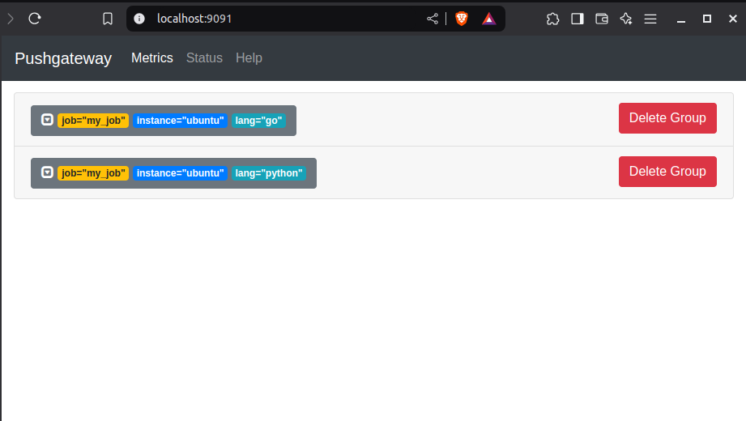

# 3 Ways to Time Kubernetes Job Duration for Better DevOps

Knowing how long the exucution of jobs take is a crucial part of monitoring
and proactive system administration.

Being able to measure, store and query this value over the course of your
application lifecycle can help you identify bottlenecks, optimize your
infrastructure and improve the overall performance of your application.

In this blog post, you are presented with three methods to achive this,
starting from one where you have the access and ability to modify the source
code, to the one where you have control over its runtime execution, and finally
without control on either & using only the Kube State Metrics.

Read more to find out how.

<!-- more -->

## Introduction

Being able to view the historic values of the execution time of your one-off
jobs is crucial if you want to know when, what and how did things change.

It'll help you identify and nail down the moment where things got off-track.

This will enable you to troubleshoot and debug faster and in proactive manner
before things get ugly.

There are three approaches that come to mind to measure and store this value,
all of which will require the
[VictoriaMetrics][^vm-stack-chart] or the [Prometheus][^prom-stack-chart]
ecosystem.

## Method 1: Modify the Source Code

Let's start with the one where we have access to modify the source code of the
application we want monitored.

A simple example will look like the following (provided in [Golang] & [Python])


===+ "Golang"

    ```go title="main.go"
    -8<- "docs/blog/posts/2025/007-k8s-command-timer/method-1/go/main.go"
    ```

=== "Python"

    ```go title="main.py"
    -8<- "docs/blog/posts/2025/007-k8s-command-timer/method-1/python/main.py"
    ```

Now, I'm sure both of these codes could be simplified by orders of magnitude,
using decorator/middleware. But the point is only to provide an example.

We want to be able to measure the time of our main task, and report its result
to Prometheus Pushgateway.

How to run any of these in a [Kubernetes] cluster?

Simply provide the container running these apps with the right URL to
pushgateway:

```yaml title="" linenums="0"
# ... truncated ...
- name: my-container
  image: my-repo/my-image
  env:
    - name: PUSHGATEWAY_URL
      value: http://pushgateway.monitoring.svc.cluster.local:9091
# ... truncated ...
```

And the result will look like the following.

<figure markdown="span">
  { loading=lazy }
  <figcaption>Pushgateway UI</figcaption>
</figure>


## Method 2: Modify the Runtime Execution

Now, we've seen how to modify the code and how to report the duration when
having access to modify the code. But, what if we were not able to do that?

What if we're on a different team or a different department and only have
access to how the container is running in the production environment?

That's where [Prometheus] Command Timer[^prom-cmd-timer] comes in.

It aims to be a single binary with all the batteries included to be able to
measure the execution time of a command and report its duration to [Prometheus]
Pushgateway.

The way it works and the way it was designed was pretty simple and
straightforward actually:

> We want to be able to run any command within a container of a pod, measure
its duration without touching the code of the upstream, and report the duration
to Prometheus Pushgateway.

The idea is to run the command timer as a CLI wrapper before the main one-off
task.

The same way you'd run, say, `dumb-init`[^dumb-init], `gosu`[^gosu] or
`tini`[^tini].

Let's see it in example first before showing you the code.

Imagine running the following Kubernetes Job:

```yaml title="job.yml"
-8<- "docs/blog/posts/2025/007-k8s-command-timer/method-2/bare-job.yml"
```

Now, if I cannot modify the upstream code in the `sh` or `sleep` command above,
the best I can do is to run those commands within another command.

This will only be a tiny wrapper that does nothing else but to track the
execution time of the child command.

Let's see how it works:

```yaml title="job.yml" hl_lines="10-14 22-34 36-38"
-8<- "docs/blog/posts/2025/007-k8s-command-timer/method-2/job.yml"
```

This is beautiful. This time around, unlike the last one, I didn't have to
change the code in the upstream application.

All I had to do was to install the required binary into my container, run
the timer command as a wrapper before the job command, and once again, I will
have those numbers in my [Prometheus] Pushgateway.

Now, for those of you who are interested in the underlying code :nerd:, here's
the minimal [Golang] application that powers this using only the standard
library.

??? "Prometheus Command Timer"

    ```go title="prometheus-command-timer/main.go"
    -8<- "https://raw.githubusercontent.com/meysam81/prometheus-command-timer/c854034977948b06aa50db59555b4549fa6a1730/main.go"
    ```

## Method 3: Using Kube State Metrics

This approach feels more intuitive for observability people who are dealing
with [Prometheus] and PromQL[^promql] in their day to day
job[^promql-cheatsheet].

It eases the pain of having
to change anything at all other than having either the [VictoriaMetrics] or
the [Prometheus] Kubernetes stack installed in your cluster.

We can measure the execution time of a Kubernetes Job in the following PromQL
query:

```promql title="" linenums="0"
(kube_job_status_completion_time - kube_job_status_start_time) / 60
```

Measured as the total minutes of the execution time of a job.

We can further enhance this by having it as a recording rule[^vm-rule] to
ensure we don't overload the query engine.

```yaml title="recording-rules.yml"
---
groups:
- name: recording-rules
  rules:
  - record: job_execution_minutes_total
    expr: >-
      (
        kube_job_status_completion_time -
        kube_job_status_start_time
      ) / 60
```

If you want an online playground, you can try the [VictoriaMetrics]
playground[^vmplay].

For example, here's the URL to the query above:

<https://play.victoriametrics.com/select/0/vmui/#/?g0.range_input=30m&g0.end_input=2025-03-02T06%3A22%3A49&g0.relative_time=last_30_minutes&g0.tab=0&g0.tenantID=0&g0.expr=%28kube_job_status_completion_time+-+kube_job_status_start_time%29+%2F+60>

Now, we can improve this query further by looking for execution times of
CronJobs when there is a parent resource.

To do that, we'll leverage the `kube_job_owner` metric.

```plaintext title="" linenums="0"
(
  kube_job_status_completion_time -
  kube_job_status_start_time
) * on(job_name, namespace)
group_left(owner_name)
kube_job_owner{owner_kind="CronJob"}
```

And to add it to our recording rules:

```yaml title="recording-rules.yml" hl_lines="12-19"
---
groups:
- name: recording-rules
  rules:
  - record: job_execution_minutes_total
    expr: >-
      (
        kube_job_status_completion_time -
        kube_job_status_start_time
      ) / 60

  - record: cronjob_execution_minutes_total
    expr: >-
      (
        kube_job_status_completion_time -
        kube_job_status_start_time
      ) * on(job_name, namespace)
      group_left(owner_name)
      kube_job_owner{owner_kind="CronJob"}
```

## Conclusion

This blog post came to being as a result of me trying to find a way to measure
the execution time of Kubernetes cronjobs and being able to query their
historic values.

I was looking for a way to be able to understand how the execution times have
changed and be able to identify the bottlenecks and the slowest jobs.

The three methods provided here have all been sparsely used here and there
dependending on how much control I've had over the application.

If you happen to have a better way to persist those metrics, please do let me
know using the comments below.

[AWS]: ../../../category/aws.md
[External Secrets]: ../../../category/external-secrets.md
[GitHub Actions]: ../../../category/github-actions.md
[GitHub Container Registry]: ../../../category/github-container-registry.md
[GitHub Pages]: ../../../category/github-pages.md
[GitHub]: ../../../category/github.md
[Golang]: ../../../category/go.md
[Kubernetes]: ../../../category/kubernetes.md
[OpenTofu]: ../../../category/opentofu.md
[Privacy]: ../../../category/privacy.md
[Terraform]: ../../../category/terraform.md
[Prometheus]: ../../../category/prometheus.md
[VictoriaMetrics]: ../../../category/victoriametrics.md
[Golang]: ../../../category/go.md
[Python]: ../../../category/python.md

[^vm-stack-chart]: https://artifacthub.io/packages/helm/victoriametrics/victoria-metrics-k8s-stack/0.38.0
[^prom-stack-chart]: https://artifacthub.io/packages/helm/prometheus-community/kube-prometheus-stack/69.6.0
[^prom-cmd-timer]: https://github.com/meysam81/prometheus-command-timer/
[^dumb-init]: https://github.com/Yelp/dumb-init
[^gosu]: https://github.com/tianon/gosu
[^tini]: https://github.com/krallin/tini
[^promql]: https://prometheus.io/docs/prometheus/latest/querying/basics/
[^promql-cheatsheet]: https://promlabs.com/promql-cheat-sheet/
[^vm-rule]: https://docs.victoriametrics.com/operator/resources/vmrule/#recording-rule
[^vmplay]: https://play.victoriametrics.com/
