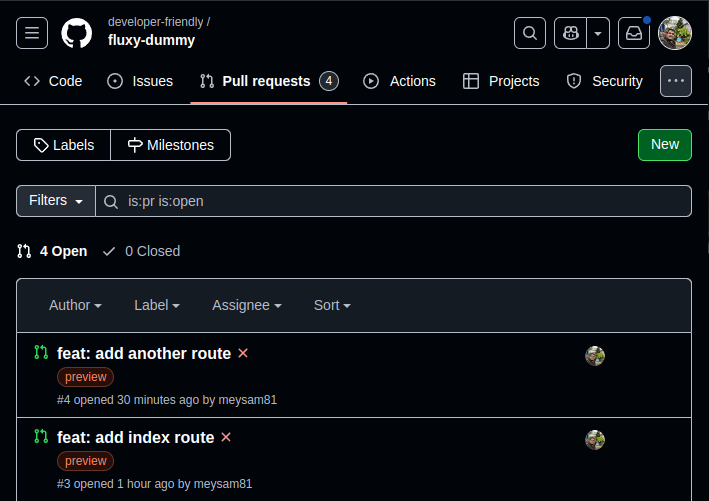
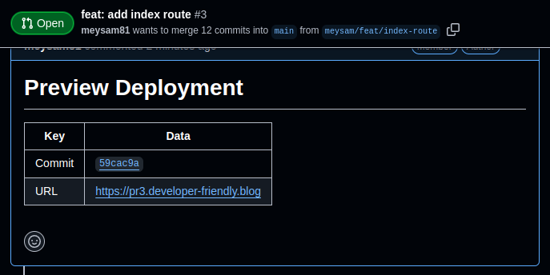

# How to Setup Preview Environments with FluxCD in Kubernetes

Preview environment is where you see a live state of your changes from your
pull request before being merged into the default branch. It gives you a look'n
feel of what it would be like if you merged your changes.

Kubernetes on the other hand, is what powers the production setups. But that's
not all it can do for you. I have spun up preview environments in Kubernetes
with different technologies in the past.

And in this blog post, I will show you how to achive this using FluxCD
Operator.

<!-- more -->

## Introduction

For most of the frontend or full-stack applications, you rarely second guess
using anything but some of the well-known PaaS providers platforms like Vercel,
Netlify, etc.

Not only they make it very easy to integrate your [Git] provider and deploy
your application with the least friction, but also you will benefit from
out-of-the-box preview deployment with little to no configuration.

However, those platforms have two downsides (from my point of view):

1. They are generalized, meaning that some of the specifics of your application
   may or may not be compatible with their offering.
2. Most importantly, they are mainly focused on [JavaScript] ecosystem, whether
   that be NodeJS, NextJS, Svelte, etc. When it comes to backend application
   deployments such as [Golang] or [Python], they fall short!

On the flip side, it's not unheard of for folks to ditch [Kubernetes]
altogether and go full in-house with a customized version of what they seem fit
for their development environments[^gitpod-k8s].

They claim, and I quote:

> [...] we’ve found that Kubernetes is not the right choice for building
  development environments.

And not shortly after:

> This is not a story of whether or not to use Kubernetes for production
  workloads.

So, in a nutsheel, they are at a point where [Kubernetes] does not work for
them.

No complaint here. Pick what works best for you!

## Why Kubernetes?

However, me personally, I rarely leave or second guess [Kubernetes] clusters.

Even for the obvious challenges of keeping storage accessible when the pod
moves around between nodes, I have personally found RWX storage classes to be a
good solution, e.g., Ceph, NFS, etc.

The reasons below are not exhaustive, but they provide my take on why I believe
[Kubernetes] is a superior choice for not just prod, but also anything in
between:

1. Deployment frequency: matched with [GitOps], there's no better way to deploy
   your applications as fast as possible[^flux-receiver]. :fast_forward:
2. Mean time to recovery: If you have everything in [Git], you only need a backup
   of your data; your cluster is always backed up in VCS. :clock1:
3. Zero downtime rollouts: What does it take for a supervisord or
   docker-compose to deliver the same!?
   :fontawesome-solid-arrow-up-from-ground-water:
4. Preview deployments: This will be the main story of this blog post! :zap:
5. Engineering overhead/technical debt/maintainability: There can be books
   written on this topic, but in short, Kubernetes is a lot less overhead than,
   say, [Ansible] in [GitHub Actions] (I have done both BTW).
6. [GitOps] (disaster recovery/drift detection): We touched on this earlier
   (point 1 & 2).
7. Automated releases: Sit back and enjoy deployments with no manual
   intervention. What can be done by machines should be done by machines!
   :sunglasses:
8. Self healing deployments: I'm sure every other tool will try as hard but
   Kubernetes is the best at this. :muscle:
9. Monitoring & observability: What's the alternative? Deploy [Prometheus]
   systemd service on every machine? No sirree, not for me! :man_running:

## What are we doing here?

When I read other people's blog posts, I skip straight to the part with the
source code snippet. I'm not one for the theories!

I will spare you the same. Let's get to the point!

Here are the spec we want to address in this blog post.

1. [x] We want to deploy a [Golang] application to [Kubernetes] cluster.
2. [x] We want every pull request on the repository of our application to spin
   up a preview environment.
3. [x] Every preview environment should have a dedicated internet-accessible
   URL.
4. [x] The URL of the preview environment has to be commmented on the [GitHub]
   pull request.

Let's start to address each of these and hope that we won't have to break this
blog post into multiple. :sweat_smile:

## Pre-requisites

- A [Kubernetes] cluster. We're working with v1.32.
- [FluxCD] installed on the cluster[^flux-install]. Currently v2.5.1.
- [GitHub] repository for the application.

## A Minimal Golang Application

Let's create our initial boilerplate:

```shell title="" linenums="0"
go mod init fluxy_dummy
cd fluxy_dummy
go get -u github.com/gin-gonic/gin
```

And the only file we need:

```go title="main.go"
-8<- "https://raw.githubusercontent.com/developer-friendly/fluxy-dummy/b23e040e97812214a449c73f3818d470ae3dbe69/main.go"
```

We have our application ready. Commit and push this to its own repository and
we're ready to create a base [Kustomization] stack for its deployment.

!!! question "Kustomization vs. Helm"

    I am more in favor of [Kustomization] for its expressiveness and
    simplicity.

    Templating languages do not scare me really; I even use Jinja2 templates
    in [Ansible] extensively.

    But unless I am providing a generalized deployment stack for the community,
    I see no point in making my manifets more complex.

    [Kustomization] is just that; simple and easy to understand. What you see
    is exactly what you get. No fuss, no templating, no nothing!

## Kustomize the Deployment

We will now create the YAML manifets that will be used by the [FluxCD]
Kustomization to deploy our application.

```yaml title="serviceaccount.yml"
-8<- "https://raw.githubusercontent.com/developer-friendly/fluxy-dummy/0d92274d85f427cc8aeb8ffef5ac1ce6f815ebef/kustomize/serviceaccount.yml"
```

```yaml title="deployment.yml"
-8<- "https://raw.githubusercontent.com/developer-friendly/fluxy-dummy/0d92274d85f427cc8aeb8ffef5ac1ce6f815ebef/kustomize/deployment.yml"
```

```yaml title="service.yml"
-8<- "https://raw.githubusercontent.com/developer-friendly/fluxy-dummy/0d92274d85f427cc8aeb8ffef5ac1ce6f815ebef/kustomize/service.yml"
```

```yaml title="kustomization.yml"
-8<- "https://raw.githubusercontent.com/developer-friendly/fluxy-dummy/0d92274d85f427cc8aeb8ffef5ac1ce6f815ebef/kustomize/kustomization.yml"
```

## FluxCD Operator

So far so good, but we've done nothing more than the usual application
deployment.

I would say, that whatever that's been covered so far is a base requirement for
any production setup.

We now move on to our main objective: preview deployments.

First things first, we gotta deploy the corresponding operator and its CRDs.

```shell title="" linenums="0"
-8<- "docs/blog/posts/2025/008-fluxcd-preview-depoyment/scripts/install-flux-operator.sh"
```

This will be the latest version of the [FluxCD] operator (as of this writing).

## Prerequisite Kubernetes Resources

As per the official documentation[^fluxcd-prereq], we better create a dedicated
namespace and a role binding to make sure no elevated permissions are given to
the operator when deploying the preview environments.

```yaml title="prereqs/namespace.yml"
-8<- "docs/blog/posts/2025/008-fluxcd-preview-depoyment/prereqs/namespace.yml"
```

```yaml title="prereqs/serviceaccount.yml"
-8<- "docs/blog/posts/2025/008-fluxcd-preview-depoyment/prereqs/serviceaccount.yml"
```

```yaml title="prereqs/rolebinding.yml"
-8<- "docs/blog/posts/2025/008-fluxcd-preview-depoyment/prereqs/rolebinding.yml"
```

## Preview Environment YAML Manifests

We're ready to leverage all our existing setup and create a preview environment
for each of our pull requests.

```yaml title="preview-environment/rsip.yml"
-8<- "docs/blog/posts/2025/008-fluxcd-preview-depoyment/preview-environment/rsip.yml"
```

To create the [GitHub] authentication token, and until [FluxCD] operator
provides native support for [GitHub] Deploy Keys[^deploy-key], we're left with no
other option but the infamous GitHub PAT.

```shell title="" linenums="0"
flux -n staging create secret git github-auth \
  --url=https://github.com/developer-friendly/fluxy-dummy \
  --username=meysam81 \
  --password=${GITHUB_TOKEN}
```

Beware that we set the `fluxcd.controlplane.io/reconcileEvery` to `10s` just
for simplicity. In real-world scenarios you'd have a realistic number such as
`5m` or higher and set up the [GitHub] webhook to trigger the
reconciliation[^flux-operator-receiver].

The following CRD is our main resource. It takes care of receiving the [GitHub]
pull requests from the parent `ResourceSetInputProvider` and creating the
specified resources.

```yaml title="preview-environment/rset.yml"
-8<- "docs/blog/posts/2025/008-fluxcd-preview-depoyment/preview-environment/rset-bare.yml"
```

You will quickly notice that unlike your typical templating language, the
values are populated with `<<` and `>>`. This is to avoid conflicting variables
with Helm templates, in case you create one.

The above three resources specified in the `ResourceSet.spec.resources` will
generate something like the following:

??? example "Click to expand"

    ```yaml title=""
    -8<- "docs/blog/posts/2025/008-fluxcd-preview-depoyment/junk/generated-resources.yml"
    ```


## Making a Change and Create Pull Request

Everything is ready. Let's create a pull request and verify the setup.

In fact, let's create two pull requests adding two separate routes to our web
application.

First pull request (pr3):

```go title="main.go" hl_lines="12-17"
-8<- "https://raw.githubusercontent.com/developer-friendly/fluxy-dummy/b449283e4736a271788b7a4e7689fd7a49c279ff/main.go"
```

Second pull request (pr4):

```go title="main.go" hl_lines="18-23"
-8<- "https://raw.githubusercontent.com/developer-friendly/fluxy-dummy/5a39668b2b7394a76a7ccbdf3364919ef12506a0/main.go"
```

Now, pushing these changes to the repository, creating a pull request per each
branch and labeling them according to our configuration, we should see the
preview environments being created.

<figure markdown="span">
  { loading=lazy }
  <figcaption>GitHub Pull Requests</figcaption>
</figure>

We can verify this by checking the corresponding [FluxCD] resource:

```yaml title="" hl_lines="31-41"
-8<- "docs/blog/posts/2025/008-fluxcd-preview-depoyment/junk/generated-rsip.yml"
```

Notice the `exportedInputs` per each of the detected pull requests. We have 5
inputs so far, providing the values we have specified in our `ResourceSet` CRD.

Let's verify the deployed instances:

```shell title="" linenums="0"
-8<- "docs/blog/posts/2025/008-fluxcd-preview-depoyment/junk/curl-pr3.sh"
```

```shell title="" linenums="0"
-8<- "docs/blog/posts/2025/008-fluxcd-preview-depoyment/junk/curl-pr4.sh"
```

It works. Great.

## Comment the Preview Environment URL

One last objective before we close this off. Let's comment on the corresponding
pull request the URL of the preview environment.

We want each pull request to do this automatically. Think of it as a one-off
task that executes to completion.

There are more than one way to achive this, but the objective for us is to use
an `initContainer` in our application that will run right before our main
container starts.

```yaml title="preview-environment/rset.yml" hl_lines="41-88"
-8<- "docs/blog/posts/2025/008-fluxcd-preview-depoyment/preview-environment/rset-preview-bot.yml"
```

An improvement to this decision would possibly be to run it as a
`lifecycle.postStart` in the pod spec[^poststart], but that means adding
another binary to our main application!

<figure markdown="span">
  { loading=lazy }
  <figcaption>Preivew Bot Comment</figcaption>
</figure>

## Conclusion

That's all folks!

The main mission in this blog post was to create preview environment on each
pull request of our GitHub repository and inform the author via a comment.

The current setup works flawlessly as scoped out at the beginning of this blog
post and can give you inspiration to setup your own preview environments.

This is not my first time provisioning preview environments in [Kubernetes]. I
have achieved the same with ArgoCD, [GitHub Actions], etc.

But to tell you the truth, [FluxCD] holds a close place in my heart. It's
simple, decoupled, and will always be my first [GitOps] tool of choice.

[Ansible]: ../../../category/ansible.md
[AWS]: ../../../category/aws.md
[External Secrets]: ../../../category/external-secrets.md
[FluxCD]: ../../../category/fluxcd.md
[Git]: ../../../category/git.md
[GitHub Actions]: ../../../category/github-actions.md
[GitHub Container Registry]: ../../../category/github-container-registry.md
[GitHub Pages]: ../../../category/github-pages.md
[GitHub]: ../../../category/github.md
[GitOps]: ../../../category/gitops.md
[Golang]: ../../../category/go.md
[JavaScript]: ../../../category/javascript.md
[Kubernetes]: ../../../category/kubernetes.md
[Kustomization]: ../../../category/kustomization.md
[OpenTofu]: ../../../category/opentofu.md
[Privacy]: ../../../category/privacy.md
[Prometheus]: ../../../category/prometheus.md
[Python]: ../../../category/python.md
[Terraform]: ../../../category/terraform.md
[VictoriaMetrics]: ../../../category/victoriametrics.md

[^gitpod-k8s]: https://www.gitpod.io/blog/we-are-leaving-kubernetes
[^flux-receiver]: https://fluxcd.io/flux/components/notification/receivers/
[^flux-install]: https://fluxcd.io/flux/installation/
[^fluxcd-prereq]: https://fluxcd.control-plane.io/operator/resourcesets/github-pull-requests/#preview-namespace
[^deploy-key]: https://docs.github.com/en/authentication/connecting-to-github-with-ssh/managing-deploy-keys
[^flux-operator-receiver]: https://fluxcd.control-plane.io/operator/resourcesets/github-pull-requests/#github-webhook
[^poststart]: https://kubernetes.io/docs/reference/kubernetes-api/workload-resources/pod-v1/#lifecycle-1
