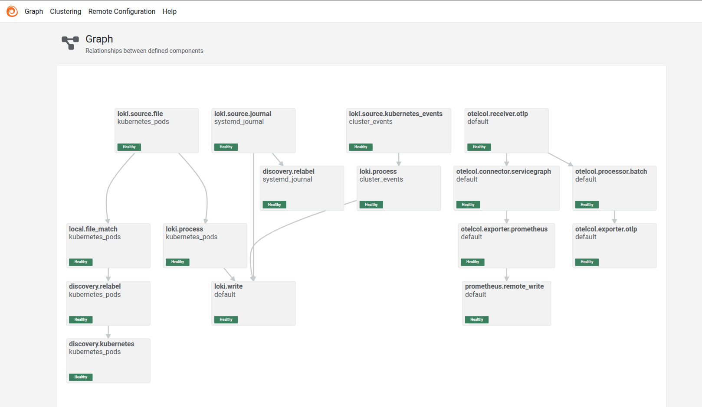

# Migration From Promtail to Alloy: The What, the Why, and the How

Promtail is (was) the lightweight log collector solution that sends the log
over the HTTP to the remote backend. This remote backend is normally Loki but
you can choose to send the logs to VictoriaLogs as well.

In this blog post, you will see the newer alternative to Promtail, Grafana
Alloy. You will see what it is, why it's a good idea to migrate, and the how-to
guide to make the jump with least friction.

<!-- more -->

## Introduction

Due to the recent decision by the Grafana team to deprecate the
Promtail[^promtail-homepage], I've got the chance to revisit my logging stack.

Promtail has always been my default & favorite choice in the last few years due
to its simplicity and negligible overhead.

It was powerful to collect all sorts of logs, whether pods of [Kubernetes] or
Journal logs of the Linux operating system[^promtail-journal].

However, from the outside and by the looks of it, it appears that the team was
bearing a lot of difficulty maintaining that solution alongside with their
other powerful solutions.

And so it happens that they have decided to let go of it, integrating its
powerful features into the currently supported [Grafana] Alloy[^alloy-docs].

In addition to the fear of change[^fear-of-change], I was hesitant and didn't
want to go through with the migration because of my very good reasons:

1. Promtail is lightweight. Download the compiled [Golang] binary and run it
   anywhere and everywhere. What can be more desireable than that!?
2. Promtail has support for almost all the log implementations. There is a good
   chance that you can scrape anything with Promtail and ship it to the remote
   backend.

And so, after many back'n forth, I decided to jump ship, finally! :cruise_ship:

This blog post and today's story is what I've learned along the way and some
of the cool features that I discovered from Alloy that I may or may not have
had with Promtail.

!!! note "Disclaimer"

    This blog post is not sponsored by [Grafana] in anyway. I don't get a
    single dime promoting their products.

    I am just a happy user. :innocent:

    P.S. I write and promote any opensource software I find compelling; this is
    the main focus of all the blog posts here.

## What is Alloy?

Alloy is your one-stop shop for any scraping; be it metrics, logging or
tracing[^alloy-intro].

In a nutshell, the simplified version of how Alloy works can be boiled down to
this:

- [x] It receives inputs and data from many adapters (hence the name
  _receiver_).
- [x] It may or may not apply some processing on the received data.
- [x] Lastly, it ports those data to the specified backend.


It has native-support for many of the available receivers and exporters and
using its powerful processors, you can do all sorts of crazy stuff like
relabling, sampling, decolorizing, reformatting, etc[^alloy-components].

If you're writing codes in any modern porgramming language, you will almost
certainly have a way to collect all the telemetry data you require from your
application with [Grafana] Alloy.

!!! tip "Known Competitor"

    For those of you coming from [OpenTelemetry] world, this is the alternative
    to OpenTelemetry Collector.

## Why Grafana Alloy?

Just to name a few, here are the highlighting features of what Alloy is capable
of:

- [x] Collecting logs from Linux journal
- [x] Capable of discovering targets with native support for [Kubernetes]
- [x] Batching metrics, logs and traces to reduce network traffic overhead
- [x] Sampling and downsampling to reduce noise and data size
- [x] Relabel data before pushing them to the remote backend
- [x] Support almost all the storage backends in the observabilty world
- [x] Native support for [OpenTelemetry] protocol
- [x] Compatible with [Prometheus] and Loki API, and as a result,
  [VictoriaMetrics] & [VictoriaLogs][^promtail-vlogs].


!!! tip "Grafana Ecosystem"

    Another smooth benefit of Alloy is its native integration with the rest of the
    [Grafana] ecosystem; this may be considered harmful if you want to avoid vendor
    lock-in, however, if you're using any of the other products from [Grafana] this
    will be to your advantage.

Now, these are most likely just scratching the surface of what Alloy is capable
of.

But, to tell you truth, this more than enough for what I want from a collector
agent! :muscle:

## How to Deploy Grafana Alloy?

So far, we've only seen what it is and what it can do. But, how do we deploy
Alloy is the focus of the remaining of this blog post.

First and foremost, if you're running on a Promtail stack, you would want to
migrate your current config with little to no friction.

Alloy CLI has you covered[^cli-reference].

With `alloy convert`, you can pass in your current `promtail.yml` file and get
a compatible configuration in HCL format that can be passed into the Alloy
binary[^alloy-github].

!!! note "Alloy CLI"

    Just like [Grafana] Promtail, Alloy is written in [Golang].

    This has a great upside to it; you can grab a compiled binary from the
    [GitHub] release page and use it as is, with all the batteries
    included[^alloy-latest-release].

If you're already running `promtail` in your [Kubernetes] cluster:

```shell title="" linenums="0"
# Get your current config
kubectl get -n monitoring secret/promtail \
  -o jsonpath='{.data.promtail\.yaml}' \
  | \base64 -d \
  | tee promtail.yml

# Convert it with native support
alloy convert --source-format=promtail \
  --bypass-errors -o alloy.hcl promtail.yml
```

And if you're just starting out, you might wanna use the proven configuration
from the Promtail [Helm] chart.

```shell title="" linenums="0"
helm template promtail grafana/promtail --version=6.16.x \
  | tee promtail.yml
```

In the `promtail.yml` file, look for `kind: Secret` and grab the content of
`data.stringData`.

??? example "promtail.yml"

    ```yaml title=""
    -8<- "docs/blog/posts/2025/009-alloy-migration/junk/promtail-manifests.yml"
    ```

With that configuration, we can once again run `alloy convert` and get a
head-start on our journey to deploy the [Grafana] Alloy.

Here's what the base configuration will look like if you convert the latest
`promtail.yml` configuration.

??? example "`alloy convert`"

    ```hcl title=""
    -8<- "docs/blog/posts/2025/009-alloy-migration/alloy/alloy-bare.hcl"
    ```

### Customizing the Configuration

This converted config above is a good start, but it doesn't cut it for me!
:sweat_smile:

I would save you the headache and give you the complete end-result in one go.
However, I am providing the explanation details right after!

If you know what this config does, feel free to skip the rest of this blog
post. :raised_hands:

```hcl title="alloy.hcl"
-8<- "docs/blog/posts/2025/009-alloy-migration/alloy/alloy.hcl"
```

For this `alloy.hcl` configuration to work properly within a [Kubernetes] pod,
you need the following [Helm] values during the installation of Alloy
chart[^alloy-chart].

```yaml title="alloy/helm-values.yml"
-8<- "docs/blog/posts/2025/009-alloy-migration/alloy/helm-values.yml"
```

Now onwards to mention a few words about each block in the configuration above
and why they are present in my config file.

#### Declutter Logs

Firstly, I would get rid of the colored logs, as well as healthchecks.

Although these shouldn't even be printed out to stdout in a production setup,
but let's just give our developers some slack!

```hcl title="alloy.hcl" linenums="90" hl_lines="6-10"
-8<- "docs/blog/posts/2025/009-alloy-migration/alloy/alloy.hcl:90:100"
```

#### Collect Linux Journal Logs

Additionally, I want to collect the logs of the host operating system. Yes,
even when I am operating at a containerized application deployment! :grimacing:

That comes with the `loki.source.journal` block, which of course has some
relabling applied to it.

```hcl title="alloy.hcl" linenums="153" hl_lines="4"
-8<- "docs/blog/posts/2025/009-alloy-migration/alloy/alloy.hcl:153:158"
```

Notice how I send the journal logs to the same remote backend.

It's important to mention that the Alloy [Helm] should accomodate for the mount
of host journal path as follows:

```yaml title="alloy/helm-values.yml" hl_lines="14"
-8<- "docs/blog/posts/2025/009-alloy-migration/alloy/helm-values.yml"
```

#### Collect Kubernetes Cluster Events as Logs

Furthermore, I would want to scrape the [Kubernetes] cluster events and ship
them to the same storage backend, as if they were logs.

That comes with the native supported `loki.source.kubernetes_events` block.

```hcl title="alloy.hcl" linenums="160"
-8<- "docs/blog/posts/2025/009-alloy-migration/alloy/alloy.hcl:160:166"
```

#### Ship Logs to VictoriaLogs

Lastly for my logs configuration, I would want to send my logs to the
[VictoriaLogs][^vlogs], instead of Loki.

```hcl title="alloy.hcl" linenums="186" hl_lines="3"
-8<- "docs/blog/posts/2025/009-alloy-migration/alloy/alloy.hcl:186:192"
```

### Collect Tracing With Alloy

Next item in the agenda is to be able to collect more than just logs with
[Grafana] Alloy.

I mean, if I want to collect three pillars of observability from my stack, the
metrics, logs and tracing data, why the hell would I want to use Alloy only for
logging and have at least one other pod to collect the tracing (i.e. the
[OpenTelemetry] collector[^otel-collector]).

Best case scenario, I would get rid of the OTel collector and use Alloy to
scrape both the logs and the tracing and ship them to the correct storage
backend. Wouldn't you!?[^victoriametrics-benchmark]

To be able to collect tracing information with [Grafana] Alloy, we open up the
corresponding endpoints with the `otelcol.receiver.otlp`.

```hcl title="alloy.hcl" linenums="198"
-8<- "docs/blog/posts/2025/009-alloy-migration/alloy/alloy.hcl:198:212"
```

Again, to be able to send tracing with OTLP protocol to Alloy, you have to open
up the [Kubernetes] Service accordingly.

```yaml title="alloy/helm-values.yml" hl_lines="2-10"
-8<- "docs/blog/posts/2025/009-alloy-migration/alloy/helm-values.yml"
```

### Tracing ServiceGraph

Alloy, just like OpenTelemery Collector, is able to ship service graph data to
[Prometheus]-compatible endpoints, allowing us to view the graph of our
services in the Tempo backend.

```hcl title="alloy.hcl" linenums="214"
-8<- "docs/blog/posts/2025/009-alloy-migration/alloy/alloy.hcl:214:222"
```

Configuring the Grafana Datasource[^gf-operator-datasource] with the following
spec, will give us the dashboard you see in the next screenshot.

```yaml title="grafana/datasource-tempo.yml"
-8<- "docs/blog/posts/2025/009-alloy-migration/grafana/datasource-tempo.yml"
```

<figure markdown="span">
  { loading=lazy }
  <figcaption>Grafana Tempo ServiceGraph</figcaption>
</figure>

### Collect Prometheus Metrics

Now, this is not something I would generally recommend doing.

**I don't even do it myself**.

But you can scrape [Prometheus] metrics from your [Kubernetes]
cluster and ship them the same way using [Grafana] Alloy.

```hcl title="alloy.hcl" linenums="250"
-8<- "docs/blog/posts/2025/009-alloy-migration/alloy/alloy.hcl:250:257"
```

Why wouldn't I do that? Because the rest of the industry is settled on using
`ServiceMonitor` and `PodMonitor` when it comes to metrics scraping.

In any [Helm] chart all you gotta do is to enable the `serviceMonitor` or the
`metrics` in its `values.yml` file. The corresponding CRD will be created and
your monitoring stack will automatically pick it up.

And just so it happens that the [VictoriaMetrics] team have native
support[^migrate-prom-to-vm] for converting [Kube Prometheus Stack] into that
of [VictoriaMetrics] K8s Stack[^vm-k8s-stack].

So, even if takes the rest of the industry a while before they have native
support for `VMServiceScrape`[^vm-service-scrape] and
`VMPodScrape`[^vm-pod-scrape], you can still benefit a lot by using `VMAgent`
to scrape your metrics.

All in all, I wouldn't use [Grafana] Alloy to collect metrics from my
[Kubernetes] cluster because it will lock you in on a single vendor. :lock:

But, if you really must, you can do that with Alloy using the
`prometheus.scrape` configuration block.

Before we close this off, here's what the Alloy UI looks like with the
configuration you have seen earlier.

<figure markdown="span">
  { loading=lazy }
  <figcaption>Tempo UI</figcaption>
</figure>

Each of the boxes above are clickable. You will be provided with the arguments,
the inputs and the outputs for each of them and some will even support live
debugging[^alloy-debug].

Whenever I can't figure out why my pipelines are not working correctly, I visit
this dashboard and can quickly spot the issue.

This is one of the coolest feature of [Grafana] Alloy in my opinion.

## Conclusion

In this blog post you've seen what [Grafana] Alloy is capable of and how easy
it is to migrate your current Promtail config into a working setup supported by
Alloy.

If you haven't done so already, you now have all the good reasons to migrate
your Promtail agents because by the time your read this, they have already
reached end of life support.

You wouldn't want to run your dependencies and services in your workload that
are no longer maintained, now would you!? :wink:

[Ansible]: ../../../category/ansible.md
[AWS]: ../../../category/aws.md
[External Secrets]: ../../../category/external-secrets.md
[FluxCD]: ../../../category/fluxcd.md
[Git]: ../../../category/git.md
[GitHub Actions]: ../../../category/github-actions.md
[GitHub Container Registry]: ../../../category/github-container-registry.md
[GitHub Pages]: ../../../category/github-pages.md
[GitHub]: ../../../category/github.md
[GitOps]: ../../../category/gitops.md
[Golang]: ../../../category/go.md
[Grafana]: ../../../category/grafana.md
[Helm]: ../../../category/helm.md
[JavaScript]: ../../../category/javascript.md
[Kubernetes]: ../../../category/kubernetes.md
[Kustomization]: ../../../category/kustomization.md
[Kube Prometheus Stack]: ../../../category/kube-prometheus-stack.md
[OpenTelemetry]: ../../../category/opentelemetry.md
[OpenTofu]: ../../../category/opentofu.md
[Privacy]: ../../../category/privacy.md
[Prometheus]: ../../../category/prometheus.md
[Python]: ../../../category/python.md
[Terraform]: ../../../category/terraform.md
[VictoriaMetrics]: ../../../category/victoriametrics.md
[VictoriaLogs]: ../../../category/victorialogs.md

[^promtail-homepage]: https://grafana.com/docs/loki/latest/send-data/promtail/
[^promtail-journal]: https://grafana.com/docs/loki/latest/send-data/promtail/configuration/#journal
[^alloy-docs]: https://grafana.com/docs/alloy/latest/
[^fear-of-change]: https://www.medicalnewstoday.com/articles/fear-of-change-phobia
[^alloy-intro]: https://grafana.com/docs/alloy/latest/introduction/
[^alloy-components]: https://grafana.com/docs/alloy/latest/get-started/components/
[^promtail-vlogs]: https://docs.victoriametrics.com/victorialogs/data-ingestion/promtail/
[^cli-reference]: https://grafana.com/docs/alloy/latest/reference/cli/
[^alloy-github]: https://github.com/grafana/alloy
[^alloy-chart]: https://artifacthub.io/packages/helm/grafana/alloy/0.12.5
[^alloy-latest-release]: https://github.com/grafana/alloy/releases/tag/v1.7.4
[^vlogs]: https://docs.victoriametrics.com/victorialogs/
[^otel-collector]: https://opentelemetry.io/docs/collector/
[^victoriametrics-benchmark]: https://victoriametrics.com/blog/opentelemetry-prometheus-and-more/
[^gf-operator-datasource]: https://grafana.github.io/grafana-operator/docs/datasources/
[^migrate-prom-to-vm]: https://docs.victoriametrics.com/operator/migration/
[^vm-k8s-stack]: https://artifacthub.io/packages/helm/victoriametrics/victoria-metrics-k8s-stack/0.39.0
[^vm-service-scrape]: https://docs.victoriametrics.com/operator/resources/vmservicescrape/
[^vm-pod-scrape]: https://docs.victoriametrics.com/operator/resources/vmpodscrape/
[^alloy-debug]: https://grafana.com/docs/alloy/latest/troubleshoot/debug/
