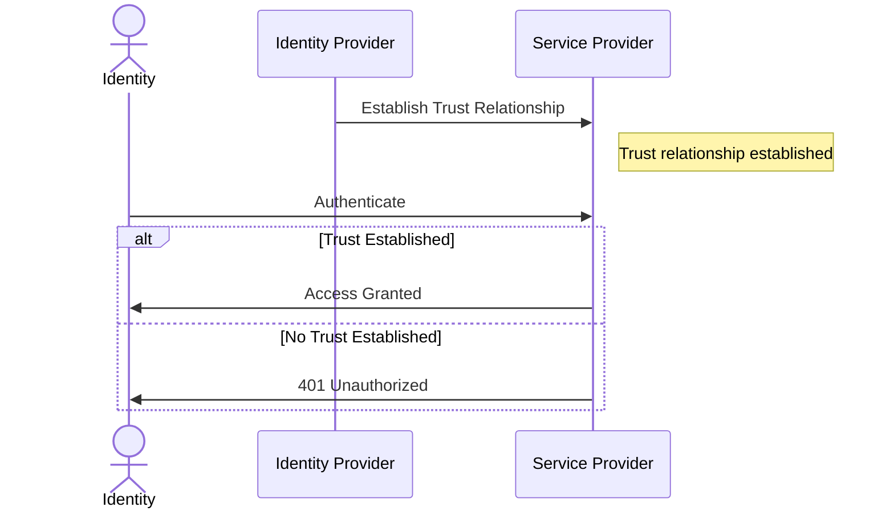

# K8s External Secrets: OIDC Integration for AWS, Azure & GCP

External Secrets is the de-facto choice for secrets management in Kubernetes
clusters. It simplifies the task of the administrator of the cluster, ensuring
only the secrets that are explicitly defined are present and accessible.

It comes with many great features but most important than all is its
integration with major cloud providers.

In this blog post you will learn how to deploy it without hard-coded credential
and using only the power of OpenID Connect for trust relationship between
services.

<!-- more -->

## Introduction

I like [External Secrets] Operator a lot. I rarely second guess my choice
deploying it in any [Kubernetes] cluster I provision and/or manage.

It enhances the security posture of my workload, while ensuring the right APIs
are called and the desired secrets are available to my pods at the right place.

The task of secret decryption is also handled by the cloud provider, which
removes the heavy lifting required to do the repetitive task by hand.

On the other hand, [OpenID Connect] is the authentication protocol that allows
for interactions and communications between services that support it.

The main idea is that by establishing a trust relationship between the identity
provider and the service provider, you will allow the the entities of the
former to access and talk to the latter.

The objective for today's blog post is to get the best of both of these ideas
and deploy [External Secrets] Operator in major cloud providers.

We will discuss managed Kubernetes clusters as well as self-managed ones.

By the end of this blog post, you should have a good idea of how to do this in
[AWS], [Azure], [GCP], in addition to bare-metal [Kubernetes] deployments as a
final bonus. :wink:

## What is OpenID Connect?

The first question we gotta answer for those of you who are not familiar is the
protocol OIDC.

The idea is pretty simple actually; we want the entities/identities from one
service (the Identity Provider) to be able to talk to the other (the Service
Provider).

The way we do that is in two steps:

1. We first establish a trust relationship between the Identity Provider and
   the Service Provider. What this does is to let the latter know that the
   folks from the former are to be authenticated to the system and can make
   API calls without receiving 401.
2. The next step is make the API call from the desired subject/identity. That
   can come in the form of `aws s3 ls s3://my-example-bucket`. The important
   thing to mention here is that the correct permission/RBAC has to be granted
   to the subject for this API call to succeed and not get 403.

Here's a summary of this interaction.



Now let's get on with implementing it in different vendors.

## Amazon Web Services (AWS)

The [AWS] EKS has many integrations with the current AWS service suits.

They actually have a habit of building their products with native support for
their other products.

They have a really good reason to do so because that will make you buy more and
pay more. :money_with_wings:

But enough complaining, let's get serious.

### Registering EKS OpenID Connect Provider

The first order of business is to ensure that the pods in your [AWS] EKS is
able to talk to other services and authenticate successfully.

That comes in the form of registering the Identity Provider of your cluster to
the [AWS] IAM[^register-aws-oidc].

You can achieve this either from your [OpenTofu]/[Terraform] code, or with a
simple CLI command.

```shell title="" linenums="0"
eksctl utils associate-iam-oidc-provider --cluster <my-cluster> --approve
```

This will give us something in the following format:

```plaintext title="" linenums="0"
oidc.eks.REGION.amazonaws.com/id/OIDC_PROVIDER_ID
```

We will use it shortly when creating IAM Policy.

That will give you the first step: establishing a trust relationship between
the two services.

### Create the AWS IAM Policy

The next step is to grant the pods of [External Secrets] access to read the
secrets from our [AWS] Secrets Manager; we are actually giving it access to
Parameter Store, which provides a limited free access to store and access
secure values[^aws-parameter-store].

```json title="aws-iam-policy.json"
-8<- "docs/blog/posts/2025/010-external-secrets-deployment/aws/iam-policy.json"
```

```shell title="" linenums="0"
aws iam create-policy \
  --policy-name external-secrets \
  --policy-document file://aws-iam-policy.json
```

And the obvious next step is to allow our pod to have access to these
permissions through short-lived credentials[^associate-iam-role].

```shell title="" linenums="0"
eksctl create iamserviceaccount \
  --name external-secrets \
  --namespace external-secrets \
  --cluster <my-cluster> \
  --role-name external-secrets \
  --attach-policy-arn arn:aws:iam::111122223333:policy/my-policy \
  --approve
```

This command will result in creating an [AWS] IAM Role similar to the
following:

```json title=""
-8<- "docs/blog/posts/2025/010-external-secrets-deployment/aws/trust-relationship.json"
```

Once we have this, we're ready to deploy the [External Secrets] Operator.

### Deploy ESO Helm Chart

We would need both the CRD installation as well as the corresponding
ServiceAccount annotation for the IAM trust relationship to work:

```json title="values.yml"
-8<- "docs/blog/posts/2025/010-external-secrets-deployment/external-secrets/helm-values.yml"
```

And now we can install it:

```shell title="" linenums="0"
helm install -n external-secrets \
  external-secrets \
  external-secrets/external-secrets \
  --values values.yml \
  --version 0.15.x
```

Let's finalize the AWS with the ClusterSecretStore creation[^eso-css].

And to verify that it works:

```yaml title=""
-8<- "docs/blog/posts/2025/010-external-secrets-deployment/output/eso-aws.yml"
```

That wraps up the [AWS] part. Let's move on to [Azure].


[Ansible]: ../../../category/ansible.md
[AWS]: ../../../category/aws.md
[External Secrets]: ../../../category/external-secrets.md
[FluxCD]: ../../../category/fluxcd.md
[Git]: ../../../category/git.md
[GitHub Actions]: ../../../category/github-actions.md
[GitHub Container Registry]: ../../../category/github-container-registry.md
[GitHub Pages]: ../../../category/github-pages.md
[GitHub]: ../../../category/github.md
[GitOps]: ../../../category/gitops.md
[Golang]: ../../../category/go.md
[Grafana]: ../../../category/grafana.md
[Helm]: ../../../category/helm.md
[JavaScript]: ../../../category/javascript.md
[Kubernetes]: ../../../category/kubernetes.md
[Kustomization]: ../../../category/kustomization.md
[Kube Prometheus Stack]: ../../../category/kube-prometheus-stack.md
[OpenTelemetry]: ../../../category/opentelemetry.md
[OpenID Connect]: ../../../category/openid-connect.md
[OpenTofu]: ../../../category/opentofu.md
[Privacy]: ../../../category/privacy.md
[Prometheus]: ../../../category/prometheus.md
[Python]: ../../../category/python.md
[Terraform]: ../../../category/terraform.md
[VictoriaMetrics]: ../../../category/victoriametrics.md
[VictoriaLogs]: ../../../category/victorialogs.md

[^register-aws-oidc]: https://docs.aws.amazon.com/eks/latest/userguide/enable-iam-roles-for-service-accounts.html
[^aws-parameter-store]: https://docs.aws.amazon.com/systems-manager/latest/userguide/systems-manager-parameter-store.html
[^associate-iam-role]: https://docs.aws.amazon.com/eks/latest/userguide/associate-service-account-role.html#_step_2_create_and_associate_iam_role
[^eso-css]: https://external-secrets.io/v0.15.0/api/clustersecretstore/
