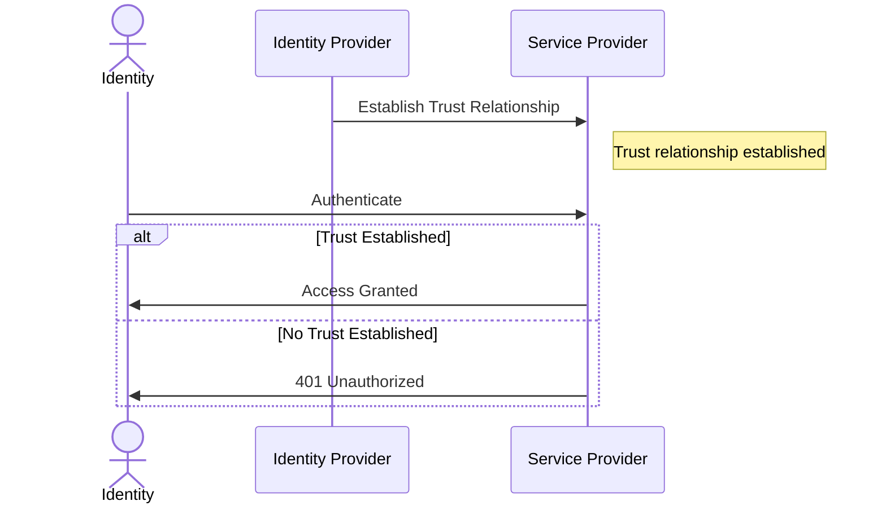

# Cloud-Native Secret Management: OIDC in K8s Explained

External Secrets is the de-facto choice for secrets management in Kubernetes
clusters. It simplifies the task of the administrator(s) of the cluster,
ensuring only the secrets that are explicitly defined are present and
accessible.

It comes with many great features but most important than all is its
integration with major cloud providers.

In this blog post you will learn how to deploy it without hard-coded
credentials and using only the power of OpenID Connect for trust relationship
between services.

<!-- more -->

## Introduction

I like [External Secrets] Operator a lot. I rarely second guess my choice
deploying it in any [Kubernetes] cluster I provision and/or manage.

It enhances the security posture of my workload, while ensuring the right APIs
are called and the desired secrets are available to my pods at the right
namespace.

The task of secret decryption is also handled by the cloud provider, which
removes the heavy lifting of key management and rotations!

On the other hand, [OpenID Connect] is the authentication protocol that allows
for interactions and communications between services that support it.

The main idea is that by establishing a trust relationship between the identity
provider and the service provider, you will allow the the entities of the
former to access and talk to the latter.

The objective for today's blog post is to get the best of both of these ideas
and deploy [External Secrets] Operator in major cloud providers.

We will discuss managed Kubernetes clusters as well as self-managed ones.

By the end of this blog post, you should have a good idea of how to do this in
[AWS], [Azure], [GCP], in addition to bare-metal [Kubernetes] deployments as a
final bonus. :wink:

## What is OpenID Connect?

The first question we gotta answer for those of you who are not familiar is the
OIDC protocol.

The idea is pretty simple actually; we want the entities/identities from one
service (the Identity Provider) to be able to talk to the other (the Service
Provider).

The way we do that is in two steps:

1. We first establish a trust relationship between the Identity Provider and
   the Service Provider. What this does is to let the service provider know
   that the folks from the identity provider are to be authenticated to the
   system and can make API calls without receiving 401.
2. Once the trust relationship is setup, we can grant the required permissions
   and RBAC to the target identity coming from the identity provider & let it
   make the API call(s). An example can be `aws s3 ls s3://my-example-bucket`
   running from inside the pods of an [AWS] EKS; unless the required
   permissions are granted beforehand, the result will be a 403 unauthorized!

Here's a summary of this interaction.



Now let's get on with implementing it in different vendors.

## Amazon Web Services (AWS)

The [AWS] EKS has many integrations with the current AWS services.

They actually have a habit of building their products with native support for
their other products.

They have a really good reason to do so because that will make you buy more and
pay more. :money_with_wings:

But enough complaining, let's get serious. :man_running:

### Registering EKS OpenID Connect Provider

The first order of business is to ensure that the pods in your [AWS] EKS is
able to talk to other services and authenticate successfully.

That comes in the form of registering the Identity Provider of your cluster to
the [AWS] IAM[^register-aws-oidc].

You can achieve this either from your [OpenTofu]/[Terraform] code, or with a
simple CLI command.

```shell title="" linenums="0"
eksctl utils associate-iam-oidc-provider --cluster <my-cluster> --approve
```

This will give us something in the following format:

```plaintext title="" linenums="0"
oidc.eks.REGION.amazonaws.com/id/OIDC_PROVIDER_ID
```

We will use it shortly when creating IAM Policy.

That will give you the first step :white_check_mark:; establishing a trust
relationship between the two services.

### Create the AWS IAM Policy

The next step is to grant the pods of [External Secrets] access to read the
secrets from our [AWS] Secrets Manager, as well as to decrypt the secure
secrets; we are actually giving it access to Parameter Store, which provides a
limited free access to store and access secure values[^aws-parameter-store].

```json title="aws-iam-policy.json"
-8<- "docs/blog/posts/2025/010-external-secrets-deployment/aws/iam-policy.json"
```

```shell title="" linenums="0"
aws iam create-policy \
  --policy-name external-secrets \
  --policy-document file://aws-iam-policy.json
```

And the obvious next step is to allow our pod to have access to these
permissions through short-lived credentials[^associate-iam-role].

The following commands create two resources:

1. [AWS] IAM Role.
2. A [Kubernetes] ServiceAccount.

```shell title="" linenums="0"
eksctl create iamserviceaccount \
  --name external-secrets \
  --namespace external-secrets \
  --cluster <my-cluster> \
  --role-name external-secrets \
  --attach-policy-arn arn:aws:iam::111122223333:policy/external-secrets \
  --approve
```

This command will result in creating an [AWS] IAM Role similar to the
following:

```json title=""
-8<- "docs/blog/posts/2025/010-external-secrets-deployment/aws/trust-relationship.json"
```

Once we have this, we're ready to deploy the [External Secrets] Operator.

**NOTE**: You will need the Amazon Identity Webhook operator installed in your
cluster, which comes pre-installed in AWS EKS[^eks-pod-identity].

### Deploy ESO Helm Chart in AWS AKS

We would need both the CRD installation as well as the corresponding
ServiceAccount annotation for the IAM trust relationship to work:

```json title="values.yml"
-8<- "docs/blog/posts/2025/010-external-secrets-deployment/external-secrets/helm-values-aws.yml"
```

And now we can install it:

```shell title="" linenums="0"
helm install -n external-secrets \
  external-secrets \
  external-secrets/external-secrets \
  --values values.yml \
  --version 0.15.x
```

Let's finalize the AWS with the ClusterSecretStore creation[^eso-css].

And to verify that it works:

```yaml title=""
-8<- "docs/blog/posts/2025/010-external-secrets-deployment/k8s/css-aws.yml"
```

```yaml title=""
-8<- "docs/blog/posts/2025/010-external-secrets-deployment/output/eso-aws.yml"
```

That wraps up the [AWS] part. Let's move on to [Azure].

## Microsoft Azure Cloud

With [Azure] AKS, you need the Workload Identity Operator installed in your
cluster[^az-wi].

Fortunately, it comes pre-installed if you're using a managed AKS cluster.

The idea is quite about the same as before; we aim to establish a trust
relationship from the Identity Provider (the [Kubernetes] cluster) to the
Service Provider (the [Azure] API) so that the pods from our identity provider
can issue API calls and not get 401 error.

### Establish Trust Relationship Between AKS and Azure API

To achieve this, we use our good friend [OpenTofu] this time.

```terraform title="azure-external-secrets-maanged-identity/versions.tf"
-8<- "docs/blog/posts/2025/010-external-secrets-deployment/azure/versions.tf"
```

```terraform title="azure-external-secrets-maanged-identity/variables.tf"
-8<- "docs/blog/posts/2025/010-external-secrets-deployment/azure/variables.tf"
```

```terraform title="azure-external-secrets-maanged-identity/main.tf"
-8<- "docs/blog/posts/2025/010-external-secrets-deployment/azure/main.tf"
```

```terraform title="azure-external-secrets-maanged-identity/outputs.tf"
-8<- "docs/blog/posts/2025/010-external-secrets-deployment/azure/outputs.tf"
```

This is only half the battle, although the most important part.

### Deploy ESO Helm Chart in Azure AKS

We'd first need the required label set on the target pod, as well as the right
annotations set on the ServiceAccount.

```json title="values.yml"
-8<- "docs/blog/posts/2025/010-external-secrets-deployment/external-secrets/helm-values-azure.yml"
```

And the installation is just as before using [Helm].

The ClusterSecretStore will look like the following.

Let's verify the setup:

```yaml title=""
-8<- "docs/blog/posts/2025/010-external-secrets-deployment/k8s/css-azure.yml"
```

```yaml title=""
-8<- "docs/blog/posts/2025/010-external-secrets-deployment/output/eso-azure.yml"
```

!!! tip "Azure Private Networking"

    In [Azure], you can set up Private Networking within your subnet to allow
    the compute instances of your workload to talk to one another using the
    private backbone and fast [Azure] network connectivity[^az-priv-endpoint].

    This has the advantage that the traffic never leaves the boundary of Azure
    and into the internet, while being fast and efficient, most likely saving
    you costs down the road.

???+ quote "Azure vs. Others"

    One thing I really enjoyed while working with [Azure] cloud was the
    resource groups.

    I didn't have a good start with them, but after a while, it became quite
    intuitive I always wondered why other cloud providers don't have!?

    In [Azure], if you want to nuke your account, you'd just delete the parent
    resource groups. No need to go crazy and search for all the regions and all
    the services if you've left something running (like in [AWS] :sweat).

Two down, one to go. :muscle:

## GCP Cloud

This is the last major cloud provider we'll cover in this blog post.

You will need the Workload Identity enabled on your GKE cluster for this method
to work properly.

```shell title="" linenums="0"
gcloud container clusters create [CLUSTER_NAME] \
  --workload-pool=[PROJECT_ID].svc.id.goog
```

Let's first create the required resources that will allow Workload Federation
within our GCP account[^gcp-wf].

```terraform title="gcp-external-secrets-iam/versions.tf"
-8<- "docs/blog/posts/2025/010-external-secrets-deployment/gcp/versions.tf"
```

```terraform title="gcp-external-secrets-iam/main.tf"
-8<- "docs/blog/posts/2025/010-external-secrets-deployment/gcp/main.tf"
```

Fortunately, you wouldn't need to annotate your Service Account this time
because that is take care of under the hood. You just gotta make sure that the
Servic Account is mounted into the pod.

```json title="values.yml"
-8<- "docs/blog/posts/2025/010-external-secrets-deployment/external-secrets/helm-values-gcp.yml"
```

And so business as usual, we'll install this using the [Helm] CLI.

Let's verify the setup:

```yaml title=""
-8<- "docs/blog/posts/2025/010-external-secrets-deployment/k8s/css-gcp.yml"
```

```yaml title=""
-8<- "docs/blog/posts/2025/010-external-secrets-deployment/output/eso-gcp.yml"
```

## Bonus: Self-Managed Kubernetes Clusters

Now, this all sounds so very good.

In fact, cloud providers take care of a lot of other things for the above
methods to work properly.

But, what if you were running a self-managed [Kubernetes] cluster?

How would you then allow the pods (identities) of your cluster to access the
API of other Service Providers?

How would you allow the [External Secrets] Operator from a self-managed
[Kubernetes] cluster to read secrets from [AWS] Parameter Store and create the
corresponding Secret in the correct namespace?

The answer lies in the [OpenID Connect].

Based on RFC 8414[^rfc-8414], the systems that provide the
`/.well-known/openid-configuration` can be considered OIDC-compliant.

The output of this endpoint will be the details on how your Identity Provider
signs the tokens for its identity and the URL for public key that can be used
to verify those tokens.

You can try this command on any [Kubernetes] cluster right now to see for
yourself.

```shell title="" linenums="0"
kubectl get --raw /.well-known/openid-configuration
```

The result will look something like the following:

```yaml title="" linenums="0"
-8<- "docs/blog/posts/2025/010-external-secrets-deployment/output/oidc-config.yml"
```

Now, to answer the first few questions of this section...

If you copy the contents of the following two endpoints from your [Kubernetes]
cluster...

1. `/.well-known/openid-configuration`
2. `/openid/v1/jwks`

... and store them somewhere that can be accessed behind secure HTTPS (signed
by trusted CA) and serve them as static files, then any Service Provider can
establish a trust relationship with your cluster and allow the pods within the
cluster to make those beautiful API calls.

That's the whole magic really! :magic_wand:

Try it with any [Kubernetes] cluster and it just works. You only need to serve
the contents of those two endpoints to the public internet.

Isn't that exciting!? Doesn't that excite you even a little bit?

It's all so good. So good to be true. But it is. It just is.

## Conclusion

I am blown away by how far away we've come from the early days of internet down
to the days that we can simply authenticate the entities of one system to the
other without passing any access-key and secret-key anywhere.

Not passing secrets means no secret rotation, no key management, no overhead,
no chores, no toil, and just pure bliss!

I love the world we live in because there's [OpenID Connect] in it!

As you've seen throughout this blog post, some cloud providers call it by other
names but that's just a marketing term in my humble opinion.

The fact stands still, that the [OpenID Connect] is one of the most remarkable
inventions of mankind to this day, at least in my opinion. :innocent:

[Ansible]: ../../../category/ansible.md
[Azure]: ../../../category/azure.md
[AWS]: ../../../category/aws.md
[External Secrets]: ../../../category/external-secrets.md
[FluxCD]: ../../../category/fluxcd.md
[GCP]: ../../../category/gcp.md
[Git]: ../../../category/git.md
[GitHub Actions]: ../../../category/github-actions.md
[GitHub Container Registry]: ../../../category/github-container-registry.md
[GitHub Pages]: ../../../category/github-pages.md
[GitHub]: ../../../category/github.md
[GitOps]: ../../../category/gitops.md
[Golang]: ../../../category/go.md
[Grafana]: ../../../category/grafana.md
[Helm]: ../../../category/helm.md
[JavaScript]: ../../../category/javascript.md
[Kubernetes]: ../../../category/kubernetes.md
[Kustomization]: ../../../category/kustomization.md
[Kube Prometheus Stack]: ../../../category/kube-prometheus-stack.md
[OpenTelemetry]: ../../../category/opentelemetry.md
[OpenID Connect]: ../../../category/openid-connect.md
[OpenTofu]: ../../../category/opentofu.md
[Privacy]: ../../../category/privacy.md
[Prometheus]: ../../../category/prometheus.md
[Python]: ../../../category/python.md
[Terraform]: ../../../category/terraform.md
[VictoriaMetrics]: ../../../category/victoriametrics.md
[VictoriaLogs]: ../../../category/victorialogs.md

[^register-aws-oidc]: https://docs.aws.amazon.com/eks/latest/userguide/enable-iam-roles-for-service-accounts.html
[^aws-parameter-store]: https://docs.aws.amazon.com/systems-manager/latest/userguide/systems-manager-parameter-store.html
[^associate-iam-role]: https://docs.aws.amazon.com/eks/latest/userguide/associate-service-account-role.html#_step_2_create_and_associate_iam_role
[^eks-pod-identity]: https://github.com/aws/amazon-eks-pod-identity-webhook/
[^eso-css]: https://external-secrets.io/v0.15.0/api/clustersecretstore/
[^az-wi]: https://azure.github.io/azure-workload-identity/docs/
[^az-priv-endpoint]: https://learn.microsoft.com/en-us/azure/private-link/private-endpoint-overview
[^gcp-wf]: https://cloud.google.com/iam/docs/workload-identity-federation
[^rfc-8414]: https://datatracker.ietf.org/doc/html/rfc8414
