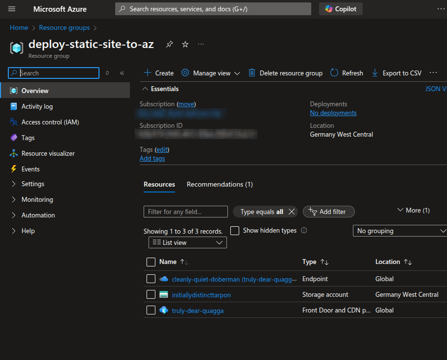
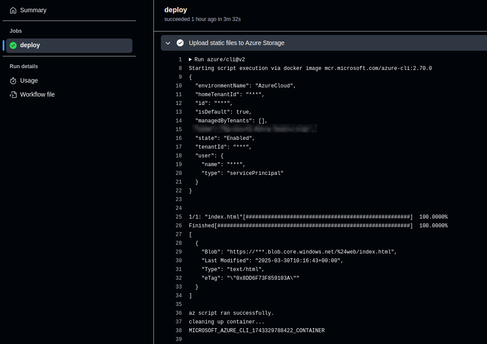

# Deploy Static Sites to Azure CDN with GitHub Actions OIDC

In this blog post you will learn how to authenticate and deploy your frontend
code to Azure CDN, backed by Azure Blob Storage to deliver low-latency static
website to your users.

The objective is to avoid hard-coded credentials and only employ OpenID Connect
to establish trust relationship between the Identity Provider (GitHub) and the
Service Provider (Azure).

<!-- more -->

## Introduction

Among many different technologies and tools in 2025, one of the most
interesting innovation of our time is the [OpenID Connect][^ms-what-is-oidc].

It opens a lot of doors to the administrator(s) of the system, enabling
secret-less authentication between different providers, promoting the
principle of least privilege, and removing the need for rotating hard-coded
credentials.

While it does so, it makes sure that adversaries and untrusted parties will
never gain access to our infrastructure, closing the doors that never ought to
be!

If you've already read [the article from last week][k8s-oidc-eso], you have a
good idea of what I'm talking about.

I will spare you the details and give you the gist.

The idea is pretty simple actually.

You establish a trust relationship between two providers, and then grant the
required permission & RBAC to let the identities of one system to perform API
calls to the other.

This is the diagram we'll cover this week. :point_down:


That sums up the whole objective of this blog post. But, first, let's nail down
exactly what we aim to achive.

## The Big Picture

This is the highlight of our mission here:

1. Build the static sites from the frontend code in [GitHub Actions]
2. Publish the static sites to [Azure] Blob Storage.
3. Configure Azure CDN to deliver those assets over low-latency global network

The following is the directory structure of our [Infrastructure as Code]:

```plaintext title="" linenums="0"
.
├── 10-azure-github-trust
│   ├── main.tf
│   └── terragrunt.hcl
├── 20-azure-cdn-blob
│   ├── main.tf
│   └── terragrunt.hcl
└── 30-github-repository
    ├── files
    │   └── ci.yml
    ├── main.tf
    └── terragrunt.hcl
```

And these are the prerequisites:

- [Terragrunt] v0.77.1[^tg-release]
- [OpenTofu] v1.9.0[^tofu-release]
- An [Azure] account
- [Azure] CLI v2.70.0[^az-cli]

## OIDC Trust Relationship Between GitHub and Azure

Let's jump right in.

We want to let our [Azure] account know that the CI/CD runners of a specific
repository are to be trusted.

This trust will let the two services talk to one another without the need for
us to provide client-id and client-secret, or any other type of hard-coded
credentials, all thanks to the power of [OpenID Connect].

!!! tip "OpenID Connect in Azure"

    Beware that [Azure], just like any other cloud provider, like playing
    names.

    They call [OpenID Connect] differently; Federated Identity
    Credentials[^az-federated].

    Quite a mouthful and it is just marketing.

    The ideas are solid and firm based on [OpenID Connect] though!
    :rolling_eyes:

```terraform title="10-azure-github-trust/versions.tf"
-8<- "docs/blog/posts/2025/011-azure-cdn-gha/10-azure-github-trust/versions.tf"
```

```terraform title="10-azure-github-trust/variables.tf"
-8<- "docs/blog/posts/2025/011-azure-cdn-gha/10-azure-github-trust/variables.tf"
```

```terraform title="10-azure-github-trust/main.tf"
-8<- "docs/blog/posts/2025/011-azure-cdn-gha/10-azure-github-trust/main.tf"
```

You will realize that we're using [Azure] Service Principal to authenticate
[GitHub] runner jobs[^az-sp-from-github].

If you don't have enough permission to configure [Azure] Entra ID, then your
second best bet will be to use Azure User-Assigned Managed Identity[^az-mi].
We have a concrete example in
[the blog post from last week][k8s-oidc-eso-azure].

```terraform title="10-azure-github-trust/outputs.tf"
-8<- "docs/blog/posts/2025/011-azure-cdn-gha/10-azure-github-trust/outputs.tf"
```

```hcl title="10-azure-github-trust/terragrunt.hcl"
-8<- "docs/blog/posts/2025/011-azure-cdn-gha/10-azure-github-trust/terragrunt.hcl"
```

Have your [Azure] CLI authenticated[^az-cli-login] and run the following:

```shell title="" linenums="0"
# These need to be present in your CLI
export ARM_SUBSCRIPTION_ID="00000000-0000-0000-0000-000000000000"
export ARM_TENANT_ID="00000000-0000-0000-0000-000000000000"

terragrunt init -upgrade
terragrunt plan -out tfplan
terragrunt apply tfplan
```

And the output will be similar to the following:

```plaintext title="" linenums="0"
-8<- "docs/blog/posts/2025/011-azure-cdn-gha/junk/output-10.txt"
```

!!! tip "Authenticate GitHub Runners to Azure"

    There are generally three types of available from [GitHub] Actions to
    [Azure] cloud[^github-to-azure-auth-methods].

    1. Service Principal. :white_check_mark:
    2. User-Assigned Managed Identity. :white_check_mark:
    3. Service Principal and Secret. :x:

    The last one is not recommended because it requires passing hard-coded
    credentials, the very first thing this blog post is aiming to
    avoid! :man_bowing:

## Provisioning Azure Blob Storage and CDN

We will heavily rely on the official documentation for creating [Azure] CDN
using [OpenTofu] code[^az-cdn-terraform].

```terraform title="20-azure-cdn-blob/versions.tf"
-8<- "docs/blog/posts/2025/011-azure-cdn-gha/20-azure-cdn-blob/versions.tf"
```

```terraform title="20-azure-cdn-blob/variables.tf"
-8<- "docs/blog/posts/2025/011-azure-cdn-gha/20-azure-cdn-blob/variables.tf"
```

```terraform title="20-azure-cdn-blob/main.tf"
-8<- "docs/blog/posts/2025/011-azure-cdn-gha/20-azure-cdn-blob/main.tf"
```

We can add custom domain to the [Azure] CDN[^az-cdn-custom-endpoint]. But for
the sake of simplicity and brevity, we'll skip that part.

```terraform title="20-azure-cdn-blob/outputs.tf"
-8<- "docs/blog/posts/2025/011-azure-cdn-gha/20-azure-cdn-blob/outputs.tf"
```

```hcl title="20-azure-cdn-blob/terragrunt.hcl"
-8<- "docs/blog/posts/2025/011-azure-cdn-gha/20-azure-cdn-blob/terragrunt.hcl"
```

Notice how we use the elegant `dependency`[^dep-tg] block of [Terragrunt] to
pass the inputs from one stack to the other. It's beautiful. :heart_eyes:

And this will be the output:

```plaintext title="" linenums="0"
-8<- "docs/blog/posts/2025/011-azure-cdn-gha/junk/output-20.txt"
```

## Publish Site to Azure Blob with GitHub Actions Workflow

```terraform title="30-github-repository/versions.tf"
-8<- "docs/blog/posts/2025/011-azure-cdn-gha/30-github-repository/versions.tf"
```

```terraform title="30-github-repository/variables.tf"
-8<- "docs/blog/posts/2025/011-azure-cdn-gha/30-github-repository/variables.tf"
```

Again, we lean on the official docs for creating our CI/CD
workflow[^github-oidc-azure], with a few modifications and customizations.
There are also official docs in [Azure] for the same
requirement[^azure-oidc-from-github].

```yaml title="30-github-repository/files/ci.yml"
-8<- "docs/blog/posts/2025/011-azure-cdn-gha/30-github-repository/files/ci.yml"
```

For a comprehensive list of all the availble inputs to `Azure/login` [GitHub]
Action, refer to the upstream repository[^az-login-action].

```terraform title="30-github-repository/main.tf"
-8<- "docs/blog/posts/2025/011-azure-cdn-gha/30-github-repository/main.tf"
```

```hcl title="30-github-repository/terragrunt.hcl"
-8<- "docs/blog/posts/2025/011-azure-cdn-gha/30-github-repository/terragrunt.hcl"
```

## Verify the Website

We have everything ready to test out if things are working correctly.

```shell title="" linenums="0"
-8<- "docs/blog/posts/2025/011-azure-cdn-gha/junk/curl-website.sh"
```

Here are the screenshots for this experiment:

<figure markdown="span">
  { loading=lazy }
  <figcaption>Azure Resource Group</figcaption>
</figure>

<figure markdown="span">
  { loading=lazy }
  <figcaption>Azure Blob Storage IAM</figcaption>
</figure>

<figure markdown="span">
  { loading=lazy }
  <figcaption>Login Action</figcaption>
</figure>

<figure markdown="span">
  { loading=lazy }
  <figcaption>Upload Assets to Azure Blob</figcaption>
</figure>

## Future Works

You can improve this work further by pruning all the files in the destination
that are not present in the source, for example because they have been removed.

This can be achieve with this command instead, which is using `azcopy` under
the hood[^az-blob-storage-sync]:

```yaml title="30-github-repository/files/ci.yml" linenums="45" hl_lines="6"
-8<- "docs/blog/posts/2025/011-azure-cdn-gha/junk/ci-improved.yml"
```

In addition, the current frontend code is pretty simplistic and just a
hello-world application; when the code grows, you will likely require
additional optimizations to improve the build time and reduce your CI billing.

That is obviously out of scope for this blog post. :nerd:

???+ question "What's Great About Azure?"

    As I close this blog post, I will go back to my [Azure] portal to remove
    the resources I've created.

    The best part of working with [Azure] is that I will only have to remove
    one resource: the Resource Group[^az-rg].

    Unlike [AWS] and other cloud providers, I don't have to hunt down the
    resources I've provisioned in different tabs, services and regions.

    Nor do I need to use external third-party tools such as cloudnuke[^cloudnuke].

    In [Azure], only removing the Resource Group will remove all the child
    resources! :muscle:

## Conclusion

With [OpenID Connect], we can establish trust relationship between two service
providers and let the identity(-ies) of one authenticate to the other without
passing any hard-coded credentials.

These types of authentication are based on short-lived TTL credentials that
are only authenticated for the brief moment that the actor needs to perform the
API call.

With these short-lived credentials, you will never have to worry about secret
rotation, or secret-leakage! It's a life-saver.

I will forever be grateful to all the wonderful genuises who delivered
[OpenID Connect] to our world. It is one of the greatest inventions of our
time.

It makes the lives of administratos a lot easier, while ensuring that our
infrastructure is secure, compliant, and without hard-coded long-lived
credentials.

I will continue to employ [OpenID Connect] now and forever, in any system that
is OIDC-compliant.

I hope, one day, to get rid of [GitHub] PATs[^gh-pat] once the good folks there
finally start supporting OIDC authentication!

[Ansible]: ../../../category/ansible.md
[Azure]: ../../../category/azure.md
[AWS]: ../../../category/aws.md
[External Secrets]: ../../../category/external-secrets.md
[FluxCD]: ../../../category/fluxcd.md
[GCP]: ../../../category/gcp.md
[Git]: ../../../category/git.md
[GitHub Actions]: ../../../category/github-actions.md
[GitHub Container Registry]: ../../../category/github-container-registry.md
[GitHub Pages]: ../../../category/github-pages.md
[GitHub]: ../../../category/github.md
[GitOps]: ../../../category/gitops.md
[Golang]: ../../../category/go.md
[Grafana]: ../../../category/grafana.md
[Helm]: ../../../category/helm.md
[Infrastructure as Code]: ../../../category/infrastructure-as-code.md
[JavaScript]: ../../../category/javascript.md
[Kubernetes]: ../../../category/kubernetes.md
[Kustomization]: ../../../category/kustomization.md
[Kube Prometheus Stack]: ../../../category/kube-prometheus-stack.md
[OpenTelemetry]: ../../../category/opentelemetry.md
[OpenID Connect]: ../../../category/openid-connect.md
[OpenTofu]: ../../../category/opentofu.md
[Privacy]: ../../../category/privacy.md
[Prometheus]: ../../../category/prometheus.md
[Python]: ../../../category/python.md
[Terragrunt]: ../../../category/terragrunt.md
[Terraform]: ../../../category/terraform.md
[VictoriaMetrics]: ../../../category/victoriametrics.md
[VictoriaLogs]: ../../../category/victorialogs.md

[k8s-oidc-eso]: ../010-external-secrets-deployment/README.md
[k8s-oidc-eso-azure]: ../010-external-secrets-deployment/README.md#microsoft-azure-cloud

[^ms-what-is-oidc]: https://www.microsoft.com/en-us/security/business/security-101/what-is-openid-connect-oidc
[^tg-release]: https://github.com/gruntwork-io/terragrunt/releases/tag/v0.77.1
[^tofu-release]: https://github.com/opentofu/opentofu/releases/tag/v1.9.0
[^az-cli]: https://learn.microsoft.com/en-us/cli/azure/install-azure-cli
[^az-federated]: https://learn.microsoft.com/en-us/graph/api/resources/federatedidentitycredentials-overview?view=graph-rest-1.0
[^az-sp-from-github]: https://learn.microsoft.com/en-us/azure/developer/github/connect-from-azure-openid-connect
[^az-mi]: https://learn.microsoft.com/en-us/entra/identity/managed-identities-azure-resources/how-manage-user-assigned-managed-identities#create-a-user-assigned-managed-identity
[^az-cli-login]: https://registry.terraform.io/providers/hashicorp/azuread/latest/docs/guides/azure_cli
[^github-to-azure-auth-methods]: https://learn.microsoft.com/en-us/azure/developer/github/connect-from-azure
[^az-cdn-terraform]: https://learn.microsoft.com/en-us/azure/cdn/create-profile-endpoint-terraform?tabs=azure-cli
[^az-cdn-custom-endpoint]: https://registry.terraform.io/providers/hashicorp/azurerm/4.24.0/docs/resources/cdn_endpoint_custom_domain
[^dep-tg]: https://terragrunt.gruntwork.io/docs/features/stacks/#passing-outputs-between-units
[^github-oidc-azure]: https://docs.github.com/en/actions/security-for-github-actions/security-hardening-your-deployments/configuring-openid-connect-in-azure
[^azure-oidc-from-github]: https://learn.microsoft.com/en-us/azure/storage/blobs/storage-blobs-static-site-github-actions?tabs=openid
[^az-login-action]: https://github.com/Azure/login?tab=readme-ov-file#login-with-openid-connect-oidc-recommended
[^az-blob-storage-sync]: https://learn.microsoft.com/en-us/cli/azure/storage/blob?view=azure-cli-latest#az-storage-blob-sync
[^az-rg]: https://learn.microsoft.com/en-us/azure/azure-resource-manager/management/manage-resource-groups-portal
[^cloudnuke]: https://github.com/gruntwork-io/cloud-nuke/releases/tag/v0.40.0
[^gh-pat]: https://docs.github.com/en/authentication/keeping-your-account-and-data-secure/managing-your-personal-access-tokens
