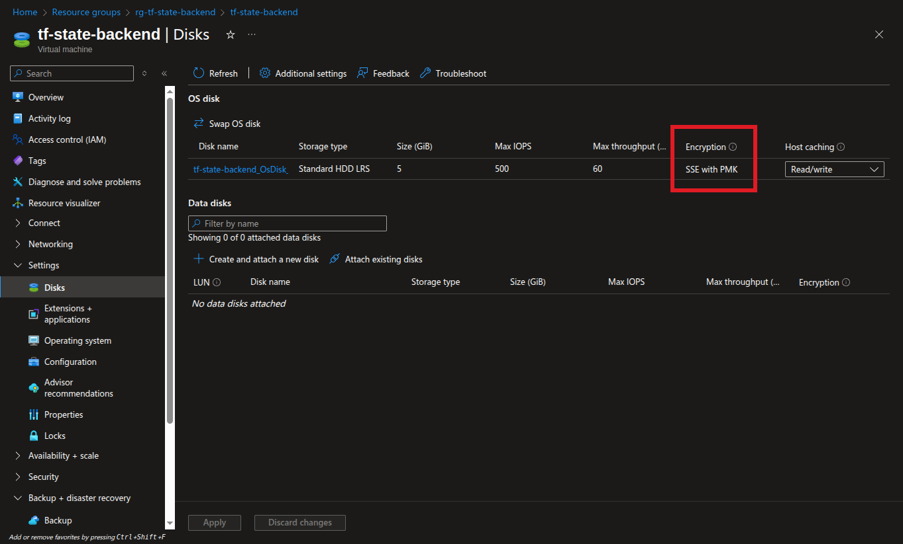
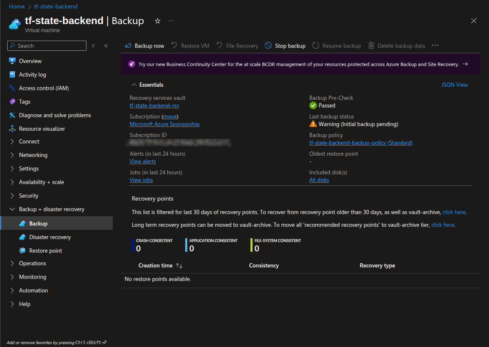
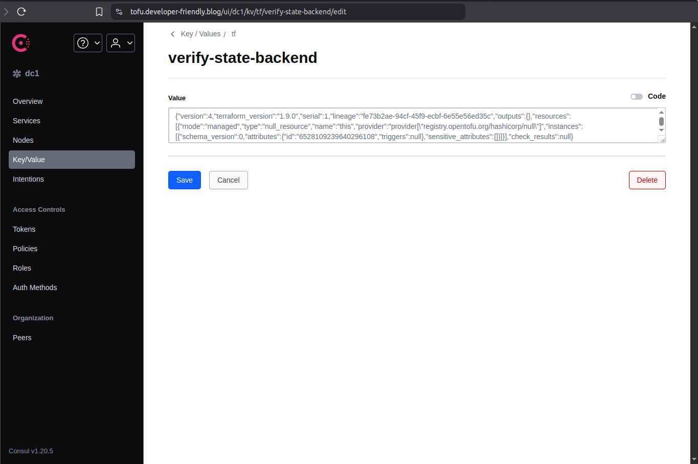

# Deploy Consul as OpenTofu Backend with Azure & Ansible

In this blog post, we provide the necessary steps to setup a single-node
standalone Consul server to be used as TF state backend.

In doing so, we aim to provide idempotent and reproducible codes using
Tofu and Ansible, for the sake of disaster recovery as well as enabling team
collaboration within version control system.

<!-- more -->

## Introduction

Having a remote [OpenTofu] state backend is crucial for any
[Infrastructure as Code]. Not only it survives the possible crash of one single
administrator's machine, but also provides team collaboration, state locking,
and many other cool features that are required for a production setup.

The objective of this blog post is to set up the Hashicorp [Consul] on a single
[Azure] virtual machine[^consul].

While this setup is not redundant, nor high available or resilient, it's still
a big win for teams that require simple deployments and can afford the risk of
running workloads on one single instance!

Although I do not recommend this for big teams, this approach works pretty
descent for small setups.

## Objectives

The following is the list of all the requirement this small project aims to
cover:

- :gear: Deploy [Consul] on a single node; for simplicity, there's no
  redundancy!
- :lock: The Consul server has to be served behind TLS to allow encryption
  in-transit.
- :floppy_disk: The server running [Consul] must have backups enabled to allow
  for fast recovery in case of crash.
- :key: The disk of the node must be encrypted; we don't care if the key is
  platform-managed!
- :rocket: The entire configuration should be idempotent, allowing
  reproducibility as well as team collaboration.

These requirements are the main highlights that we aim to tackle in the rest of
this blog post.

There are some opiniated toolings employed here that may or may not sit well
with you; you may prefer alternatives or find the proposed approaches hard to
comprehend and/or maintain.

It is fine though. There isn't a single best way to handle the requirements
here. Find and pick what works best for you.

With all that chatter out of the way, let's get serious.

Here's the directory structure that will be covered in here.

```plaintext title="" linenums="0"
.
├── 10-vm
│   ├── cloud-init.yml
│   ├── main.tf
│   ├── output.tf
│   ├── terragrunt.hcl
│   └── versions.tf
├── 20-bootstrap-consul
│   ├── ansible.cfg
│   ├── inventory
│   │   └── azure_rm.yml
│   ├── playbook.yml
│   ├── requirements.yml
│   └── roles/
│       ├── acme/
│       ├── consul/
│       ├── firewall/
│       └── haproxy/
├── 30-verify-state-backend
│   ├── main.tf
│   ├── terragrunt.hcl
│   └── versions.tf
└── azurerm.hcl
```

## Prerequisites

The following are the tools used on the local machine:

- [Terragrunt] v0.77[^tg]
- [OpenTofu] v1.9[^tofu]
- [Ansible] v2.18[^ansible]

## Creating an Azure Virtual Machine

**NOTE**: If you already have a VM/server, skip this step! :open_hands:

The following [OpenTofu] stack is the minimal [Infrastructure as Code] that
will boot up a VM in the [Azure] cloud.

Although some may prefer using ready-made and off-the-shelf TF modules, I for
one, prefer writing my own resources for one very important reason.

> :material-check-all: Although using TF modules can speed up the development
  initially, the maintenance cost of upgrades and compatibility outweighs the
  benefit.

I eventually stopped upgrading my TF modules because they keep introducing
changes in backward incompatible ways, making it an absolute nightmare just to
keep the lights running!

So, here's my own simple code, and it'll work for infinity so long as the
upstream provider doesn't mess up their API! Even when the provider is pinned
to major version.

```terraform title="10-vm/versions.tf"
-8<- "docs/blog/posts/2025/012-consul-tf-backend/10-vm/versions.tf"
```

```yaml title="10-vm/cloud-init.yml"
-8<- "docs/blog/posts/2025/012-consul-tf-backend/10-vm/cloud-init.yml"
```

```terraform title="10-vm/main.tf"
-8<- "docs/blog/posts/2025/012-consul-tf-backend/10-vm/main.tf"
```

If you're struggling to find Azure images for your VMs like me, you will find
alternative online methods very useful[^az-vm-image].

```terraform title="10-vm/output.tf"
-8<- "docs/blog/posts/2025/012-consul-tf-backend/10-vm/output.tf"
```

```hcl title="10-vm/terragrunt.hcl"
-8<- "docs/blog/posts/2025/012-consul-tf-backend/10-vm/terragrunt.hcl"
```

Running this stack is pretty simple at this point:

```shell title="" linenums="0"
terragrunt init -upgrade
terragrunt plan -out tfplan
terragrunt apply tfplan
```

We will require the SSH private key for the next step:

```shell title="" linenums="0"
terragrunt output -raw ssh_private_key > /tmp/key
chmod 600 /tmp/key
```

## Bootstrap the Consul Server

We are now ready to run a bunch of [Ansible] playbook tasks to configure our
server.

Note that this is a Fedora machine and we will mostly use
`ansible.builtin.package` for package installation. We care little to none
about portability, e.g., to use `ansible.builtin.package`!

While working for the codes for this blog post, I slowly fell in love with how
Fedora works with packages. :heart_eyes:

It makes it so easy to grab the latest available version of each package;
whatever you need is always one `dnf` away from you!

Coming from Ubuntu background and using Ubuntu-based desktop all my life, I
have never had such a great [sysadmin] experience before in my life. Fedora is
awesome. :heart_hands:

### Disable Fedora's Firewall

Now let's start with the bare essentials. We first need to disable the firewall
of the host, since [Azure] cloud already has a Security Group configured in
front of it.

```yaml title="20-bootstrap-consul/roles/firewall/tasks/main.yml"
-8<- "docs/blog/posts/2025/012-consul-tf-backend/20-bootstrap-consul/roles/firewall/tasks/main.yml"
```

### Configure the Consul Server

This step is the most important part of this blog post.

If you skipped all the other sections, then this is the only one you should
care about. :ok_hand:

#### consul.hcl

```hcl title="20-bootstrap-consul/roles/consul/files/consul.hcl"
-8<- "docs/blog/posts/2025/012-consul-tf-backend/20-bootstrap-consul/roles/consul/files/consul.hcl"
```

```yaml title="20-bootstrap-consul/roles/consul/tasks/service.yml"
-8<- "docs/blog/posts/2025/012-consul-tf-backend/20-bootstrap-consul/roles/consul/tasks/service.yml"
```

#### consul acl bootstrap

```yaml title="20-bootstrap-consul/roles/consul/tasks/acl.yml"
-8<- "docs/blog/posts/2025/012-consul-tf-backend/20-bootstrap-consul/roles/consul/tasks/acl.yml"
```

#### Agent Policy

The [Consul] agent running behind systemd service needs to have `node:write`
permission to register itself to the cluster. This ACL policy will grant that
access[^acl-policy].

We'd then create and provide a token from such a policy in the config
directory[^cfg-dir].

```hcl title="20-bootstrap-consul/roles/consul/files/agent-policy.hcl"
-8<- "docs/blog/posts/2025/012-consul-tf-backend/20-bootstrap-consul/roles/consul/files/agent-policy.hcl"
```

```yaml title="20-bootstrap-consul/roles/consul/tasks/agent.yml"
-8<- "docs/blog/posts/2025/012-consul-tf-backend/20-bootstrap-consul/roles/consul/tasks/agent.yml"
```

Since the systemd `consul.service` is running with
`consul agent -config-dir=/etc/consul.d/`, we can place any number of files in
that directory and still get the combined result of them all. :muscle:

#### TF State Backend ACL Policy

Last step. We will configure the policy and the token that we'll use in our
local machine when configuring the TF state backend.

```hcl title="20-bootstrap-consul/roles/consul/files/tofu-policy.hcl"
-8<- "docs/blog/posts/2025/012-consul-tf-backend/20-bootstrap-consul/roles/consul/files/tofu-policy.hcl"
```

```yaml title="20-bootstrap-consul/roles/consul/tasks/tofu.yml"
-8<- "docs/blog/posts/2025/012-consul-tf-backend/20-bootstrap-consul/roles/consul/tasks/tofu.yml"
```

That's it. After this step, we will have the token and this is how we can get
the plaintext value from the temp stored file.

```shell title="" linenums="0"
$ ansible -m fetch -a 'src=/tmp/.tf_token_jnq5afq6 dest=token' --become consul
$ cat token/tf-state-backend_79f7/tmp/.tf_token_jnq5afq6
29020ed6-0dee-f022-ca8b-40efa519446b
```

We will use that UUID value later on as the [Consul] HTTP
token[^consul-backend].

## Configure Load Balancer and TLS Certificate

We are using HAProxy with Certbot for the task. You may pick something simpler
that has native TLS certificate retrieval, like Caddy[^caddy] or
Traefik[^traefik].

```ini title="20-bootstrap-consul/roles/haproxy/files/haproxy.cfg"
-8<- "docs/blog/posts/2025/012-consul-tf-backend/20-bootstrap-consul/roles/haproxy/files/haproxy.cfg"
```

```yaml title="20-bootstrap-consul/roles/haproxy/tasks/main.yml"
-8<- "docs/blog/posts/2025/012-consul-tf-backend/20-bootstrap-consul/roles/haproxy/tasks/main.yml"
```

And the `acme-backend` is as follows:

```ini title="20-bootstrap-consul/roles/acme/files/acme-backend.service"
-8<- "docs/blog/posts/2025/012-consul-tf-backend/20-bootstrap-consul/roles/acme/files/acme-backend.service"
```

```shell title="20-bootstrap-consul/roles/acme/files/prepare-haproxy-cert.sh"
-8<- "docs/blog/posts/2025/012-consul-tf-backend/20-bootstrap-consul/roles/acme/files/prepare-haproxy-cert.sh"
```

```ini title="20-bootstrap-consul/roles/acme/tasks/main.yml"
-8<- "docs/blog/posts/2025/012-consul-tf-backend/20-bootstrap-consul/roles/acme/tasks/main.yml"
```

### Ansible Playbook

To wire these all up, we need three important pieces:

1. The inventory; [Azure] [Ansible] dynamic inventory[^ansible-azure]
2. The [Ansible] configuration
3. The playbook

```yaml title="20-bootstrap-consul/inventory/azure_rm.yml"
-8<- "docs/blog/posts/2025/012-consul-tf-backend/20-bootstrap-consul/inventory/azure_rm.yml"
```

```ini title="20-bootstrap-consul/ansible.cfg"
-8<- "docs/blog/posts/2025/012-consul-tf-backend/20-bootstrap-consul/ansible.cfg"
```

```yaml title="20-bootstrap-consul/playbook.yml"
-8<- "docs/blog/posts/2025/012-consul-tf-backend/20-bootstrap-consul/playbook.yml"
```

And for reproducibility, here are the requirements:

```yaml title="20-bootstrap-consul/requirements.yml"
-8<- "docs/blog/posts/2025/012-consul-tf-backend/20-bootstrap-consul/requirements.yml"
```

To run this playbook, we need to be authenticated to [Azure] API. We are using
`az login` for that[^az-login].

```shell title="" linenums="0"
export ARM_SUBSCRIPTION_ID="00000000-0000-0000-0000-000000000000"
export ARM_TENANT_ID="00000000-0000-0000-0000-000000000000"
ansible-playbook playbook.yml
```

## Verify the Setup

At this very last step, we ensure that everything is working as expected:

```terraform title="30-verify-state-backend/versions.tf"
-8<- "docs/blog/posts/2025/012-consul-tf-backend/30-verify-state-backend/versions.tf"
```

```terraform title="30-verify-state-backend/main.tf"
-8<- "docs/blog/posts/2025/012-consul-tf-backend/30-verify-state-backend/main.tf"
```

```hcl title="30-verify-state-backend/terragrunt.hcl"
-8<- "docs/blog/posts/2025/012-consul-tf-backend/30-verify-state-backend/terragrunt.hcl"
```

Remember that [Consul] token we fetched with [Ansible] ad-hoc command?

We'll use that here:

```shell title="" linenums="0"
export CONSUL_HTTP_TOKEN="29020ed6-0dee-f022-ca8b-40efa519446b"
terragrunt init -upgrade
terragrunt plan -out tfplan
terragrunt apply tfplan
```

And it works flawlessly! :partying_face:

<figure markdown="span">
  { loading=lazy }
  <figcaption>Azure VM Disk</figcaption>
</figure>

<figure markdown="span">
  { loading=lazy }
  <figcaption>Azure VM Backup</figcaption>
</figure>

<figure markdown="span">
  { loading=lazy }
  <figcaption>Consul UI</figcaption>
</figure>

## Conclusion

In this blog post we have provided a working example of setting up a [Consul]
server as the [OpenTofu] state backend.

While this approach may not withstand the HA requirement of some of the big
organizations with massive teams, it works descently well for small startups.

It provides a remote backend for TF files with state locking.

If you're working in [Infrastructure as Code] in a team setup, you may wanna
either use one of the available hosted solutions for state backend or build up
your own.

If you choose the latter, this blog post will serve you right to prepare and
lunch a minimal setup with no glitch. :wave:

[Ansible]: ../../../category/ansible.md
[Azure]: ../../../category/azure.md
[AWS]: ../../../category/aws.md
[Consul]: ../../../category/consul.md
[External Secrets]: ../../../category/external-secrets.md
[FluxCD]: ../../../category/fluxcd.md
[GCP]: ../../../category/gcp.md
[Git]: ../../../category/git.md
[GitHub Actions]: ../../../category/github-actions.md
[GitHub Container Registry]: ../../../category/github-container-registry.md
[GitHub Pages]: ../../../category/github-pages.md
[GitHub]: ../../../category/github.md
[GitOps]: ../../../category/gitops.md
[Golang]: ../../../category/go.md
[Grafana]: ../../../category/grafana.md
[Helm]: ../../../category/helm.md
[Infrastructure as Code]: ../../../category/infrastructure-as-code.md
[JavaScript]: ../../../category/javascript.md
[Kubernetes]: ../../../category/kubernetes.md
[Kustomization]: ../../../category/kustomization.md
[Kube Prometheus Stack]: ../../../category/kube-prometheus-stack.md
[OpenTelemetry]: ../../../category/opentelemetry.md
[OpenID Connect]: ../../../category/openid-connect.md
[OpenTofu]: ../../../category/opentofu.md
[Privacy]: ../../../category/privacy.md
[Prometheus]: ../../../category/prometheus.md
[Python]: ../../../category/python.md
[sysadmin]: ../../../category/system-administration.md
[Terragrunt]: ../../../category/terragrunt.md
[Terraform]: ../../../category/terraform.md
[VictoriaMetrics]: ../../../category/victoriametrics.md
[VictoriaLogs]: ../../../category/victorialogs.md

[^consul]: https://developer.hashicorp.com/consul/tutorials
[^tg]: https://github.com/gruntwork-io/terragrunt/releases/tag/v0.77.14
[^tofu]: https://github.com/opentofu/opentofu/releases/tag/v1.9.0
[^ansible]: https://github.com/ansible/ansible/releases/tag/v2.18.4
[^az-vm-image]: https://az-vm-image.info/
[^acl-policy]: https://developer.hashicorp.com/consul/docs/security/acl/acl-policies
[^cfg-dir]: https://developer.hashicorp.com/consul/docs/agent/config/cli-flags#_config_dir
[^consul-backend]: https://developer.hashicorp.com/vault/docs/configuration/storage/consul
[^caddy]: https://caddyserver.com/docs/automatic-https
[^traefik]: https://doc.traefik.io/traefik/https/tls/
[^ansible-azure]: https://docs.ansible.com/ansible/latest/collections/azure/azcollection/azure_rm_inventory.html
[^az-login]: https://learn.microsoft.com/en-us/cli/azure/authenticate-azure-cli
