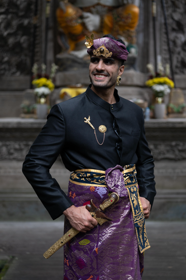

---
social:
  cards_layout_options:
    title: Site Reliability Engineering
description: >-
  Expert SRE & DevOps consultant. 7+ years in Kubernetes, cloud, CI/CD. Boost
  reliability & efficiency. AWS, Azure, Terraform pro. Remote-friendly freelancer.
hide:
  - navigation
  - feedback
comments: false
glightbox: false
---

# About Me

Hi :wave: I am Meysam Azad.

I’m a Senior Site Reliability Engineer with over seven :seven: years of
professional experience around the industry. :nerd:

I was born in Iran :flag_ir:, moved to Turkey :flag_tr: and lived for a year
from 2021-2022.

I'm currently living in Indonesia :flag_id: as of 2022.

<figure markdown="span">
  { width="300" align=left loading=lazy }
  <figcaption>Photo Taken in Bali</figcaption>
</figure>

I married :fontawesome-solid-venus-mars: here to a beautiful girl :princess_tone3: whom I love
:octicons-heart-fill-24:{ .mdx-heart .mdx-insiders }.

I have two dogs :dog: named Ruby :simple-ruby: & Sky.

## Professional Career

I have expertise and experience in the following areas:

- [x] Kubernetes, containerization & serverless (AWS Lambda, Cloudflare
      Workers, etc.)
- [x] Infrastructure as code (IaC) tools, e.g., Terraform, Ansible, etc.
- [x] Cloud providers such as AWS, Azure, Hetzner, etc.
- [x] CI/CD pipelines, e.g., GitHub Actions, Gitlab CI, etc.
- [x] Monitoring & observability tools, e.g., Prometheus, Loki, Grafana, etc.
- [x] GitOps principles and tools, e.g., FluxCD, ArgoCD, etc.

## Outside of Work

Beyond my work, I’m someone who .

- [x] I workout 4-5 times a week in the mornings :man_lifting_weights:.
- [x] I've been practicing and learning piano since 2022 :musical_keyboard:.
- [x] I enjoy reading non-fictions :books:.
- [x] I love riding motorcycles :motorcycle:.
- [x] I enjoy deep conversations about life outside of the daily grind.
- [x] I love to create technical contents, be it Youtube videos or blog posts.

## My Philosophy

I believe in simplicity.

---

## Let’s Connect

I'm available for **consulting and freelance SRE projects**.

Let's discuss how my experience can benefit your team.

Book a call or drop me an email to get started.

[Book a call :material-video:][book-call]{ .md-button .md-button--primary }
[Email :material-email:][email-me]{ .md-button }
[LinkedIn :simple-linkedin:][linkedin]{ .md-button }
[Twitter :simple-x:][twitter]{ .md-button }

[book-call]: https://cal.com/meysam
[email-me]: mailto:meysam@developer-friendly.blog
[linkedin]: https://linkedin.com/in/meysamazad
[twitter]: https://x.com/meysamazing
