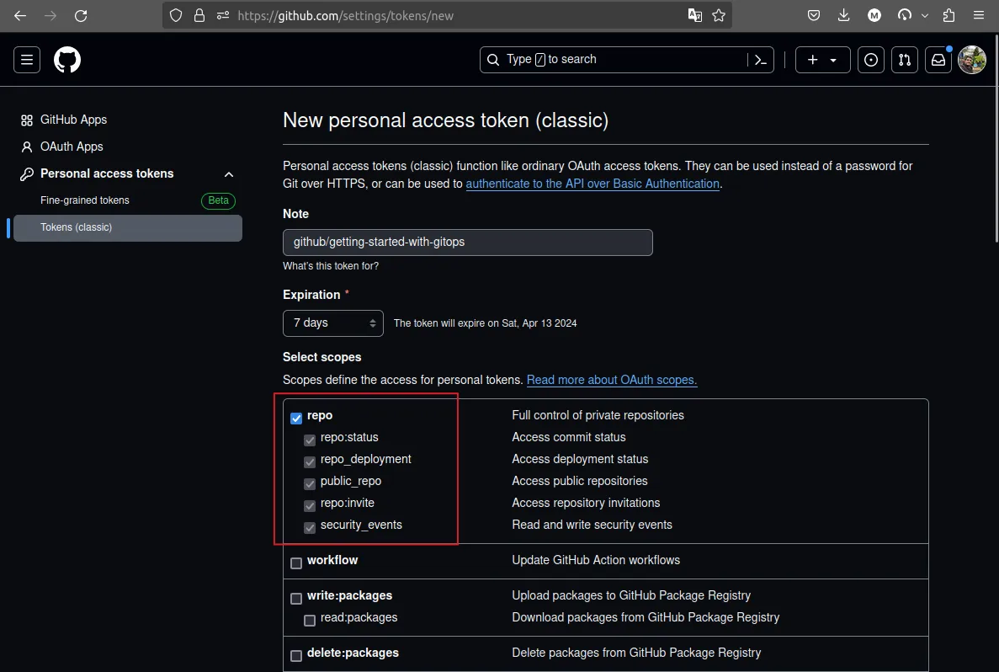

# Getting Started with GitOps and FluxCD

Learn how to leverage your Git repository, the GitOps style, to manage your
Kubernetes cluster with FluxCD. Enhance your delivery and reduce deployment
frictions with GitOps.

<!-- more -->

## Introduction

GitOps is a modern approach to managing infrastructure and applications. It
leverages Git repositories as the source of truth for your infrastructure and
application configurations. By using GitOps, you can automate your deployment
processes, enhance your delivery pipeline, and reduce deployment frictions.

In this guide, we will explore the fundamentals of GitOps and FluxCD. We will
learn how to set up FluxCD in your Kubernetes cluster and automate your
deployments.

## Prerequisites

Before we start, you need to have the following prerequisites:

- [x] A Kubernetes cluster up and running

    * If you feel nerdy and don't mind getting your hands dirty with a bit of
      complexity, you shall find the [Kubernetes the Hard Way][k8s-the-hard-way]
      very helpful.

    * If you don't have the time or the mood to setup a full-fledged Kubernetes
      cluster, you can either use a managed cluster on a cloud provider, spin up
      any of the easy solutions e.g. [Minikube][minikube], [Kind][kind], or
      follow our previous guide to [Setup a production-ready Kubernetes cluster
      using K3s][k3s-setup].

- [x] A Git repository to store your Kubernetes manifests
- [x] FluxCD[^1] binary installed in your `PATH` (`v2.2.3` at the time of writing)
- [ ] Optionally, the GitHub CLI (`gh`)[^2] for easier GitHub operations (
      `v2.47.0` at the time of writing).
- [ ] A basic understanding of [Kustomize][kustomize]. A topic for a future post.

## What is GitOps?

GitOps is a modern approach to managing infrastructure and applications. It
leverages Git repositories as the source of truth for your infrastructure and
application configurations. By using GitOps, you can automate your deployment
processes, enhance your delivery pipeline, and reduce deployment frictions.

!!! quote "GitOps Definition by Wikipedia"

    GitOps evolved from DevOps. The specific state of deployment configuration
    is version-controlled. Because the most popular version-control is Git,
    GitOps' approach has been named after Git. Changes to configuration can be
    managed using code review practices, and can be rolled back using
    version-controlling. Essentially, all of the changes to a code are tracked,
    bookmarked, and making any updates to the history can be made easier. As
    explained by Red Hat, "*visibility to change means the ability to trace and
    reproduce issues quickly, improving overall security.*"[^3]

## What is FluxCD?

FluxCD is a popular GitOps operator for Kubernetes. It automates the deployment
of your applications and infrastructure configurations by syncing them with your
Git repository. FluxCD watches your Git repository for changes and applies them
to your Kubernetes cluster.

## FluxCD Setup & Automation

Bootstrap refers to the initial setup of FluxCD in your Kubernetes cluster.
After which, FluxCD will continuously watch your Git repository for changes and
apply them to your cluster.

One of the benefits of using FluxCD during the bootstrap phase is
that you can even upgrade FluxCD itself using the same GitOps approach, as you
would do with your applications.

That means less manual intervention and more automation, especially if you opt
for an automated FluxCD upgrade process[^4]. I don't know about you, but I
cannot have enough automation in my life :grin:.

???+ info "Automated FluxCD Upgrade"

    Since this will not be the topic of today's post, it's worth mentioning
    as a side note that you can automated the FluxCD upgrade process using the
    power of your CI/CD pipelines.

    For example, you can see a `step` of a GitHub Action workflow that upgrades
    FluxCD to the latest version below (source[^5]):

    ```yaml title=""
    - name: Setup Flux CLI
      uses: fluxcd/flux2/action@main
      with:
        # Flux CLI version e.g. 2.0.0.
        # Defaults to latest stable release.
        version: 'latest'

        # Alternative download location for the Flux CLI binary.
        # Defaults to path relative to $RUNNER_TOOL_CACHE.
        bindir: ''
    ```

## Step 0: Check Pre-requisites

You can check your if your initial setup is acceptable by FluxCD using the
following command:

```shell title="" linenums="0"
flux check --pre
```

### Creating the GitHub Repository

Skip this step if you already have a GitHub repository ready for FluxCD.

**NOTE**: FluxCD will create the repository as part of the bootstrap process.
This step will only give you flexibility for better customization.

You will need GitHub CLI[^2] installed for the following to work.

```bash title="" linenums="0"
gh repo create getting-started-with-gitops --clone --public
cd getting-started-with-gitops
```

### Monitoring

FluxCD bootstrap is able to create any initial resource you place in its bootstrap
path. Which means we will be able to spin up any and all the resources we need
alongside FluxCD with only a single command.

That's why, in the same path to the FluxCD bootstrap, we will create a root
`Kustomization` that will control all the subdirectories and reconcile the
resources as needed.

This will later be used to create the monitoring stack and all the bells and
whistles that come with it.

```yaml title="clusters/dev/k8s.yml"
-8<- "https://github.com/developer-friendly/getting-started-with-gitops/raw/main/clusters/dev/k8s.yml"
```

And the resources that will be managed by this `Kustomization` are as follows:

=== "dev/monitoring/kustomization.yml"
    ```yaml title=""
    -8<- "https://github.com/developer-friendly/getting-started-with-gitops/raw/main/dev/monitoring/kustomization.yml"
    ```

=== "dev/monitoring/namespace.yml"
    ```yaml title=""
    -8<- "https://github.com/developer-friendly/getting-started-with-gitops/raw/main/dev/monitoring/namespace.yml"
    ```

=== "dev/monitoring/repository.yml"
    ```yaml title=""
    -8<- "https://github.com/developer-friendly/getting-started-with-gitops/raw/main/dev/monitoring/repository.yml"
    ```

===+ "dev/monitoring/release.yml"
    ```yaml title=""
    -8<- "https://github.com/developer-friendly/getting-started-with-gitops/raw/main/dev/monitoring/release.yml"
    ```

### Create a GitHub Personal Access Token

We will need a [GitHub Personal Access Token][gh-pat] with the `repo` scope.
You can see token creation screenshot below:

<figure markdown="span">
  { loading=lazy }
  <figcaption>Generating GitHub PAT</figcaption>
</figure>

Use the newly created token for the next step.

## Step 1: Bootstrapping FluxCD

We can now spin up FluxCD in our Kubernetes cluster using the following command:

```shell title="" linenums="0"
export GITHUB_TOKEN="TOKEN_FROM_THE_LAST_STEP"
export GITHUB_ACCOUNT="developer-friendly"
export GITHUB_REPO="getting-started-with-gitops"
flux bootstrap github \
  --owner=${GITHUB_ACCOUNT} \
  --repository=${GITHUB_REPO} \
  --private=false \
  --personal=true \
  --path=clusters/dev
```

It will take a moment or two for everything to reconcile, but after that,
FluxCD will be up and running in your Kubernetes cluster.

### Check the state of the cluster

You can check the status using the following command.

```shell title="" linenums="0"
flux check
```

We can also check the pods, `Kustomization` and `HelmRelease` resources.

```shell title="" linenums="0"
kubectl get pods -A
kubectl get kustomizations,helmreleases -A # ks,hr for short
```

The final status of our loki-stack `HelmRelease` will transition from this:

```shell title="" linenums="0"
Running 'install' action with timeout of 2m0s
```

To this:

```shell title="" linenums="0"
Helm install succeeded for release monitoring/loki-stack.v1 with chart loki-stack@2.10.2
```

## Step 2: Monitoring the Cluster

We now have the monitoring stack up and running in our Kubernetes cluster.
Let's leverage it to deliver our alerts and notifications to the Prometheus
Alertmanager[^7].

In this step we will create a `Provider` for FluxCD to send notifications
and alerts to our in-cluster Alertmanager, after which the admin/operator
can decide how to handle them.

!!! success "Alertmanager Configuration"

    Stay tuned for a future post where we will explore how to configure
    Alertmanager to send notifications to various channels like Slack, Email,
    and more.

=== "dev/notifications/kustomization.yml"
    ```yaml title=""
    -8<- "https://github.com/developer-friendly/getting-started-with-gitops/raw/main/dev/notifications/kustomization.yml"
    ```

=== "dev/notifications/alertmanager-address.yml"
    ```yaml title=""
    -8<- "https://github.com/developer-friendly/getting-started-with-gitops/raw/main/dev/notifications/alertmanager-address.yml"
    ```

===+ "dev/notifications/alertmanager.yml"
    ```yaml title=""
    -8<- "https://github.com/developer-friendly/getting-started-with-gitops/raw/main/dev/notifications/alertmanager.yml"
    ```


[k8s-the-hard-way]: ./0003-kubernetes-the-hard-way.md
[minikube]: https://minikube.sigs.k8s.io/docs/
[kind]: https://kind.sigs.k8s.io/
[k3s-setup]: ./0005-install-k3s-on-ubuntu22.md
[kustomize]: https://kustomize.io/
[gh-pat]: https://github.com/settings/tokens/new

[^1]: https://github.com/fluxcd/flux2/releases/
[^2]: https://cli.github.com/
[^3]: https://en.wikipedia.org/wiki/DevOps#GitOps
[^4]: https://fluxcd.io/flux/installation/upgrade/#upgrade-with-flux-cli
[^5]: https://fluxcd.io/flux/flux-gh-action/
[^6]: https://fluxcd.io/flux/components/notification/
[^7]: https://prometheus.io/docs/alerting/latest/alertmanager/
<!-- [^7]: https://github.com/developer-friendly/getting-started-with-gitops -->
