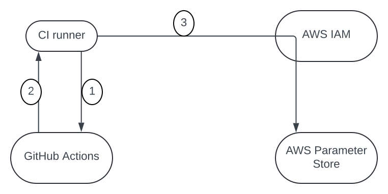
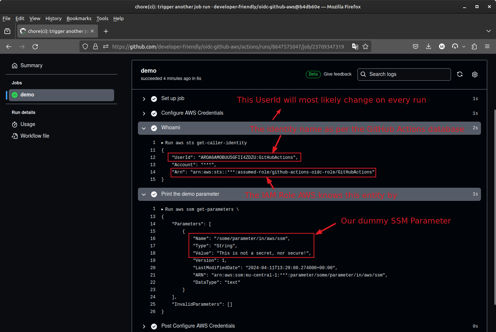

# What is OIDC Authentication? A Practical Guide

Learn what OpenID Connect is and how to use it to grant GitHub Actions access
to your AWS account securely, without needing to store long-lived credentials
outside your AWS account.

<!-- more -->

## Introduction

AWS (and other providers) highly recommend against storing long-lived
credentials outside your AWS account[^1].

The rationale is that those secrets can be compromised and put your account at
risk. On non-extreme cases, you are advised to rotate your credentials and
having to update every credential can be cumbersome when working at scale.

That's where [OpenID Connect (OIDC)](/category/oidc/) comes in.

## What is OpenID Connect?

Let's provide a formal definition first[^2]:

> OpenID Connect is an interoperable authentication protocol based on the
  OAuth 2.0 framework of specifications (IETF RFC 6749 and 6750). It simplifies
  the way to verify the identity of users based on the authentication performed
  by an Authorization Server and to obtain user profile information in an
  interoperable and REST-like manner.

Another great definition is provided by the Mozilla[^3]:

> OpenID Connect (OIDC) is a protocol that allow web applications (also called
  relying parties, or RP) to authenticate users with an external server called
  the OpenID Connect Provider (OP). This server typically gets user information
  from an identity provider (IdP), which is a database of user credentials and
  attribute information.

> The communication with the OpenID Connect Provider (OP) is done using tokens.
  An ID token is provided to the web application (RP) by the Open ID Connect
  Provider (OP) once the user has authenticated. It contains a JSON document
  which informs the web application (RP) about how, when the user has
  authenticated, various attributes, and for how long the user session can be
  trusted. This token can be re-newed as often as necessary by the web
  application (RP) to ensure that the user and its attributes are both valid
  and up to date.

Now, at least the first definition is too formal for my non-native English
speaker brain. Let's simplify it a bit to understand what it means.

## Simplified Explanation With an Example

In this guide, we will cover a practical example. Let's break down the
requirements of this scenario:

- [x] The requirement for this scenario is to allow GitHub Actions' job(s) running
in a specific repository to access AWS Parameter Store securely. This may be
the repository of your infrastructure or your applications trying to read the
secure secrets from AWS Parameter Store and passing them to runner.
- [x] The hard requirement for our scenario is to avoid storing any credentials
in GitHub Secrets and use OIDC mechanism to authenticate the runner jobs to the
AWS services instead.

<figure markdown="span">
  { loading=lazy }
  <figcaption>GitHub Actions runner talking to AWS Parameter Store</figcaption>
</figure>

Let's break down what's happening in the diagram above:

1. The CI runner authenticates itself to GitHub Actions identity server and
fetches an access token.
2. The runner will use the access token for the next step to talk to AWS API.
3. The AWS IAM will verify the access token to make sure the trusted identity
provider has issued it. If so, the request will be granted access to the AWS SSM.

With that in mind, let's simplify the definitions above with our example.

- The *user* (1) is the entity trying to access a service, e.g., a runner job in
GitHub Actions trying to access the services of AWS.
{ .annotate }

    1.  As in, it is using the services of the service provider, hence, the
        user.

- The service provider is the service the user is trying to access, e.g.,
AWS Parameter Store.
- The Open ID Connect identity provider is the service that authenticates the
user, e.g., GitHub Actions (1). It can be a separate entity from the Identity
Provider, but in our case, it is the same.
{ .annotate }

    1.  GitHub Actions is an identity provider to each of the jobs running inside
        GitHub Actions. This identity provider implements the OIDC protocol
        and is indeed an OIDC comptabile service.

!!! success "OIDC Compatibility"

    A hard requirement on implementing and adopting OIDC as an authentication
    mechanism is that both the service provider and the identity provider must
    support OIDC. In other words, they should be OIDC compatible and implement
    the corresponding RFCs[^4].

???+ abstract "SAML vs. OIDC"

    SAML (Security Assertion Markup Language) is another protocol that is used
    for authentication. The main difference between SAML and OIDC is that SAML
    was initially designed for single sign-on (SSO) and is XML-based, whereas
    OIDC is JSON-based and is more modern and flexible with a more focus on
    authentication for modern [mobile] applications [^5].

    OIDC is built on top of OAuth2 and is more modern and flexible than SAML.

    On a personal note, I would rather the JSON-based OIDC than the XML-based.
    But, since that protocol is usually the reponsibility of my upstream
    services, I rarely care how they talk to each other and just use the
    proper tool to address the problem at hand.

When the runner job tries to access AWS Parameter Store, it needs to
authenticate itself to GitHub Actions. After the authentication, it will have an
access token, using which it can access AWS Parameter Store that is protected
behind AWS IAM.

Presenting that access token to AWS IAM, and the verification of that token is
the crux of the OIDC mechanism.

In essence, the IAM will verify the access token before allowing
the runner job to access the AWS Parameter Store. The verfication of the
access token happens behind the scenes with the public key provided at the
`/.well-known/openid-configuration` endpoint of the identity provider.

To elaborate further, the AWS IAM will fetch the public key from the URL in the
GitHub Action's `/.well-known/openid-configuration` JWK endpoint and using that
public key, verifies the signature of the access token. If the signature is
valid, the IAM will allow the runner job to access the AWS Parameter Store.

If we try it locally, we will get the following output:

```shell title="" linenums="0"
curl -s \
  https://token.actions.githubusercontent.com/.well-known/openid-configuration \
  | tee github-oidc-endpoint.json
```

??? example "github-oidc-endpoint.json"

    ```json title=""
    -8<- "docs/codes/0007/github-oidc-endpoint.json"
    ```

```shell title="" linenums="0"
curl -s \
  https://token.actions.githubusercontent.com/.well-known/jwks \
  | tee github-oidc-jwks.json
```

??? example "github-oidc-jwks.json"

    ```json title=""
    -8<- "docs/codes/0007/github-oidc-jwks.json"
    ```

This process can numb your brain if you're new to OIDC. But the idea is
straightforward: some other services keep the username-password (GitHub
Actions) and will generate access token for it to authenticate to other services
(AWS SSM).

## Why use OpenID Connect?

Among countless obvious and non-obvious reasons, here are a few, and by no means
exhaustive:

- You can use one identity provider for all your services and not creating
multiple accounts for each service in each environment.
- You never have to store long-lived credentials and take the overhead of
rotating them (1).
{ .annotate }

    1.  Have you seen the following before? It's wrong. Don't do it!

        ```yaml title=""
        - name: Configure AWS Credentials
          uses: aws-actions/configure-aws-credentials@v4
          with:
            aws-access-key-id: ${{ secrets.AWS_ACCESS_KEY_ID }}
            aws-secret-access-key: ${{ secrets.AWS_SECRET_ACCESS_KEY }}
            aws-region: us-east-2
        ```

- You can have a centralized place to manage your users and their permissions.
This works better at scale.

## OpenID Connect in Practice

Based on the foundations we laid above, let's see how we can use OpenID Connect
in a practical scenario. This gives a good chance to fully understand the
concepts we discussed so far.

In the rest of this guide, we will implement the scenario we have discussed
above and try to grant GitHub Actions runners access to AWS Parameter Store
without passing any access-key and secret-key to the runner jobs.

### OIDC Provider

To start with, you need to create an OIDC identity provider in your AWS
account[^6].

```hcl title="versions.tf"
-8<- "docs/codes/0007/previous-versions/versions.tf"
```

```hcl title="main.tf"
-8<- "docs/codes/0007/main.tf"
```

Applying this TF code is quite simple:

```shell title="" linenums="0"
export AWS_PROFILE="PLACEHOLDER"
tofu plan -out tfplan
tofu apply tfplan
```

### IAM Role

We have created the Identity Provider in AWS. That is the service
that will authenticate the runner jobs and issues the access token to them.

However, within the AWS IAM, we need to authorize the identities of the
aforementioned identity provider to access the AWS SSM. That is done using the
AWS IAM role and IAM policy.

???+ question "What is AWS IAM Role?"

    IAM Role is a really powerful concept in identity and access management
    within AWS. It allows you to delegate access to specific roles and restrict
    the access of who can assume that role, that is, the trusted entity/entities.

    This will allow for a more granular access control and better security
    posture.

    The credentials of IAM role are temporary and rotated automatically by AWS.
    In essence, the risk of having long-lived credentials is mitigated and you
    can still access the AWS services securely.

    AWS recommends using IAM roles over long-lived credentials whenever
    possible[^7].

To create the IAM role, we use the following TF code:

```hcl title="variables.tf"
-8<- "docs/codes/0007/previous-versions/variables.tf"
```

```hcl title="iam.tf" hl_lines="14 18-19 24-25"
-8<- "docs/codes/0007/iam.tf"
```

Applying this code is as before. But let's explain the highlights of this TF
code.

1. The audience of the IAM role ensures that the runner job's token is only
valid if talking to the `sts.amazonaws.com` service. There are other services
within AWS and restricting it will enhance the security posture.
2. The conditional for subject on line 24 ensures that only the runner jobs in
the specified repository are allowed to assume the role and none other.
3. The attached managed policy (line 34) is tailored to our scenario. Your
requiments may vary; you can also attach custom policies to the IAM role.

The final IAM role will have a trusted policy **similar** to this[^6]:

```json title=""
{
  "Version": "2012-10-17",
  "Statement": [
    {
      "Effect": "Allow",
      "Principal": {
        "Federated": "arn:aws:iam::123456123456:oidc-provider/token.actions.githubusercontent.com"
      },
      "Action": "sts:AssumeRoleWithWebIdentity",
      "Condition": {
        "StringLike": {
          "token.actions.githubusercontent.com:sub": "repo:octo-org/octo-repo:*"
        },
        "StringEquals": {
          "token.actions.githubusercontent.com:aud": "sts.amazonaws.com"
        }
      }
    }
  ]
}
```

Before we move on to the GitHub side, let's also create a sample secret in the
AWS Parameter Store so that we can later fetch that value for testing.

We would also create the necessary GitHub Variables to be used inside the
CI workflow definition later on.

```hcl title="variables.tf" hl_lines="11-14"
-8<- "docs/codes/0007/variables.tf"
```

```hcl title="versions.tf" hl_lines="13-16 20-22"
-8<- "docs/codes/0007/versions.tf"
```

```hcl title="ssm.tf"
-8<- "docs/codes/0007/ssm.tf"
```

```hcl title="github.tf"
-8<- "docs/codes/0007/github.tf"
```

Applying the above TF files will require you to have the GitHub CLI installed
and authenticated[^8].

If you don't want to install the extra binary on your system, you can also
pass a GitHub Personal Access Token (PAT) as specified in the docs[^9].

### GitHub Actions Workflow

We have prepared everything from AWS & GitHub side. Now, it's time to trigger
a workflow in the said repository and test if it is able to read the secrets
from AWS Parameter Store.

```yaml title=".github/workflows/ci.yml" hl_lines="12"
-8<- "https://github.com/developer-friendly/oidc-github-aws/raw/v0.1.0/.github/workflows/ci.yml"
```

What's important here is that we are not passing in any credentials to the
workflow; there is no AWS access-key and secret-key anywhere, nor do we store
such values in GitHub Secrets.

It takes away the maintenance of secret rotation and also allows us not to worry
about the authentication process as that is happening by the two services, i.e.,
the GitHub Actions as the OIDC provider and the AWS as the service provider.

This, in effect, means that any runner job inside the said repository will get
the access token from GitHub Actions and use that to authenticate to AWS IAM.
Which also means that no matter which disposable environment the runner job is in
and how many times it has run, it will always be able to access the AWS SSM
without any manual intervention.

That is the true power of adopting OIDC as an authentication mechanism.

The successful CI job run will look like this:

<figure markdown="span">
  { loading=lazy }
  <figcaption>Successful GitHub Actions CI run</figcaption>
</figure>

You will notice that the caller ID ARN has an `assumed-role` in it. This is
what it means to grab the temporary credentials from the IAM role and use them
to access the AWS services.

You can also notice the `UserId` which is the name assigned to the runner job
by the GitHub Actions identity provider. For the record, AWS has no username
representing that identifier, but only because it trusts the recently added
identity provider, it acknowledges the request as being valid and grants access.

## Bonus: CloudTrail Logs

We have done all the required steps to authenticate and grant access to the
runner job in GitHub Actions to access the AWS Parameter Store.

Let's take a look at the CloudTrail logs to see the successful request and
response.

??? example "Click to see more"

      ```json title="" hl_lines="20-25 37-38"
      -8<- "docs/codes/0007/cloudtrail-ci-log.json"
      ```

Notice the principal ID and the assumed role ARN in the log is the same as what
we saw in the CI job run. This confirms that the authentication has been
successful and the identity provider and the service provider were able to
work together to grant access to the runner job.

## Conclusion

That concludes are tutorial on OpenID Connect and how to use it to authenticate
GitHub Actions runner jobs to access AWS services securely.

On a day to day operations job, you will find yourself needing to grant access
from one one service to another. OpenID Connect (OIDC) is the modern-day
solution to this problem. It has a neat approach to handle authentication that
won't require any long-lived credentials, yet still be flexible enough for you
to define a granular access control on the service provider side.

I am guilty of passing long-lived credentials in the past, but I am glad that
with this new finding, I can alter my past and current workflows for a more
secure and robust and yet less overhead approach.

I hope you too can find spots in your workflows where you can adopt OIDC and
make your services more secure and flexible.

Thanks for reading thus far, *ciao*, and till next time! :saluting_face:


[^1]: https://docs.aws.amazon.com/IAM/latest/UserGuide/id_roles_providers_oidc.html
[^2]: https://openid.net/developers/how-connect-works/
[^3]: https://infosec.mozilla.org/guidelines/iam/openid_connect.html#oidc-in-a-nutshell
[^4]: https://openid.net/specs/openid-connect-core-1_0.html
[^5]: https://www.onelogin.com/learn/oidc-vs-saml
[^6]: https://docs.github.com/en/actions/deployment/security-hardening-your-deployments/configuring-openid-connect-in-amazon-web-services#adding-the-identity-provider-to-aws
[^7]: https://docs.aws.amazon.com/IAM/latest/UserGuide/id_roles.html
[^8]: https://cli.github.com/manual/gh_auth_login
[^9]: https://registry.terraform.io/providers/integrations/github/6.2.0/docs#authentication
