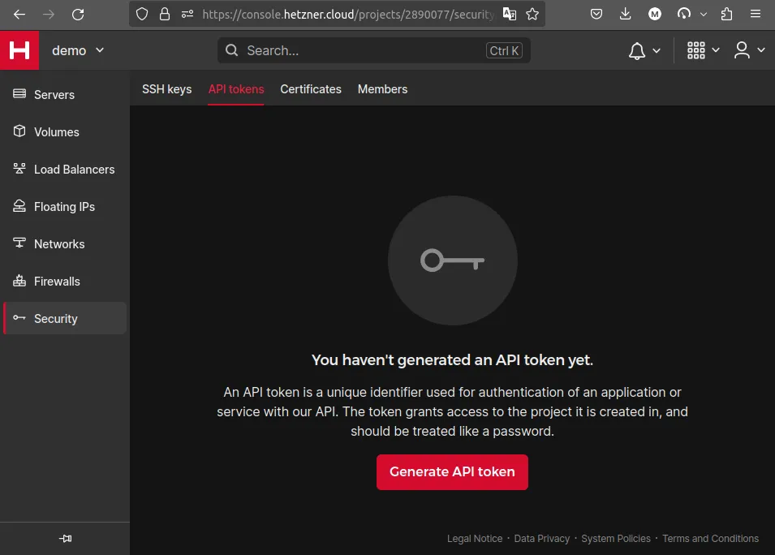
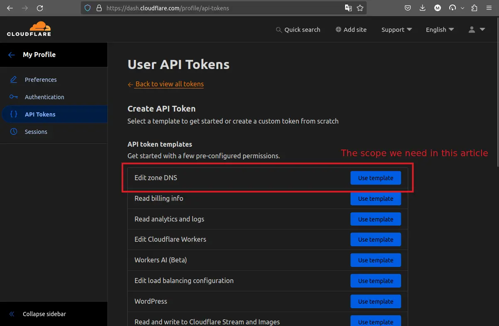

# Grant Kubernetes Pods Access to AWS Services Using OpenID Connect

Learn how to establish a trust relationship between a Kubernetes cluster and
AWS IAM to grant cluster generated Service Account tokens access to AWS
services using OIDC & without storing long-lived credentials.

<!-- more -->

## Introduction

In our [previous post](./0007-oidc-authentication.md), we discussed what
OpenID Connect (OIDC) is and how to use it to authenticate identities from one
system to another.

We covered why it is crucial to avoid storing long-lived
credentials and the benefits of employing OIDC for the task of authentication.

If you haven't read that one already, here's a recap:

- [x] OIDC is an authentication protocol that allows the identities in one system
      to authenticate to another system.
- [x] It is based on OAuth 2.0 and JSON Web Tokens (JWT).
- [x] Storing long-lived credentials is risky and should be avoided at all cost
      if possible.
- [x] OIDC provides a secure way to authenticate identities without storing
      long-lived credentials.
- [x] It is widely used in modern applications and systems.
- [x] The hard requirements is that both the Service Provider and the Identity
      Provider must be OIDC compliant.
- [x] With OIDC you will only keep the identities and their credentials in one
      system and authenticate them to another system without storing any
      long-lived credentials. The former is called the ^^Identity Provider^^ and
      the latter is called the ^^Service Provider^^.

We also covered a practical example of authenticating GitHub runners to AWS IAM
by establishing a trust relationship between GitHub and AWS using OIDC.

In this post, we will take it one step further and provide a way for the pods
of our Kubernetes cluster to authenticate to AWS services using OIDC.

This post will provide a walkthrough of granting such access to a
bare-metal Kubernetes cluster (k3s[^1]) using only the power of OpenID Connect
protocol. In a later post, we'll show you how easy it is to achieve the same
with a managed Kubernetes cluster like Azure Kubernetes Service (AKS)[^2].
But, first let's understand the fundamentals by trying it on a bare-metal
cluster.

We will not store any credentials in our pods and as such, won't ever have to
worry about other security concerns such as secret rotations!

With that intro out of the way, let's dive in!

## Prerequisites

Make sure you have the following prerequisites in place before proceeding:

- [x] A Kubernetes cluster that can be exposed to the internet. (1)
      { .annotate }

      1.  A local Kubernetes cluster will do, however, you will need to expose
          the required endpoints to the internet. This can be done using a
          service like ngrok[^3].

          Not the topic of today's post!

- [x] An AWS account to create an OIDC provider and IAM roles.
- [x] A verified root domain name that YOU own. Skip this if you're using a
      managed Kubernetes cluster.
- [x] OpenTofu v1.6[^4]
- [x] Ansible v2.16[^5]

## Roadmap

Let's see what we are trying to achieve in this guide.

Our end goal is to create an Identity Provider (IdP) in AWS[^6].
After doing so, we will be able to create an IAM Role[^7] with a trust relationship
to the IdP.

**Ultimately, the pods in our Kubernetes cluster that have the
desired Service Account(s)[^8] will be able to talk to the AWS
services**.

To achieve this, and as per the OIDC specification, the following endpoints
must be exposed through an
HTTPS endpoint with a verified TLS certificate[^9]:

- `/.well-known/openid-configuration`: This is a MUST for OIDC compliance.
- `/openid/v1/jwks`: This is configurable through the first endpoint as you'll
  see later.

These endpoints provide the information of the OIDC provider and the public
keys used to sign the JWT tokens, respectively. The former will be used by the
service provider to ^^validate the OIDC provider^^ and the latter will be used
to ^^validate the JWT access tokens^^ provided by the entities that want to
talk to the Serivce Provider.

!!! tip "Service Provider"

    Service Provider refers to the host that provides the service. In our
    example, AWS is the service provider.

Exposing such endpoints will make our OIDC provider compliant with the OIDC
specification. In that regard, any OIDC compliant service provider will be able
to trust our OIDC provider.

!!! tip "OIDC Compliant"

    For an OIDC provider and a Service Provider to trust each other, they must
    both be OIDC compliant. This means that the OIDC provider must expose
    certain endpoints and the Service Provider must be able to validate the
    OIDC provider through those endpoints.

In practice, we will need the following two absolute URLs to be accessible
publicly through internet with a verified TLS certificate signed by a trusted
Certificate Authority (CA):

- `https://mydomain.com/.well-known/openid-configuration`
- `https://mydomain.com/openid/v1/jwks`

Again, and just to reiterate, as per the OIDC specification the HTTPS is a must
and the TLS certificate has to be signed by a trusted Certificate
Authority (CA).

When all this is set up, we shall be able to add the `https://mydomain.com` to
the AWS as an OIDC provider.

## Step 0: Directory Structure

There are a lot of codes we will cover in this post. It is good to know that
to expect. Here's the layout of the directories we will be working with:

<div class="annotate" markdown>
```plaintext title="" linenums="0"
.
├── ansible.cfg
├── app/(1)
├── configure-oidc/(2)
├── inventory/(3)
├── k8s/(4)
├── playbook.yml(5)
├── provision-k8s/(6)
├── requirements.yml(7)
└── vars/(8)
```
</div>

1. Ansible role to test out the setup in the end.
2. TF files that will create OIDC provider in AWS after the `provision-k8s`
   stack is applied.
3. Inventory files for Ansible to use. The TF files in `provision-k8s` will
   create the inventory files.
4. Ansible role to bootstrap the Kubernetes cluster. Including the Cilium CNI
   installation, TLS certificate fetching and the static web server setup.
5. Our main playbook and the Ansible entrypoint for all the tasks we do against
   the target `inventory`.
6. The starting point for this guide begins here where we provision a server
   in Hetzner Cloud and spin up a lightweight Kubernetes cluster using `k3s`.
7. The Ansible collection requirements file.
8. The host-specific variables that will be used in the Ansible tasks.

## Step 1: Dedicated Domain Name

As mentioned, we need to assign a dedicated domain name to the OIDC provider.
This will be the address we will add to the AWS IAM as an Identity Provider.

Any DNS provider will do, but for our example, we're using Cloudflare.

```hcl title="provision-k8s/variables.tf"
-8<- "docs/codes/0008/junk/v0/variables.tf"
```

```hcl title="provision-k8s/versions.tf"
-8<- "docs/codes/0008/junk/v0/versions.tf"
```

```hcl title="provision-k8s/network.tf"
-8<- "docs/codes/0008/provision-k8s/network.tf"
```

```hcl title="provision-k8s/dns.tf"
-8<- "docs/codes/0008/provision-k8s/dns.tf"
```

```hcl title="provision-k8s/outputs.tf"
-8<- "docs/codes/0008/junk/v0/outputs.tf"
```

We would need the required access token which you can get from their respective
account settings. If you want to apply the stack, you will need a Cloudflare
token[^10] and a Hetzner API token[^11].

??? example "Get Hetzner Cloud API Token"

      <figure markdown="span">
        { loading=lazy }
        <figcaption>Get Hetzner Cloud API Token</figcaption>
      </figure>

??? example "Get Cloudflare API Token"

      <figure markdown="span">
        { loading=lazy }
        <figcaption>Get Cloudflare API Token</figcaption>
      </figure>

```shell title="" linenums="0"
export TF_VAR_cloudflare_api_token="PLACEHOLDER"
export TF_VAR_hetzner_api_token="PLACEHOLDER"

tofu plan -out tfplan
tofu apply tfplan
```

## Step 2: A Live Kubernetes Cluster

At this point, we should have a live Kuberntes cluster. We've already covered
how to set up a [lightweight Kubernetes cluster on a Ubuntu 22.04 machine](./0005-install-k3s-on-ubuntu22.md)
before and so, we won't go too deep into that.

But for the sake of completeness, we'll resurface the code one more time, with
some minor tweaks here and there.

```hcl title="provision-k8s/variables.tf" hl_lines="28-36"
-8<- "docs/codes/0008/provision-k8s/variables.tf"
```

```hcl title="provision-k8s/versions.tf" hl_lines="15-22"
-8<- "docs/codes/0008/junk/v1/versions.tf"
```

```hcl title="provision-k8s/server.tf" hl_lines="47-48"
-8<- "docs/codes/0008/provision-k8s/server.tf"
```

```hcl title="provision-k8s/firewall.tf"
-8<- "docs/codes/0008/provision-k8s/firewall.tf"
```

```hcl title="provision-k8s/outputs.tf" hl_lines="9-34"
-8<- "docs/codes/0008/provision-k8s/outputs.tf"
```

Notice the lines where we specify the OIDC issuer URL & JWK URL for the
Kubernetes API server to be a publicly accessible address and
pass it as an argument to the `k3s` server.

```shell title="provision-k8s/server.tf" linenums="47"
-8<- "docs/codes/0008/provision-k8s/server.tf:47:48"
```

If not specified, the rest of this
guide won't work and additional configuration is required. In summary, these
are the URLs that will be used by the Service Provider when trying to verify
the OIDC provider & the access tokens of the Service Accounts.

Business as usual, we apply the stack as below.

```shell title="" linenums="0"
tofu plan -out tfplan
tofu apply tfplan
```

And for connecting to the machine:

```shell title="" linenums="0"
tofu output -raw ssh_private_key > ~/.ssh/k3s-cluster
chmod 600 ~/.ssh/k3s-cluster

IP_ADDRESS=$(tofu output -raw public_ip)
ssh -i ~/.ssh/k3s-cluster k8s@$IP_ADDRESS
```

To be able to use the Ansible playbook in the next steps, we shall write the
inventory where Ansible expects them.

??? example "ansible.cfg"
    ```ini title="" hl_lines="8"
    -8<- "docs/codes/0008/ansible.cfg"
    ```

```shell title="" linenums="0"
mkdir -p ../inventory/group_vars
tofu output -raw ansible_inventory_yaml > ../inventory/k3s-cluster.yml
tofu output -raw ansible_vars > ../inventory/group_vars/all.yml
```

??? example "`ansible-inventory --list`"
    ```json title=""
    -8<- "docs/codes/0008/junk/outputs/ansible-inventory-list.json"
    ```

At this stage we're ready to move on to the next step.

## Step 3: Bootstrap the Cluster

At this point we have installed the Cilium binary in our host machine, yet we
haven't installed the CNI plugin in our Kubernetes cluster.

Let's create an Ansible role and a playbook to take care of all the Day 1 operations.

```shell title="" linenums="0"
ansible-galaxy init k8s
touch playbook.yml
```

The first step is to install the Cilium CNI.

```yaml title="k8s/defaults/main.yml"
-8<- "docs/codes/0008/junk/v1/k8s-defaults-main.yml"
```

```yaml title="k8s/tasks/cilium.yml"
-8<- "docs/codes/0008/k8s/tasks/cilium.yml"
```

```yaml title="k8s/tasks/main.yml"
-8<- "docs/codes/0008/junk/v1/k8s-tasks-main.yml"
```

```yaml title="playbook.yml"
-8<- "docs/codes/0008/junk/v1/playbook.yml"
```

To run the playbook:

```shell title="" linenums="0"
ansible-playbook playbook.yml
```

## Step 4: Fetch the TLS Certificate

At this point, we need a CA verified TLS certificate for the domain name we
created in the first step.

We will carry our tasks with Ansible throughout the entire Day 1 to Day n
operations.

```yaml title="k8s/defaults/main.yml" hl_lines="3"
-8<- "docs/codes/0008/junk/v2/k8s-defaults-main.yml"
```

```jinja title="k8s/templates/wellknown-server.service.j2"
-8<- "docs/codes/0008/k8s/templates/wellknown-server.service.j2"
```

```yaml title="k8s/handlers/main.yml"
-8<- "docs/codes/0008/junk/v1/k8s-handlers-main.yml"
```

```yaml title="k8s/tasks/certbot.yml"
-8<- "docs/codes/0008/k8s/tasks/certbot.yml"
```

```yaml title="k8s/tasks/main.yml" hl_lines="6-9"
-8<- "docs/codes/0008/junk/v2/k8s-tasks-main.yml"
```

```yaml title="playbook.yml" hl_lines="6-7"
-8<- "docs/codes/0008/junk/v2/playbook.yml"
```

???+ success "Certificate Renewal"

    Although not required, one of the benefits of using `certbot` for
    TLS certificates is the ease of renewal.

    After your initial `certbot` command, you will find the following two
    `systemd` files in your system.

    ```ini title="/lib/systemd/system/certbot.service"
    -8<- "docs/codes/0008/junk/outputs/certbot.service"
    ```

    ```ini title="/lib/systemd/system/certbot.timer"
    -8<- "docs/codes/0008/junk/outputs/certbot.timer"
    ```

    Although on the same host, you will find a crontab entry for the `certbot`
    as you see below:

    ```plaintext title="/etc/cron.d/certbot"
    -8<- "docs/codes/0008/junk/outputs/certbot-crontab"
    ```

    All of these files are created by the `certbot` binary during the initial
    run. You are free to modify and customize it, although it's unlikely that
    you will need to.

After adding another task to our Ansible role, we can run the new tasks with
the following command:

```shell title="" linenums="0"
ansible-playbook playbook.yml --tags certbot
```

## Step 5: Expose OIDC Configuration to the Internet

We've prepared all these works so far for this next step.

In here, we will fetch the OIDC configuration from the Kubernetes API server
and expose them to the internet on HTTPS using the newly acquired TLS
certificate with the help of static web server[^12].

```yaml title="k8s/defaults/main.yml" hl_lines="4-5"
-8<- "docs/codes/0008/k8s/defaults/main.yml"
```

```yaml title="k8s/handlers/main.yml" hl_lines="7-16"
-8<- "docs/codes/0008/k8s/handlers/main.yml"
```

```jinja title="k8s/templates/static-web-server.service.j2"
-8<- "docs/codes/0008/k8s/templates/static-web-server.service.j2"
```

```yaml title="k8s/tasks/static-server.yml" hl_lines="45-46 53-54 61-62"
-8<- "docs/codes/0008/k8s/tasks/static-server.yml"
```

```yaml title="k8s/tasks/main.yml" hl_lines="10-13"
-8<- "docs/codes/0008/k8s/tasks/main.yml"
```

```yaml title="vars/aarch64.yml"
-8<- "docs/codes/0008/vars/aarch64.yml"
```

```yaml title="playbook.yml" hl_lines="4 8-9"
-8<- "docs/codes/0008/junk/v3/playbook.yml"
```

Running this will be as follows:

```shell title="" linenums="0"
ansible-playbook playbook.yml --tags static-web-server
```

You can notice that we have turned on fact gathering in this step. This is due
to our desire to include host-specific variables as you see with `vars_files`
entry.

From the above tasks, there are references to a couple of important files.
One is the `static-web-server-prepare` which has both a `service` file as well
as a `timer` file.

This gives us flexibility to define `oneshot` services which
will only run to completion on every tick of the `timer`. Effectively, we'll
be able to separate the executable task and the scheduling of the task.

The definitions for those files are as following:

```jinja title="k8s/templates/static-web-server-prepare.sh.j2"
-8<- "docs/codes/0008/k8s/templates/static-web-server-prepare.sh.j2"
```

Notice how we are manually fetching the OIDC configurations from the Kubernetes
as well as the TLS certificate. This is due to a possibility of renewal for
any of the given files:

1. Firstly, the Kubernetes API server might rotate its Service Account issuer
   key pair and with that, the JWKs URL will have different output.
2. Secondly, the TLS certificate will be renewed by `certbot` in the background
   and we have to keep up with that.

Now, let's take a look at our preparation service and timer definition.

```jinja title="k8s/templates/static-web-server-prepare.service.j2" hl_lines="10"
-8<- "docs/codes/0008/k8s/templates/static-web-server-prepare.service.j2"
```

```jinja title="k8s/templates/static-web-server-prepare.timer.j2"
-8<- "docs/codes/0008/k8s/templates/static-web-server-prepare.timer.j2"
```

Notice that the service file specifies the working directory for the script.
Which means the `static-web-server-prepare` shell script will be executed in
the specified directory.

Also, watch out for `oneshot` systemd service type. These services are not
long-running processes in an infitie loop. Instead, they will run to completion
and the systemd will not report their state as `Active` as it would with
`simple` services[^13].

## Step 6: Add the OIDC Provider to AWS

That's it. We have done all the hard work. Anything after this will be a breeze
compared to what we've done so far as you shall see shortly.

Now, we have a domain name that is publishing its OIDC configuration and JWKs
over the HTTPS endpoint and is ready to be used as a trusted OIDC provider.

All we need right now, is a couple of TF resource in the AWS account and after
that, we can test the setup using a sample Job that takes a Service Account
in its definition and uses its token to talk to AWS.

Note that we're starting a new TF module below.

```hcl title="configure-oidc/versions.tf"
-8<- "docs/codes/0008/configure-oidc/versions.tf"
```

```hcl title="configure-oidc/main.tf"
-8<- "docs/codes/0008/configure-oidc/main.tf"
```

```hcl title="configure-oidc/oidc_provider.tf"
-8<- "docs/codes/0008/configure-oidc/oidc_provider.tf"
```

Let's apply this stack:

```shell title="" linenums="0"
export AWS_PROFILE="PLACEHOLDER"

tofu plan -out tfplan
tofu apply tfplan
```

Believe it or not, but after all these efforts, it is finally done.

Now it is time for the test.

In order to be able to assume a role from inside a pod of our cluster, we will
create a sample IAM Role with a trust relationship to the OIDC provider we just
created.

```hcl title="configure-oidc/iam_role.tf" hl_lines="18 21 27 30"
-8<- "docs/codes/0008/configure-oidc/iam_role.tf"
```

```hcl title="configure-oidc/outputs.tf"
-8<- "docs/codes/0008/configure-oidc/outputs.tf"
```

The AWS IAM Role trust relationship will look something like this:

```json title="AWS IAM Role Trust Relationship"
-8<- "docs/codes/0008/junk/outputs/aws-iam-role-trust-relationship.json"
```

This, of course, shouldn't come as a surprise. We have already seen this in the
TF definition above.

## Step 7: Test the Setup

We have created the IAM Role with the trust relationship to the OIDC provider
of the cluster. With the conditional in the AWS IAM Role you se in the previous
step, only the Service Accounts with the specified audience, in the `default`
namespace and with the Service Account name `demo-service-account` will be able
to assume the role.

That said, let's use create another Ansible role to create a Kuberentes Job.

```shell title="" linenums="0"
ansible-galaxy init app
```

We will need the Kubernetes core Ansible collection, so let's install that.

```yaml title="requirements.yml"
-8<- "docs/codes/0008/requirements.yml"
```

```shell title="" linenums="0"
ansible-galaxy collection install -r requirements.yml
```

```yaml title="app/defaults/main.yml"
-8<- "docs/codes/0008/app/defaults/main.yml"
```

```yaml title="app/templates/manifest.yml" hl_lines="43-44 49 53-60"
-8<- "docs/codes/0008/app/templates/manifest.yml"
```

```yaml title="app/tasks/main.yml"
-8<- "docs/codes/0008/app/tasks/main.yml"
```

```yaml title="playbook.yml" hl_lines="14-44"
-8<- "docs/codes/0008/playbook.yml"
```

A few important notes are worth mentioning here:

<div class="annotate" markdown>
1. The second playbook is tagged with `never`. That is because there is a
dependency on the second TF module. We have to manually resolve it before being
able to run the second playbook. As soon as the dependency is resolved, we can
run the second playbook with the `--tags test` flag.
2. There is a fact gathering in the `pre_task` of the second playbook. That is,
again, because of the dependency to the TF module. We will grab the output of
the TF module and pass it to our next role. If you notice there is a
`aws_region` variable in the Jinja template that is being initialized by this
fact gathering step. (1)
3. In the fact gathering step, there is an Ansible delegation happening. This
will ensure that the task is running in our own machine and not the target
machine. The reason is that the TF module and its TF state file is in our local
machine. We also do not need the `become` and as such it is turned off.
4. You will notice that the job manifest is using AWS CLI Docker image. By
specifying some of the expected environment variables[^14], we
are able to use the AWS CLI without the requirement of manual `aws configure`.
</div>

1. These two steps:
   ```yaml title="playbook.yml" linenums="29"
   -8<- "docs/codes/0008/playbook.yml:29:39"
   ```


This playbook can be run after the second TF module with the following command:

```shell title="" linenums="0"
ansible-playbook playbook.yml --tags test
```

When checking the logs of the deployed Kubernetes Job, we can see that it has
been successful.

???+ example "`kubectl logs job/demp-app`"

    There is no AWS SSM Parameter in the target AWS account and as such, the
    AWS CLI will not return an empty list; it will return nothing!

    ```json title=""
    -8<- "docs/codes/0008/junk/outputs/kubectl-logs-job-demo-app.json"
    ```

Lastly, to test if the Service Account and the IAM Role trust policy plays any
role in any of this, we can remove the `serviceAccountToken` and try to recreate
the job.

The output is as expected:

```plaintext title="" linenums="0"
An error occurred (AccessDenied) when calling the AssumeRoleWithWebIdentity operation: Not authorized to perform sts:AssumeRoleWithWebIdentity
```

That's all folks! We can now wrap this up.

## Bonus: JWKs URL

Remember at the beginning of this guide when we mentioned that the JWKs URL is
configurable through the OIDC configuration endpoint?

Let's see it in action.

```shell title=""
DOMAIN=$(grep domain_name inventory/group_vars/all.yml | awk '{print $2}')
curl https://$DOMAIN/.well-known/openid-configuration | jq -r .jwks_uri
```

This means that you can host your JWKs on a different server than the OIDC
server. Although I don't suggest this to be a good idea because of all the
maintenance overhead.

That said, if your JWKs URL is at a different server or hosted on a different
endpoint, all you gotta do, is pass the value to the `kube-apiserver` as
you see below:

```shell title="" linenums="0"
kube-apiserver --service-account-jwks-uri=https://mydomain.com/some/different/endpoint
```

## Conclusion

OpenID Connect is one of the most powerful protocols that powers the internet.
Yet, it is so underestimated and easily overlooked. If you look closely enough
on any system around you, you will see a lot of practical applications of OIDC.

One of the cues that you can look for when trying to identify applicability of
OIDC is when trying to authenticate an identity of one system to another. You
will almost always never need to create another identity in the target system,
nor do you need to pass any credentials around. All that's needed is to establish
a trust relationship between the two systems and you're good to go.

This gives you a lot of flexibility and enhances your security posture. You
will also remove the overhead of secret rotations from your workload.

In this post, we have seen how to establish a trust relationship between a
bare-metal Kubernetes cluster and AWS IAM to grant cluster generated Service
Account tokens access to AWS services using OIDC.

Having this foundation in place, it's easy to extend this pattern to managed
Kubernetes clusters such as Azure Kubernetes Service (AKS)[^2] or Google
Kubernetes Engine (GKE)[^15]. All you need from the managed Kubernetes cluster is
the OIDC configuration endpoint, which in turn has the JWKs URL. With that,
you can create the trust relationship in AWS or any other Service Provider and
grant the relevant access to your services as needed.

Hope you've enjoyed reading the post as much as I've enjoyed writing it. I wish
you have learned something new and useful from it.

Until next time, *ciao* :cowboy: & happy coding! :penguin: :crab:


[^1]: https://docs.k3s.io/
[^2]: https://learn.microsoft.com/en-us/azure/aks/
[^3]: https://ngrok.com/
[^4]: https://github.com/opentofu/opentofu/releases/tag/v1.6.2
[^5]: https://github.com/ansible/ansible/releases/tag/v2.16.6
[^6]: https://docs.aws.amazon.com/IAM/latest/UserGuide/id_roles_providers_create_oidc.html
[^7]: https://docs.aws.amazon.com/IAM/latest/UserGuide/id_roles.html
[^8]: https://kubernetes.io/docs/tasks/configure-pod-container/configure-service-account/
[^9]: https://openid.net/specs/openid-connect-core-1_0.html
[^10]: https://dash.cloudflare.com/profile/api-tokens
[^11]: https://docs.hetzner.com/cloud/api/getting-started/generating-api-token/
[^12]: https://static-web-server.net/
[^13]: https://www.freedesktop.org/software/systemd/man/latest/systemd.timer.html
[^14]: https://docs.aws.amazon.com/cli/latest/userguide/cli-configure-envvars.html
[^15]: https://cloud.google.com/kubernetes-engine/docs
