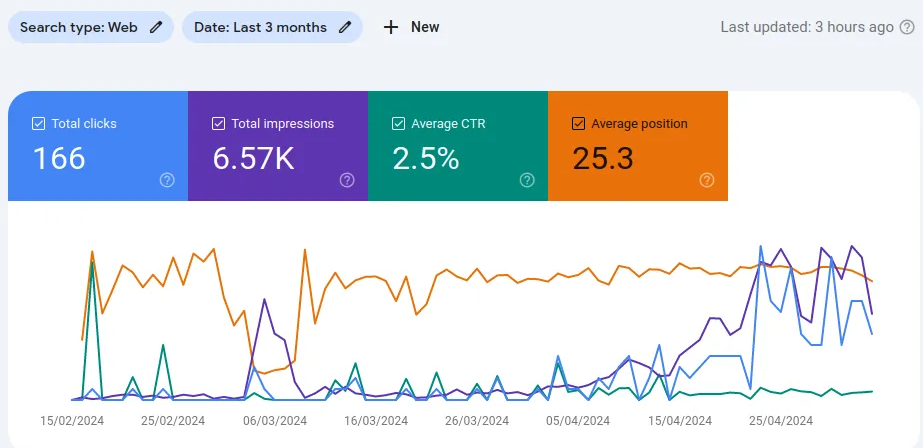

# cert-manager: All-in-One Kubernetes Certificate Manager

Kubernetes is a great orchestration tool for managing your applications and all
its dependencies. However, it comes with an extensible architecture and with an
unopinionated approach to many of the day-to-day operational tasks.

One of these tasks is the management of TLS certificates. This includes issuing
as well as renewing certificates from a trusted Certificate Authority.
This CA may be a public internet-facing application or an internal service that
needs encrypted communication between parties.

In this post, we will introduce the industry de-facto tool of choice for
managing certificates in Kubernetes: cert-manager. We will walk you through
the installation of the operator, configuring the issuer(s), and receiving a
TLS certificate as a Kubernetes Secret for the Ingress or Gateway of your
application.

Finally, we will create the Gateway CRD and expose an application securely
over HTTPS to the internet.

If that gets you excited, hop on and let's get started!

<!--
SEO keywords:
 - cert-manager
 - kubernetes
 - certificate
 - TLS
 - HTTPS
 - ingress
 - gateway
 - cilium
 - AWS
 - Route53
 - Cloudflare
-->


<!-- more -->

## Introduction

If you have deployed any reverse proxy in the pre-Kubernetes era, you might
have, at some point or another, bumped into the issuance and renewal of TLS
certificates. The trivial approach, back in the days as well as even today,
was to use [certbot]. This command-line utility abstracts you away from the
complexity of the underlying CA APIs and deals with the certificate issuance
and renewal for you.

Certbot is created by the Electronic Frontier Foundation (EFF) and is a great
tool for managing certificates on a single server. However, when you're working
at scale with many applications and services, you will benefit from the
automation and integration that [cert-manager] provides.

cert-manager is a Kubernetes-native tool that extends the Kubernetes API
with custom resources for managing certificates. It is built on top of the
[Operator pattern], and is a graduated project of the [CNCF].

With cert-manager, you can fetch and renew your TLS certificates with ease,
passing them along to the [Ingress] or [Gateway] of your platform to host your
applications securely over HTTPS without losing the comfort of hosting your
applications in a Kubernetes cluster.

With that introduction, let's kick off the installation of cert-manager.

???+ success "Huge Thanks to You :hugging:"

    If you're reading this, I would like to thank you for the time you spend
    on this blog :rose:. Whether this is your first time, or you've been here
    before and have liked the content and its quality, I truly appreciate the
    time you spend here.

    As a token of appreciation, and to celebrate with you, I would like to
    share the achievements of this blog over the course of ~11 weeks since its
    launch (the initial commit).

    - [x] 10 posts published :books:
    - [x] 13.8k+ words written so far (37k+ including codes) :pencil:
    - [x] 2.48k+ views since the launch :eyes:
    - [x] 130+ clicks coming from search engines :mag:

    You can find the corresponding screenshots below:

    <figure markdown="span">
      { loading=lazy }
      <figcaption>Search Engine Perfomance</figcaption>
    </figure>

    <figure markdown="span">
      { loading=lazy }
      <figcaption>Search Engine Clicks</figcaption>
    </figure>

    <figure markdown="span">
      { loading=lazy }
      <figcaption>Total Views</figcaption>
    </figure>

    Greatly appreciate you being here and hope you keep coming back. :champagne_glass:

## Pre-requisites

Before we start, make sure you have the following set up:

- [x] A Kubernetes cluster. We have a couple of guides in our archive if you
      need help setting up a cluster:
      - [Kubernetes the Hard Way](./0003-kubernetes-the-hard-way.md)
      - [Lightweight K3s installation on Ubuntu](./0005-install-k3s-on-ubuntu22.md)
      - [Azure AKS TF Module](./0009-external-secrets-aks-to-aws-ssm.md)
- [x] [OpenTofu v1.7]
- [ ] Although not required, we will use FluxCD as a GitOps approach for our
      deployments. You can either follow along and use the Helm CLI instead,
      or follow our earlier guide for
      [introduction to FluxCD](./0006-gettings-started-with-gitops-and-fluxcd.md).
- [ ] Optionally, External Secrets Operator installed. We will use it in this
      guide to store the credentials for the DNS01 challenge.
      - We have covered the installation of ESO in our last week's guide if
        you're new to it:
        [External Secrets Operator](./0009-external-secrets-aks-to-aws-ssm.md)

## Step 0: Installation

cert-manager comes with a first-class support for Helm chart installation.
This makes the installation rather straightforward.

As mentioned earlier, we will install the Helm chart using FluxCD CRDs.

```yaml title="cert-manager/namespace.yml"
-8<- "docs/codes/0010/cert-manager/namespace.yml"
```

```yaml title="cert-manager/repository.yml"
-8<- "docs/codes/0010/cert-manager/repository.yml"
```

```yaml title="cert-manager/release.yml" hl_lines="20"
-8<- "docs/codes/0010/cert-manager/release.yml"
```

Although not required, it is hugely beneficial to store the Helm values as it
is in your VCS. This makes your future upgrades and code reviews easier.

```shell title="" linenums="0"
helm repo add jetstack https://charts.jetstack.io
helm repo update jetstack
helm show values jetstack/cert-manager > cert-manager/values.yml
```

```yaml title="cert-manager/values.yml"
-8<- "docs/codes/0010/cert-manager/values.yml"
```

Additionally, we will use [Kubernetes Kustomize]:

```yaml title="cert-manager/kustomizeconfig.yml"
-8<- "docs/codes/0010/cert-manager/kustomizeconfig.yml"
```

```yaml title="cert-manager/kustomization.yml" hl_lines="7"
-8<- "docs/codes/0010/cert-manager/kustomization.yml"
```

Notice the namespace we are instructing Kustomization to place the resources in.

Ultimately, to create this stack, we will create a FluxCD [Kustomization resource]:

```yaml title="cert-manager/kustomize.yml"
-8<- "docs/codes/0010/cert-manager/kustomize.yml"
```

You may either advantage from the recursive reconciliation of FluxCD, add it
to your root Kustomization or apply the resources manually from your command line.

```shell title=""
kubectl apply -f cert-manager/kustomize.yml
```

??? example "Build Kustomization"

    A good practice is to build your Kustomization locally and optionally apply
    them as a dry-run to debug any potential typo or misconfiguration.

    ```shell title="" linenums="0"
    kustomize build ./cert-manager
    ```

    And the output:

    ```yaml title=""
    -8<- "docs/codes/0010/junk/cert-manager/manifests.yml"
    ```

## Step 1.0: Issuer 101

In general, you can fetch your TLS certificate in two ways: either by verifying
your domain using the HTTP01 challenge or the DNS01 challenge. Each have their
own pros and cons, but both are just to make sure that you own the domain you're
requesting the certificate for. Imagine a world where you could request a
certificate for `google.com` without owning it! :scream:

The HTTP01 challenge requires you to expose a specific path on your web server
and asking the CA to send a GET request to that endpoint, expecting a specific
file to be present in the response.

This is not always possible, especially if you're running a private service.

On a personal note, the HTTP01 feels like a complete hack to me. :sweat:

As such, **in this guide, we'll use the DNS01 challenge**. This challenge
will create a specific DNS record in your nameserver. You don't specifically
have to manually do it yourself, as that is the whole point of automation that
cert-manager will bring to the table.

For the DNS01 challenge, there are a couple of nameserver providers
natively supported by cert-manager. You can find the list of
[supported providers on their website].

For the purpose of this guide, we will provide examples for two different
nameserver providers: AWS Route53 and Cloudflare.

AWS services are the indudstry standard for many companies, and Route53 is one
of the most popular DNS services (fame where it's due).

Cloudflare, on the other hand, is handling a significant portion of the
internet's traffic and is known for its networking capabilities across the
globe.

If you have other needs, you won't find it too difficult to find support for
your nameserver provider in the cert-manager documentation.

## Step 1.1: AWS Route53 Issuer

The [developer-friendly.blog] domain is hosted in Cloudflare and to demonstrate
the AWS Route53 issuer, we will make it so that a subdomain will be resolved
by a Route53 Hosted Zone. That way, we can instruct the cert-manager controller
to talk to the Route53 API for record creation and domain verfication.

<figure markdown="span" style="border: 1px solid #000">
   { loading=lazy }
   <figcaption>Nameserver Diagrams</figcaption>
</figure>

```hcl title="hosted-zone/variables.tf"
-8<- "docs/codes/0010/hosted-zone/variables.tf"
```

```hcl title="hosted-zone/versions.tf"
-8<- "docs/codes/0010/hosted-zone/versions.tf"
```

```hcl title="hosted-zone/main.tf"
-8<- "docs/codes/0010/hosted-zone/main.tf"
```

```hcl title="hosted-zone/outputs.tf"
-8<- "docs/codes/0010/hosted-zone/outputs.tf"
```

To apply this stack we'll use [OpenTofu](/category/opentofu). We could've either
separated the stacks to create the Route53 zone beforehand, or we will go ahead
and target our resources separately from command line as you see below.

```shell title=""
export TF_VAR_cloudflare_api_token="PLACEHOLDER"
export AWS_PROFILE="PLACEHOLDER"

tofu plan -out tfplan -target=aws_route53_zone.this
tofu apply tfplan

# And now the rest of the resources

tofu plan -out tfplan
tofu apply tfplan
```

???+ question "Why Applying Two Times?"

      The values in a TF `for_each` must be known at the time of planning,
      [aka, static values].

      And since that is not the case with `aws_route53_zone.this.name_servers`,
      we have to make sure to create the Hosted Zone first before passing its
      output to another resource.

We should have our AWS Route53 Hosted Zone created as you see in the screenshot
below.

<figure markdown="span">
   { loading=lazy }
   <figcaption>AWS Route53</figcaption>
</figure>

Now that we have our Route53 zone created, we can proceed with the cert-manager
configuration.

### AWS IAM Role

We now need an IAM Role with enough permissions to create the DNS records to
[satisfy the DNS01 challenge].

```hcl title="route53-iam-role/variables.tf"
-8<- "docs/codes/0010/route53-iam-role/variables.tf"
```

```hcl title="route53-iam-role/versions.tf"
-8<- "docs/codes/0010/route53-iam-role/versions.tf"
```

```hcl title="route53-iam-role/main.tf"
-8<- "docs/codes/0010/route53-iam-role/main.tf"
```

```hcl title="route53-iam-role/outputs.tf"
-8<- "docs/codes/0010/route53-iam-role/outputs.tf"
```

```shell title="" linenums="0"
tofu plan -out tfplan
tofu apply tfplan
```

If you don't know what [OpenID Connect](/category/openid-connect) is and what
we're doing here, you might want to check out our ealier guides on the topic:

- [x] Establishing a trust relationship between
      [bare-metal Kubernetes cluster and AWS IAM](./0008-k8s-federated-oidc.md)
- [x] Same concept of trust relationship, this time between
      [Azure AKS and AWS IAM](./0009-external-secrets-aks-to-aws-ssm.md)

The gist of both articles is that we are providing a means for the two services
to talk to each other securely and without storing long-lived credentials.

In essence, one service will issue the tokens (Kubernetes cluster), and the
other will trust the tokens of the said service (AWS IAM).

### Kubernetes Service Account

Now that we have our IAM role set up, we can pass that as an annotation to the
Service Account of the cert-manager Deployment. This way the cert-manager will
assume that role with the [Web Identity Token flow] (there are five in total).

We will also create a ClusterIssuer CRD to be responsible for fetching the TLS
certificates from the trusted CA.

```hcl title="route53-issuer/variables.tf"
-8<- "docs/codes/0010/route53-issuer/variables.tf"
```

```hcl title="route53-issuer/versions.tf"
-8<- "docs/codes/0010/route53-issuer/versions.tf"
```

```hcl title="route53-issuer/main.tf"
-8<- "docs/codes/0010/route53-issuer/main.tf"
```

```hcl title="route53-issuer/outputs.tf"
-8<- "docs/codes/0010/route53-issuer/outputs.tf"
```

```shell title="" linenums="0"
tofu plan -out tfplan
tofu apply tfplan
```

This stack allows the cert-manager controller to talk to AWS Route53.

Notice that we didn't pass any credentials, nor did we have to create any IAM
User for this communication to work. It's all the power of
[OpenID Connect](/category/openid-connect) and
allows us to establish a trust relationship and never have to worry about any
credentials in the client service. :white_check_mark:

We're now done with the AWS issuer. Let's switch gear for a bit to create the
Cloudflare issuer before finally creating a TLS certificate for our desired
domain(s).

## Step 1.2: Cloudflare Issuer

Since Cloudflare does not have native support for OIDC, we will have to pass
an API token to the cert-manager controller to be able to manage the DNS
records on our behalf.

That's where the [External Secrets Operator] comes into play and I invite you
to take a look at our last week's guide if you haven't done so already. Cause
we will not repeat ourselves here and will only use the ExternalSecret CRD to
fetch an API token from the AWS SSM Parameter Store and pass it down to our
Kubernetes cluster as a Secret resource.

Notice the highlighted lines.

```yaml title="cloudflare-issuer/externalsecret.yml" hl_lines="4 9"
-8<- "docs/codes/0010/cloudflare-issuer/externalsecret.yml"
```

```yaml title="cloudflare-issuer/clusterissuer.yml" hl_lines="4 16"
-8<- "docs/codes/0010/cloudflare-issuer/clusterissuer.yml"
```

```yaml title="cloudflare-issuer/kustomization.yml"
-8<- "docs/codes/0010/cloudflare-issuer/kustomization.yml"
```

```yaml title="cloudflare-issuer/kustomize.yml"
-8<- "docs/codes/0010/cloudflare-issuer/kustomize.yml"
```

```shell title="" linenums="0"
kubectl apply -f cloudflare-issuer/kustomize.yml
```

That's all the issuers we aimed to create for today. One for AWS Route53 and
another for Cloudflare.

We are now equipped with enough access in our Kubernetes cluster to just create
the TLS certificate and never have to worry about how to verify their ownership.

With that promise, let's wrap this up with the easiest part! :sunglasses:

## Step 2: TLS Certificate

You should have noticed by now that the root [developer-friendly.blog] will
be resolved by Cloudflare as our initial nameserver. We also created a subdomain
and a Hosted Zone in AWS Route53 to resolve the `aws.` subdomain using Route53
as its nameserver.

We can now fetch a TLS certificate for each of them using our newly created
ClusterIssuer resource. The rest is the responsbility of the cert-manager to
verify the ownership within the cluster through the DNS01 challenge and using
the access we've provided to it.

```yaml title="tls-certificates/aws-subdomain.yml" hl_lines="10"
-8<- "docs/codes/0010/tls-certificates/aws-subdomain.yml"
```

```yaml title="tls-certificates/cloudflare-root.yml" hl_lines="10"
-8<- "docs/codes/0010/tls-certificates/cloudflare-root.yml"
```

```yaml title="tls-certificates/kustomization.yml"
-8<- "docs/codes/0010/tls-certificates/kustomization.yml"
```

```yaml title="tls-certificates/kustomize.yml"
-8<- "docs/codes/0010/tls-certificates/kustomize.yml"
```

```shell title="" linenums="0"
kubectl apply -f tls-certificates/kustomize.yml
```

It'll take less than a minute to have the certificates issued and stored as
Kubernetes Secrets in the same namespace as the cert-manager Deployment.

The final result will have a Secret with two keys: `tls.crt` and `tls.key`.
This will look similar to what you see below.

```yaml title=""
-8<- "docs/codes/0010/junk/tls-certificates/manifests.yml"
```

## Step 3: Use the TLS Certificates in Gateway

At this point, we have the required ingredients to host an application within
cluster and exposing it securely through HTTPS into the world.

That's exactly what we aim for at this step. But, first, let's create a Gateway
CRD that will be the entrypoint to our cluster. The Gateway can be thought of
as the sibling of Ingress resource, yet more handsome, more successful and
[educated and more charming].

The key point to keep in mind is that the Gateway API doesn't come with the
implementation. Infact, it is unopinionated about the implementation and you
can use any networking solution that fits your needs and has support for it.

In our case, and based on the personal preference and tendency of the author
:innocent:, we'll use [Cilium](/category/cilium) as the networking solution,
both as the CNI, as well as the implementation for our Gateway API.

We have covered the [Cilium installation before], but, for the sake of
completeness, here's [the way to do it] using [Cilium CLI].

```yaml title="cilium/playbook.yml" hl_lines="44-46"
-8<- "docs/codes/0010/cilium/playbook.yml"
```

And now, let's create the Gateway CRD.

```yaml title="gateway/gateway.yml" hl_lines="6 24 28"
-8<- "docs/codes/0010/gateway/gateway.yml"
```

Notice that we did not create the `gatewayClassName`. It comes as
battery-included with [Cilium](/category/cilium). You can find the
`GatewayClass` as soon as Cilium installation completes with the following
command:

```shell title="" linenums="0"
kubectl get gatewayclass
```

GatewayClass is to Gateway as IngressClass is to Ingress. :material-check-all:

Also note that we are passing the TLS certificates to this Gateway we have
created earlier. That way, the gateway will terminate and offload the SSL/TLS
encryption and your upstream service will receive plaintext traffic. However,
if you have set up your mTLS the way we did with Wireguard encryption (or any
other mTLS solution for that matter), node-to-node communication will not be
plaintext!

```yaml title="gateway/http-to-https-redirect.yml" hl_lines="11"
-8<- "docs/codes/0010/gateway/http-to-https-redirect.yml"
```

Though not required, this redirect allows you to avoid accepting any
plaintext HTTP traffic on your domain.

```yaml title="gateway/kustomization.yml"
-8<- "docs/codes/0010/gateway/kustomization.yml"
```

```yaml title="gateway/kustomize.yml"
-8<- "docs/codes/0010/gateway/kustomize.yml"
```

```shell title="" linenums="0"
kubectl apply -f gateway/kustomize.yml
```

## Step 4: HTTPS Application

That's all the things we aimed to do today. At this point, we can create our
HTTPS-only application and expose it securely to the wild internet!

```yaml title="app/deployment.yml"
-8<- "docs/codes/0010/app/deployment.yml"
```

```yaml title="app/service.yml"
-8<- "docs/codes/0010/app/service.yml"
```

```yaml title="app/httproute.yml" hl_lines="7-8"
-8<- "docs/codes/0010/app/httproute.yml"
```

```ini title="app/configs.env"
-8<- "docs/codes/0010/app/configs.env"
```

```yaml title="app/kustomization.yml"
-8<- "docs/codes/0010/app/kustomization.yml"
```

```yaml title="app/kustomize.yml"
-8<- "docs/codes/0010/app/kustomize.yml"
```


```shell title="" linenums="0"
kubectl apply -f app/kustomize.yml
```

That's everything we had to say for today. We can now easily access our
application as follows:

```shell title="" linenums="0"
curl -v https://echo.developer-friendly.blog -sSo /dev/null
```

or...

```shell title="" linenums="0"
curl -v https://aws.echo.developer-friendly.blog -sSo /dev/null
```

```plaintext title="Output of the curl command(s)" linenums="0"
...truncated...
*  expire date: Jul 30 04:44:12 2024 GMT
...truncated...
```

Both will show that the TLS certificate is present. signed by a trusted CA, is
valid and matches the domain we're trying to access. :tada:

You shall see the same expiry date on your certificate if accessing as follows:

```shell title="" linenums="0"
kubectl get certificate -n cert-manager -o jsonpath='{.items[*].status.notAfter}'
```

```plaintext title="Output of kubectl command" linenums="0"
2024-07-30T04:44:12Z
```

As you can see, they information we get from the publicly available certificate
as well as the one we get internally from our Kubernetes cluster are the same
down to the second. :muscle:

## Conclusion

These days, I am never spinning up a Kubernetes cluster without having
cert-manager installed on it as its day 1 operation task. It's such a
life-saver tool to have in your toolbox and you can rest assured that the TLS
certificates in your cluster are always up-to-date and valid.

If you ever had to worry about the expiry date of your certificates before,
those days are behind you and you can benefit a lot by employing the
cert-manager operator in your Kubernetes cluster. Use it to its full potential
and you shall be served greatly.

Hope you enjoyed reading this material.

Until next tima, *ciao* :cowboy: and happy hacking! :crab: :penguin: :whale:

[certbot]: https://certbot.eff.org/
[Ingress]: https://kubernetes.io/docs/concepts/services-networking/ingress/
[Gateway]: https://gateway-api.sigs.k8s.io/
[cert-manager]: https://cert-manager.io/
[Operator pattern]: https://kubernetes.io/docs/concepts/extend-kubernetes/operator/
[CNCF]: https://www.cncf.io/
[Kustomization resource]: https://fluxcd.io/flux/components/kustomize/kustomizations/
[Kubernetes Kustomize]: https://kubectl.docs.kubernetes.io/references/kustomize/kustomization/
[supported providers on their website]: https://cert-manager.io/docs/configuration/acme/dns01/
[developer-friendly.blog]: https://developer-friendly.blog
[aka, static values]: https://developer.hashicorp.com/terraform/language/meta-arguments/for_each#limitations-on-values-used-in-for_each
[OpenTofu v1.7]: https://github.com/opentofu/opentofu/releases/tag/v1.7.0
[Web Identity Token flow]: https://docs.aws.amazon.com/STS/latest/APIReference/API_AssumeRoleWithWebIdentity.html
[Kubernetes Reflector]: https://github.com/emberstack/kubernetes-reflector
[External Secrets Operator]: ./0009-external-secrets-aks-to-aws-ssm.md
[educated and more charming]: https://gateway-api.sigs.k8s.io/
[Cilium installation before]: ./0005-install-k3s-on-ubuntu22.md
[Cilium CLI]: https://github.com/cilium/cilium-cli/releases/tag/v0.16.6
[the way to do it]: https://docs.cilium.io/en/stable/network/servicemesh/gateway-api/gateway-api/
[satisfy the DNS01 challenge]: https://cert-manager.io/docs/configuration/acme/dns01/route53/#set-up-an-iam-role
