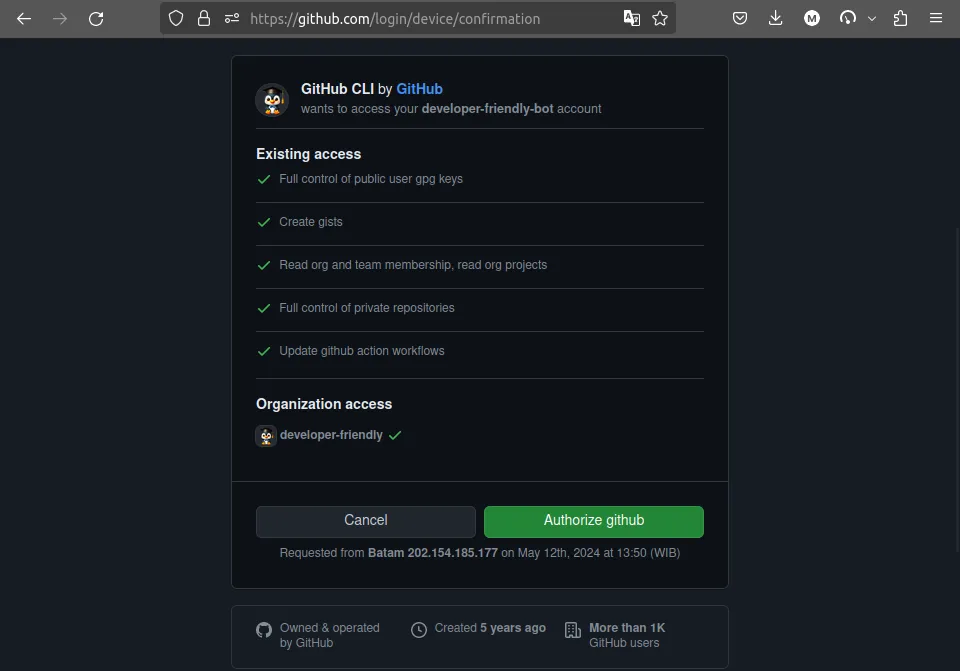
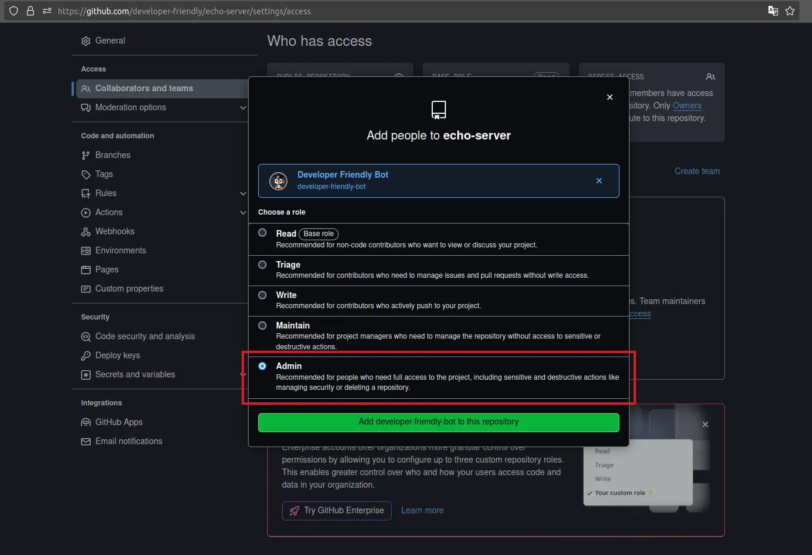
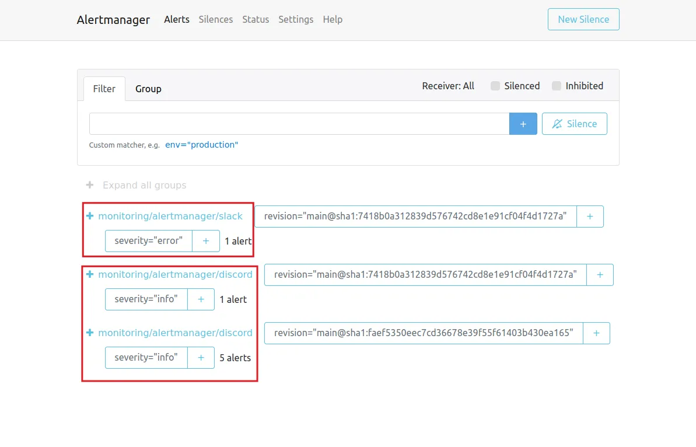
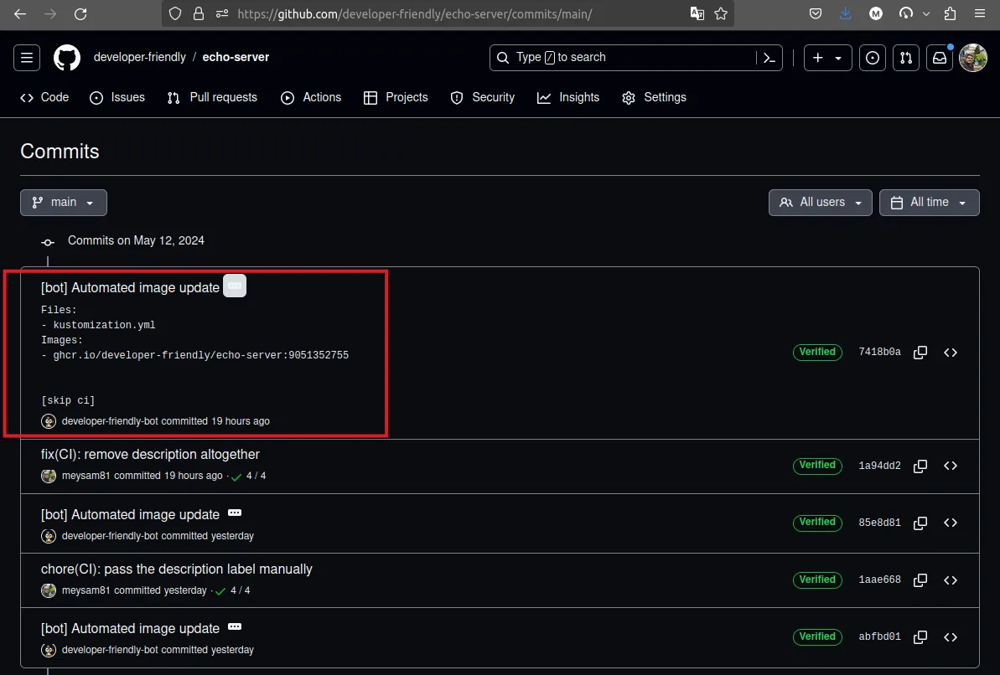
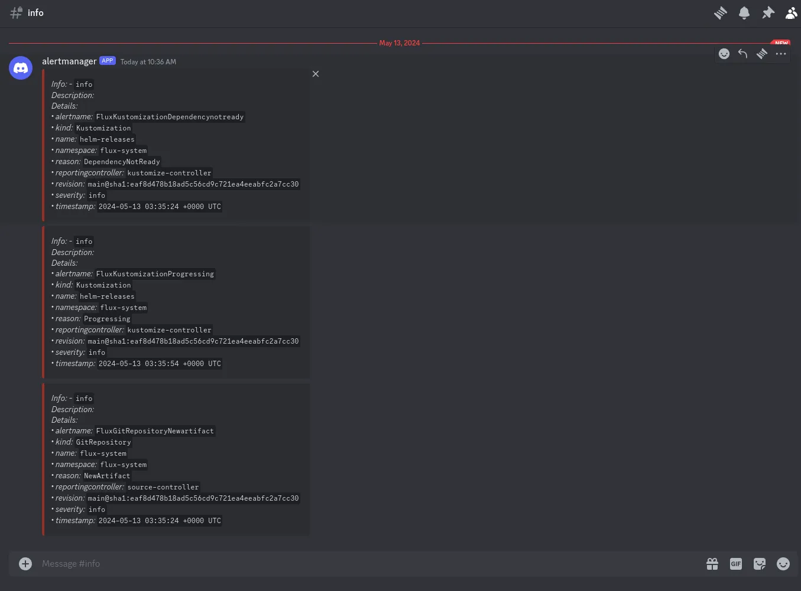
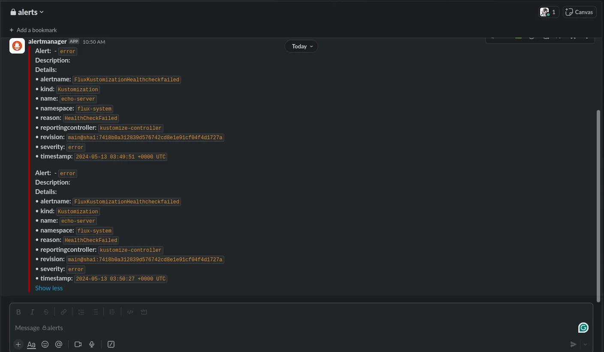

# GitOps Continuous Deployment: FluxCD Advanced CRDs

FluxCD is a powerful ecosystem of GitOps operators that can be enabled
on-demand as per the requirement of your environment. It enables you to opt-in
for the features you need and to disable the ones you don't.

As the complexity and requirement of your environment grows, so does the need
for extra tooling to cover the implementation of the features you need.

FluxCD comes with more than just the support for Kustomization and HelmRelease.
With FluxCD, you can also manage your Docker images as new versions get built.
You can also get notified of the events that happen on your behalf by the
FluxCD operators.

Stick till the end to see how you can take your Kubernetes cluster to the next
level using advanced FluxCD CRDs.

<!-- more -->

## Introduction

We have covered the beginner's guide to FluxCD in
[an earlier post](./0006-gettings-started-with-gitops-and-fluxcd.md).

This blog post will continue from where we left off and covers the advanced
CRDs not included in the first post.

Specifically, we will mainly cover the Image Automation Controller[^1] and the
Notification Controller[^2] in this post.

Using the provided CRDs by these operators, we will be able to achieve the
following inside our Kubernetes cluster:

- [x] Fetch the latest tags of our specified Docker images
- [x] Update the Kustomization[^3] to use the latest Docker image tag based on
      the desired tag pattern
- [x] Notify and/or alert external services (e.g. Slack, Discord, etc.) based
      on the severity of the events happening within the cluster

If you're as pumped as I am, let's not waste any more second and dive right in!

## Pre-requisites

Make sure you have the following setup ready before going forward:

- [x] A Kubernetes cluster accessible from the internet (v1.30 as of writing)
      Feel free to follow our earlier guides if you need assistance:
    - [Kubernetes the Hard Way](./0003-kubernetes-the-hard-way.md)
    - [K3s Installation](./0005-install-k3s-on-ubuntu22.md)
    - [Managed Azure AKS][eso-installation]
- [x] FluxCD operator installed. Follow our earlier blog post to get started:
      [Getting Started with GitOps and FluxCD](./0006-gettings-started-with-gitops-and-fluxcd.md)
- [x] Either Gateway API[^4] or an Ingress Controller[^5] installed on your cluster.
      We will need this internet-accessible endpoint to receive the webhooks
      from the GitHub repository to our cluster.
- [x] Both the [Extenal Secrets Operator][eso-installation] as well as
      [cert-manager](./0010-cert-manager.md) installed on your cluster.
      Although, feel free to use any alternative that suits your environment
      best.
- [ ] Optionally, GitHub CLI v2[^6] installed for TF code authentication. The
      alternative is to use GitHub PAT, which I'm not a big fan of!
- [ ] Optionally a GitHub account, although any other Git provider will do when
      it comes to the Source Controller[^7].

## Source, Image Automation & Notification Controllers 101 :nerd:

Before getting hands-on, a bit of explanation is in order.

The Source Controller[^8] in FluxCD is responsible for fetching the artifacts and
the resources from the external sources. It is called **Source** controller
because it provides the resources needed for the rest of the FluxCD controllers.

These _Sources_ can be of various types, such as GitRepository, HelmRepository,
Bucket, etc. It will need the required auth and permission(s) to access those
repositories, but, once given proper access, it will mirror the contents of
said sources to your cluster so that you can have seamless integration from
your external repositories right into the Kubernetes cluster.

The Image Automation Controller[^9] is responsible for managing the Docker images.
It fetches the latest tags, groups them based on defined patterns and criteria,
and updates the target resources (e.g. Kustomization) to use the latest image
tags; this is how you achieve the continuous deployment of your Docker images.

The Notification Controller[^10], on the other hand, is responsible for both
receiving and sending notifications. It can receive the events from the
external sources[^11], e.g. GitHub, and acts upon them as defined in its CRDs.
It can also send notifications from your cluster to the external services.
This can include sending notifications or alerts to Slack, Discord, etc.

This is just an introduction and sounds a bit vague. So let's get hands-on and
see how we can use these controllers in our cluster.

## Application Scaffold

Since you will see a lot of code snippets in this post, here's the directory
structure you better be prepared for:

```plaintext title="" linenums="0"
.
├── echo-server/
├── fluxcd-secrets/
├── github-webhook/
├── kube-prometheus-stack/
├── kustomize/
│   ├── base/
│   └── overlays/
│       └── dev/
├── notifications/
├── webhook-receiver/
└── webhook-token/
```

The application we'll deploy today is a Rust :crab: application named
`echo-server`. The rest of the configurations are complementary to the CD of
this application.

## Step 1: Required Secrets

The first step is to create a couple of required secrets we'll be needing for
our application, as well as for all the other controllers responsible for
reconciling the deployment and its image autmation.

Specifically, we'll need three secrets at this stage:

1. GitHub Deploy Key[^12]: This will be used by the Source Controller to fetch the
   source code artifacts from GitHub and stores them in the cluster. The rest
   of the controllers will need to reference this GitHub repository during
   initialization in their YAML manifest. It will also use this Deploy Key
   to commit the changes back to the repository (more on that in a bit).
2. User GPG Key[^13]: This is the key that the Image Update Automation will use
   to sign the commits when changing target image tag of our application
   once a new Docker iamge is built.
3. GitHub Container Registry token: The GHCR token is used by the Image
   Automation controller to fetch the latest tags of the Docker images from
   the GitHub Container Registry. This will be a required step for private
   repositories, however, you can skip it for public repos.

We will employ External Secrets Operator to fetch our secrets from AWS SSM.
We have already covered the [installation of ESO][eso-installation] in a
previous post and using that knowledge, we'll only need to place the secrets in
the AWS, and instruct the operator to fetch and feed them to our application.

```hcl title="fluxcd-secrets/variables.tf" hl_lines="37 43"
-8<- "docs/codes/0011/fluxcd-secrets/variables.tf"
```

```hcl title="fluxcd-secrets/versions.tf" hl_lines="23 27-28"
-8<- "docs/codes/0011/fluxcd-secrets/versions.tf"
```

```hcl title="fluxcd-secrets/main.tf" hl_lines="12"
-8<- "docs/codes/0011/fluxcd-secrets/main.tf"
```

```hcl title="fluxcd-secrets/outputs.tf"
-8<- "docs/codes/0011/fluxcd-secrets/outputs.tf"
```

Notice that we're defining two providers with differing aliases[^14] for our
GitHub provider. For that, there are a couple of worthy notes to mention:

1. We are using GitHub CLI for the API authentication of our TF code to the
   GitHub. The main and default provider we use is `developer-friendly`
   organization and the other is `developer-friendly-bot` normal user.
2. The GitHub Deploy Key[^12] creation API call is something even an organization
   account can do. But for the creation of the User GPG Key[^13], we need to
   send the requests from a non-organization account, i.e., a normal user; that
   is the reason for using two providers instead of one. You could argue that
   we could create all resources using the normal account, however, we are
   employing the principle of least privilege here.
3. For the GitHub CLI authentication to work, beside the CLI installation, you
   need to grant your CLI access to your GitHub account. You can see the
   command and its resulting screenshot below:

```shell title="" linenums="0"
gh auth login --web --scopes admin:gpg_key
```

And the web browser page:

<figure markdown="span">
  { loading=lazy }
  <figcaption>GitHub CLI Authentication</figcaption>
</figure>

Applying the stack above is straightforward:

```hcl title="fluxcd-secrets/terraform.tfvars"
-8<- "docs/codes/0011/junk/fluxcd-secrets.terraform.tfvars"
```

```shell title="" linenums="0"
tofu init
tofu plan -out tfplan
tofu apply tfplan
```

## Step 2: Repository Set Up

Now that we have our secrets ready in AWS SSM, we can go ahead and create the
FluxCD GitRepository.

Remember we created GitHub Deploy Key earlier? We are passing it to the cluster
this way:

```yaml title="echo-server/externalsecret.yml" hl_lines="8"
-8<- "docs/codes/0011/echo-server/externalsecret.yml"
```

The format of the Secret that FluxCD expects for GitRepository is documented
on their documentation and you can use other forms of authentication as needed[^15].
We are using GitHub Deploy Key here as they are more flexible when it comes to
revoking access, as well as granting write access to the repository[^12].

The Known Hosts value is coming from the GitHub SSH key fingerprint[^16]. The
bad news is that you will have to manually change them if they change theirs!
:sweat_smile:

And using the resuling generated Kubernetes Secret from the ExternalSecret
above, we are creating the GitRepository using SSH instead of HTTPS; the reason
is that the GitHub Deploy Key generated earlier in our TF code has write
access. We'll talk about why in a bit.

```yaml title="echo-server/gitrepo.yml"
-8<- "docs/codes/0011/echo-server/gitrepo.yml"
```

```yaml title="echo-server/kustomization.yml"
-8<- "docs/codes/0011/echo-server/kustomization.yml"
```

And now let's create this stack:

```yaml title="echo-server/kustomize.yml"
-8<- "docs/codes/0011/echo-server/kustomize.yml"
```

```shell title="" linenums="0"
kubectl apply -k echo-server/kustomize.yml
```

!!! note "Buckle Up!"

    There is going to be a lot of code snippets. Get ready to be bombarded with
    all that we had stored in the cannon. :bomb: :grimacing:

## Step 3: Application Deployment

Now that we have our GitRepository set up, we can deploy the application.

There is not much to say about the `base` Kustomization. It is a normal
application like any other.

For your reference, here's the `base` Kustomization:

=== "kustomize/base/configs.env"
    ```ini title=""
    -8<- "docs/codes/0011/kustomize/base/configs.env"
    ```

=== "kustomize/base/deployment.yml"
     ```yaml title=""
     -8<- "docs/codes/0011/kustomize/base/deployment.yml"
     ```

=== "kustomize/base/service.yml"
    ```yaml title=""
    -8<- "docs/codes/0011/kustomize/base/service.yml"
    ```

===+ "kustomize/base/kustomization.yml"
    ```yaml title=""
    -8<- "docs/codes/0011/kustomize/base/kustomization.yml"
    ```

Now, let's go ahead and see what we need to create in our `dev` environment.

Notice the referencing AWS SSM key in our ExternalSecret resource which is
targeting the same value as we created earlier in our `fluxcd-secrets` TF stack.

```yaml title="kustomize/overlays/dev/externalsecret-docker.yml" hl_lines="8 20-29"
-8<- "docs/codes/0011/kustomize/overlays/dev/externalsecret-docker.yml"
```

```yaml title="kustomize/overlays/dev/externalsecret-gpgkey.yml" hl_lines="8 20"
-8<- "docs/codes/0011/kustomize/overlays/dev/externalsecret-gpgkey.yml"
```

The following HTTPRoute is using
[the Gateway we have created][cert-manager-installation] in our last week's
guide. Make sure to check it out if you haven't already.

```yaml title="kustomize/overlays/dev/httproute.yml"
-8<- "docs/codes/0011/kustomize/overlays/dev/httproute.yml"
```

The `PLACEHOLDER` in the following ImagePolicy below will be replaced by the
Kustomization in a bit.

Notice the pattern we are requesting, which **MUST be the same
as you build in your CI pipeline**.

```yaml title="kustomize/overlays/dev/imagepolicy.yml" hl_lines="10"
-8<- "docs/codes/0011/kustomize/overlays/dev/imagepolicy.yml"
```

Creating an ImageRepository for a private Docker image is what I consider to
be a superset of the public ImageRepository. As such, I will only cover the
private ImageRepository in this blog post.

<div class="annotate" markdown>
Since the Git provider will be GitHub, we will need a GitHub PAT; I really
wish GitHub would provide official OpenID Connect support(1) someday to get rid
of all these tokens lying around in our environments! :face_with_head_bandage:
</div>

1. There is an un-official OIDC support for GitHub as we speak[^17].
   A topic for a future post. :wink:

<div class="annotate" markdown>
```yaml title="kustomize/overlays/dev/imagerepository.yml" hl_lines="6 10"
-8<- "docs/codes/0011/kustomize/overlays/dev/imagerepository.yml"
```
</div>

1. This one:
   ```yaml title="kustomize/overlays/dev/externalsecret-docker.yml" hl_lines="8"
   -8<- "docs/codes/0011/kustomize/overlays/dev/externalsecret-docker.yml"
   ```


The referenced Kubernetes Secret in the ImageRepository above, and the one
referencing the GPG Key Secret are both fed into the cluster by the ESO that
[we have deployed in our cluster previously][eso-installation].

The following ImageUpdateAutomation resource will require the write access to
the repository; that's where the write access of the GitHub Deploy Key we
mentioned earlier comes into play.

<div class="annotate" markdown>
```yaml title="kustomize/overlays/dev/imageupdateautomation.yml" hl_lines="36"
-8<- "docs/codes/0011/kustomize/overlays/dev/imageupdateautomation.yml"
```
</div>

1. The Kubernetes Secret generated from this ExternalSecret:
   ```yaml title="kustomize/overlays/dev/externalsecret-gpgkey.yml" hl_lines="8"
   -8<- "docs/codes/0011/kustomize/overlays/dev/externalsecret-gpgkey.yml"
   ```

<div class="annotate" markdown>
```yaml title="kustomize/overlays/dev/kustomization.yml" hl_lines="13"
-8<- "docs/codes/0011/kustomize/overlays/dev/kustomization.yml"
```
</div>

1. The ImagePolicy created here:
   ```yaml title="kustomize/overlays/dev/imagepolicy.yml" hl_lines="10"
   -8<- "docs/codes/0011/kustomize/overlays/dev/imagepolicy.yml"
   ```

### Image Policy Tagging

Did you notice the line with the following _commented_ value:

```json title="" linenums="0"
{ "$imagepolicy": "default:echo-server:tag" }
```

Don't be mistaken!

This is not a comment[^18]. This is a metadata that FluxCD understands and uses
to update the Kustomization `newTag` field with the latest tag of the Docker
image repository.

For your reference, here's the allowed references:

- `{"$imagepolicy": "<policy-namespace>:<policy-name>"}`
- `{"$imagepolicy": "<policy-namespace>:<policy-name>:tag"}`
- `{"$imagepolicy": "<policy-namespace>:<policy-name>:name"}`

To understand this better, let's take look at the created ImageRepository first:

```yaml title="" hl_lines="28 35"
-8<- "docs/codes/0011/junk/imagerepository.yml"
```

Out of all these scanned images, the following are the ones that we care about
in our `dev` environment.

```yaml title="" hl_lines="29-30 35"
-8<- "docs/codes/0011/junk/imagepolicy.yml"
```

If you remember from our ImagePolicy earlier, we have created the pattern so
that the Docker images are all having tags that are numerical only and the
highest number is the latest.

Here's the snippet from the ImagePolicy again:

```yaml title="kustomize/overlays/dev/imagepolicy.yml" linenums="9" hl_lines="5"
-8<- "docs/codes/0011/kustomize/overlays/dev/imagepolicy.yml:9:13"
```

### GitHub CI Workflow

To elaborate further, this is the piece of GitHub CI definition that creates
the image with the exact tag that we are expecting:

```yaml title=".github/workflows/ci.yml" linenums="73" hl_lines="12"
-8<- "docs/codes/0011/junk/ci-workflow.yml:73:87"
```

This CI definition will create images as you have seen in the status of the
ImagePolicy, in the following format:

```plaintext title="" linenums="0"
ghcr.io/developer-friendly/echo-server:9050352340
```

You can employ other techniques as well. For example, you can use
Semantic Versioning[^19] as a pattern, and optionally extract only a part of the
tag to be used in the Kustomization(1).
{ .annotate }

1.  Perhaps a topic for another day.

??? example "Full CI Definition"

      ```yaml title=".github/workflows/ci.yml"
      -8<- "docs/codes/0011/junk/ci-workflow.yml"
      ```

Be sure to deploy the app.

```yaml title="kustomize/overlays/dev/kustomize.yml"
-8<- "docs/codes/0011/kustomize/overlays/dev/kustomize.yml"
```

```shell title="" linenums="0"
kubectl apply -f kustomize/overlays/dev/kustomize.yml
```

Note that in order for the Deploy Key write access to work, the bot user need
to have write access to the repository. In our case, we are also using the same
account to create the GitHub Deploy Key, which forces us to grant it the admin
access as you see below.

<figure markdown="span">
  { loading=lazy }
  <figcaption>GitHub Repository Admin Access</figcaption>
</figure>

## Step 4: Receiver and Webhook

FluxCD allows you to configure a Receiver so that external services can trigger
the controllers of FluxCD to reconcile before the configured interval.

This can be greatly beneficial when you want to deploy the changes as soon as
they are pushed to the repository. For example, a push to the `main` branch,
which, in turn will trigger a webhook from the Git repository to your Kubernetes
cluster.

The important note to mention here is that the endpoint has to be publicly
accessible through the internet. Of course you are going to protect it behind
an authentication system using secrets, which we'll see in a bit.

First things first, let's create the Receiver so that the cluster is ready
before any webhook is sent.

### Generate the Secret

We need a trust relationship between the GitHub webhook system and our cluster.
This comes in the form of including a token that only the two parties know of.

```hcl title="webhook-token/variables.tf"
-8<- "docs/codes/0011/webhook-token/variables.tf"
```

```hcl title="webhook-token/versions.tf"
-8<- "docs/codes/0011/webhook-token/versions.tf"
```

```hcl title="webhook-token/main.tf"
-8<- "docs/codes/0011/webhook-token/main.tf"
```

```hcl title="webhook-token/outputs.tf"
-8<- "docs/codes/0011/webhook-token/outputs.tf"
```

```shell title="" linenums="0"
tofu init
tofu plan -out tfplan
tofu apply tfplan
```

### Create the Receiver

Now that we have the secret in our secrets management system, let's create the
Receiver to be ready for all the GitHub webhook triggers.

<div class="annotate" markdown>
```yaml title="webhook-receiver/externalsecret.yml" hl_lines="4"
-8<- "docs/codes/0011/webhook-receiver/externalsecret.yml"
```
</div>

1. This secret was created here in our TF code:
   ```hcl title="webhook-token/main.tf" hl_lines="7-8"
   -8<- "docs/codes/0011/webhook-token/main.tf"
   ```

```yaml title="webhook-receiver/httproute.yml"
-8<- "docs/codes/0011/webhook-receiver/httproute.yml"
```

```yaml title="webhook-receiver/receiver.yml" hl_lines="16"
-8<- "docs/codes/0011/webhook-receiver/receiver.yml"
```

```yaml title="webhook-receiver/kustomization.yml"
-8<- "docs/codes/0011/webhook-receiver/kustomization.yml"
```

An now, let's apply this stack.

```yaml title="webhook-receiver/kustomize.yml"
-8<- "docs/codes/0011/webhook-receiver/kustomize.yml"
```

```shell title="" linenums="0"
kubectl apply -k webhook-receiver/kustomize.yml
```

At this point, if we inspect the created Receiver, we will get something similar
to this:

```yaml title=""
-8<- "docs/codes/0011/junk/receiver.yml"
```

### GitHub Webhook

All is ready for GitHub to notify our cluster on every push to the `main`
branch. Let's create the webhook using TF stack.

```hcl title="github-webhook/variables.tf"
-8<- "docs/codes/0011/github-webhook/variables.tf"
```

```hcl title="github-webhook/versions.tf"
-8<- "docs/codes/0011/github-webhook/versions.tf"
```

```hcl title="github-webhook/main.tf"
-8<- "docs/codes/0011/github-webhook/main.tf"
```

```hcl title="github-webhook/outputs.tf"
-8<- "docs/codes/0011/github-webhook/outputs.tf"
```

```shell title="" linenums="0"
tofu init
tofu plan -out tfplan
tofu apply tfplan
```

With the webhook set up, for every push to our `main` branch, the GitHub will
trigger a webhook to the Kubernetes cluster, targetting the FluxCD Notification
Controller, which in turn will accept and notify the `.spec.resources` of the
Receiver we have configured earlier.

This results in GitRepository resource in the Receiver specificiation to be
notified beforethe `.spec.interval`; the outcome is that we'll get faster
deployments of our changes since the cluster and the controllers will not wait
until the next reconciliation interval, but will get notified as soon as the
changes are landed in the repository.

It's a perfect setup for instant deployment of your changes as soon as they
are ready. :partying_face:

## Step 5: Notifications & Alert

With the application deployed, and the receiver of our GitOps ready to be
notified on every new change, we should be able to get notified of info and
alerts of our cluster.

This way we get to be notified of normal operations of our clusters, as well
as when things go south! :cold_face:

In the following stack, we are creating two different targets for our
notification delivery system. One is sending all the info events to our Discord
and the other will send all the errors to the configured Slack channel.

It gives you a good diea on how the real world scenarios can be handled
when different groups of people are interested in different types and severities
of events generated in a Kubernetes cluster. :information_source:

You may as well mute the noisier info channel, and let the error channel page
your ops team as soon as something lands on it. :fire: :firefighter:

**NOTE**: There are two types of events in Kubernetes: `Normal` and `Warning`.
FluxCD considers normal events as info and warnings as errors. From the
official Kubernetes documentation[^20]:
> type is the type of this event (Normal, Warning), new types could be added in
> the future. It is machine-readable. This field cannot be empty for new Events.

You can also check the source code for the Notification Controller in the
FluxCD repository[^21].

```yaml title="notifications/secret.yml" hl_lines="4"
-8<- "docs/codes/0011/notifications/secret.yml"
```

```yaml title="notifications/provider.yml" hl_lines="7"
-8<- "docs/codes/0011/notifications/provider.yml"
```

```yaml title="notifications/alert-info.yml" hl_lines="8"
-8<- "docs/codes/0011/notifications/alert-info.yml"
```

```yaml title="notifications/alert-error.yml" hl_lines="8"
-8<- "docs/codes/0011/notifications/alert-error.yml"
```

```yaml title="notifications/kustomization.yml"
-8<- "docs/codes/0011/notifications/kustomization.yml"
```

And to create this stack:

```yaml title="notifications/kustomize.yml"
-8<- "docs/codes/0011/notifications/kustomize.yml"
```

Finally:

```shell title="" linenums="0"
kubectl apply -k notifications/kustomize.yml
```

### Kube Prometheus Stack

We haven't talked about how to configure the AlertManager to send it's alerts
to the corresponding channels, but, for the sake of completeness, and to avoid
leaving you hanging, here's full installation of the stack:

```yaml title="kube-prometheus-stack/repository.yml"
-8<- "docs/codes/0011/kube-prometheus-stack/repository.yml"
```

```yaml title="kube-prometheus-stack/externalsecret.yml" hl_lines="9 12"
-8<- "docs/codes/0011/kube-prometheus-stack/externalsecret.yml"
```

```yaml title="kube-prometheus-stack/release.yml" hl_lines="33-36"
-8<- "docs/codes/0011/kube-prometheus-stack/release.yml"
```

Pay close attention to the config matcher strategy highlighted above. This is
a known issue; one you can find an extensive discussion on in the
relevant GitHub repository[^22].

```yaml title="kube-prometheus-stack/alertmanagerconfig.yml" hl_lines="11-12 29-30"
-8<- "docs/codes/0011/kube-prometheus-stack/alertmanagerconfig.yml"
```

```yaml title="kube-prometheus-stack/kustomization.yml"
-8<- "docs/codes/0011/kube-prometheus-stack/kustomization.yml"
```

Let's create this stack:

```yaml title="kube-prometheus-stack/kustomize.yml"
-8<- "docs/codes/0011/kube-prometheus-stack/kustomize.yml"
```

And apply it:

```shell title="" linenums="0"
kubectl apply -k kube-prometheus-stack/kustomize.yml
```

## Bonus: Screenshots

The following are the relevant screenshots of the resources we have created
and deployed in our Kubernetes cluster.

<figure markdown="span">
  { loading=lazy }
  <figcaption>Alertmanager UI</figcaption>
</figure>

The commits that the bot will make to the repository will be signed with the
GPG Key we have created earlier. This is how it looks like in the GitHub UI:

<figure markdown="span">
  { loading=lazy }
  <figcaption>GitHub Commit History</figcaption>
</figure>

You can see the alerts triggered as specified in their YAML manifest:

<figure markdown="span">
  { loading=lazy }
  <figcaption>Discord Triggered Info</figcaption>
</figure>

<figure markdown="span">
  { loading=lazy }
  <figcaption>Slack Triggered Alerts</figcaption>
</figure>


## Conclusion

That concludes all that we have to cover in this blog post.

I have to be honest with you. When I started this post, I wasn't sure if I'm
gonna have enough material to be considered as one blog post. Yet here I am,
writing ~20min :clock4: worth of reading material. :sweat_smile:

I really hope that you have enjoyed and learned something new from this post.

The whole idea was to give you a glimpse of what you can achieve with FluxCD
and where it can take you as you grow your Kubernetes cluster.

With the techniques and examples mentioned in this blog post, you can go ahead
and deploy your application like a champ. :trophy:

At this point, we have covered all the advanced topics of FluxCD.

Should you have any questions or need further clarification, feel free to
reach out from the links at the bottom of the page.

Until next time :saluting_face:, _ciao_ :cowboy: and happy hacking! :penguin:
:crab:

[^1]: https://fluxcd.io/flux/components/image/
[^2]: https://fluxcd.io/flux/components/notification/
[^3]: https://kubectl.docs.kubernetes.io/references/kustomize/kustomization/
[^4]: https://gateway-api.sigs.k8s.io/
[^5]: https://kubernetes.io/docs/concepts/services-networking/ingress-controllers/
[^6]: https://github.com/cli/cli/releases/tag/v2.49.1
[^7]: https://fluxcd.io/flux/components/source/
[^8]: https://github.com/fluxcd/source-controller/tree/v1.3.0
[^9]: https://github.com/fluxcd/image-automation-controller/tree/v0.38.0
[^10]: https://github.com/fluxcd/notification-controller/tree/v1.3.0
[^11]: https://fluxcd.io/flux/components/notification/receivers/#type
[^12]: https://docs.github.com/en/authentication/connecting-to-github-with-ssh/managing-deploy-keys
[^13]: https://docs.github.com/en/authentication/managing-commit-signature-verification/adding-a-gpg-key-to-your-github-account
[^14]: https://developer.hashicorp.com/terraform/language/providers/configuration#alias-multiple-provider-configurations
[^15]: https://fluxcd.io/flux/components/source/gitrepositories/#secret-reference
[^16]: https://docs.github.com/en/authentication/keeping-your-account-and-data-secure/githubs-ssh-key-fingerprints
[^17]: https://github.com/octo-sts
[^18]: https://fluxcd.io/flux/guides/image-update/#configure-image-update-for-custom-resources
[^19]: https://semver.org/
[^20]: https://kubernetes.io/docs/reference/kubernetes-api/cluster-resources/event-v1/
[^21]: https://github.com/fluxcd/notification-controller/blob/580497beeb8bee4cee99163bb63fba679cd2d735/api/v1beta1/alert_types.go#L39
[^22]: https://github.com/prometheus-operator/prometheus-operator/discussions/3733#discussioncomment-8237810

[cert-manager-installation]: ./0010-cert-manager.md#step-3-use-the-tls-certificates-in-gateway
[eso-installation]: ./0009-external-secrets-aks-to-aws-ssm.md
