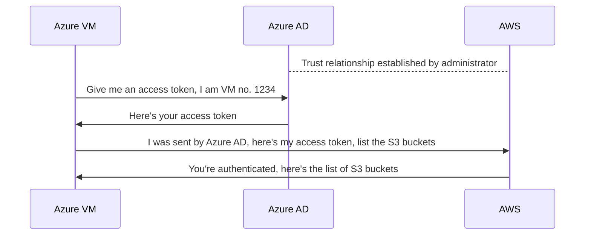

# How to Grant Azure VM Access to AWS Services Using OpenID Connect

In the day to day operations of a software application, it is common to be in a
position to manage and handle multiple cloud providers at the same time.

This can be due to the business requirements or because of technological
constraints on the primary cloud provider of the company.

In this blog post we will see how to grant an Azure Virtual Machine access to
AWS services, without storing any long-lived credentials and with the power of
OpenID Connect.

If you've worked with either cloud, or want inspiration on how to apply this
technique to your setup, then this blog post is for you.

<!-- more -->

## Introduction

The idea of [OpenID Connect](/category/openid-connect/) fascinates me the most.
Especially knowing how useful it is in the modern day of software development
and with the best practices of security as batteries included. Yet, it's really
surprising that is it not as widely adopted or known for as it should be.

It's really one of the most underrated technologies of our time, yet its
effectiveness in what it's promised for is unmatched.

I really wish more and more people could see the potential aspect of using
OIDC in their applications and services and adopting and integrating their
workflows with it.

The truth is, those in the knowing are already benefiting from it at scale,
in ways not intuitively visible to naked eyes, unless you look close enough.
:face_with_monocle:

If you have never used OIDC ever before, or if you're still doubtful of its
potential, then this blog post is for you. We have a full archive of posts
discussing various implementations and integration guides when it comes to
[OpenID Connect](/category/openid-connect/).

## Why Should You Care?

The main objective is simple and very pratical. We want to grant an Azure VM
access to AWS services, e.g., to list the AWS S3 buckets and/or its objects.

Given this task to a non-informed operational engineer, you'd likely see them
passing around AWS credentials into the VM; that can't be the worst problem
happening since if all the other measures are in place, the VM is only
accessible to trusted parties, e.g., through restricting the network access
using security groups, i.e., firewalls.

The matters gets worse real quick when you realize that those secrets need to
be passed to the VM somehow, and one of the ugliest ways you can do that is to
hard-code them in a private repository.

That also cannot be the worst thing happening since if your Git service provider
is never compromised (which is very unlikely in today's world), the very least
you have to worry about is **the rotation of your secrets**!

This is a crucial aspect since there should be a clear and concise plan for
the secret rotation of your platform, ideally through automation and without
the need for manual intervention.

I hope I was successful painting what it's like to operate in such environments.
Honestly, it's not pretty and you have to seriously start planning proactively
to address such shortages and maintain the excellence of your operations.

## What's the Alternative, Then?

Well, OpenID Connect to the rescue. In a nutshell, OIDC ensures that you don't
pass around secrets where you don't have to; that is, places where the identity
of a user, a machine, or a service is the responsibility of an
_Identity Provider_ and through that, you can establish a trust relationship
with a third-party service in such a way that the identities of one provider
are authenticated to the other provider.

If all this sounds too jibberish, let's provide a visual diagram to illustrate
the concept.



As you see in the diagram, the whole idea is that the AWS no longer takes care
of keeping the identities on its side, instead, the trust relationship from
Azure to AWS allows for the identities of Azure to be authenticated by AWS.

If you think about it, the AWS doesn't even **need** to keep the identity
information of such a VM, because it is not a resource managed by AWS after
all.

That's the whole idea of [OpenID Connect](/category/openid-connect/), and in
this post, we will provide the [Infrastructure as Code](/category/iac/) to
implement such a trust relationship between [Azure](/category/azure/) and
[AWS](/category/aws/).

## Directory Structure

Before we start, let's give you an idea of what to expect from a directory
point of view.

```plaintext title="" linenums="0"
.
├── ansible.cfg
├── azure-vm/
├── playbook.yml
├── trust-relationship/
└── vm-identity/
```

## Establishing the Trust Relationship

As per the diagram above, we'll establish that important trust relationship
we've talked about. This is the core of our setup, one that we cannot live
without and the rest of this guide will be useless if not done correctly.

In setting up the trust relationship, you will need to query your Azure AD
tenant for its OIDC configuration endpoint. That is the endpoint where all
the key components of an OIDC compliance are stored, e.g., the `jwks_uri` is
for the public keys that the Azure AD uses to sign the JWT tokens.

In turn, AWS will use those keys to verify the integrity and validity of the
provided JWT tokens; think in terms of Azure signing off tokens with its
private keys, and having its public keys open to the world, anyone can verify
if a given token is signed by Azure or not.

You can see the TF code below.

```hcl title="trust-relationship/versions.tf"
-8<- "docs/codes/2024/0013/trust-relationship/versions.tf"
```

```hcl title="trust-relationship/variables.tf"
-8<- "docs/codes/2024/0013/trust-relationship/variables.tf"
```

```hcl title="trust-relationship/main.tf"
-8<- "docs/codes/2024/0013/trust-relationship/main.tf"
```

```hcl title="trust-relationship/outputs.tf"
-8<- "docs/codes/2024/0013/trust-relationship/outputs.tf"
```

### OpenID Connect Audience

Notice that the `client_id_list` must include a value and based on my findings
so far, I couldn't find a way to customize this _audience_ field anywhere in
Azure. I'd be more than happy to be proven wrong by a diligent reader. :hugging:

But, until then, it's safe to assume that the audience of the JWT token is
what you see in the TF code above. :shrug:

### OIDC URL

Additionally, pay close attention to the URL of our OpenID Connect provider.
This is something tailored specific to Azure AD and its format is just as you
see in the code above, with `sts.windows.net` in the hostname and the tenant ID
in the http path.

Eventually, as per the OIDC compliance, one is able to fetch the OIDC
configuration from such URL by issuing the following HTTP request:

```shell title="" linenums="0"
TENANT_ID="00000000-0000-0000-0000-000000000000"
curl https://sts.windows.net/$TENANT_ID/.well-known/openid-configuration
```

And the response is, of course, all the required and extended functionalities
of Azure AD as far as OIDC is concerned.

??? example "Click to expand"

    ```json title=""
    -8<- "docs/codes/2024/0013/junk/azure-oidc-configuration.json"
    ```

### Applying the Stack

Applying this stack and we will have our trust relationship setup and ready
for the next steps where we will leverage this trust to create an IAM role.

```shell title="" linenums="0"
export AWS_PROFILE="PLACEHOLDER"
export ARM_CLIENT_ID="PLACEHOLDER"
export ARM_TENANT_ID="PLACEHOLDER"

tofu init
tofu plan -out tfplan
tofu apply tfplan
```

## AWS IAM Role

At this point, we should head over to AWS to create a new IAM Role with the
proper conditionals and trust relationship to Azure AD.

The idea is that using the newly created
[OpenID Connect](/category/openid-connect/) provider in the last
step, we can now instruct the AWS IAM to grant access to ^^any identity coming
from such a provider^^ and ^^has a specific subject claim^^ in its JWT token.

If this all sounds a bit too vague, let's see some code to make it more clear.

```hcl title="vm-identity/versions.tf"
-8<- "docs/codes/2024/0013/vm-identity/versions.tf"
```

```hcl title="vm-identity/variables.tf"
-8<- "docs/codes/2024/0013/vm-identity/variables.tf"
```

```hcl title="vm-identity/main.tf"
-8<- "docs/codes/2024/0013/vm-identity/main.tf"
```

```hcl title="vm-identity/outputs.tf"
-8<- "docs/codes/2024/0013/vm-identity/outputs.tf"
```

This stack contains two main components, which we'll explain below.

### 1. User Assigned Identity

The first one includes creating an [Azure](/category/azure/) User Assigned
Identity. This will be the identity of our Virtual Machine in the next step. It
is basically like a username assigned to the VM of our choice and it is
guaranteed to be unique and persistent; that's the reason we can rely on its ID
when placing the conditional on our IAM Role.

```hcl title="vm-identity/main.tf" linenums="19"
-8<- "docs/codes/2024/0013/vm-identity/main.tf:19:23"
```

If you're not an Azure user, one thing to keep in mind is that in Azure
every single resource has to be [placed in a resource group]. That makes grouping
easier on the organization as well as the billing side of things.

### 2. IAM Role and Trust Relationship

The second component is the IAM Role itself. It is the role that we will
assumed by the VM in the next step. There is only one identity in the whole
world who can assume this and that is because of the conditional we placed
on the `sub` claim of the JWT token coming to the AWS STS service, as you see
below:

```hcl title="vm-identity/main.tf" linenums="35"
-8<- "docs/codes/2024/0013/vm-identity/main.tf:35:39"
```

This _principal ID_ is also interchangably called the _object id_; as if working
in Azure environment wasn't confusing enough already. :confounded:

In the end, once this stack is also deployed just as the one before, we will
have an IAM Role similar to what you see below:

```json title=""
-8<- "docs/codes/2024/0013/junk/iam-role.json"
```

## Azure Virtual Machine

At this point all is ready from administration and managerial point of view.
We only need to create the VM, let it know which IAM Role it should assume,
and make a test API call to [AWS](/category/aws/) to list the S3 buckets.

If that works, all this has been successful.

Therefore, we have two main objectives:

1. Create the Azure VM using TF code for the provisioning stage.
2. Wait a bit for the VM to be ready and then run an
   [Ansible](/category/ansible/) playbook to take care of the rest.

In Azure, any VM with an identity attached [can fetch an access token]. You
can grant such identity permissions in and outside Azure cloud. For us, this
is going to be AWS.

The identity of the VM is the most critical part of this next step. One which
the whole operation would be meaningless otherwise. The identity of a VM in
Azure is as if the VM had gotten username and password credentials during the
provisioning stage, using which it would be able to fetch a short-lived access
[token from Azure AD].

Let's stop talking and actually create the VM. Although, bear in mind that this
stack is quite heavy and need careful attention to the details.

```hcl title="azure-vm/versions.tf"
-8<- "docs/codes/2024/0013/azure-vm/versions.tf"
```

Notice that we're, again, using the outputs from our earlier TF stack by
querying the TF state file in this code. :point_down:

```hcl title="azure-vm/main.tf"
-8<- "docs/codes/2024/0013/azure-vm/main.tf"
```

```hcl title="azure-vm/network.tf"
-8<- "docs/codes/2024/0013/azure-vm/network.tf"
```

```hcl title="azure-vm/compute.tf"
-8<- "docs/codes/2024/0013/azure-vm/compute.tf"
```

```hcl title="azure-vm/outputs.tf"
-8<- "docs/codes/2024/0013/azure-vm/outputs.tf"
```

This stack deserves a good amount of explanation. Let's break down the
components and provide proper details.

### Networking

The networking part is similar and hefty to what AWS is in terms of resources
and their relationship. Keeping them in a separate file allows for better
logical grouping and readability.

The Network Security Group (NSG) below is only opening the ports to the admin
public IP address; which is the IP address of the control plan machine applying
this TF stack.

```hcl title="azure-vm/network.tf"
-8<- "docs/codes/2024/0013/azure-vm/network.tf:1:3"
```

```hcl title="" linenums="45"
-8<- "docs/codes/2024/0013/azure-vm/network.tf:45:57"
```

### SSH Keys

Sadly enough, when specifying `admin_ssh_key`, Azure VMs do
[not accept SSH keys] of types other than `RSA`.
Otherwise, the author's preference is `ED25519`. :shield:

### Target Image

As for `source_image_reference`, be very careful when trying to reference an
image in Azure. They do not make
it easy for you to guess an image name or find your preferred image easily.
You'd have to really struggle, and it took me some time to actually come up
with the [following Debian image] that has ARM64 support.

```hcl title="azure-vm/compute.tf" linenums="33"
-8<- "docs/codes/2024/0013/azure-vm/compute.tf:33:38"
```

### User Data

For the VM user data, we're leveraging the [cloud-init]. Do check them out if
not already, but know that I personally find them very limited in terms of
functionality. In more complex cases, I'd rather run
[Ansible](/category/ansible/) playbooks and save the golden image for further
use.

In a nutshell, in the following config we're installing Azure CLI, AWS CLI,
`jq`, and lastly Python3.12 for our next Ansible playbook.

```hcl title="azure-vm/compute.tf" linenums="40"
-8<- "docs/codes/2024/0013/azure-vm/compute.tf:40:51"
```

### Applying the Stack

Once you have the TF code ready, you can apply the stack as follows:

```shell title="" linenums="0"
tofu init
tofu plan -out tfplan
tofu apply tfplan

# needed for the next step
tofu output -raw ssh_private_key > /tmp/oidc-vm.pem
chmod 600 /tmp/oidc-vm.pem
tofu output -raw ansible_inventory_yml > ../inventory.yml
```

In the end, this is what it will look like in [Azure Portal].

<figure markdown="span">
  { align=left loading=lazy }
  <figcaption>Azure Resource Group</figcaption>
</figure>

## Ansible Playbook

It's now time to test this whole setup with a call to AWS. If that call is
successful, everything we've been working so far has been fruitful. :grapes:

The idea is to:

1. Login to Azure AD from within the VM using the user assigned identity
   attached during the provisioning stage.
2. Fetch an access token from Azure AD using that logged in identity.
3. Instruct the AWS CLI to use that access token for calls to AWS services.

The Ansible playbook looks like blow.

```yaml title="playbook.yml"
-8<- "docs/codes/2024/0013/playbook.yml"
```

Let's explain this playbook a little bit.

### Azure AD Login

We first need to login to Azure AD. That is only possible because we have
an identity attached to the VM.

You can see the screenshot below for the user assigned identity in Azure Portal.

<figure markdown="span">
  { align=left loading=lazy }
  <figcaption>Azure VM User Assigned Identity</figcaption>
</figure>

And this is the task that leverages on that.

```yaml title="playbook.yml" linenums="10"
-8<- "docs/codes/2024/0013/playbook.yml:10:11"
```

### Fetch Access Token

At this stage, we can use the newly logged in identity to grab an access token
to be used later on by AWS CLI.

```yaml title="playbook.yml" linenums="13" hl_lines="3 6 9"
-8<- "docs/codes/2024/0013/playbook.yml:13:23"
```

!!! tip "Access Token Expiry"

    By default, Azure AD access tokens are valid for [1 day and 5 minutes]. If
    you have a task that requires a valid token on every access, you can renew
    it before then.

### AWS Role ARN

Remember earlier when in our TF code we saved the role ARN to later be used by
Ansible. This is it.

```hcl title="vm-identity/main.tf" linenums="52"
-8<- "docs/codes/2024/0013/vm-identity/main.tf:52:56"
```

```yaml title="playbook.yml" linenums="24"
-8<- "docs/codes/2024/0013/playbook.yml:24:27"
```

### AWS Configuration

All is ready for AWS to grab the token, use it to authenticate to AWS IAM, and
make an AWS call to list the S3 buckets. We just need to instruct it on where
to pick up the token from.

```yaml title="playbook.yml" linenums="34"
-8<- "docs/codes/2024/0013/playbook.yml:34:42"
```

No surprise here really, we are using the same `~/.azure/vm-identity-token` path
we have populated earlier by fetching an access token from Azure AD.

### Running the Playbook

Of course the playbook runs and successfully lists the S3 buckets as we expected.

```shell title="" linenums="0"
ansible-playbook playbook.yml -e aws_profile=$AWS_PROFILE
```

## Bonus: JWT Claims

If you decode the access token given to the VM by Azure AD, you will see the
following claims in the JWT token.

```json title=""
-8<- "docs/codes/2024/0013/junk/decoded-jwt-access-token.json"
```

## Conclusion

This blog post should wash away all doubts you might have had about the
potential of [OpenID Connect](/category/openid-connect/) and how it can improve
the security posture of your platform.

This is not the only use-case of OIDC, yet you can see the huge gain we've
achieved by not passing around secrets where we didn't need to!

OIDC is also used whenever you, as a user, try to login to a third-party
website and choose "Login with Example".

There are many benefits of integrating such a powerful technology into your
platform, some of the most important ones you have already wintnessed with your
own eyes in this blog post.

After writing so much about OIDC, I feel like I'm being drugged, happy and
peaceful; yet, I still feel like I've only scratched the surface and there's a
lot more implementation of OIDC that is yet to be explored between many of
our online services.

If this blog post has piqued your interest in OIDC, stay tuned for more as I am
as fascinated as you are and I will be writing more about it in the future.

Until then, happy OIDC-ing! :wave:

[not accept SSH keys]: https://learn.microsoft.com/en-us/azure/virtual-machines/linux/mac-create-ssh-keys#supported-ssh-key-formats
[following Debian image]: https://learn.microsoft.com/en-us/azure/virtual-machines/linux/cli-ps-findimage
[cloud-init]: https://cloudinit.readthedocs.io/
[placed in a resource group]: https://learn.microsoft.com/en-us/azure/azure-resource-manager/management/manage-resource-groups-portal
[can fetch an access token]: https://learn.microsoft.com/en-us/entra/identity/managed-identities-azure-resources/qs-configure-portal-windows-vm
[token from Azure AD]: https://learn.microsoft.com/en-us/entra/identity/managed-identities-azure-resources/how-to-use-vm-token
[Azure Portal]: https://azure.microsoft.com/en-us/get-started/azure-portal
[1 day and 5 minutes]: https://stackoverflow.com/a/54038587/8282345
