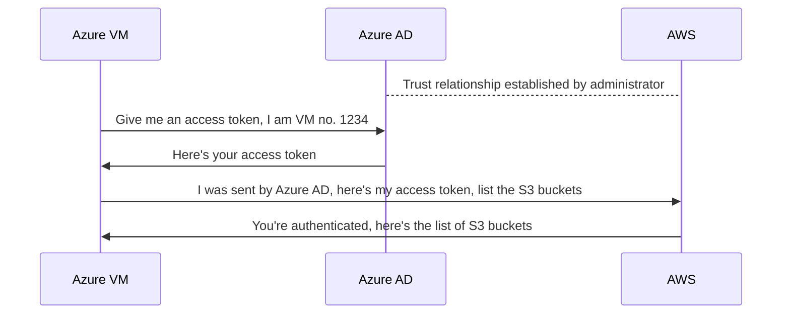

# How to Grant Azure VM Access to AWS Services Using OpenID Connect

In the day to day operations of a software application, it is common to be in a
position to manage and handle multiple cloud providers at the same time.

This can be due to the business requiremetns or because of technological
constraints on the primary cloud provider of the company.

In this blog post we will see how to grant an Azure Virtual Machine access to
AWS services using OpenID Connect, without storing any long-lived credentials
and with the power of OpenID Connect.

<!-- more -->

## Introduction

The idea of [OpenID Connect](/category/openid-connect/) fascinates me the most.
Especially knowing how useful it is in the modern day of software development
and with the security batteries included, it's really surprising that is it not
as widely adopted or known for as it should be.

It's really one of the most underrated technologies of our time, yet its
effectiveness in what it's promised for is unmatched.

I really wish more and more people could see the potential aspect of using
OIDC in their applications and services.

The truth is, those in the knowing are already benefiting from it at scale,
in ways not intuitively visible to naked eyes, unless you look close enough.
:face_with_monocle:

If you have never used OIDC ever before, or if you're still doubtful of its
potential, then this blog post is for you. We have a full archive of posts
discussing various implementations and integration guides when it comes to
[OpenID Connect](/category/openid-connect/).

## Why Should You Care?

The main objective is simple and very pratical. We want to grant an Azure VM
access to AWS services, e.g., to list the AWS S3 buckets and/or its objects.

Given this task to a non-informed operational engineer, you'd likely see them
passing around AWS credentials into the VM; that can't be the worst problem
happening since if all the other measures are in place, the VM is only
accessible to trusted parties, e.g., through restricting the network access
using security groups, e.g., firewalls.

The matters gets worse real quick when you realize that those secrets need to
be passed to the VM somehow, and one of the ugliest ways you can do that is to
hard-code them into a private repository.

That also cannot be the worst thing happening since if your Git service provider
is never compromised (which is very unlikely in today's world), the very least
you have to worry about is **the rotation of your secrets**!

This is a crucial aspect since there should be a clear and concise plan for
the secret rotation of your platform, ideally thorugh automation and without
the need for manual intervention.

I hope I have pictured you waht it's like to operate in such environment.
Honestly, it's not pretty and you gotta make proactive planning to remediate
such shortage in the excellence of your operations.

## What's the Alternative, Then?

Well, OpenID Connect to the rescue. In a nutshell, OIDC ensures that you don't
pass around secrets where you don't have to; that is, places where the identity
of a user, a machine, or a service is the responsibility of an
_Identity Provider_ and through that, you can establish a trust relationship
with a third-party service in such a way that the identities of one provider
are authenticated to the other provider.

If all this sounds too jibberish, let's provide a visual diagram to illustrate
the concept.



As you see in the diagram, the whole idea is that the AWS no longer takes care
of keeping the identities on its side, instead, the trust relationship from
Azure to AWS allows for the identities of Azure to be authenticated by AWS.

If you think about it, the AWS doesn't even need to keep the identity information
of such a VM, because it is not a resource managed by AWS, but by Azure.

That's the whole idea of [OpenID Connect](/category/openid-connect/), and in
this post, we will provide the [Infrastructure as Code](/category/iac/) to
implement such a trust relationship between Azure and AWS.

## Establishing the Trust Relationship

As per the diagram above, we'll establish that important trust relationship
we've talked about. This is the core of our setup, one that we cannot live
without and the rest of this guide will be useless if not done correctly.

In setting up the trust relationship, you will need to query your Azure AD
tenant for its OIDC configuration endpoint. That is the endpoint where all
the key components of an OIDC compliance are stored, e.g., the `jwks_uri` is
for the public keys that the Azure AD uses to sign the JWT tokens.

In turn, AWS will use those keys to verify the integrity and validity of the
provided JWT tokens.

You can see the TF code below.

```hcl title="trust-relationship/versions.tf"
-8<- "docs/codes/2024/0013/trust-relationship/versions.tf"
```

```hcl title="trust-relationship/variables.tf"
-8<- "docs/codes/2024/0013/trust-relationship/variables.tf"
```

```hcl title="trust-relationship/main.tf"
-8<- "docs/codes/2024/0013/trust-relationship/main.tf"
```

```hcl title="trust-relationship/outputs.tf"
-8<- "docs/codes/2024/0013/trust-relationship/outputs.tf"
```

Applying this stack and we will have our IAM Role ready to be assumed by any
identity inside our Azure AD tenant.

```shell title="" linenums="0"
export AWS_PROFILE="PLACEHOLDER"
export ARM_CLIENT_ID="PLACEHOLDER"
export ARM_TENANT_ID="PLACEHOLDER"

tofu init
tofu plan -out tfplan
tofu apply tfplan
```

## Azure Virtual Machine

Now it's time to create a VM in Azure with system assigned identity enabled.
Just like the trust relationship, this is a critical component of our setup.

With a system assigned identity, every Azure VM will be able to fetch an access
token from Azure; it's as if the VM had gotten username and password
credentials during the provisioning time, using which it would be able to fetch
a short-lived access token from Azure AD.

Let's see it in action.

```hcl title="azure-vm/versions.tf"
-8<- "docs/codes/2024/0013/azure-vm/versions.tf"
```

```hcl title="azure-vm/variables.tf"
-8<- "docs/codes/2024/0013/azure-vm/variables.tf"
```

```hcl title="azure-vm/main.tf"
-8<- "docs/codes/2024/0013/azure-vm/main.tf"
```

```hcl title="azure-vm/outputs.tf"
-8<- "docs/codes/2024/0013/azure-vm/outputs.tf"
```
