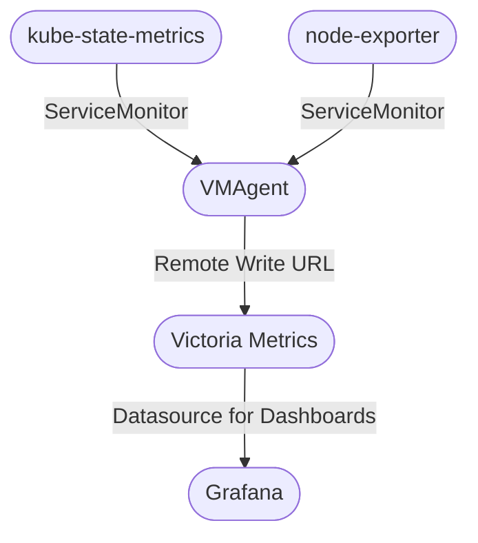

# Victoria Metrics

<!--
VictoriaMetrics: The Ultimate Guide to High-Performance Monitoring
Top 10 Features of VictoriaMetrics You Need to Know
VictoriaMetrics vs. Prometheus: A Detailed Comparison
Getting Started with VictoriaMetrics: Installation and Setup
Why VictoriaMetrics is the Best Choice for Time Series Database
Scaling with VictoriaMetrics: Tips and Best Practices
How to Optimize Your Monitoring with VictoriaMetrics
VictoriaMetrics for Beginners: A Comprehensive Tutorial
Advanced Querying Techniques in VictoriaMetrics
VictoriaMetrics Performance Tuning: Expert Tips and Tricks
How VictoriaMetrics Can Be Your Drop-In Replacement for Prometheus
Unlocking the Power of VictoriaMetrics: A Prometheus Alternative
VictoriaMetrics vs. Prometheus: Why You Should Switch Today
Step-by-Step Guide to Migrating from Prometheus to VictoriaMetrics
VictoriaMetrics: Superior Performance and Scalability for Your Data
Transform Your Monitoring with VictoriaMetrics: A Prometheus Replacement
The Benefits of Using VictoriaMetrics Over Prometheus
How VictoriaMetrics Simplifies Time Series Data Management
Boost Your Monitoring Efficiency with VictoriaMetrics
VictoriaMetrics: The High-Performance Alternative to Prometheus
From Prometheus to VictoriaMetrics: A Seamless Transition Guide
Why VictoriaMetrics Is the Future of Time Series Databases
Optimizing Your Infrastructure with VictoriaMetrics
A Deep Dive into VictoriaMetrics: Features, Benefits, and Use Cases
VictoriaMetrics: The Scalable Solution for Large-Scale Monitoring
How to Get the Most Out of VictoriaMetrics for Your Monitoring Needs
The Ultimate Comparison: VictoriaMetrics vs. Prometheus
Leveraging VictoriaMetrics for Advanced Monitoring and Analytics
Why Developers Are Choosing VictoriaMetrics Over Prometheus
Effortless Monitoring with VictoriaMetrics: A Complete Guide
-->

One of the main tasks of an operations team in any organization is to provide a
solid and robust monitoring solution for the platform, the application, and the
entire infrastructure.

Monitoring enables business owners to understand how their applications behave
in a production setup, how to optimize it, and how to proactively fine-tune &
forecast the future growth of the platform.

In this blog post, we will explore what Victoria Metrics has to offer, how to
set it up and configure it to work as a drop-in replacement for Prometheus and
a datastore for Grafana.

<!-- more -->

## Why Monitoring is Crucial?

Monitoring is crucial because it gives you real-time & historic insights into
the health and performance of your systems, helping you catch issues before
they escalate into bigger problems.

Consider monitoring as a constant health check-up for the systems and
infrastructure, ensuring everything runs smoothly and efficiently.

With successful monitoring, one can optimize resource usage, prevent downtime,
quickly troubleshoot unexpected behaviors, and do capacity planning, ultimately
saving time and reducing costs.

Additionally, it provides valuable data for improving future performance and
planning capacity, making it an indispensable part of managing any tech
environment.

## Introduction to Victoria Metrics

Victoria Metrics[^vm] is a high-performance[^vm-perf], cost-effective time
series database designed for monitoring and observability. It's known for its
speed, efficiency, and scalability, making it an excellent choice for handling
large volumes of data effortlessly.

Furthermore, it’s fully compatible with Prometheus, offering an effortless
transition for those looking to migrate their current monitoring setup.

## Why Victoria Metrics?

Victoria Metrics stands out because of multiple factors.

For one, it is scalable, which is a perfect choice for handling vast amounts of
time series data.

Also, it’s designed to be a drop-in replacement for Prometheus, offering
**faster queries**, better compression, and multi-tenant support.

For me personally, I came across Victoria Metrics looking for a long-term
storage solution for Prometheus. Looking through the available tools, the most
compelling ones were Victoria Metrics and Thanos.

I chose Victoria Metrics because it was far more resource efficient and a lot
easier to set up and configure. With Thanos, there's a huge learning curve and
the overhead and maintainability cost really weighed in on the decision.

## Key Features of Victoria Metrics

- Delivers high performance with fast query capabilities.
- Offers efficient data compression to save storage space.
- Ensures smooth handling of multiple data sources with multi-tenant support.
- Provides effortless compatibility with Prometheus for easy integration.
- Scales easily to manage large datasets.

## Victoria Metrics vs. Prometheus

- **Resource Utilization**: Victoria Metrics is more memory and CPU efficient
  than Prometheus, making it a cost-effective solution. I have personally seen
  as much as a 50% reduction in memory footprint when switching to Victoria
  Metrics.
- **Long-term Storage**: Victoria Metrics has native support for long-term
  storage, whereas with Prometheus, you need to set up a separate solution like
  Thanos[^prometheus-long-term-storage].
- **Scalability**: Victoria Metrics is designed to be scalable both veritically
  and horizontally. Prometheus, on the other hand, falls short in that regard
  and requires additional tools like Thanos to scale.

## Deploy Victoria Metrics

For this guide, we wil use [Kubernetes](/category/kubernetes/) to deploy
Victoria Metrics. Feel free to pick an easy way to create your cluster, like
Minikube, Kind, or K3s.

We have other guides in our archive to set up a Kubernetes cluster if you are
interested:

- [Kubernetes The Hard Way](./0003-kubernetes-the-hard-way.md)
- [How to Install Lightweight Kubernetes on Ubuntu 22.04](0005-install-k3s-on-ubuntu22.md)
- [Create an Azure AKS Cluster with OpenTofu](./0009-external-secrets-aks-to-aws-ssm.md#step-0-setting-up-azure-managed-kubernetes-cluster)

Diagram below shows the installation architecture for this blog post.



### Victoria Metrics Operator

The official provided operator[^vm-operator] for Victoria Metrics has a lot of
benefits compared to alternative one-shot installation methods.

With the Victoria Metrics operator you get to decide the architecture of your
Victoria Metrics using one or multiple CRD resources. It is more flexible in
the long run.

We are using [FluxCD](/category/fluxcd/) as our [GitOps](/category/gitops/)
tool of choice, but feel free to use any other tool you are comfortable with.

```yaml title="victoria-metrics-operator/namespace.yml"
-8<- "docs/codes/2024/0016/victoria-metrics-operator/namespace.yml"
```

```yaml title="victoria-metrics-operator/repository.yml"
-8<- "docs/codes/2024/0016/victoria-metrics-operator/repository.yml"
```

```yaml title="victoria-metrics-operator/release.yml"
-8<- "docs/codes/2024/0016/victoria-metrics-operator/release.yml"
```

```yaml title="victoria-metrics-operator/kustomization.yml"
-8<- "docs/codes/2024/0016/victoria-metrics-operator/kustomization.yml"
```

```yaml title="victoria-metrics-operator/kustomize.yml"
-8<- "docs/codes/2024/0016/victoria-metrics-operator/kustomize.yml"
```

Finally, to deploy this stack:

```bash title="" linenums="0"
kubectl apply -f victoria-metrics-operator/kustomize.yml
```

### Victoria Metrics CRDs

Having the Victoria Metrics Operator installed, we can query and see that we
have the corresponding CRDs available in our Kubernetes cluster.

```bash title="" linenums="0"
kubectl api-resources | grep victoriametrics
```

And the output:

<figure markdown="span">
  { align=left loading=lazy }
  <figcaption>Victoria Metrics Operator CRDs</figcaption>
</figure>

Just by looking at the CRDs here, you can quickly realize how powerful this
mode of installation is and how much flexibility it provides.

For example, one of the quickest ways to provide authentication on top of any
of the Victoria Metrics component instances is to create a `VMAuth` as a proxy
and one or more `VMUser` CRD[^vmauth].

See an example below. :point_down:

```yaml title="" hl_lines="5 36"
-8<- "docs/codes/2024/0016/junk/vmauth.yml"
```

A few seconds after applying these resources, a new Kubernetes Service and a
Secret in the target namespace will be created.

We can get the corresponding password for the user by running:

```bash title="" linenums="0"
kubectl get \
  -n monitoring \
  secret/vmuser-john-doe \
  -o jsonpath='{.data.password}' | \
  base64 -d -
```

Having the password we grabbed from the Secret, and the address from the
`HTTPRoute` resource, we will be prompted for basic HTTP authentication upon
the first visit to the address.

<figure markdown="span">
  { align=left loading=lazy }
  <figcaption>VMAuth Authentication Proxy</figcaption>
</figure>

The best thing about this architecture is that any piece of it is replaceable
by your preferred tooling. If you choose to use a different authentication
proxy server such as [Ory Oathkeeper](/category/oathkeeper/) to take advantage
of your current Identity Provider, you definitely can[^oathkeeper-access-rules].

## Migration From Kube Prometheus Stack

At this point, we will assume that you have the Kube Prometheus
Stack[^k8s-prom-stack] installed in your cluster. Due to the massive adoption
of the Kube Prometheus Stack, this assumption is not far-fetched.

That stack comes with a number of CRDs that make it easier for discovering
new targets for your Prometheus server.

Upon the [installation of Victoria Metrics Operator](#victoria-metrics-operator),
you are, by default and unless excplicitly disabled, opting in for automatic
conversion of every one of the Prometheus Stack's CRDs into that of Victoria
Metrics Operator[^vm-object-conversion].

That, in essence, means that the following conversion table applies to you:

| Kube Prometheus Stack CRD | Victoria Metrics Operator CRD |
|---------------------------|-------------------------------|
| `ServiceMonitor`          | `VMServiceScrape`             |
| `PodMonitor`              | `VMPodScrape`                 |
| `Probe`                   | `VMProbe`                     |
| `PrometheusRule`          | `VMRule`                      |
| `AlertmanagerConfig`      | `VMAlertmanagerConfig`        |
| `ScrapeConfig`            | `VMScrapeConfig`              |

With this table in mind, moving away from Prometheus to Victoria Metrics has
the least overhead. All your current scrape targets (e.g., `ServiceMonitor` &
`PodMonitor`) will continue to work when replacing a Prometheus server with a
`VMAgent` instance.

Your Grafana dashboard will also continue to work as expected just by a change
of datasource address from Prometheus URL to that of Victoria Metrics.

## Scrape Targets with Victoria Metrics

At this point, we should visit our last objective for this blog post. We aim to
scrape targets with Victoria Metrics components and ship them to a storage to
later be queried.

For this purpose, we aim to provide the following variations:

1. Shipping metrics from `kube-state-metrics` and `node-exporter` to
   Victoria Metrics, as you saw earlier in the diagram above.
2. Shipping metrics from the same sources to Grafana Cloud.
3. Shipping metrics from another Prometheus instance elsewhere or a `VMAgent`
   to the Victoria Metrics storage.

### Deploy Victoria Metrics to Kubernetes Cluster

For the deployment of the Victoria Metrics storage, you have the option to
deploy them one by one or all in a single instance. The former gives you more
scalability, whereas the latter gives you more simplicity.

We will deploy the `VMCluster` in this section and leave `VMSingle` for the
last section[^vm-cluster-arch].

We first deploy the storage component , the query component (`select`) and the
ingestion component (`insert`)[^vm-cluster]. These components are the core of
Victoria Metrics.

```yaml title="victoria-metrics-cluster/vmcluster.yml"
-8<- "docs/codes/2024/0016/victoria-metrics-cluster/vmcluster.yml"
```

We then deploy a `VMAgent`, scraping metrics from any of the discovered targets
and ship them to the cluster created with `VMCluster`.

```yaml title="victoria-metrics-cluster/vmagent.yml"
-8<- "docs/codes/2024/0016/victoria-metrics-cluster/vmagent.yml"
```

Notice that in the `VMAgent`, the URL we are passing to the remote-write is
coming from our `VMCluster` instance, one that can be verified with the
`kubectl get service` command, as well as looking through the documentation for
Vicoria Metrics endpoints[^vm-url-formats].

Lastly, we need to be able to access the UI from our browser. That's where the
rest of the components come as you see below.

```yaml title="victoria-metrics-cluster/vmauth.yml"
-8<- "docs/codes/2024/0016/victoria-metrics-cluster/vmauth.yml"
```

```yaml title="victoria-metrics-cluster/vmuser.yml"
-8<- "docs/codes/2024/0016/victoria-metrics-cluster/vmuser.yml"
```

```yaml title="victoria-metrics-cluster/httproute.yml"
-8<- "docs/codes/2024/0016/victoria-metrics-cluster/httproute.yml"
```

```yaml title="victoria-metrics-cluster/kustomization.yml"
-8<- "docs/codes/2024/0016/victoria-metrics-cluster/kustomization.yml"
```

```yaml title="victoria-metrics-cluster/kustomize.yml"
-8<- "docs/codes/2024/0016/victoria-metrics-cluster/kustomize.yml"
```

Finally, to deploy this stack:

```bash title="" linenums="0"
kubectl apply -f victoria-metrics-cluster/kustomize.yml
```

Opening the target address at `/vmui` endopint, we will see the Victoria
Metrics query dashboard as you see below.

<figure markdown="span">
  { align=left loading=lazy }
  <figcaption>Victoria Metrics UI</figcaption>
</figure>

This concludes our first objective, to scrape and ship metrics from the same
cluster.

### Remote Write Victoria Metrics to Grafana Cloud

Grafana Cloud makes it very easy for you to ship your metrics with the least
overhead. You will be responsible for only scraping your targets. The rest is
the taken care of by their infrastructure, including storage, query, scaling,
availabilty, etc.

Let's create a single `VMAgent` to scrape all the metrics and ship them to the
Grafana Cloud.

If you already have one or if you create a new account, they provide a generous
free tier to try out their services.

For the Prometheus server, you will have a remote write URL similar to what you
see below.

```yaml title=""
-8<- "docs/codes/2024/0016/junk/grafana-cloud-remote-write-prom.yml"
```

Let's use this configuration to create such a `VMAgent` instance.

```yaml title="grafana-cloud/vmagent.yml"
-8<- "docs/codes/2024/0016/grafana-cloud/vmagent.yml"
```

This agent will also, just like the last one, scrape all the `ServiceMonitor`,
`PodMonitor`, `VMServiceScrape` & `VMPodScrape` resources.

The difference is, however, that this agent will ship the metrics to the remote
write URL of Grafana Cloud and we won't have to manage any storage or grafana
instance of our own anymore.

### Monitor Standalone Hosts with Victoria Metrics

For addressing the last objective, we aim to make things a bit more different
in that we will scrape the target host from a single standalone machine
(outside Kubernetes) and ship those to the in-cluster Victoria Metrics we
created earlier in our `VMCluster` setup.

Since this is assumed to be a standalone machine, we will use our beloved tool
[Ansible](/category/ansible/). This helps reproducibility as well as
documenting the steps for future reference.

```yaml title="standalone-host/victoria-metrics/vars/vars-aarch64.yml"
-8<- "docs/codes/2024/0016/standalone-host/victoria-metrics/vars/vars-aarch64.yml"
```

```yaml title="standalone-host/victoria-metrics/vars/vars-x86_64.yml"
-8<- "docs/codes/2024/0016/standalone-host/victoria-metrics/vars/vars-x86_64.yml"
```

```ini title="standalone-host/victoria-metrics/templates/vmagent.service.j2"
-8<- "docs/codes/2024/0016/standalone-host/victoria-metrics/templates/vmagent.service.j2"
```

```yaml title="standalone-host/victoria-metrics/templates/vmagent.yml.j2"
-8<- "docs/codes/2024/0016/standalone-host/victoria-metrics/templates/vmagent.yml.j2"
```

```yaml title="standalone-host/victoria-metrics/tasks/main.yml"
-8<- "docs/codes/2024/0016/standalone-host/victoria-metrics/tasks/main.yml"
```

```yaml title="standalone-host/victoria-metrics/handlers/main.yml"
-8<- "docs/codes/2024/0016/standalone-host/victoria-metrics/handlers/main.yml"
```

Having this Ansible role, we can now use it to monitor our target host.

But, before doing that, let's deploy a `VMSingle` instance to our Kubernetes
cluster as promised earlier.

```yaml title="victoria-metrics-standalone/vmsingle.yml"
-8<- "docs/codes/2024/0016/victoria-metrics-standalone/vmsingle.yml"
```

```yaml title="victoria-metrics-standalone/httproute.yml"
-8<- "docs/codes/2024/0016/victoria-metrics-standalone/httproute.yml"
```

```yaml title="victoria-metrics-standalone/kustomization.yml"
-8<- "docs/codes/2024/0016/victoria-metrics-standalone/kustomization.yml"
```

```yaml title="victoria-metrics-standalone/kustomize.yml"
-8<- "docs/codes/2024/0016/victoria-metrics-standalone/kustomize.yml"
```

Finally, to deploy this stack:

```bash title="" linenums="0"
kubectl apply -f victoria-metrics-standalone/kustomize.yml
```

And now we are ready to run the following Ansible playbook.

```yaml title="standalone-host/main.yml"
-8<- "docs/codes/2024/0016/standalone-host/main.yml"
```

```bash title="" linenums="0"
ansible-playbook standalone-host/main.yml
```

All of these approaches are just a few of the many ways you can monitor your
infrastructure with Victoria Metrics. We covered some of the most typical ways
you would normally monitor a production setup. This should give you a good idea
of how to get started with Victoria Metrics.

## Conclusion

Victoria Metrics is a powerful, high-performance and resource efficient
monitoring solution that can easily replace Prometheus in your monitoring
stack. It offers a wide range of features and capabilities that make it an
ideal choice for handling large-scale data and optimizing monitoring
performance.

By following the steps outlined in this guide, you can migrate or integrate
your current monitoring setup with Victoria Metrics effortlessly and take
advantage of its advanced features and benefits.

We have covered some of the most common patterns for monitoring the target
hosts and scraping the metrics to Victoria Metrics. You can use these examples
to build up your own monitoring solution in a way that fits your environment.

If you are looking for a high-performance, scalable, and cost-effective
monitoring solution, Victoria Metrics is definitely worth considering.

Give it a try today and see how it can transform your monitoring experience!

Happy hacking and until next time :saluting_face:, _ciao_. :penguin: :crab:

<!--
Introduction

    Brief introduction to VictoriaMetrics
    Importance of monitoring systems in modern infrastructure
    Purpose of the article: Why consider VictoriaMetrics as a Prometheus replacement

1. Overview of VictoriaMetrics

    What is VictoriaMetrics?
    Key features and capabilities
    Typical use cases and industry adoption

2. VictoriaMetrics vs. Prometheus

    Performance Comparison
        Query performance and speed
        Storage efficiency and data retention
    Scalability
        Handling large-scale data
        Horizontal and vertical scaling capabilities
    Resource Usage
        Memory and CPU efficiency
        Cost-effectiveness in terms of infrastructure

3. Seamless Transition from Prometheus to VictoriaMetrics

    Drop-In Replacement Explained
    Compatibility with Prometheus Query Language (PromQL)
    Step-by-Step Migration Guide
        Data migration strategies
        Configuration and setup
        Testing and validation

4. Unique Features of VictoriaMetrics

    Built-in Multi-Tenant Support
    Advanced Compression Algorithms
    Native support for Prometheus Remote Write API
    Long-term storage solutions
    High availability and fault tolerance

5. Practical Use Cases and Case Studies

    Real-world examples of VictoriaMetrics deployment
    Case studies highlighting performance improvements
    Testimonials from companies that switched from Prometheus

6. Optimization and Best Practices

    Tips for optimizing VictoriaMetrics performance
    Best practices for data ingestion and retention
    Query optimization techniques

7. Tools and Integrations

    Compatible tools and integrations
    Using Grafana with VictoriaMetrics
    Alerting and visualization tools

8. Troubleshooting and Support

    Common issues and solutions
    Community and enterprise support options
    Documentation and resources

9.  Conclusion

    Recap of VictoriaMetrics benefits
    Final thoughts on why VictoriaMetrics is a superior choice
    Call to action: Try VictoriaMetrics today

10. Additional Resources

    Links to official documentation
    Tutorials and guides for deeper learning
    Community forums and discussion groups

11. FAQs

    Address common questions about VictoriaMetrics
    Provide quick answers and direct links to detailed sections of the blog
-->

[^vm]: https://victoriametrics.com/
[^vm-perf]: https://last9.io/blog/prometheus-vs-victoriametrics/
[^prometheus-long-term-storage]: https://prometheus.io/docs/prometheus/latest/storage/#operational-aspects
[^vm-operator]: https://artifacthub.io/packages/helm/victoriametrics/victoria-metrics-operator/0.32.2
[^vmauth]: https://docs.victoriametrics.com/operator/auth/
[^oathkeeper-access-rules]: https://www.ory.sh/docs/oathkeeper/api-access-rules
[^k8s-prom-stack]: https://artifacthub.io/packages/helm/prometheus-community/kube-prometheus-stack/60.1.0
[^vm-object-conversion]: https://docs.victoriametrics.com/operator/migration/#objects-conversion
[^vm-cluster-arch]: https://docs.victoriametrics.com/cluster-victoriametrics/#architecture-overview
[^vm-cluster]: https://docs.victoriametrics.com/operator/quick-start/#vmcluster-vmselect-vminsert-vmstorage
[^vm-url-formats]: https://docs.victoriametrics.com/cluster-victoriametrics/#url-format
