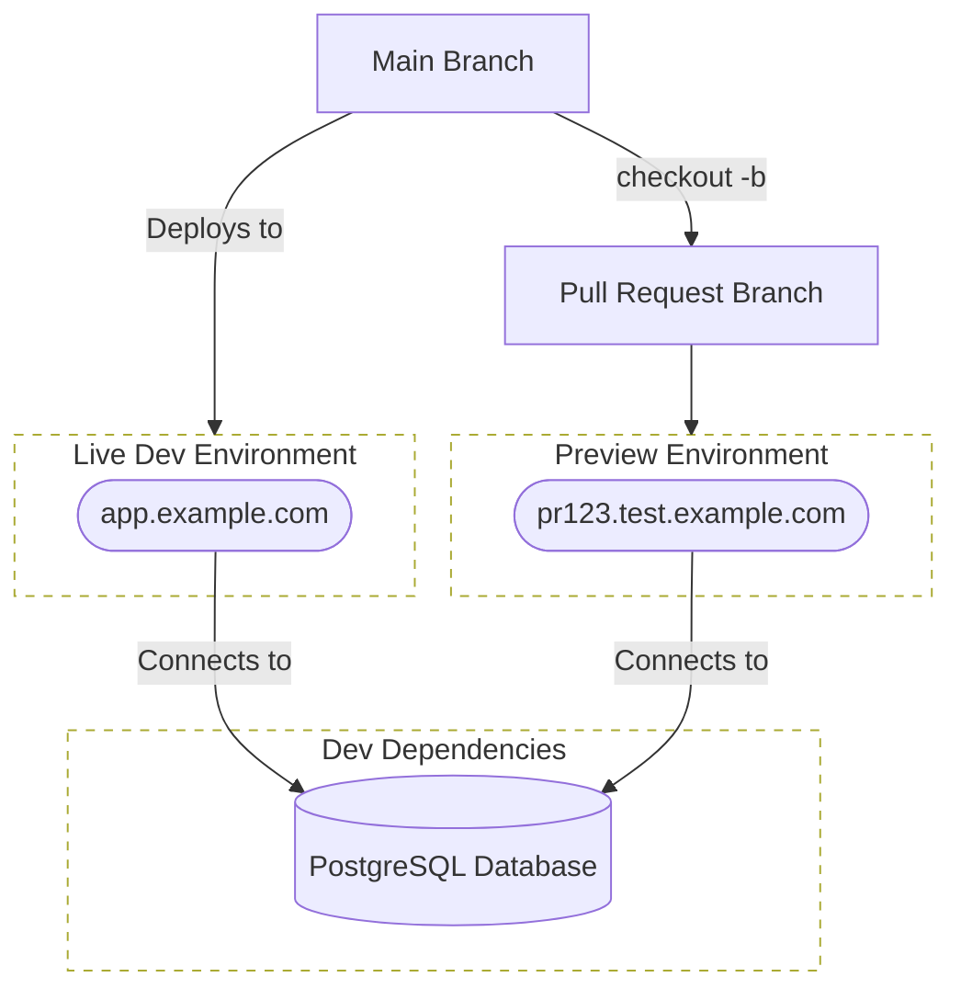

# How to Set Up Preview Environments for Pull Requests

<!--
preview deployment with kubernetes
live application for each pull request
Deploy Preview Versions Instantly on Every Pull Request
How to Set Up Preview Environments for Pull Requests
increase your feedback loop with CI/CD and preview environments
enhanced CI/CD with preview environments on each pull request
game up your CI/CD with preview environments
how to set up preview environments for pull requests
-->

Have you ever been frustrated at long merge queues? Did you ever wish there was
a better and faster way to get feedback on your code changes and approval from
your team members?

You may have also been on the other side of the table, reviewing pull requests
and wishing there was a better way to actually test the revisions before
approving it; giving you a sense of what it would feel and look like if it were
to merge.

Netlify and other frontend hosting services have spoiled us with the ability to
spin up a live instance of the application for each pull request for static
files. But what about backend applications? How can we achieve the same and
deploy our backend for every new proposed change in the pull request?

In this blog post, we will explore how to set up preview environments for each
pull request using GitHub Actions and Kubernetes. This guide includes spinning
up the application as a live instance with an internet accessible URL to
preview and verify the changes before they find their way into the main trunk.

## Introduction

When working in a team environment, it's common to adopt the pull-request style
for collaborations. This ensures that the quality of the codebase is maintained
having some guardrails to avoid merging changes that are undesired and/or do
not meet a certain standard of the team.

This process can become tedious, especially at scale and working with more than
a few team members. Although there are tools and practices to help with the
coordination and overhead associated with code reviews, there is still an
ongoing maintainance cost when it comes to keeping up with the flow and pace
of changes proposed to the codebase, i.e., pull requests.

One of the main reasons code reviews are tough to deal with is the efforts
required to spin up the application as proposed in the pull request. Any of the
modern day applications today depends on many services and dependencies, e.g.,
databases, caches, queues, etc.

Not only that it is not easy to set up all these dependencies right out of the
box, the communication between the application and these services is often a
giant undertaking on its own, perhaps nothing less than setting up a full
production environment; we all know how cumbersome that can be due to the
planning and operational mindset required.

Furthermore, the application and all its dependent services need computation
power and resources to run. This is challenging when your production
environment is working at scale of a country, continent, or even the world.
Imagine having to deploy Zookeeper, Kafka, and Cassandra just to test a small
change in the application. It's not only time-consuming but also resource
intensive.

That is where the preview environments come into play. It allows you to see the
live state of the application as proposed in the pull request, with all the
bells and whistles, without having to set up the environment yourself.

## What is a Preview Environment?

A preview environment is a live instance of the application that is spun up
after each push to the pull request branch. This environment is usually an
identical copy of the dev or ideally prod environment with all the services and
dependencies that the application relies on. If the application needs to talk
to a database or the cache system, those communications are also set up in the
preview environment.

The whole point of preview environments is to help the author of the pull
request and other team members to see the application as it would look like if
the changes were to merge. This helps in speeding up the feedback loop and the
approval process, as the reviewers can see the changes in action and verify
that they are desirable.

What's more, the preview environment helps reduce the procrastination factor to
zero, not requiring any of the reviewers to go through the manual labor of
pulling the changes and setting up the environment locally to see the new
state of the application. As a result, the feedback loop is shortened and the
merge queue less congested.

To help better replicate the production environment, the preview environment is
usually designed in a way that closely resembles that environment, or at least
as close as possible. This ensures there is no surprises when the pull requests
are merged and the regressions are minimized.

To help with the cost optimizations, there is the possibility of sharing the
services and dependencies between the preview environment and the dev
environment. Sharing it with the prod, however, is way too risky and outweights
the benefits; any proposed change in the pull request is error prone and
susceptible to bugs and regressions that can have an unpredictable impact to
your end-users.

Additionally, depending on the structure and deployment of the dev or prod
environment, the preview environment is accessible from the internet using a
unique URL, e.g., `pr123.test.example.com`.

Having an internet-accessible endpoint allows other team members to test,
review and verify the proposed changes in the pull request as a live instance.
This greatly facilitates team working for organizations working in an async
fashion, possibly from different timezones, to collaborate and provide feedback
on the changes as soon as possible, with the least delay and to help unblock
the merge queue.

## What Preview Environment is NOT?

It's important to highlight that in no way the preview environment can be a
substitute for regular workflow of the software development lifecycle.

Even with a preview environment for each pull request, the author of the
changes still need to locally run the application, review, test and verify that
everything works as expected.

Moreover, the automated tests of the application need to run before or at least
during the deployment of the preview environment. You should, at the very
least, run your small and fast unit tests locally before pushing the changes to
the pull request branch.

The preview environment is a powerful tool, but it's not a silver bullet. At
the end of the day, when all is said and done, *no tool and technology can
replace the engineering culture and mindset of the team*.

## Why is Preview Environments beneficial?

Working in a team and receiving instant feedback from the impact of your work
is essential to the success of the project. It allows using all the powers of
the team combined, and not just the sum of each individual's effort.

Here are the main reasons why you should consider setting up preview
environments for each pull request.

- [x] **Speed up the feedback loop**: The preview environment allows the author
      of the pull request and the reviewers to see the new revisions instantly.
      This greatly speeds up the feedback loop and the approval process.
- [x] **Enhanced continuous integration**: Having fast and short feedback loop
      upon code reviews, as well as the automated tests running in parallel,
      allows the dev team to see their changes faster in the codebase, giving
      the sense of accomplishment, seeing the result of their work in the
      codebase.
- [x] **Powers up the code reviews**: The reviewers have less manual labor when
      verifying the integrity and correctness of the new revision of the code.
      The live instance of the application can quickly give a look 'n feel of
      the changes and the impact it will have on the application.
- [x] **Improved (remote) collaboration**: People have different task
      priorities on their working day and one may or may not be able to review
      a change in the codebase at the same time as the author. The preview
      environment facilitates asynchronous collaboration.
- [x] **Better developer/testing experience**: Having instant access to an
      already deployed instance of the new application is a boost in
      productivity, enabling fast validation within the dev team as well as the
      product team.
- [x] **Short merge queues**: A better code review results in instant
      verification. Having the newer revision of the app available for testing
      on-demand significantly increases the likelihood of convincing reviewers
      to provide input and feedback. This is because there is less resistance
      due to the time required for testing.
