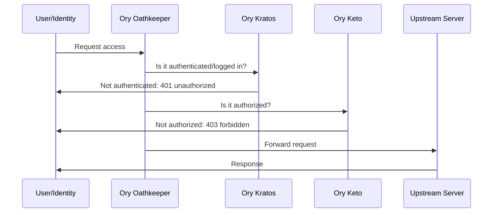
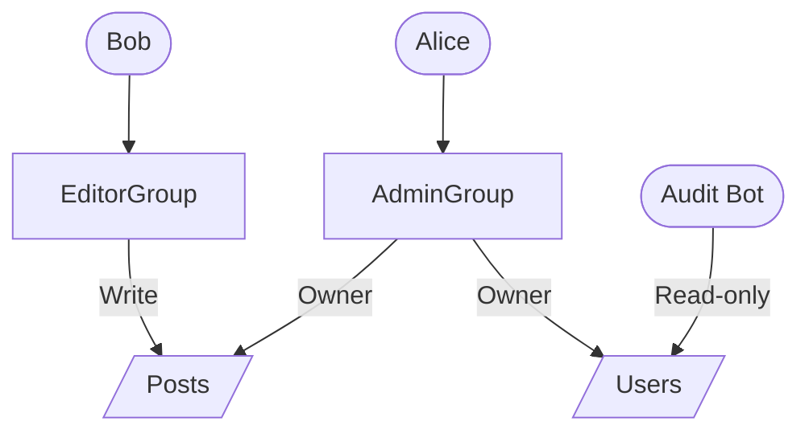

# Ory Keto: Authorization and Access Control as a Service

Internet has come a long way since its inception. The first few years might
have been a new adventure for those building web applications, but in the
modern day software development and in 2024, you rarely stop to question most
of the common practices around the industry.

One of the most frequent requirement for any application is to have some sort
of access control policy. The most used approach in today's world is the use
of RBAC. It makes a lot of sense to treat a group of one or multiple identities
of a system the same way and grant or deny them a specific set of permissions.

Ory Keto comes with all the batteries included. It provides a fearless
authorization platform, friendly API for developers, and scalable stateless
application.

If you're creating an application over HTTP these days, chances are, Ory Keto
has a lot to offer you. Stick around till the end to find out how.

<!-- more -->

## Introduction

Today's software development is rarely just the software itself. We all get
tangled up in all the other aspects of production-readiness and the ever so
famous *checklist*.

We find ourselves doing only %20 application development. The rest gets us all
so busy with the never ending yak-shavings[^yak-shaving].

Fortunately for us, [Ory] comes with a bundle of plug-and-play products to make
our lives easier. We will have one less aspect to worry about when it comes to
securing our application in the wild world out there.

With Ory [Keto], you can grant or deny access to your application in a flexible
manner, customize the permission sets as required, and grow effortlessly as
your application scales.

<!-- subscribe -->

## What is Ory Keto?

Ory Keto is a one-stop shop for all the authorization needs. With Keto, you can
define policies, roles, and permissions for your application. These policies
can be written in the Ory Permission Language(OPL)[^ory-perm-lang] in the form
of either a programming language SDK, or a configuration file in JSON or YAML.

It has a friendly REST API[^keto-http-api] that you can use to query or modify
the policies on the fly.

In short, with [Ory] Keto you can answer the second most important question:

***Is the user/identity X allowed to access the resource Y?***

In that the first one is: ***Is the request authenticated/logged-in?***

We will get to the nitty gritty details of how it identifies how to answer this
under the hood in a bit, but the important thing to mention here is that it
simplifies the [authorization] problem by centralizing the policies and
consolidating the definitions in one place.

## Why Ory Keto?

[Keto] is not the only authorization solution out there. The reality is that
there are countless other alternatives, each with their own strength and
flexibility. You may end up getting lost finding the right fit for your setup!

There are programming language authorization libraries such as Casbin[^casbin] and
OPA[^opa]. There are cloud-based solutions such as Auth0[^auth0] and
Okta[^okta].

In my experience managing production workloads over the years, I have found
that the authorization is mostly an operational concern.

Although some folks may disagree, I have found that taking the authorization
out of the application simplifies the maintainability and long-term success of
the application, allowing the developers focusing on increasing the success and
richness of the business logic.

However, when placing RBAC and other [authorization] mechanisms inside the
application, you'll end up with a lot of code that is mostly relevant to the
production environment and only slows the developers down when working locally.

*Why is that an issue?* one might ask. Well, imagine having to populate your
access policy documents at the start of the application on each local
development. That's a waste of computation and engineering time.

On top of that, every time a new member joins the team, you end up having to
explain the [authorization] mechanism to them and how to set the whole thing up.

We may get clever automating the process by creating a migration step for the
authorization policies. However, that only pushes the problem to a different
layer rather than solving it.

All in all, [Ory] Keto is a great place to offload such a tedious task, and it
comes with a lot of flexibility in the operational and admin layer.

Everything that you would otherwise require a production release to reflect on
production can be a switch or an API call in the production when managing the
authorization of your platform at the operational level, using an authorization
as a service tool such as Ory [keto].

!!! note "Disclaimer"

    This blog post is **NOT** sponsored by Ory(1). I'm just a happy user of
    their products and I want to share my experience with you.
    { .annotate }

    1.  Though, I definitely wouldn't mind seeing some dollars.
        :money_mouth_face:

## How Does Ory Keto Work?

If you've worked with RBAC systems before, understanding the inner workings of
Ory Keto should be a piece of cake for you. :cake:

It also closely resembles [Linux] file permissions[^linux-file-permissions], in
that you can assign users to groups, and allow them a certain level of access
over files and directories.

To make the matters more clear, we are gonna use an illustration below.

Bear in mind that this diagram is loaning what we've built before with Ory
[Kratos] and Ory [Oathkeeper] and you are more than welcome to give those a read
as well.

- [Ory Oathkeeper: Identity and Access Proxy Server]
- [Ory Kratos: Headless Authentication, Identity and User Management]



Here are the steps, simplified for better understanding:

1. The request comes into the system, [Oathkeeper] takes the request.
2. The Oathkeeper will consult the [Kratos] to see if the request is
   authenticated.
3. If the request is not authenticated, the user will get a `401 Unauthorized`
   response, redirected to the login page, or another action based on
   configuration.
4. If the request is authenticated, the Oathkeeper will consult the [Keto] to
   see if the request is authorized.
5. If the request is not authorized, the user will get a `403 Forbidden`
   response, and the corresponding error message will be displayed.
6. If the request is authorized, the Oathkeeper will forward the request to the
   upstream server, waits for the response and returns it to the user.

This flow will repeat for every request coming into the system. Since all of
these services are stateless, you can scale them on-demand; the only bottleneck
will be the SQL database running in the background and there different
techniques to scale that as well[^timescale-scaling-postgres].

In our series covering the [Ory] products, we've already covered all the way
until step 3. This blog post will cover the authorization part, step 4.

At the end of this article, you should be able to protect your upstream server
from any unauthorized access, without the need to implement it manually in your
code.

That, in effect, means that you can take any application in the wild, and
protect it using only the operational layer, without touching the application,
and without even needing to understand or modify its code.

## How to Deploy self-hosted Ory Keto?

You don't necessarily have to deploy the [Keto] yourself to take it for a
spin[^ory-network].
However, we are feeling nerdy here and can't help it. :nerd:

Additionally, I, personally, have found the Ory's Helm charts[^ory-helm-repo]
to be extremely inflexible and hard to customize. You'd expect that using a
template engine would allow your downstream users more wiggle room, but the sad
reality is that in my opinion, there's a lot of room for improvement in their
Helm charts[^ory-helm-charts].

Here's the tree structure before getting into the code:

```plaintext title="" linenums="0"
./keto/
├── deployment.yml
├── externalsecret.yml
├── httproute-read.yml
├── httproute-write.yml
├── keto-server-config.yml
├── kustomization.yml
├── kustomize.yml
├── service-read.yml
└── service-write.yml
```

As such, we are using [Kustomization] in the following stack:

```yaml title="keto/deployment.yml"
-8<- "docs/codes/2024/0018/keto/deployment.yml"
```

```yaml title="keto/externalsecret.yml"
-8<- "docs/codes/2024/0018/keto/externalsecret.yml"
```

```yaml title="keto/httproute-read.yml"
-8<- "docs/codes/2024/0018/keto/httproute-read.yml"
```

```yaml title="keto/httproute-write.yml"
-8<- "docs/codes/2024/0018/keto/httproute-write.yml"
```

The most important part of the [Keto] server configuration below, besides all
the operational configurations and boilerplates, is the `namespace` definition.
More on that in a bit.

```yaml title="keto/keto-server-config.yml" hl_lines="7-11"
-8<- "docs/codes/2024/0018/keto/keto-server-config.yml"
```

```yaml title="keto/kustomization.yml"
-8<- "docs/codes/2024/0018/keto/kustomization.yml"
```

```yaml title="keto/service-read.yml"
-8<- "docs/codes/2024/0018/keto/service-read.yml"
```

```yaml title="keto/service-write.yml"
-8<- "docs/codes/2024/0018/keto/service-write.yml"
```

Lastly, let's apply this stack:

```yaml title="keto/kustomize.yml"
-8<- "docs/codes/2024/0018/keto/kustomize.yml"
```

```bash title="" linenums="0"
kubectl apply -f keto/kustomize.yml
```

Once this stack is up, we can use the [Keto] CLI[^keto-cli-installation] to
check the connection to the server.

```bash title="" linenums="0"
$ export KETO_READ_REMOTE=acl.developer-friendly.blog:443

$ keto status
SERVING

$ keto relation-tuple get
NAMESPACE       OBJECT  RELATION NAME   SUBJECT

NEXT PAGE TOKEN
IS LAST PAGE    true
```

## What is the Namespace in Ory Keto?

We've been putting it off for a while, but it's time to address the elephant in
the room :elephant:. The `namespace` in [Keto] is the most important concept
you should be aware of to understand the model of the [authorization] Keto
provides.

It is this concept that allows you to create a multi-tenant system, where each
tenant can have its own set of policies, roles, and permissions.

It grants the ability to create hierarchical permission structures, RBAC, and
ABAC models, and allows you to create a complex set of rules that can be
applied to a specific tenant or a group of tenants.

Let's provide some concrete examples to make it more clear.



Let's explain some of the higlights of this diagram before putting it all into
code.

- [x] There are two groups of entities in our system, one identity in each.
- [x] Granting resource access to a group falls under the RBAC category, e.g.,
      `AdminGroup` to `Posts` relationship.
- [x] Granting resource access to a specific identity falls under the ABAC
      category, e.g., `AuditBot` to `Users` relationship.

It is usually the case that RBAC is a more flexible and desirable permission
model, especially at scale.

ABAC, however, is more granular and can be used to create a more fine-grained
permission model, yet it might be harder to maintain over the long run.

Overall, it's not uncommon to see a combination of both models in a system.

### What are my namespaces?

It's not unusual to get lost in what namespaces you have in your system.
It can be a bit tricky to define the boundaries of a namespace.

However, there is one recipe that can help you understand and define those
namespaces and it is this:

Whenever there is a relationship between a subject or a subject group and
an object, there is a namespace.

For example, in the diagram above, we have two namespaces: `roles` and
`endpoints`.

That's because we have relationships between the identities and the the groups
we want to assign them to (`roles`).

We also have relationships between the groups and the resources we want to
grant them access to (`endpoints`).

Whenever you get lost in defining your namespaces, remind yourself that the key
here is the **relationship**.

Let's define the relationships in the following sections. These are the files
you are going to see:

```plaintext title="" linenums="0"
./permissions/
├── auditbot.json
├── members.json
└── rbac.json
```

### Role-Based Access Control (RBAC)

Now that we know what is and isn't a *namespace*, let's create our groups and
their members in the [Keto] server[^keto-create-relationship-api].

```json title="permissions/members.json"
-8<- "docs/codes/2024/0018/permissions/members.json"
```

You can create these permissions in your own application code by issuing
requests to the admin interface of these services ([Kratos] & [Keto]).

For example, if a new user signs up to the application, you can decide whether
or not to add them to a specific group, or grant them a certain permission.

After this initial permission creation in the application code, [Ory] products
will take care of the authentication and authorization for you, without any
request ever reaching your application if it is not meant to.

Now, let's grant permissions to our groups.

```json title="permissions/rbac.json"
-8<- "docs/codes/2024/0018/permissions/rbac.json"
```

These permissions define the following relationships:

- Any identity in the `EditorGroup` can read and write to the `Posts` endpoint.
- Any identity in the `AdminGroup` can read and write to the `Posts` endpoint.
- Any identity in the `AdminGroup` can read and write to the `Users` endpoint.

If we did not define the two namespaces in the Keto server configuration, we'd
get a `404 Not Found` error when trying to create these permissions.

**NOTE**: The values we specified for `relation` and `object` are dynamic and
can be customized to reflect our business logic. The value of the `namespace`,
however, is static and should be defined in the server configuration
beforehand.

### Attribute-Based Access Control (ABAC)

Let's briefly switch gears and create our single permission for the `AuditBot`.

The idea is that our `AuditBot` should be able to view the users of the system.
This will allow for auditing the system without having to have access to the
user's data.

```json title="permissions/auditbot.json"
-8<- "docs/codes/2024/0018/permissions/auditbot.json"
```

Here, we are not adding the audit bot to any group. Instead, we are granting
the permission directly to the identity.

The reason why ABAC can be harder to maintain is that you have to keep track of
all the identities and their permissions in the system. This can be a daunting
task as the number of identities in a system grows.

## Query the Permission Engine

We have created our demo permissions and groups. Now, let's verify that the
permissions are working as expected.

We will combine the Oathkeeper and the Keto for an integrated auth solution
in a bit, but let's query the Keto server directly for now.

```bash title="" linenums="0"
curl -X POST \
  https://acl.developer-friendly.blog/relation-tuples/check \
  -Hcontent-type:application/json \
  -d'{"namespace":"endpoints",
      "object":"users",
      "relation":"write",
      "subject_id":"alice@developer-friendly.blog"}' \
  -D -
```

The result of this query will be a `200 OK` with the following response:

```json title="" linenums="0"
{"allowed":true}
```

Noticed the beauty? The query is asking for specific write permission for the
email address, yet we did not have any explicit permission for that email.

However, the Keto permission and policy engine will recurse through the groups
until the maximum of predefined `max-depth` is reached. If no permission
matches, a `403 Forbidden` will be returned.

```mermaid
flowchart TB
    alice([alice@example.com])
    Users[/Users/]

    alice --> |Member of| AdminGroup["Admin Group"]
    AdminGroup --> |Write permission| Users
```

## Verify the Permissions and Access Control

As before, we're heavily relying on our previously built stack on the [Ory]
series. If you need a refresher, give them a look before proceeding.

[Ory]: /category/ory/
[Keto]: /category/keto/
[authorization]: /category/authorization/
[Kratos]: /category/kratos/
[Linux]: /category/linux/
[Oathkeeper]: /category/oathkeeper/
[Kustomization]: /category/kustomization/
[Ory Oathkeeper: Identity and Access Proxy Server]: ./0015-ory-oathkeeper.md
[Ory Kratos: Headless Authentication, Identity and User Management]: ./0012-ory-kratos.md

[^yak-shaving]: https://seths.blog/2005/03/dont_shave_that/
[^ory-perm-lang]: https://www.ory.sh/docs/keto/#ory-permission-language
[^keto-http-api]: https://www.ory.sh/docs/keto/reference/rest-api
[^casbin]: https://casbin.org/
[^opa]: https://www.openpolicyagent.org/
[^auth0]: https://auth0.com/
[^okta]: https://www.okta.com/
[^linux-file-permissions]: https://en.wikipedia.org/wiki/File_system_permissions
[^timescale-scaling-postgres]: https://www.timescale.com/learn/guide-to-postgresql-scaling
[^ory-network]: https://console.ory.sh/
[^ory-helm-repo]: https://github.com/ory/k8s
[^ory-helm-charts]: https://artifacthub.io/packages/search?repo=ory&sort=relevance&page=1
[^keto-cli-installation]: https://www.ory.sh/docs/keto/install
[^keto-create-relationship-api]: https://www.ory.sh/docs/keto/reference/rest-api#tag/relationship/operation/createRelationship
[^kratos-list-identities-api]: https://www.ory.sh/docs/kratos/reference/api#tag/identity/operation/listIdentities
