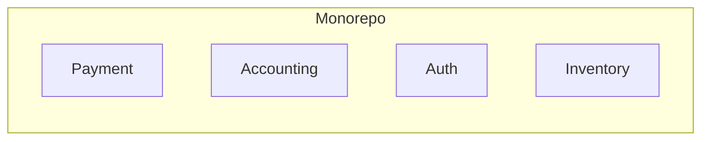
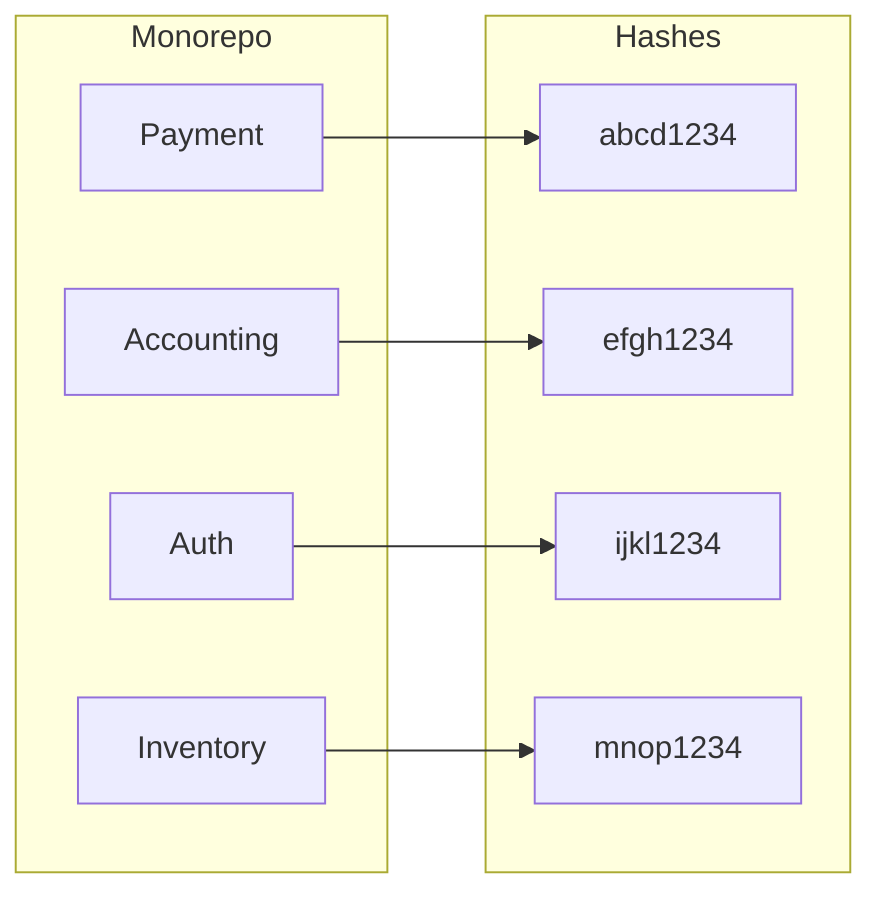

# Monorepo Strategies: Selective Builds for Changed Applications

Monorepo is the practice of storing all your code in a single repository, which
can be beneficial for code sharing, dependency management, and version control.

However, there is no free lunch! As your codebase grows, managing builds become
unavoidably complex and time-consuming. This build time is billed on your
organization and it can get quite costly.

In this blog post, we'll explore the challenges of building only changed
applications in a monorepo and discuss strategies to optimize your workflow
with selective builds.

If this gets you excited, let's dive in!

<!-- more -->

## Introduction

In the modern day of software development, where it is claimed that *software
is eating the world*[^software-eating-world], it's important to stay sharp and
ahead of the game, not falling victom of our own success.

Monorepo is one of the strategies to help manage the codebase of multiple
applications, while keeping them in a single repository, squeezing every ounce
of collaboration and teamwork out of your team.

It comes with its own benefit and challenges of course. Let's explore them in
more detail.

### What is a Monorepo and Why Use It?

A monorepo is a single repository that contains the source code for multiple
projects or applications. This approach is commonly used by organizations to
manage large codebases, share code between projects, and simplify dependency
management.



It allows standardizing some of the organization-wide practices for packaging,
building, dependency management, and deployment. It enables more accessible
codebase where audits are done faster, dependencies can be upgraded
simultaneously and the overall development experience is more streamlined.

### The Challenge of Building Only Changed Applications

As the codebase in a monorepo grows, it becomes evidently clear that builds
will cost more compute time and resources. This is because the build process
often involves compiling, testing, and packaging all applications in the
repository, even if only a few of them have changed.

<figure markdown="span">
  { align=left loading=lazy }
  <figcaption><a href="https://unsplash.com/photos/man-wearing-white-top-using-macbook-1K9T5YiZ2WU" target="_blank">Full focus at a coffee shop</a></figcaption>
</figure>

This inefficiency can lead to longer build times, increased resource consumption,
and slower feedback loops for developers. To address this challenge, developers
need to implement strategies for building only the applications that have
changed since the last build.

### Key Advantages of Using a Monorepo Structure

Monorepo comes with a couple of very sexy and appealing advantages:

- [x] **Code Sharing**: Developers can easily share code between projects and
      applications, reducing duplication and improving consistency.
- [x] **Dependency Management**: Dependencies can be managed at the repository
      level, ensuring that all applications use the same versions of libraries
      and packages.
- [x] **Version Control**: Changes to multiple applications can be tracked and
      managed in a single repository, simplifying version control and code reviews.
- [x] **Collaboration**: Teams can work together more effectively by sharing
      code, reviewing changes, and coordinating releases in a single repository.
- [x] **Consistency**: Standardized build processes, testing frameworks, and
      deployment pipelines can be applied across all applications in the repository.

### Disadvantages of Monorepo Structure

However, there are some disadvantages to using a monorepo structure:

- [x] **Complexity**: Managing a large codebase with multiple applications can
      be complex and challenging, especially as the number of projects grows.
      This will require a lot of discipline and organization.
- [x] **Build Performance**: Building all applications in the repository can be
      time-consuming and resource-intensive, leading to longer build times and
      slower feedback loops for developers.
- [x] **Dependency Conflicts**: Dependencies between applications can lead to
      conflicts and compatibility issues, requiring careful management and
      coordination between teams.
- [x] **Security Risks**: A single repository can be a single point of failure
      for security breaches, so it's important to implement strong access controls
      and security measures to protect the codebase.

## The Problem with Full Rebuilds

When you make changes to a single application in a monorepo, the traditional
build process often involves rebuilding all applications in the repository. This
can be inefficient and time-consuming, especially if only a few applications have
changed.

Structured poorly, this can lead to a lot of wasted time and resources, which
could be better spent on more productive tasks. Imagine spending on a lambda
function that runs for 10 minutes, but only 1 minute is used for the actual
work!

That's the main reason why optimizing the build process is crucial to benefit
from the advantages of a monorepo structure, while minimizing the drawbacks.

### Why Full Rebuilds are Inefficient

Full rebuilds are inefficient for several reasons:

- [x] **Resource Consumption**: Building all applications in the repository
      requires more compute resources, leading to higher costs and longer build
      times.
- [x] **Build Time**: Rebuilding unchanged applications is a waste of time and
      can slow down the feedback loop for developers.
- [x] **Developer Productivity**: Waiting for full rebuilds to complete can
      reduce developer productivity and hinder collaboration between teams.
- [x] **CI/CD Pipelines**: Full rebuilds can overload CI/CD pipelines and
      increase the risk of build failures and bottlenecks.

## Strategies for Building Only Changed Applications

To address the challenges of full rebuilds in a monorepo, developers can implement
strategies for building only the applications that have changed since the last
build. This can help optimize build performance, reduce resource consumption, and
improve developer productivity.

There are various strategies to employ, each can be fitting for different
organizations and teams. Let's explore some of them.

### Using Dependency Graphs to Identify Changes

One approach to selective builds is to use dependency graphs to identify the
applications that have changed and need to be rebuilt. By analyzing the
dependencies between applications, developers can determine which applications
are affected by a change and only rebuild those applications.

### Implementing Selective Builds with Build Tools

Another strategy is to use build tools that support selective builds, such as
Bazel or Lerna. These tools allow developers to define build targets for
specific applications and only rebuild those targets when changes are detected.

### Leveraging CI/CD Pipelines for Optimized Builds

CI/CD pipelines can also be used to optimize builds in a monorepo by triggering
builds only for the applications that have changed. By setting up automated
pipelines that monitor changes in the repository, developers can ensure that
only the necessary applications are rebuilt.

This is the approach we will explore in this article, implementing an efficient
CI/CD pipeline that will trigger the build for only the applications that have
changed since the last build.

## Selective Builds in Practice

We have done a lot of talking so far. Let's get hands-on a bit. :nerd:

Imagine having a monorepo with the following code structure:

```plaintext title="" linenums="0"
monorepo/
├── payment/
├── auth/
├── inventory/
├── order/
├── shipping/
└── frontend/
```

We need a way to findout about the changes in the repository in each
application. As explained earlier, there are different ways to do this.

To keep things simple, we will follow a naive approach by identifying the
changes of an application by looking at the changes to the contents of the
files within its directory.

If we, somehow, figure out a way to map the current contents of the files down
to a single unique string (i.e. a hash), we can compare future changes of any
of the files within that directory to the earlier computed hash and determine
if the application needs a rebuild.



With the hashes we collected in our first run, in any of the future pushes to
the repository, running the same hash function should either:

1. Generate the same hash output, meaning no changes were made to the files
   within the application directory, :lock: or
2. Generate a different hash output, meaning changes were made to the files
   and we need a rebuild of that application to reflect the new state of the
   app. :twisted_rightwards_arrows:

### Hash Function for Selective Builds

*What if there was a way we could map our directory's content to a hash?*

That's the question we will cover in this section. It aims to calculate a
single finite string that represents the current state of the files within a
directory.

This function has to have knowledge of the contents within each of the files in
that directory because any future changes to those files should change the
output of this hash function.

Consequently, and completely irrelevant, the hash function is a one-way
function, meaning we can't reverse-engineer the contents of the files from the
hash output. This may or may not be a compliance requirement for your
orgniazation, yet it is good to know that it's already the case if the need
arises.

```shell title=""
find . -type f -exec sha256sum {} \; | \
  awk '{print $1}' | \
  sha256sum - | \
  awk '{print $1}'
```

There are 4 steps happening in this hash function. Let's break it down:

:one:  We first find all the files in the current working directory using the
`find` command. Directories are not needed as `sha256sum` works on files!
For each of the found files, calculate the SHA256 hash of the file's content
and print it to stdout. Here's the sample output:

```plaintext title="" linenums="0"
4cde77ce6b1585c84f26e517ce28ce1d6b0c2d0e509110444c5938447e6d5c2b  order/Dockerfile
0923360dc7503b16d208f70bb3e5d27908c302312ea79b9d7105d360e84b868c  order/main.rs
8f60efa0e14bd576a88514ad5235cc27ea6067bdf4381e07a857cffdf70bd213  auth/Dockerfile
d4e0a53dc7f9d1604df94d33ab563935429f798c2a2f903323196c94818fb5e6  auth/main.py
e3b0c44298fc1c149afbf4c8996fb92427ae41e4649b934ca495991b7852b855  payment/Dockerfile
e3b0c44298fc1c149afbf4c8996fb92427ae41e4649b934ca495991b7852b855  payment/main.py
b8b7a713ff573581ae3925660996343134b0d85d9cade2107db66178bd188ee0  inventory/Dockerfile
fcccc7035d7f9459577ca137a6d8fc437aef8c4d4df173dd316aeed66d8a834c  inventory/main.go
```

:two: We grab all these textual outputs and run them through our SHA256 hash
function to get a single hash output. This will be the hash function of the
entire directory we'll use later to compare the current state against any of
the future changes. This will be the sample output:

```plaintext title="" linenums="0"
474a904ae9f57595d8545fbe69dc0d717ba37b77aec292e3726711548338f475  -
```

:three: As you see in the last step's output, there is a redundant `-` at the
end. The `awk` at the last step removes that, leaving us with only the hash
function output.

:material-check-all: The output of the last step is our final value for getting
a unique hash string for an entire directory of files. We'll use this in our
following steps.

### Comparing Hashes for Selective Builds on Changes

In our naive approach, we will consider an application to be changed if any of
the files within it has changed their contents, e.g. addition, deletion, etc.

To be able to determine the change, we need to store the "state" somewhere,
that is, the hash function output of previous runs. That's how we'll later be
able to compare the hashes and decide if a rebuild is needed.

To make the process programmatic, we'll use [Python] to have more flexibility.

Furthermore, for our datastore, among many available options, we'll pick
[Redis] for its simpicity and ease of use. As for the Redis server, we'll use
the free tier of Upstash[^upstash], a managed Redis service.

!!! info "DISCLOSURE"

    This post is **NOT** sponsored by Upstash. I'm just a happy user of their
    services.

## Conclusion

## Further Reading

If you want to find out more about monorepo and how other players in the industry
are using it, here are some resources to check out:

1. **Microsoft DevOps Blog** - Insights into using Azure DevOps for monorepo management and selective builds.
[Microsoft DevOps Blog](https://devblogs.microsoft.com/devops/)

1. **GitHub Blog** - Articles on monorepo strategies and build optimization.
[GitHub Blog](https://github.blog/)

1. **LinkedIn Engineering Blog** - LinkedIn's practices for managing large codebases with monorepos.
[LinkedIn Engineering Blog](https://engineering.linkedin.com/blog)

1. **Facebook Engineering Blog** - Facebook's experiences with monorepos and incremental builds.
[Facebook Engineering Blog](https://engineering.fb.com/)

1. **Atlassian Developer Blog** - Insights into monorepo architecture and efficient build practices.
[Atlassian Developer Blog](https://developer.atlassian.com/blog/)

1. **ThoughtWorks Insights** - Articles on continuous integration, deployment, and monorepo strategies.
[ThoughtWorks Insights](https://www.thoughtworks.com/insights)

1. **Medium Articles** - Community-driven insights on monorepos and selective builds.
[Medium](https://medium.com/)

1. **Stack Overflow** - Discussions and Q&A on monorepo best practices.
[Stack Overflow](https://stackoverflow.com/)

[Python]: /category/python/
[Redis]: /category/redis/

[^software-eating-world]: https://a16z.com/why-software-is-eating-the-world/
[^upstash]: https://console.upstash.com/redis
