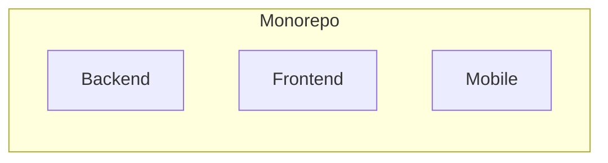

# Monorepo Strategies: Selective Builds for Changed Applications

Monorepo is the practice of storing all your code in a single repository, which
can be beneficial for code sharing, dependency management, and version control.

However, there is no free lunch! As your codebase grows, managing builds become
unavoidably complex and time-consuming. This time is billed on your
organization and it can get quite costly.

In this blog post, we'll explore the challenges of building only changed
applications in a monorepo and discuss strategies to optimize your workflow
with selective builds.

If this gets you excited, let's dive in!

<!-- more -->

## Introduction

In the modern day of software development, where it is claimed that *software
is eating the world*[^software-eating-world], it's important to stay sharp and
ahead of the game, not falling victom of our own success.

Monorepo is one of the strategies to help manage the codebase of multiple
applications, while keeping them in a single repository, squeezing every ounce
of collaboration and teamwork out of your team.

It comes with its own benefit and challenges of course. Let's explore them in
more detail.

### What is a Monorepo and Why Use It?

A monorepo is a single repository that contains the source code for multiple
projects or applications. This approach is commonly used by organizations to
manage large codebases, share code between projects, and simplify dependency
management.



It allows standardizing some of the organization-wide practices for packaging,
building, dependency management, and deployment. It enables more accessible
codebase where audits are done faster, dependencies can be upgraded simultaneously
and the overall development experience is more streamlined.

### The Challenge of Building Only Changed Applications

As the codebase in a monorepo grows, it becomes evidently clear that builds
will cost more compute time and resources. This is because the build process
often involves compiling, testing, and packaging all applications in the
repository, even if only a few of them have changed.

<figure markdown="span">
  { align=left loading=lazy }
  <figcaption><a href="https://unsplash.com/photos/man-wearing-white-top-using-macbook-1K9T5YiZ2WU" target="_blank">Full focus at a coffee shop</a></figcaption>
</figure>

This inefficiency can lead to longer build times, increased resource consumption,
and slower feedback loops for developers. To address this challenge, developers
need to implement strategies for building only the applications that have
changed since the last build.

### Key Advantages of Using a Monorepo Structure

Monorepo comes with a couple of very sexy and appealing advantages:

- [x] **Code Sharing**: Developers can easily share code between projects and
      applications, reducing duplication and improving consistency.
- [x] **Dependency Management**: Dependencies can be managed at the repository
      level, ensuring that all applications use the same versions of libraries
      and packages.
- [x] **Version Control**: Changes to multiple applications can be tracked and
      managed in a single repository, simplifying version control and code reviews.
- [x] **Collaboration**: Teams can work together more effectively by sharing
      code, reviewing changes, and coordinating releases in a single repository.
- [x] **Consistency**: Standardized build processes, testing frameworks, and
      deployment pipelines can be applied across all applications in the repository.

### Disadvantages of Monorepo Structure

However, there are some disadvantages to using a monorepo structure:

- [x] **Complexity**: Managing a large codebase with multiple applications can
      be complex and challenging, especially as the number of projects grows.
      This will require a lot of discipline and organization.
- [x] **Build Performance**: Building all applications in the repository can be
      time-consuming and resource-intensive, leading to longer build times and
      slower feedback loops for developers.
- [x] **Dependency Conflicts**: Dependencies between applications can lead to
      conflicts and compatibility issues, requiring careful management and
      coordination between teams.
- [x] **Security Risks**: A single repository can be a single point of failure
      for security breaches, so it's important to implement strong access controls
      and security measures to protect the codebase.

## The Problem with Full Rebuilds

When you make changes to a single application in a monorepo, the traditional
build process often involves rebuilding all applications in the repository. This
can be inefficient and time-consuming, especially if only a few applications have
changed.

Structured poorly, this can lead to a lot of wasted time and resources, which
could be better spent on more productive tasks. Imagine spending on a lambda
function that runs for 10 minutes, but only 1 minute is spent on the actual
work!

### Why Full Rebuilds are Inefficient

Full rebuilds are inefficient for several reasons:

- [x] **Resource Consumption**: Building all applications in the repository
      requires more compute resources, leading to higher costs and longer build
      times.
- [x] **Build Time**: Rebuilding unchanged applications is a waste of time and
      can slow down the feedback loop for developers.
- [x] **Developer Productivity**: Waiting for full rebuilds to complete can
      reduce developer productivity and hinder collaboration between teams.
- [x] **CI/CD Pipelines**: Full rebuilds can overload CI/CD pipelines and
      increase the risk of build failures and bottlenecks.


## Strategies for Building Only Changed Applications

To address the challenges of full rebuilds in a monorepo, developers can implement
strategies for building only the applications that have changed since the last
build. This can help optimize build performance, reduce resource consumption, and
improve developer productivity.

There are various strategies to employ, each can be fitting for different
organizations and teams. Let's explore some of them.

### Using Dependency Graphs to Identify Changes

One approach to selective builds is to use dependency graphs to identify the
applications that have changed and need to be rebuilt. By analyzing the
dependencies between applications, developers can determine which applications
are affected by a change and only rebuild those applications.

### Implementing Selective Builds with Build Tools

Another strategy is to use build tools that support selective builds, such as
Bazel or Lerna. These tools allow developers to define build targets for
specific applications and only rebuild those targets when changes are detected.

### Leveraging CI/CD Pipelines for Optimized Builds

CI/CD pipelines can also be used to optimize builds in a monorepo by triggering
builds only for the applications that have changed. By setting up automated
pipelines that monitor changes in the repository, developers can ensure that
only the necessary applications are rebuilt.

## Selective Builds in Practice

We have done a lot of talking so far. Let's get hands-on a bit. :nerd:

Imagine having a monorepo with the following code structure:

```plaintext
monorepo/
├── payment/
├── auth/
├── inventory/
├── order/
├── shipping/
└── frontend/
```

## Further Reading

If you want to find out more about monorepo and how other players in the industry
are using it, here are some resources to check out:

1. **Google Monorepo Best Practices** - Google's approach to monorepos and selective builds.
[Google's Approach to Monorepos](https://landing.google.com/sre/sre-book/chapters/monorepo/)

2. **Microsoft DevOps Blog** - Insights into using Azure DevOps for monorepo management and selective builds.
[Microsoft DevOps Blog](https://devblogs.microsoft.com/devops/)

3. **GitHub Blog** - Articles on monorepo strategies and build optimization.
[GitHub Blog](https://github.blog/)

4. **LinkedIn Engineering Blog** - LinkedIn's practices for managing large codebases with monorepos.
[LinkedIn Engineering Blog](https://engineering.linkedin.com/blog)

5. **Facebook Engineering Blog** - Facebook's experiences with monorepos and incremental builds.
[Facebook Engineering Blog](https://engineering.fb.com/)

6. **Atlassian Developer Blog** - Insights into monorepo architecture and efficient build practices.
[Atlassian Developer Blog](https://developer.atlassian.com/blog/)

7. **ThoughtWorks Insights** - Articles on continuous integration, deployment, and monorepo strategies.
[ThoughtWorks Insights](https://www.thoughtworks.com/insights)

8. **Medium Articles** - Community-driven insights on monorepos and selective builds.
[Medium](https://medium.com/)

9. **Stack Overflow** - Discussions and Q&A on monorepo best practices.
[Stack Overflow](https://stackoverflow.com/)

10. **YouTube - Monorepo Talks and Conferences** - Videos and talks from conferences like Google I/O, GitHub Universe, etc., discussing monorepo management.
Example: [Google I/O - Monorepos: Please Do!](https://www.youtube.com/watch?v=7YmkEmttyVY)


## Conclusion

[^software-eating-world]: https://a16z.com/why-software-is-eating-the-world/
