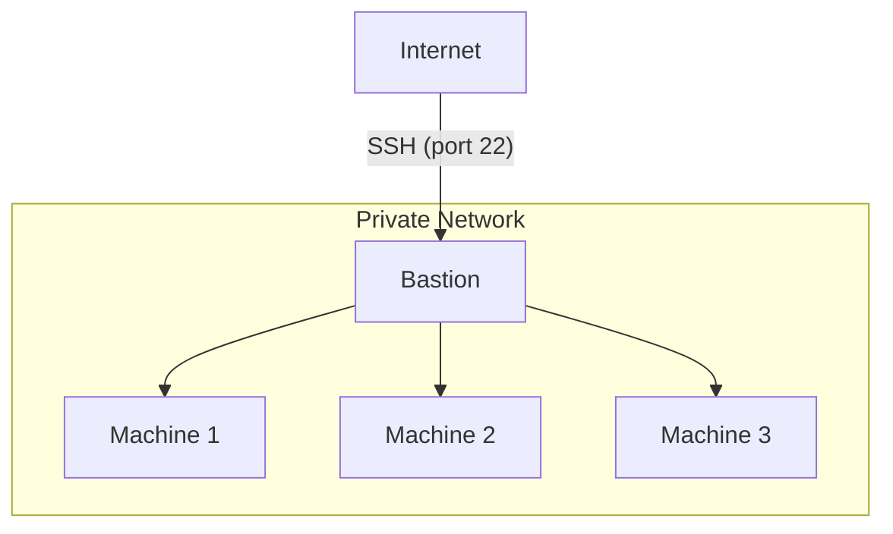

# Azure Bastion Host: Secure Cloud Access Made Simple

Discover how Azure Bastion can revolutionize your cloud security strategy.
This comprehensive guide explains what a Bastion host is, why it's crucial for
secure access to your Azure resources, and provides a step-by-step walkthrough
for implementation.

You'll learn how to enhance your network security, simplify remote access, and
automate Bastion deployment using tools like Terraform and Azure CLI. Dive in
to unlock the full potential of secure, scalable cloud access for your
organization.

<!-- more -->

<!--
6. Step-by-Step Guide: Creating an Azure Bastion Host
   - Prerequisites
   - Configuring the Azure Virtual Network
   - Deploying Azure Bastion
   - Connecting to VMs using Azure Bastion

7. Best Practices for Azure Bastion Implementation
   - Security considerations
   - Performance optimization
   - Cost management tips

8. Automating Azure Bastion Deployment
   - Using Azure CLI
   - Terraform configuration examples
   - ARM template snippets

9. Monitoring and Troubleshooting Azure Bastion
   - Azure Monitor integration
   - Common issues and solutions

10. Real-world Use Cases
    - Enterprise scenarios
    - DevOps team implementations

11. Future of Bastion Hosts in Cloud Computing
    - Emerging trends
    - Potential developments in Azure Bastion service

12. Conclusion
    - Recap of key points
    - Call-to-action for implementing Azure Bastion
-->

## Introduction

Deploying production workloads in cloud providers has made a lot of operational
efforts easier. They allow for a lot of flexibility in your infrastructure &
with their on-demand offerings, your life as an administrator will be much
easier.

### Challenges in Cloud Network Security

However, this ease doesn't come at a cheap price; and I'm not talking about
just the financial implications of deploying to cloud providers, but also their
maintenance and long-term management.

When you deploy your services to cloud providers, you can't simply lean back
and relax! They do make a lot of things easier, but they don't do magic. At the
end of the day, you're still in charge of anything happening to your production
workloads and as a result, your customers.

One of the most critical aspect of managing a production workload is to ensure
its compliant with your security policies, not allowing adversaries to take
control and damage your business, financially and reputation-wise.

### Bastion Host: Secure Cloud Access Made Simple

Bastion hosts are computers like any other, sitting in your private network and
opening a backdoor to the internal services, using which you can gain access to
the resources which would've otherwise been closed due to deep defensive
measures.

Here's a how it look like:

The bastion host in this setup may also be called the "jump host", as in, you
make an extra hop from your current node to the target node using one extra
jump. :kangaroo:

## What is a Bastion Host? Understanding the Gateway to Secure Cloud Access

### Defining the Core Concept of Bastion Hosts

A Bastion host, often referred to as a jump server or jump box, is a specially
designed computer on a network that serves as a critical access point for a
protected network, particularly when accessing internally isolated
environments.

In the context of [cloud computing], a Bastion host acts as a secure,
intermediate server that allows authorized users to connect to other servers or
services within a private network, typically a Virtual Private Cloud (VPC) or
Virtual Network (VNet).

The primary purpose of a Bastion host is to provide a controlled and monitored
entry point into a protected network environment, reducing the attack surface
and enhancing overall security posture.

By channeling all external access through this fortified server, organizations
can implement robust security measures, such as multi-factor authentication,
detailed logging, and fine-grained access controls.

The provided capabilities for audit allows organization to adhere to the strict
compliance requirements and security standards, ensuring that only authorized
users can access sensitive resources.

### The Evolution of Bastion Hosts: From On-Premises to Cloud

Historically, Bastion hosts emerged in the early days of network security as a
means to protect sensitive on-premises infrastructure. As organizations began
to adopt more complex network architectures, the need for a secure gateway
became increasingly apparent. Traditional Bastion hosts were often hardened
Linux or Unix servers, meticulously configured to withstand potential attacks.

With the advent of cloud computing, the concept of Bastion hosts has evolved to
meet the unique challenges of distributed and scalable environments. Cloud
providers like [Azure] have introduced managed Bastion services, such as Azure
Bastion, which offer enhanced security features, seamless integration with
cloud resources, and simplified management compared to traditional jump
servers.

The modern cloud-based Bastion host builds upon its on-premises predecessors by
incorporating advanced technologies like SSL/TLS encryption, automated
patching, and integration with cloud-native identity and access management
systems.

This evolution has made Bastion hosts an indispensable component of secure
cloud architecture, enabling organizations to maintain strict access controls
while leveraging the flexibility and scalability of cloud environments.

## Leveraging Azure Bastion: Enhancing Cloud Security and Compliance

### Security Benefits of Azure Bastion: Fortifying Your Cloud Perimeter

Azure Bastion provides a robust set of security features that significantly
enhance your cloud infrastructure's protection. By acting as a secure gateway,
it eliminates the need to expose RDP and SSH ports directly to the internet,
dramatically reducing the attack surface.

Azure Bastion implements strong encryption for all remote connections, ensuring
that data in transit remains confidential. Additionally, it supports Azure
Active Directory integration, enabling multi-factor authentication and
just-in-time access, further strengthening your security posture.

### Compliance Advantages: Meeting Regulatory Requirements with Azure Bastion

For organizations operating in regulated industries, Azure Bastion offers
several compliance advantages:

It helps meet various compliance standards by providing detailed audit logs of
all remote access sessions, aiding in forensic analysis and regulatory
reporting.

The service's built-in security features align with best practices required by
frameworks such as HIPAA, PCI DSS, and ISO 27001, simplifying the compliance
process for cloud environments.

### Simplified Access Management: Streamlining Secure Remote Connections

Azure Bastion simplifies access management by centralizing remote access to
your Azure-hosted resources.

It eliminates the need for managing multiple VPN connections or distributing
and maintaining SSH keys. With its browser-based console, users can securely
access resources from any device without requiring additional client software,
reducing administrative overhead and improving user experience.

## Azure Bastion vs. Traditional Jump Servers: A Comparative Analysis

### Key Differences: Cloud-Native Security vs. Legacy Approaches

While traditional jump servers and Azure Bastion serve similar purposes, there
are key differences in their implementation and capabilities.

Traditional jump servers often require manual setup, patching, and maintenance,
whereas [Azure] Bastion is a fully managed PaaS offering.

Azure Bastion also provides native integration with Azure services, offering a
more seamless experience compared to standalone jump servers.

### Advantages of Azure Bastion: Elevating Cloud Access Security

Azure Bastion offers several advantages over traditional jump servers:

1. [x] Automated patching and updates, ensuring the latest security measures
       are always in place
1. [x] Scalability to handle varying loads without manual intervention
1. [x] Native integration with Azure AD for enhanced identity management
1. [x] Built-in logging and monitoring capabilities for improved visibility
1. [x] No need for public IP addresses on your Azure VMs, enhancing security

## Understanding Azure Bastion Architecture and Integration

### Azure Bastion Architecture: A Deep Dive into Secure Design

Azure Bastion's architecture is designed for optimal security and performance.
It deploys a hardened and managed instance within your Azure Virtual Network,
which acts as the sole entry point for RDP and SSH traffic.

This architecture ensures that all remote desktop and SSH traffic is contained
within your Azure environment, never exposed directly to the internet.

### Effortless Integration with Azure Virtual Network

Azure Bastion integrates seamlessly with [Azure] Virtual Network, providing
secure access to all VMs within the VNet without requiring public IP addresses.

It utilizes Azure's backbone network for connectivity, ensuring
high-performance and low-latency connections.

This integration allows for granular network security group rules, enabling you
to precisely control which resources can be accessed through the Bastion host.

By leveraging Azure Bastion, organizations can achieve a higher level of
security, compliance, and operational efficiency in their cloud environments.

Its cloud-native design and deep integration with Azure services make it a
superior choice for secure remote access in modern cloud architectures.

[cloud computing]: /category/cloud-computing/
[Azure]: /category/azure/
